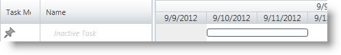

////

|metadata|
{
    "name": "xamgantt-configuring-tasks-active-inactive",
    "controlName": ["xamGantt"],
    "tags": ["Data Presentation","How Do I","Scheduling"],
    "guid": "ce90c13c-d4c1-4fad-950f-8407991fd328",  
    "buildFlags": [],
    "createdOn": "2016-05-25T18:21:55.4211325Z"
}
|metadata|
////

= Configuring Tasks as Active/Inactive

== Topic Overview

=== Purpose

This topic explains how to configure a task as either active or inactive using the  _xamGantt_™ control.

=== Required background

The following topics are prerequisites to understanding this topic:

[options="header", cols="a,a"]
|====
|Topic|Purpose

| link:xamgantt-binding-to-data-using-project.html[Binding to Data Using Project]
|This topic explains how to configure a task to be manually or automatically scheduled in the _xamGantt_ control.

|====

=== In this topic

This topic contains the following sections:

* <<_Ref335053332, Active/Inactive Task Configuration Summary >>
* <<_Ref335053337, Configuring Task State as Active/Inactive Using IsActive Property >>

** <<_Ref335260702,Overview>>
** <<_Ref335260708,Property settings>>
** <<_Ref335260713,Example>>

* <<_Ref335053342, Related Content >>

** <<_Ref335053347,Topics>>
** <<_Ref335053351,Samples>>

[[_Ref335053332]]
== Active/Inactive Task Configuration Summary

=== Active/Inactive task configuration summary chart

The following table lists the configurable aspects of the link:{ApiPlatform}controls.schedules.xamgantt{ApiVersion}~infragistics.controls.schedules.projecttask_members.html[ProjectTask]’s state (active or inactive). Additional details follow after the table.

[options="header", cols="a,a,a,a"]
|====
|Configurable aspect|Details|Property|Command

|Setting a task as active
|programmatically changes the task’s state using either the `ProjectTask` `IsActive` property or a command.
| link:{ApiPlatform}controls.schedules.xamgantt{ApiVersion}~infragistics.controls.schedules.projecttask~isactive.html[IsActive]
|
* link:{ApiPlatform}controls.schedules.xamgantt{ApiVersion}~infragistics.controls.schedules.ganttcommandid.html[ChangeTaskToActive] 

* link:{ApiPlatform}controls.schedules.xamgantt{ApiVersion}~infragistics.controls.schedules.ganttcommandid.html[ToggleTaskActive] 

|Setting a task as inactive
|programmatically changes the task’s state is using the `ProjectTask` `IsActive` property or a command.
| link:{ApiPlatform}controls.schedules.xamgantt{ApiVersion}~infragistics.controls.schedules.projecttask~isactive.html[IsActive]
|
* link:{ApiPlatform}controls.schedules.xamgantt{ApiVersion}~infragistics.controls.schedules.ganttcommandid.html[ChangeTaskToInactive] 

* link:{ApiPlatform}controls.schedules.xamgantt{ApiVersion}~infragistics.controls.schedules.ganttcommandid.html[ToggleTaskActive] 

|====

[[_Ref335053337]]
== Configuring Task State as Active/Inactive Using IsActive Property

[[_Ref335260702]]

=== Overview

The `ProjectTask` has two states:

* active
* inactive

By default, the project task state is active.

As long as inactive tasks do not depend on other active tasks, the scheduling engine ignores them.

If a parent task is marked as inactive, all of its children are also deactivated.

The control displays the task in both the  _xamGantt’s_   grid and chart sections.

* In the grid section, the task state appears in the  *Active*  column
* In the chart section, the inactive taskbars are blurred

.Note
[NOTE]
====
Project tasks with actuals (Actual Duration, Actual Finish, Actual Start or % Complete fields have values) cannot be set as inactivate.
====

[[_Ref335260708]]

=== Property settings

The following table maps the desired configuration to property settings.

[options="header", cols="a,a,a"]
|====
|In order to:|Use this property:|And set it to:

|Activate/Inactivate
|`IsActive`
|`bool`

|====

[[_Ref335260713]]

=== Example

The screenshot below illustrates how to set the task state as inactive using the following settings:

[cols="a,a"]
|====
|Property|Value

|`IsActive`
|`false`

|====

*In C#:*

[source,csharp]
----
XamGantt gantt = new XamGantt();
Project project = new Project();
ProjectTask task = new ProjectTask();
task.TaskName = "Inactive Task";
task.IsActive = false;
task.Duration = TimeSpan.FromHours(16);
task.Start = DateTime.Today.ToUniversalTime();
project.RootTask.Tasks.Add(task);
gantt.Project = project;
----

*In Visual Basic:*

[source,vb]
----
Dim gantt As New XamGantt()
Dim project As New Project()
Dim task As New ProjectTask()
task.TaskName = "Inactive Task"
task.IsActive = False
task.Duration = TimeSpan.FromHours(16)
task.Start = DateTime.Today.ToUniversalTime()
project.RootTask.Tasks.Add(task)
gantt.Project = project
----

[[_Ref335053342]]
== Related Content

[[_Ref335053347]]

=== Topics

The following topics provide additional information related to this topic.

[options="header", cols="a,a"]
|====
|Topic|Purpose

| link:xamgantt-configuring-tasks.html[Configuring Tasks]
|The topics in this group explain the _xamGantt_ ProjectTask class, its configurable aspects and the main features it provides.

| link:xamgantt-using-xamgantt-commands.html[Using Commands]
|This topic describes many of the more commonly used commands available in the _xamGantt_ control and how to use them.

|====

[[_Ref335053351]]

=== Samples

The following samples provide additional information related to this topic.

[options="header", cols="a,a"]
|====
|Sample|Purpose

| pick:[sl=" link:{SamplesURL}/gantt/#/inactive-tasks[Inactive Tasks]"] pick:[wpf=" link:{SamplesURL}/gantt/inactive-tasks[Inactive Tasks]"] 
|This sample demonstrates how you can set a task to be inactive – either by setting the ProjectTask IsActive property to False or via _xamGantt_ command.

|====