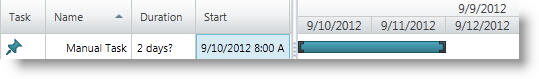
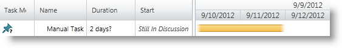

////

|metadata|
{
    "name": "xamgantt-configuring-tasks-manual-automatic",
    "controlName": ["xamGantt"],
    "tags": ["Data Presentation","Getting Started","How Do I","Scheduling"],
    "guid": "02cfa65a-bd39-4264-a49d-4ee74e951f5a",  
    "buildFlags": [],
    "createdOn": "2016-05-25T18:21:55.4161325Z"
}
|metadata|
////

= Configuring Tasks as Manual/Automatic

== Topic Overview

=== Purpose

This topic explains how to configure a task to either manual or automatic scheduling using the  _xamGantt™_   control.

=== Required background

The following topics are prerequisites to understanding this topic:

[options="header", cols="a,a"]
|====
|Topic|Purpose

| link:xamgantt-binding-to-data-using-project.html[Binding to Data Using Project]
|This topic describes how the _xamGantt_ control can be bound to data via Project property.

|====

=== In this topic

This topic contains the following sections:

* <<_Ref335045186, Manual/Auto Task Configuration Summary >>
* <<_Ref335045209, Configuring Task Mode to Auto/Manually Scheduled Using IsManual Property >>

** <<_Ref335262164,Overview>>
** <<_Ref335262172,Property settings>>
** <<_Ref335262185,Example>>

* <<_Ref335045248, Related Content >>

** <<_Ref335045253,Topics>>
** <<_Ref335045258,Samples>>

[[_Ref335045186]]
== Manual/Auto Task Configuration Summary

=== Manual/auto task configuration summary chart

The following table lists the link:{ApiPlatform}controls.schedules.xamgantt.v{ProductVersion}~infragistics.controls.schedules.projecttask_members.html[ProjectTask] mode‘s (auto or manual scheduled) configurable aspects. Additional details follow.

[options="header", cols="a,a,a,a"]
|====
|Configurable aspect|Details|Property|Command

|Toggle task mode to auto scheduled
|Programmatically changes the task’s mode using either the `ProjectTask` `IsManual` property or a command.
| link:{ApiPlatform}controls.schedules.xamgantt.v{ProductVersion}~infragistics.controls.schedules.projecttask~ismanual.html[IsManual]
| link:{ApiPlatform}controls.schedules.xamgantt.v{ProductVersion}~infragistics.controls.schedules.ganttcommandid.html[ChangeTaskToAutomatic]

|Toggle task mode to manually scheduled
|Programmatically changes the task’s mode is using either the `ProjectTask` `IsManual` property or a command.
| link:{ApiPlatform}controls.schedules.xamgantt.v{ProductVersion}~infragistics.controls.schedules.projecttask~ismanual.html[IsManual]
| link:{ApiPlatform}controls.schedules.xamgantt.v{ProductVersion}~infragistics.controls.schedules.ganttcommandid.html[ChangeTaskToManual]

|Configuring the scheduling mode of the created tasks through the _xamGantt_ user interface
|Configures the newly created tasks mode using the link:{ApiPlatform}controls.schedules.xamgantt.v{ProductVersion}~infragistics.controls.schedules.projectsettings_members.html[ProjectSettings] link:{ApiPlatform}controls.schedules.xamgantt.v{ProductVersion}~infragistics.controls.schedules.projectsettings~newtasksaremanual.html[NewTasksAreManual] property.
| link:{ApiPlatform}controls.schedules.xamgantt.v{ProductVersion}~infragistics.controls.schedules.projectsettings~newtasksaremanual.html[NewTasksAreManual]
|-

|====

[[_Ref335045209]]
== Configuring Task Mode to Auto/Manually Scheduled Using IsManual Property

[[_Ref335262164]]

=== Overview

The `ProjectTask` task mode indicates how a task’s scheduling affected when other changes occur within the project.

Possible task mode values are:

* auto scheduled
* manually scheduled

When making changes to the project or one of its tasks, results in the rescheduling of the auto-scheduled tasks.

The manually scheduled tasks are only rescheduled when changes are made to it, or either its predecessors or successors changes.

.Note
[NOTE]
====
You can change the default scheduling mechanism using the ProjectSettings *ShouldCalculateAfterEachEdit* property - to suspend the automatic recalculation and *ShouldUpdateManualTasksWhenEditingLinks* property - to prevent updates to the manual tasks after editing their dependencies.
====

The task mode displays in both in the grid and chart  _xamGantt_   section.

* In the grid section, the task mode appears in the  *Task Mode*  column.
* In the chart section, the manual and automatic scheduled tasks differentiated by different colored taskbars.

[[_Ref335262172]]

=== Property settings

The following table maps the desired configuration to property settings.

[options="header", cols="a,a,a"]
|====
|In order to:|Use this property:|And set it to:

|Toggle Task Mode to Auto/Manually Scheduled
|`IsManual`
|`bool`

|====

[[_Ref335262185]]

=== Example

The screenshots below illustrates how to configure the manually scheduled task mode using the following settings:

[start=1]
. Task start date and duration are specified:

[options="header", cols="a,a"]
|====
|Property|Value

|`IsManual`
|`true`

|`Duration`
|`TimeSpan.FromHours(16)`

|`Start`
|`DateTime.Today.ToUniversalTime();`

|====

*In C#:*

[source,csharp]
----
XamGantt gantt = new XamGantt();
Project project = new Project();
ProjectTask manualTask = new ProjectTask();
manualTask.TaskName = "Manual Task";
manualTask.IsManual = true;
manualTask.Duration = TimeSpan.FromHours(16);
manualTask.Start = DateTime.Today.ToUniversalTime();
project.RootTask.Tasks.Add(manualTask);
gantt.Project = project;
----

*In Visual Basic:*

[source,vb]
----
Dim gantt As New XamGantt()
Dim project As New Project()
Dim manualTask As New ProjectTask()
manualTask.TaskName = "Manual Task"
manualTask.IsManual = True
manualTask.Duration = TimeSpan.FromHours(16)
manualTask.Start = DateTime.Today.ToUniversalTime()
project.RootTask.Tasks.Add(manualTask)
gantt.Project = project
----

[start=2]
. Specifies a task’s duration, but task's start and finish dates are undefined and enters free text:

[options="header", cols="a,a"]
|====
|Property|Value

|`IsManual`
|`true`

|`Duration`
|`TimeSpan.FromHours(16)`

|`ManualStart`
|`new ManualDateTime("Still In Discussion")`

|`ManualFinish`
|`new ManualDateTime("Not Defined Yet")`

|====

*In C#:*

[source,csharp]
----
XamGantt gantt = new XamGantt();
Project project = new Project();
ProjectTask manualTask = new ProjectTask();
manualTask.TaskName = "Manual Task";
manualTask.IsManual = true;
manualTask.Duration = TimeSpan.FromHours(16);
manualTask.ManualStart = new ManualDateTime("Still In Discussion");
manualTask.ManualFinish = new ManualDateTime("Not Defined Yet");
project.RootTask.Tasks.Add(manualTask);
gantt.Project = project;
----

*In Visual Basic:*

[source,vb]
----
Dim gantt As New XamGantt()
Dim project As New Project()
Dim manualTask As New ProjectTask()
manualTask.TaskName = "Manual Task"
manualTask.IsManual = True
manualTask.Duration = TimeSpan.FromHours(16)
manualTask.ManualStart = New ManualDateTime("Still In Discussion")
manualTask.ManualFinish = New ManualDateTime("Not Defined Yet")
project.RootTask.Tasks.Add(manualTask)
gantt.Project = project
----

[[_Ref335045248]]
== Related Content

[[_Ref335045253]]

=== Topics

The following topics provide additional information related to this topic.

[options="header", cols="a,a"]
|====
|Topic|Purpose

| link:xamgantt-configuring-tasks.html[Configuring Tasks]
|The topics in this group explain the _xamGantt_ ProjectTask class, its configurable aspects and the main features it provides.

| link:xamgantt-using-xamgantt-commands.html[Using Commands]
|This topic describes many of the more commonly used commands available in the _xamGantt_ control, and how to use them.

|====

[[_Ref335045258]]

=== Samples

The following samples provide additional information related to this topic.

[options="header", cols="a,a"]
|====
|Sample|Purpose

| pick:[sl=" link:{SamplesURL}/gantt/#/manual-automatically-scheduled-tasks[Manual/Automatically Scheduled Tasks]"] pick:[wpf=" link:{SamplesURL}/gantt/manual-automatically-scheduled-tasks[Manual/Automatically Scheduled Tasks]"] 
|This sample demonstrates how you can set and use manual scheduled tasks in order to create more flexible project plan.

|====