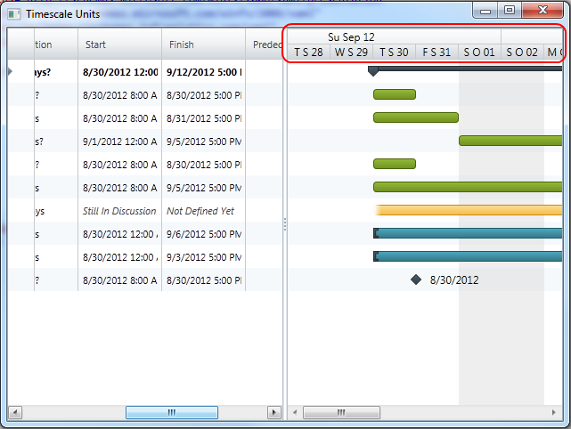

////

|metadata|
{
    "name": "xamgantt-configuring-the-xamgantt-timescale-display-formats",
    "controlName": ["xamGantt"],
    "tags": ["Data Presentation","Formatting","Grids","Scheduling"],
    "guid": "d4c80ea7-de3f-491b-81d9-c57d0ae5369e",  
    "buildFlags": [],
    "createdOn": "2016-05-25T18:21:55.5151369Z"
}
|metadata|
////

= Configuring the xamGantt Timescale Display Formats

== Topic Overview

=== Purpose

This topic describes how you can configure timescale display formats. Timescale display formats are configured by setting a display format for each band from the timescale band collection.

=== Required background

The following topics are prerequisites to understanding this topic:

[options="header", cols="a,a"]
|====
|Topic|Purpose

| link:xamgantt-adding-xamgantt-to-a-page.html[Adding _xamGantt_ to a Page]
|This topic describes how you can add the _xamGantt™_ control to a page.

|====

=== In this topic

This topic contains the following sections:

* <<_Ref334119870, TimescaleDisplay Formats Overview >>

** <<_Ref334119876,Introduction>>

** <<_Ref334119882,Display Format>>

** <<_Ref334119887,Display Format Replacement tags>>

* <<_Ref334119893, Code Example: Setting the Timescale Display Formats >>

** <<_Ref333763526,Description>>

** <<_Ref334102005,Prerequisites>>

** <<_Ref334102013,Preview>>

** <<_Ref334102056,Code>>

* <<_Ref333763543, Related Content >>

** <<_Ref333763550,Topics>>

** <<_Ref333763850,Samples>>

[[_Ref334101919]]
== TimescaleDisplay Formats Overview

[[_Ref334119876]]

=== Introduction

_XamGantt_  Timescale maintains a read-only collection of TimescaleBand objects called Bands. You can specify the link:{ApiPlatform}controls.schedules.xamgantt.v{ProductVersion}~infragistics.controls.schedules.timescaleband~displayformat.html[DisplayFormat] for each TimescaleBand from this collection.

[[_Ref334119882]]

=== Display Format

The display format property accepts a Date Time format string. This string is used to specify the text to be displayed for the time interval in the timescale bands. `DisplayFormat` supports all .NET Date Time format strings.

`DisplayFormat` also supports additional custom replacement tags. These tags allow you to customize the string displayed to users in a manner which cannot be achieved by using the default .NET format strings.

[[_Ref334119887]]

=== Display Format Replacement tags

The table below lists the Replacement tags which can be used with TimescaleBand.DisplayFormat. The values in table represent the replacable tokens that may be used.

[options="header", cols="a,a"]
|====
|Replacement tag|Description

|{d:n} 

{day:n}
|Inserts a substring of the full day name for the date. n indicates the number of characters that should be displayed. For example, '{d:2}' for Sunday would result in "Su".

|{m:n} 

{mon:n}
|Inserts a substring of the full month name for the date. n indicates the number of characters that should be displayed. For example, '{m:2}' for September would result in "Se".

|{doyn} 

{DOYn}
|Inserts the day of the year for the date. n is optional and indicates the minimum number of digits in the resulting string. For example, '{doy3}' for January 2nd would result in "002".

|{wn} 

{Wn}
|Inserts the week number for the date. n is optional and indicates the minimum number of digits in the resulting string. For example, '{w2}' for the first week of the year would result in "01" but '{w}' would result in "1".

|{tom} 

{TOM}
|Inserts a string identifying the third of the month that contains the date. The upper case '{TOM}' indicates that the full version - e.g. "Beginning", "Middle" or "End" - should be used. Lower case indicates the short version - e.g. "B", "M" or "E" - should be used. For example, '{tom}' January 15 would result in "M" but '{TOM}' would result in "Middle".

|{q} 

{Q}
|Inserts a string identifying the quarter of the year that contains the date. The upper case '{Q}' indicates that the full version - e.g. "1st", "2nd", "3rd" or "4th" - should be used. Lower case indicates the short version - e.g. "1", "2", "3" or "4" - should be used. For example, '{q}' January 15 would result in "1" but '{Q}' would result in "1st".

|{hy} 

{HY}
|Inserts a string identifying the half of the year that contains the date. The upper case '{HY}' indicates that the full version - e.g. "1st" or "2nd" - should be used. Lower case indicates the short version - e.g. "1" or "2" - should be used. For example, '{hy}' January 15 would result in "1" but '{HY}' would result in "1st".

|{start:un} 

{finish:un}
|Inserts the difference between the start or finish date and the date for the interval in the specified units. u indicates the units in which the difference will be expressed and includes values of m, h, d, w, tom, M, q, hy and y which represents minutes, hours, days, weeks, thirds of a month, months, quarters, half years and years respectively. n is optional and indicates the number of characters that should be displayed. For example, '{start:d}' would display a string containing the number of days between the interval and the start (e.g. project start).

|====

[[_Ref333763503]]
== Code Example: Setting the Timescale Display Formats

[[_Ref333763526]]

=== Description

This code example show you how to set the timescale display formats. You set timescale display formats by setting display format for each of the timescale’s bands. You can set them via XAML or via code-behind.

[[_Ref334102005]]

=== Prerequisites

To complete the code example, you should have a  _xamGantt_   project . You can follow the instructions in link:xamgantt-adding-xamgantt-to-a-page.html[Adding  _xamGantt_  to a Page] in order to create sample  _xamGantt_  project. Then you need to replace the markup with those one shown in this topic or use the snippet from code-behind.

[[_Ref334102013]]

=== Preview

This is a preview of completed sample project. The top band has a display format string set as “`{day``:2``} {m:3}` `yy`”, and the middle one has the display format string set as “`{day:1} {m:1}` dd”.

[[_Ref334102056]]

=== Code

*In XAML:*

[source,xaml]
----
…
    <Grid>
        <ig:XamGantt x:Name="gantt" Project="{Binding Project}">
            <ig:XamGantt.ViewSettings>
                <ig:ProjectViewSettings>
                    <ig:ProjectViewSettings.Timescale>
                        <ig:Timescale>
                            <ig:TimescaleBand DisplayFormat="{}{day:2} {m:3} yy" Unit="Weeks" />
                            <ig:TimescaleBand DisplayFormat="{}{day:1} {m:1} dd" Unit="Days" />
                        </ig:Timescale>
                    </ig:ProjectViewSettings.Timescale>
                </ig:ProjectViewSettings>
            </ig:XamGantt.ViewSettings>
        </ig:XamGantt>
    </Grid>
…
----

*In C#:*

[source,csharp]
----
…
            Timescale timescale = new Timescale();
            timescale.Bands.Add(new TimescaleBand { DisplayFormat = "{day:2} {m:3} 
yy", Unit = TimescaleUnit.Weeks });
            timescale.Bands.Add(new TimescaleBand { DisplayFormat = "{day:1} {m:1} 
dd", Unit = TimescaleUnit.Days });
            gantt.ViewSettings = new ProjectViewSettings();
            gantt.ViewSettings.Timescale = timescale;
…
----

*In Visual Basic:*

[source,vb]
----
…
Dim timescale As New Timescale()
timescale.Bands.Add(New TimescaleBand() With { 
      Key .DisplayFormat = "{day:2} {m:3} yy", 
      Key .Unit = TimescaleUnit.Weeks 
})
timescale.Bands.Add(New TimescaleBand() With { 
      Key .DisplayFormat = "{day:1} {m:1} dd", 
      Key .Unit = TimescaleUnit.Days 
})
gantt.ViewSettings = New ProjectViewSettings()
gantt.ViewSettings.Timescale = timescale
…
----

[[_Ref333763543]]
== Related Content

[[_Ref333763550]]

=== Topics

The following topics provide additional information related to this topic:

[options="header", cols="a,a"]
|====
|Topic|Purpose

| link:xamgantt-configuring-the-xamgantt-timescale.html[Configuring the Timescale]
|The topics in this group contains information about xamGantt™ Timescale.

| link:xamgantt-timescale-configuration-overview.html[xamGantt Timescale Configuration Overview]
|This topic gives an overview of the main features of xamGantt™ Timescale.

|====

[[_Ref333763850]]

=== Samples

The following samples provide additional information related to this topic:

[options="header", cols="a,a"]
|====
|Sample|Purpose

| pick:[sl=" link:{SamplesURL}/gantt/#/timescale-units[Timescale Units]"] pick:[wpf=" link:{SamplesURL}/gantt/timescale-units[Timescale Units]"] 
|This sample shows timescale units supported by xamGantt and demonstrate how you can change the units and unit count for timescale bands.

| pick:[sl=" link:{SamplesURL}/gantt/#/timescale-display-formats[Timescale Display Formats]"] pick:[wpf=" link:{SamplesURL}/gantt/timescale-display-formats[Timescale Display Formats]"] 
|This sample shows large set of supported display formats by the xamGantt control and demonstrates how you can change the display format for a timescale band.

|====