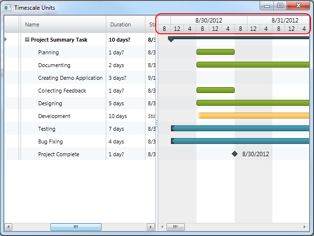

////
|metadata|
{
    "name": "xamgantt-configuring-the-xamgantt-timescale-units",
    "controlName": ["xamGantt"],
    "tags": ["Data Presentation","Filtering","Formatting","Grids","Scheduling"],
    "guid": "8cacf84a-d786-4099-a04b-30686e9416b0",
    "buildFlags": [],
    "createdOn": "2016-05-25T18:21:55.5101381Z"
}
|metadata|
////

= Configuring the xamGantt Timescale Units

== Topic Overview

=== Purpose

This topics describes how you can configure timescale units. Timescale units and unit counts are configured by setting a unit and unit count for each timescale band from the timescale band collection.

=== Required background

The following topics are prerequisites to understanding this topic:

[options="header", cols="a,a"]
|====
|Topic|Purpose

| link:xamgantt-adding-xamgantt-to-a-page.html[Adding _xamGantt_ to a Page]
|This topic describes how you can add the _xamGantt™_ control to a page.

|====

=== In this topic

This topic contains the following sections:

* <<_Timescale_Units_Overview, Timescale Units Overview >>

** <<_Ref334101937,Overview>>

** <<_Ref334104615,Unit>>

** <<_Ref334104620,Unit Count>>

* <<_Code_Example_Setting_The_Timescale_Units_And_Unit_Count, Code Example: Setting the Timescale Units and Unit Count >>

** <<_Ref333763526,Description>>

** <<_Ref334102005,Prerequisites>>

** <<_Ref334102013,Preview>>

** <<_Ref334102056,Code>>

* <<_Related_Content, Related Content >>

** <<_Ref333763550,Topics>>

** <<_Ref333763850,Samples>>

[[_Timescale_Units_Overview]]
== Timescale Units Overview

[[_Ref334101937]]
=== Overview

XamGantt Timescale maintains a collection of `TimescaleBand` objects called link:{ApiPlatform}controls.schedules.xamgantt.v{ProductVersion}~infragistics.controls.schedules.timescale~bands.html[Bands] .This collection has only get accessor. The collection is modifiable and you can for example add items to it or remove items from it. You can specify the link:{ApiPlatform}controls.schedules.xamgantt.v{ProductVersion}~infragistics.controls.schedules.timescaleband~unit.html[Unit] and link:{ApiPlatform}controls.schedules.xamgantt.v{ProductVersion}~infragistics.controls.schedules.timescaleband~unitcount.html[UnitCount] for each TimescaleBand from this collection.

[[_Ref334104615]]
=== Unit

The `Unit` property is used for setting the unit type of the interval. As unit can be set any item belonging to the link:{ApiPlatform}controls.schedules.xamgantt.v{ProductVersion}~infragistics.controls.schedules.timescaleunit.html[TimescaleUnit] enumeration.

[[_Ref334104620]]
=== Unit Count

The `UnitCount` property is used for setting the number of units in one interval.

[[_Code_Example_Setting_The_Timescale_Units_And_Unit_Count]]
== Code Example: Setting the Timescale Units and Unit Count

[[_Ref333763526]]
=== Description

This code example show you how to set the timescale units and timescale unit count. You set timescale units and unit count by setting unit and unit count for each of the timescale’s bands. You can set them via XAML or via code-behind.

[[_Ref334102005]]
=== Prerequisites

To complete the code example, you should have a xamGantt project . You can follow the instructions in link:xamgantt-adding-xamgantt-to-a-page.html[Adding  _xamGantt_  to a Page] in order to create sample xamGantt project. You have to replace the mark-up with those one shown in this topic or use the code snippet in code-behind.

[[_Ref334102013]]
=== Preview

This is a preview of completed sample project. For the first band `Unit` is set to `TimescaleUnit.Days` and `UnitCount` is set to 1. For the second band `Unit` is set to TimescaleUnit.Hours and `UnitCount` is set to 8.

[[_Ref334102056]]
=== Code

*In XAML:*
[source,xaml]
----
…
<Grid>
    <ig:XamGantt x:Name="gantt" Project="{Binding Project}">
        <ig:XamGantt.ViewSettings>
            <ig:ProjectViewSettings>
                <ig:ProjectViewSettings.Timescale>
                    <ig:Timescale>
                        <ig:TimescaleBand Unit="Days" UnitCount="1" />
                        <ig:TimescaleBand Unit="Hours" UnitCount="4" />
                    </ig:Timescale>
                </ig:ProjectViewSettings.Timescale>
            </ig:ProjectViewSettings>
        </ig:XamGantt.ViewSettings>
    </ig:XamGantt>
</Grid>
…
----

*In C#:*
[source,csharp]
----
…
Timescale timescale = new Timescale();
timescale.Bands.Add(new TimescaleBand { Unit = TimescaleUnit.Days, UnitCount = 1 });
timescale.Bands.Add(new TimescaleBand { Unit = TimescaleUnit.Hours, UnitCount = 8 });
gantt.ViewSettings = new ProjectViewSettings();
gantt.ViewSettings.Timescale = timescale;
…
----

*In Visual Basic:*
[source,vb]
----
…
Dim timescale As New Timescale()
timescale.Bands.Add(New TimescaleBand() With { _
    .Unit = TimescaleUnit.Days, _
    .UnitCount = 1 _
})
timescale.Bands.Add(New TimescaleBand() With { _
    .Unit = TimescaleUnit.Hours, _
    .UnitCount = 8 _
})
gantt.ViewSettings = New ProjectViewSettings()
gantt.ViewSettings.Timescale = timescale
…
----

[[_Related_Content]]
== Related Content

[[_Ref333763550]]
=== Topics

The following topics provide additional information related to this topic.

[options="header", cols="a,a"]
|====
|Topic|Purpose

| link:xamgantt-configuring-the-xamgantt-timescale.html[Configuring the Timescale]
|The topics in this group contains information about xamGantt™ Timescale.

| link:xamgantt-timescale-configuration-overview.html[xamGantt Timescale Configuration Overview]
|This topic gives an overview of the main features of xamGantt™ Timescale.

|====

[[_Ref333763850]]
=== Samples

The following samples provide additional information related to this topic.

[options="header", cols="a,a"]
|====
|Sample|Purpose

| link:{SamplesURL}/gantt/timescale-units[Timescale Units]
|This sample shows timescale units supported by xamGantt and demonstrate how you can change the units and unit count for timescale bands.

| link:{SamplesURL}/gantt/timescale-display-formats[Timescale Display Formats]
|This sample shows large set of supported display formats by the xamGantt control and demonstrates how you can change the display format for a timescale band.

|====