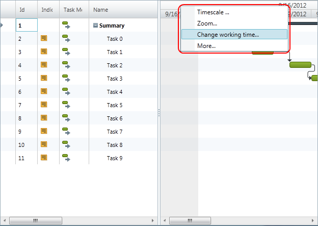

////
|metadata|
{
    "name": "xamgantt-configuring-xamgantt-additional-context-menus",
    "controlName": ["xamGantt"],
    "tags": ["Data Presentation","Extending","Scheduling","Styling","Templating"],
    "guid": "df52c1e7-dc44-4dcf-8734-29de8a7dad35",
    "buildFlags": [],
    "createdOn": "2016-05-25T18:21:55.5561405Z"
}
|metadata|
////

= Configuring xamGantt Additional Context Menus

== Topic Overview

=== Purpose

This topic describes how you can configure the  _xamGantt™_'s context menus and add additional context menus for predefined areas of the  _xamGantt_   control.

=== Required background

The following topics are prerequisites to understanding this topic:

[options="header", cols="a,a"]
|====
|Topic|Purpose

| link:xamgantt-adding-xamgantt-to-a-page.html[Adding xamGantt to a Page]
|This topic describes how you can add the _xamGantt_ control to a page.

| link:xamcontextmenu-getting-started-with-xamcontextmenu.html[Adding xamContexMenu to your page]
|In order to get you up and running as quickly as possible with the link:xamcontextmenu.html[xamContexMenu] control, we've provided you with information on how to get started using the control.

|====

=== In this topic

This topic contains the following sections:

* <<_Context_Menus_Overview,  _xamGantt_  Context Menus Overview >>

** <<_Introduction,Introduction>>

** <<_Gantt_Context_Menu_Provider,Gantt Context Menu Provider>>

** <<_Gantt_Context_Menu_Area,Gantt Context Menu Area>>

* <<_Code_Example_Creating_Additional_Context_Menus, Code Example: Creating Additional Context Menus for xamGantt chart section >>

** <<_Description,Description>>

** <<_Prerequisites,Prerequisites>>

** <<_Preview,Preview>>

** <<_Code,Code>>

* <<_Related_Content, Related Content >>

** <<_Topics,Topics>>

** <<_Samples,Samples>>

[[_Context_Menus_Overview]]
== XamGantt Context Menus Overview

[[_Introduction]]
=== Introduction

The  _xamGantt_  control comes with a set of built-in context menus. In addition, you can add your own custom context menu for a predefined set of  _xamGantt_  areas or, if you want, to override an existing context menu.

XamGantt uses an instance of the link:{ApiPlatform}controls.schedules.xamgantt.v{ProductVersion}~infragistics.controls.schedules.ganttcontextmenuprovider_members.html[GanttContextMenuProvider] class to define the default context menus. Context menus are identified by the link:{ApiPlatform}controls.schedules.xamgantt.v{ProductVersion}~infragistics.controls.schedules.ganttcontextmenuarea.html[GanttContextMenuArea] enumeration.

[[_Gantt_Context_Menu_Provider]]
=== Gantt Context Menu Provider

You can use the `GanttContextMenuProvider`’s link:{ApiPlatform}controls.schedules.xamgantt.v{ProductVersion}~infragistics.controls.schedules.ganttcontextmenuprovider~resourceoverrides.html[ResourceOverrides] property to add a custom ResourceDictionary. In this ResourceDictionary you can specify your additional context menus.

[[_Gantt_Context_Menu_Area]]
=== Gantt Context Menu Area

`GanttContextMenuArea` enumeration is used to identify the context menus.  _XamGantt_  comes with default menus for members of this enumeration and you have the ability to add context menus for other members of the enumeration or to override the existing context menus.

[options="header", cols="a,a,a"]
|====
|Member|Description|Built-in menu

|Cell
|The context menu for the data cells in the grid section.
|image::images/xamGantt_Configuring_xamGantt_Additional_Context_menus_1.png[]

|ColumnHeader
|The context menu for the column headers in the grid section.
|image::images/xamGantt_Configuring_xamGantt_Additional_Context_menus_1.png[]

|Grid
|The context menu for the empty portion of the grid section.
|image::images/xamGantt_Configuring_xamGantt_Additional_Context_menus_1.png[]

|Row
|The context menu for a row in the grid section.
|image::images/xamGantt_Configuring_xamGantt_Additional_Context_menus_1.png[]

|RowSelectorHeader
|The context menu for the header cell of the row selectors in the grid section.
|image::images/xamGantt_Configuring_xamGantt_Additional_Context_menus_1.png[]

|Task
|The context menu for the task in chart section.
|image::images/xamGantt_Configuring_xamGantt_Additional_Context_menus_1.png[]

|TaskDependency
|The context menu for the task dependency in the chart section.
|image::images/xamGantt_Configuring_xamGantt_Additional_Context_menus_1.png[]

|TimescaleArea
|The context menu for the timescale area in the chart section.
|image::images/xamGantt_Configuring_xamGantt_Additional_Context_menus_8.png[]

|TimescaleBandHeader
|The context menu for the timescale band header in the chart section.
|image::images/xamGantt_Configuring_xamGantt_Additional_Context_menus_8.png[]

|TimescaleHeader
|The context menu for the timescale header presenter in the chart section.
|image::images/xamGantt_Configuring_xamGantt_Additional_Context_menus_8.png[]

|====

[[_Code_Example_Creating_Additional_Context_Menus]]
== Code Example: Creating Additional Context Menus for xamGantt chart section

[[_Description]]
=== Description

This code example shows you how to create additional context menus for TimescaleArea and TimescaleBandHeader for  _xamGantt_ . It adds a resource dictionary to the GanttContexMenuProvider.ResourceOverrides. In the resource dictionary there are defined two  _xamContextMenu_, one for the TimescaleArea and one for the TimescaleBandHeader area.

.Note
[NOTE]
====
You have to specify the name of the `GanttContexMenuArea` member as a key for the context menu in order to associate the context menu with this area.
====

[[_Prerequisites]]
=== Prerequisites

** To complete the code example, you should have a  _xamGantt_   project. You can follow the instructions in link:xamgantt-adding-xamgantt-to-a-page.html[Adding xamGantt to a Page] in order to create sample  _xamGantt_  project.

** You must also change the mark-up for the `xamGantt` to coincide with example shown in code section of this topic.

[[_Preview]]
=== Preview

This is a preview of a completed sample project. You can see the additional context menu for the timescale band header area.

[[_Code]]
=== Code

*In XAML:*
[source,xaml]
----
<ig:XamGantt x:Name="xamGantt" Project="{Binding Project}">
    <ig:XamGantt.ContextMenuProvider>
        <ig:GanttContextMenuProvider>
            <ig:GanttContextMenuProvider.ResourceOverrides>
                <ResourceDictionary>
                    <ig:XamContextMenu x:Key="TimescaleArea">
                        <ig:XamMenuItem Header="Show timescale..." />
                        <ig:XamMenuItem Header="Show split..." />
                    </ig:XamContextMenu>
                    <ig:XamContextMenu x:Key="TimescaleBandHeader">
                        <ig:XamMenuItem Header="Timescale ..." />
                        <ig:XamMenuItem Header="Zoom..." />
                        <ig:XamMenuItem Header="Change working time..." />
                        <ig:XamMenuItem Header="More..." />
                    </ig:XamContextMenu>
                </ResourceDictionary>
            </ig:GanttContextMenuProvider.ResourceOverrides>
        </ig:GanttContextMenuProvider>
    </ig:XamGantt.ContextMenuProvider>
</ig:XamGantt>
----

[[_Related_Content]]
== Related Content

[[_Topics]]
=== Topics

The following topics provide additional information related to this topic:

[options="header", cols="a,a"]
|====
|Topic|Purpose

|link:xamgantt-configuring-xamgantt.html[Configuring xamGantt]
|The topics in this group contains information about the _xamGantt_ control, ranging from what the control does to step-by-step procedures on using it in your application.

|====

[[_Samples]]
=== Samples

The following samples provide additional information related to this topic:

[options="header", cols="a,a"]
|====
|Sample|Purpose

| link:{SamplesURL}/gantt/additional-context-menus[Additional Context Menu]
|This sample demonstrates how you can add additional context menus for predefined areas of the _xamGantt_ control– like a timescale header or a timescale area. The supported areas are listed in the `GanttContexMenuArea` enumeration.

|====