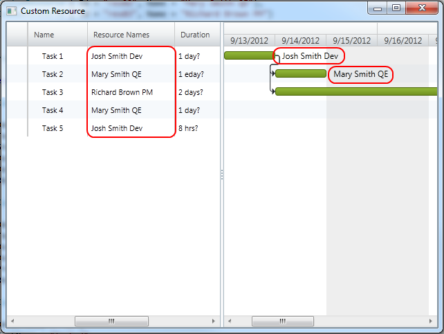

////

|metadata|
{
    "name": "xamgantt-creating-custom-resources-for-xamgantt",
    "controlName": ["xamGantt"],
    "tags": ["Data Binding","Data Presentation","Extending","Grids","Scheduling"],
    "guid": "35badc3a-70d5-4fa4-9cfb-e28434fca136",  
    "buildFlags": [],
    "createdOn": "2016-05-25T18:21:55.5501398Z"
}
|metadata|
////

= Creating Custom Resources for xamGantt

== Topic Overview

=== Purpose

This topics describes how you can create your custom resource class and use it with  _xamGantt._

=== Required background

The following topics are prerequisites to understanding this topic:

[options="header", cols="a,a"]
|====
|Topic|Purpose

| link:xamgantt-adding-xamgantt-to-a-page.html[Adding _xamGantt_ to a Page]
|This topic describes how you can add the _xamGantt_ control to a page.

|====

=== In this topic

This topic contains the following sections:

* <<_Custom_Resources_Introduction, Custom Resources Introduction >>

** <<_Introduction,Introduction>>

** <<_Resource_Property_Mappings,Resource Property Mappings>>

* <<_Code_Example_Creting_a_Custom_Resource, Code Example: Creating a Custom Resource >>

** <<_Description,Description>>

** <<_Ref334102005,Prerequisites>>

** <<_Ref334102013,Preview>>

** <<_Ref335317538,Custom resource code>>

** <<_Ref334464995,Code>>

* <<_Related_Content, Related Content >>

** <<_Ref333763550,Topics>>

** <<_Ref333763850,Samples>>

[[_Custom_Resources_Introduction]]
== Custom Resources Introduction

[[_Introduction]]

=== Introduction

You can use your custom resource class with a  _xamGantt_  link:{ApiPlatform}controls.schedules.xamgantt{ApiVersion}~infragistics.controls.schedules.listbackedproject_members.html[ListBackedProject]. `ListBackedProject` is a project that obtains the task information from a specified link:{ApiPlatform}controls.schedules.xamgantt{ApiVersion}~infragistics.controls.schedules.listbackedproject~taskitemssource.html[TaskItemsSource]. In order to use custom resources, you must set the link:{ApiPlatform}controls.schedules.xamgantt{ApiVersion}~infragistics.controls.schedules.listbackedproject~resourceitemssource.html[ResourceItemsSource] property of your `ListBackedProject`.

The table below summarizes the main properties of a ListBackedProject when used with custom resources:

[options="header", cols="a,a"]
|====
|Property|Description

| link:{ApiPlatform}controls.schedules.xamgantt{ApiVersion}~infragistics.controls.schedules.listbackedproject~resourcepropertymappings.html[ResourcePropertyMappings]
|This property gets or sets a collection used to provide the mappings from the properties in the items of the `ResourceItemsSource` to properties on the link:{ApiPlatform}controls.schedules.xamgantt{ApiVersion}~infragistics.controls.schedules.projectresource_members.html[ProjectResource].

|`ResourceItemsSource`
|This property gets or sets the collection that provides the resource information.

|====

[[_Resource_Property_Mappings]]

=== Resource Property Mappings

Usage of the `ResourcePropertyMappings` consists of setting a link:{ApiPlatform}controls.schedules.xamgantt{ApiVersion}~infragistics.controls.schedules.projectresourcepropertymapping_members.html[ProjectResourcePropertyMapping] object. `ProjectResourcePropertyMapping` contains information regarding a specific field in the data source, which is specified by the `ResourceItemsSource`. This data field is mapped to by a property of the `ProjectResource` object.

The property of the `ProjectResource` object is identified by the link:{ApiPlatform}controls.schedules.xamgantt{ApiVersion}~infragistics.controls.schedules.projectresourcepropertymapping~resourceproperty.html[ResourceProperty], and the field in the data source is identified by the link:{ApiPlatform}controls.schedules.xamgantt{ApiVersion}~infragistics.controls.schedules.projectresourcepropertymapping~dataobjectproperty.html[DataObjectProperty]. You can set the following values for the `ResourceProperty` in XAML:

[options="header", cols="a,a"]
|====
|Resource property values|Description

| _UniqueId_ 
|This is the unique indentifier for the resource which will be mapped to the link:{ApiPlatform}controls.schedules.xamgantt{ApiVersion}~infragistics.controls.schedules.projectresource~uniqueid.html[UniqueId] of the `ProjectResource`.

| _DisplayName_ 
|This is the name of the resource which will be mapped to the link:{ApiPlatform}controls.schedules.xamgantt{ApiVersion}~infragistics.controls.schedules.projectresource~displayname.html[DisplayName] of the `ProjectResource` class. The Display name values appears in the _xamGantt_ grid section.

|====

[[_Code_Example_Creting_a_Custom_Resource]]
== Code Example: Creating a Custom Resource

[[_Description]]

=== Description

This code example creates an Observable collection with three instances of the custom resource class. This collection is set to a property of the underliying ViewModel and it is bound to the `ResourceItemsSource` property of the `ListBackedProject`.

In the mark-up of the example, the necessary Resource property mappings are set. It is therefore ensured that only resources from the bound source can be added to the tasks.

This code example includes a collection of tasks in order to show the displayed resource name near each task.

[[_Ref334102005]]

=== Prerequisites

To complete the code example, you should have a  _xamGantt_  project . You can review the instructions in link:xamgantt-adding-xamgantt-to-a-page.html[Adding  _xamGantt_  to a Page] in order to create a sample  _xamGantt_  project.

Then you need to change the project so that the following classes are present:

* `CustomResource`. To see the complete code for this class, please refer to the Custom Resource code section below.

* `CustomTask`. To see the complete code for this class, please refer to the link:resources-xamgantt-custom-task-code-example.html[CustomTask CodeExample].

Finally, you have to replace the mark-up and theViewModel with those ones shown in this topic.

[[_Ref334102013]]

=== Preview

This is a preview of the completed sample project. You can see that in the grid section and by each task in the chart section, the names of the resources are shown. In the view model of the code example, each task has its resource associated by the resource ID.

[[_Ref335317538]]

=== Custom resource code

*In C#:*

[source,csharp]
----
 public class CustomResource : INotifyPropertyChanged
    {
        #region Private variables
        private string id;
        private string name;
        #endregion // private variables
        #region Public properties
        public string Id
        {
            get { return id; }
            set
            {
                if (value != id)
                {
                    id = value;
                    OnPropertyChanged("Id");
                }
            }
        }
        public string Name
        {
            get { return name; }
            set
            {
                if (value != name)
                {
                    name = value;
                    OnPropertyChanged("Name");
                }
            }
        }
        #endregion // Public properties
        #region INotifyPropertyChanged
        public event PropertyChangedEventHandler PropertyChanged;
        public void OnPropertyChanged(string propertyName)
        {
            if (PropertyChanged != null)
            {
                PropertyChanged(this, new PropertyChangedEventArgs(propertyName));
            }
        }
        #endregion // INotifyPropertyChanged
    }
----

*In Visual Basic:*

[source,vb]
----
Public Class CustomResource
      Implements INotifyPropertyChanged
      #Region "Private variables"
      Private m_id As String
      Private m_name As String
      #End Region
      #Region "Public properties"
      Public Property Id() As String
            Get
                  Return m_id
            End Get
            Set
                  If value <> m_id Then
                        m_id = value
                        OnPropertyChanged("Id")
                  End If
            End Set
      End Property
      Public Property Name() As String
            Get
                  Return m_name
            End Get
            Set
                  If value <> m_name Then
                        m_name = value
                        OnPropertyChanged("Name")
                  End If
            End Set
      End Property
      #End Region
      #Region "INotifyPropertyChanged"
      Public Event PropertyChanged As PropertyChangedEventHandler
      Public Sub OnPropertyChanged(propertyName As String)
            RaiseEvent PropertyChanged(Me, New PropertyChangedEventArgs(propertyName))
      End Sub
      #End Region
End Class
----

[[_Ref334464995]]

=== Code

*In XAML:*

[source,xaml]
----
 <Grid>
        <Grid.Resources>
            <local:CustomResourceViewModel x:Key="dc" />
        </Grid.Resources>
        <Grid.DataContext>
            <Binding Source="{StaticResource dc}" />
        </Grid.DataContext>
        <ig:XamGantt x:Name="xamGantt">
            <ig:XamGantt.Project>
                <ig:ListBackedProject TaskItemsSource="{Binding Tasks}" ResourceItemsSource="{Binding Resources}">
                    <ig:ListBackedProject.TaskPropertyMappings>
                        <ig:ProjectTaskPropertyMapping TaskProperty="DataItemId" DataObjectProperty="DataItemId" />
                        <ig:ProjectTaskPropertyMapping TaskProperty="TaskName" DataObjectProperty="TaskName" />
                        <ig:ProjectTaskPropertyMapping TaskProperty="Start" DataObjectProperty="Start" />
                        <ig:ProjectTaskPropertyMapping TaskProperty="Duration" DataObjectProperty="Duration" />
                        <ig:ProjectTaskPropertyMapping TaskProperty="Tasks" DataObjectProperty="Tasks" />
                        <ig:ProjectTaskPropertyMapping TaskProperty="Predecessors" DataObjectProperty="Predecessors" />
                        <ig:ProjectTaskPropertyMapping TaskProperty="ConstraintDate" DataObjectProperty="ConstraintDate" />
                        <ig:ProjectTaskPropertyMapping TaskProperty="ConstraintType" DataObjectProperty="ConstraintType" />
                        <ig:ProjectTaskPropertyMapping TaskProperty="DurationFormat" DataObjectProperty="DurationFormat" />
                        <!-- You need to add this mapping in order to match the resources associates with the tasks.-->
                        <ig:ProjectTaskPropertyMapping TaskProperty="Resources" DataObjectProperty="Resources" />
                    </ig:ListBackedProject.TaskPropertyMappings>
                    <ig:ListBackedProject.ResourcePropertyMappings>
                        <ig:ProjectResourcePropertyMappingCollection UseDefaultMappings="True">
                            <ig:ProjectResourcePropertyMapping ResourceProperty="UniqueId" DataObjectProperty="Id" />
                            <ig:ProjectResourcePropertyMapping ResourceProperty="DisplayName" DataObjectProperty="Name" />
                        </ig:ProjectResourcePropertyMappingCollection>
                    </ig:ListBackedProject.ResourcePropertyMappings>
                </ig:ListBackedProject>
            </ig:XamGantt.Project>
        </ig:XamGantt>
    </Grid>
----

*In C#:*

[source,csharp]
----
public class CustomResourceViewModel  : INotifyPropertyChanged
    {
        #region Private variables
        private ObservableCollection<CustomTask> taskAndResources;
        private ObservableCollection<CustomResource> resources;
        #endregion Private variables
        #region Public Properties
        public ObservableCollection<CustomTask> Tasks
        {
            get 
            {
                if (taskAndResources == null)
                {
                    taskAndResources = GenerateTasks();
                }
                return taskAndResources; 
            }
            set
            {
                if (value != taskAndResources)
                {
                    taskAndResources = value;
                    OnPropertyChanged("Tasks");
                }
            }
        }
        public ObservableCollection<CustomResource> Resources
        {
            get
            {
                if (resources == null)
                {
                    resources = GenerateResources();
                }
                return resources;
            }
            set
            {
                if (value != resources)
                {
                    resources = value;
                    OnPropertyChanged("Resources");
                }
            }
        }
        #endregion Public Properties
        #region Private helpers
        private ObservableCollection<CustomResource> GenerateResources()
        {
            return new ObservableCollection<CustomResource>()
            {
                new CustomResource { Id = "res01", Name = "Josh Smith Dev"},
                new CustomResource { Id = "res02", Name = "Mary Smith QE"},
                new CustomResource { Id = "res03", Name = "Richard Brown PM"}
            };
        }
        private ObservableCollection<CustomTask> GenerateTasks()
        {
            return new ObservableCollection<CustomTask>()
                  {
                        new CustomTask
                        {
                              DataItemId = "t1",
                              TaskName = "Task 1",
                              Start = DateTime.Now,
                              Duration = TimeSpan.FromHours(8),
                    DurationFormat = "Days",
                    Resources = "res01"
                        },
                new CustomTask
                        {
                              DataItemId = "t2",
                              TaskName = "Task 2",
                              Duration = TimeSpan.FromHours(24),
                    DurationFormat = "ElapsedDays",
                    Predecessors = "t1",
                    Resources = "res02"
                        },
                        new CustomTask
                        {
                              DataItemId = "t3",
                              TaskName = "Task 3",
                              Duration = TimeSpan.FromHours(16),
                    DurationFormat = "Days",
                    Predecessors = "t1",
                    Resources = "res03"
                        },
                        new CustomTask
                        {
                              DataItemId = "t4",
                              TaskName = "Task 4",
                              Duration = TimeSpan.FromHours(8),
                    DurationFormat = "Days",
                    Predecessors = "t3",
                    Resources = "res02"
                        },
                        new CustomTask
                        {
                              DataItemId = "t5",
                              TaskName = "Task 5",
                              Duration = TimeSpan.FromHours(8),
                    DurationFormat = "Hours",
                    Predecessors = "t4",
                    Resources = "res01"
                        }
                  };
        }
        #endregion // Private helpers
        #region INotifyPropertyChanged
        public event PropertyChangedEventHandler PropertyChanged;
        public void OnPropertyChanged(string propertyName)
        {
            if (PropertyChanged != null)
            {
                PropertyChanged(this, new PropertyChangedEventArgs(propertyName));
            }
        }
        #endregion // INotifyPropertyChanged
    }
----

*In Visual Basic:*

[source,vb]
----
Public Class CustomResourceViewModel
      Implements INotifyPropertyChanged
      #Region "Private variables"
      Private taskAndResources As ObservableCollection(Of CustomTask)
      Private m_resources As ObservableCollection(Of CustomResource)
      #End Region
      #Region "Public Properties"
      Public Property Tasks() As ObservableCollection(Of CustomTask)
            Get
                  If taskAndResources Is Nothing Then
                        taskAndResources = GenerateTasks()
                  End If
                  Return taskAndResources
            End Get
            Set
                  If value <> taskAndResources Then
                        taskAndResources = value
                        OnPropertyChanged("Tasks")
                  End If
            End Set
      End Property
      Public Property Resources() As ObservableCollection(Of CustomResource)
            Get
                  If m_resources Is Nothing Then
                        m_resources = GenerateResources()
                  End If
                  Return m_resources
            End Get
            Set
                  If value <> m_resources Then
                        m_resources = value
                        OnPropertyChanged("Resources")
                  End If
            End Set
      End Property
      #End Region
      #Region "Private helpers"
      Private Function GenerateResources() As ObservableCollection(Of CustomResource)
            Return New ObservableCollection(Of CustomResource)() From { _
                  New CustomResource() With { _
                        Key .Id = "res01", _
                        Key .Name = "Josh Smith Dev" _
                  }, _
                  New CustomResource() With { _
                        Key .Id = "res02", _
                        Key .Name = "Mary Smith QE" _
                  }, _
                  New CustomResource() With { _
                        Key .Id = "res03", _
                        Key .Name = "Richard Brown PM" _
                  } _
            }
      End Function
      Private Function GenerateTasks() As ObservableCollection(Of CustomTask)
            Return New ObservableCollection(Of CustomTask)() From { _
                  New CustomTask() With { _
                        Key .DataItemId = "t1", _
                        Key .TaskName = "Task 1", _
                        Key .Start = DateTime.Now, _
                        Key .Duration = TimeSpan.FromHours(8), _
                        Key .DurationFormat = "Days", _
                        Key .Resources = "res01" _
                  }, _
                  New CustomTask() With { _
                        Key .DataItemId = "t2", _
                        Key .TaskName = "Task 2", _
                        Key .Duration = TimeSpan.FromHours(24), _
                        Key .DurationFormat = "ElapsedDays", _
                        Key .Predecessors = "t1", _
                        Key .Resources = "res02" _
                  }, _
                  New CustomTask() With { _
                        Key .DataItemId = "t3", _
                        Key .TaskName = "Task 3", _
                        Key .Duration = TimeSpan.FromHours(16), _
                        Key .DurationFormat = "Days", _
                        Key .Predecessors = "t1", _
                        Key .Resources = "res03" _
                  }, _
                  New CustomTask() With { _
                        Key .DataItemId = "t4", _
                        Key .TaskName = "Task 4", _
                        Key .Duration = TimeSpan.FromHours(8), _
                        Key .DurationFormat = "Days", _
                        Key .Predecessors = "t3", _
                        Key .Resources = "res02" _
                  }, _
                  New CustomTask() With { _
                        Key .DataItemId = "t5", _
                        Key .TaskName = "Task 5", _
                        Key .Duration = TimeSpan.FromHours(8), _
                        Key .DurationFormat = "Hours", _
                        Key .Predecessors = "t4", _
                        Key .Resources = "res01" _
                  } _
            }
      End Function
      #End Region
      #Region "INotifyPropertyChanged"
      Public Event PropertyChanged As PropertyChangedEventHandler
      Public Sub OnPropertyChanged(propertyName As String)
            RaiseEvent PropertyChanged(Me, New PropertyChangedEventArgs(propertyName))
      End Sub
      #End Region
End Class
----

[[_Related_Content]]
== Related Content

[[_Ref333763550]]

=== Topics

The following topics provide additional information related to this topic:

[options="header", cols="a,a"]
|====
|Topic|Purpose

| link:xamgantt-managing-project-resources.html[Managing Project Resources]
|This topic explains how you create resources available for a project and assign them to the project’s tasks using the 

xamGantt control.

|====

[[_Ref333763850]]

=== Samples

The following samples provide additional information related to this topic:

[options="header", cols="a,a"]
|====
|Sample|Purpose

|pick:[sl=" link:{SamplesURL}/gantt/#/custom-resources[Custom Resources]"] pick:[wpf=" link:{SamplesURL}/gantt/custom-resources[Custom Resources]"]
|This sample demonstrates how you can create your custom resources class and use it with the xamGantt control.

|====