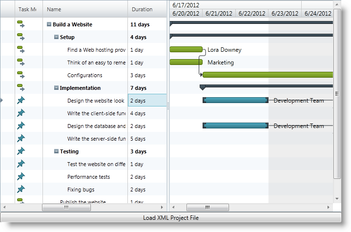

////
|metadata|
{
    "name": "xamgantt-loading-project-plan-from-ms-project-xml-file",
    "controlName": ["xamGantt"],
    "tags": ["Data Binding","How Do I"],
    "guid": "9cbc408b-a3e5-4439-a608-a6bbfe5da884",
    "buildFlags": [],
    "createdOn": "2016-05-25T18:21:55.2221595Z"
}
|metadata|
////

= Loading a Project Plan from a MS Project XML File

== Topic Overview

=== Purpose

This topic describes how an already created project plan saved in a Microsoft Project™ 2010 XML file is loaded in the  _xamGantt™_   control.

=== Required background

The following topics are prerequisites to understanding this topic:

[options="header", cols="a,a"]
|====
|Topic|Purpose

| link:xamgantt-adding-xamgantt-to-a-page.html[Adding xamGantt to a Page]
|This topic describes how you can add the _xamGantt_ control to a page.

|====

=== In this topic

This topic contains the following sections:

* <<_Ref333840050, Loading a Project Plan from a MS Project XML File >>

** <<_Ref333840057,Introduction>>
** <<preview,Preview>>
** <<Overview,Overview>>
** <<_Ref333840069,Steps>>

* <<CodeExamples, Code Examples >>

** <<_Ref333840095,Code Example: Handling the Button Click event to browse an XML file>>
** <<_Ref333840105,Code Example: Loading the Project to the  _xamGantt_  Control>>

* <<_Ref333840111, Related Content >>

** <<_Ref333840116,Topics>>
** <<_Ref333840119,Samples>>

[[_Ref333840050]]
== Loading a Project Plan from a MS Project XML File

[[_Ref333840057]]
=== Introduction

The procedure describes how you can load a MS Project 2010 XML file in  _xamGantt_   control.

=== Preview

The following screenshot previews the result.

=== Overview

Following is a conceptual overview of the process:

[start=1]
. link:xamgantt-loading-project-plan-from-ms-project-xml-file.html#_Ref333840069[*Add a xamGantt control in XAML* ]
[start=2]
. link:xamgantt-loading-project-plan-from-ms-project-xml-file.html#_Ref333840069[*Add a Button to open a dialog to browse for project XML file* ]
[start=3]
. link:xamgantt-loading-project-plan-from-ms-project-xml-file.html#_Ref333840069[*Add required references in code-behind* ]
[start=4]
. link:xamgantt-loading-project-plan-from-ms-project-xml-file.html#_Ref333840069[*Handle the Button Click event* ]
[start=5]
. link:xamgantt-loading-project-plan-from-ms-project-xml-file.html#_Ref333840069[*Load project in the xamGantt* ]

[[_Ref333840069]]

=== Steps

The following steps demonstrate how to load an XML project file in the  _xamGantt_.

. Add a xamGantt control in XAML
+
Add the  _xamGantt_   control to the first row of a Grid container:
+
*In XAML:*
+
[source,xaml]
----
<Grid>
    <Grid.RowDefinitions>
        <RowDefinition Height="*" />
        <RowDefinition Height="22" />
    </Grid.RowDefinitions>
    <ig:XamGantt x:Name="gantt" />
    <!-- Add other controls here -->
</Grid>
----

. Add a Button to open a dialog to browse for project XML file
+
Add a Button control in the second row of the Grid container:
+
*In XAML:*
+
[source,xaml]
----
<Button x:Name="Btn_LoadProject" 
        Grid.Row="1"
        Content="Load XML Project File"
        Click="Btn_LoadProject_Click"/>
----

. Add required references in code-behind
+
Add the following using and Imports declarations in the code-behind:
+
*In C#:*
+
[source,csharp]
----
using System;
using System.IO;
using System.Windows;
using Infragistics;
using Infragistics.Controls.Schedules;
----
+
*In Visual Basic:*
+
[source,vb]
----
Imports System.IO
Imports Infragistics
Imports Infragistics.Controls.Schedules
Imports Microsoft.Win32
----

. Handle the Button Click event
+
Handle the Button Click event to open an XML project file.
+
For more information, see the <<_Ref333840095,Code Example: Handling the Button Click event to browse an XML file.>>

. Load project in the xamGantt
+
Use the link:{ApiPlatform}controls.schedules.xamgantt{ApiVersion}~infragistics.controls.schedules.project_members.html[Project] link:{ApiPlatform}controls.schedules.xamgantt{ApiVersion}~infragistics.controls.schedules.project~loadfromprojectxml.html[LoadFromProjectXml] method to load a project from a stream.
+
For more information, see the <<_Ref333840105,Code Example: Loading a Project to the  _xamGantt_  Control.>>

[[CodeExamples]]
== Code Examples

=== Code examples summary

The following table lists the code examples included in this topic.

[options="header", cols="a,a"]
|====
|Example|Description

|<<_Ref333840095,Code Example: Handling the Button Click event to browse an XML file>>
|The example code uses the OpenFileDialog class to open an XML file and to obtain a Stream object.

|<<_Ref333840105,Code Example: Loading a Project to the _xamGantt_ Control>>
|The example code loads a project from a Stream object.

|====

[[_Ref333840095]]
== Code Example: Handling the Button Click event to browse an XML file

=== Description

The example code below illustrates how to find, open and transform an XML project file to a Stream object.

=== Code

*In C#:*
[source,csharp]
----
using Microsoft.Win32;
private void Btn_LoadProject_Click(object sender, RoutedEventArgs e)
{
    OpenFileDialog dialog = new OpenFileDialog();
    dialog.Multiselect = false;
    dialog.InitialDirectory = "c:\\";
    dialog.Filter = "MS Project XML (.xml)|*.xml|All Files (*.*)|*.* ";
    bool? isOpened = dialog.ShowDialog();
    if (isOpened == true)
    {
        try
        {
            using (Stream stream = dialog.OpenFile())
            {
                LoadProjectFromStream(stream);
                stream.Close();
            }
        }
        catch (Exception ex)
        {
            MessageBox.Show(ex.Message);
        }
    }
}
----

*In Visual Basic:*
[source,vb]
----
Imports Microsoft.Win32
Private Sub Btn_LoadProject_Click(sender As Object, e As RoutedEventArgs)
    Dim dialog As New OpenFileDialog()
    dialog.Multiselect = False
    dialog.InitialDirectory = "c:\"
    dialog.Filter = "MS Project XML (.xml)|*.xml|All Files (*.*)|*.* "
    Dim isOpened As System.Nullable(Of Boolean) = dialog.ShowDialog()
    If isOpened = True Then
        Try
            Using stream As Stream = dialog.OpenFile()
                LoadProjectFromStream(stream)
                stream.Close()
            End Using
        Catch ex As Exception
            MessageBox.Show(ex.Message)
        End Try
    End If
End Sub
----

[[_Ref333840105]]
== Code Example: Loading a Project to the  _xamGantt_   Control

=== Description

The example code below, illustrates how to load a project from the Stream object created in the previous code example.

The Project link:{ApiPlatform}controls.schedules.xamgantt{ApiVersion}~infragistics.controls.schedules.project~loadfromprojectxml.html[LoadFromProjectXml] method takes a Stream as a parameter.

=== Code

*In C#:*
[source,csharp]
----
private void LoadProjectFromStream(Stream stream)
{
    // Create a xamGantt Project and load project data from the resulting Stream
    var project = new Project();
    // Load a project from stream
    project.LoadFromProjectXml(stream);
    this.gantt.VisibleDateRange = new DateRange(project.Start, project.Finish);
    this.gantt.Project = project;
}
----

*In Visual Basic:*
[source,vb]
----
Private Sub LoadProjectFromStream(stream As Stream)
    ' Create a xamGantt Project and load project data from a Stream
    Dim project = New Project()
    ' Load a project from stream
    project.LoadFromProjectXml(stream)
    Me.gantt.VisibleDateRange = New DateRange(project.Start, project.Finish)
    Me.gantt.Project = project
End Sub
----

[[_Ref333840111]]
== Related Content

[[_Ref333840116]]
=== Topics

The following topics provide additional information related to this topic.

[options="header", cols="a,a"]
|====
|Topic|Purpose

| link:xamgantt-data-binding-overview.html[Data Binding Overview]
|This topic gives an overview of _xamGantt_ control data binding.

| link:xamgantt-binding-to-data-using-project.html[Binding to Data Using Project]
|This topic describes how the _xamGantt_ control is bound to data via Project property.

| link:xamgantt-binding-arbitrary-tasks-collection-listbackedproject.html[Binding to Arbitrary Task Collection Using ListBackedProject]
|This topic describes how the _xamGantt_ control is bound to an arbitrary tasks collection via ListBackedProject.

|====

[[_Ref333840119]]
=== Samples

The following samples provide additional information related to this topic.

[options="header", cols="a,a"]
|====
|Sample|Purpose

| link:{SamplesURL}/gantt/load-a-project-from-a-ms-project-xml-file[Load a Project from a MS Project XML File]
|This sample demonstrates how a project plan is loaded in the _xamGantt_ control from a Microsoft Project 2010 XML file.

|====