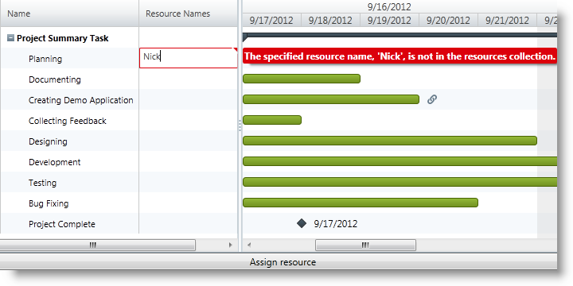
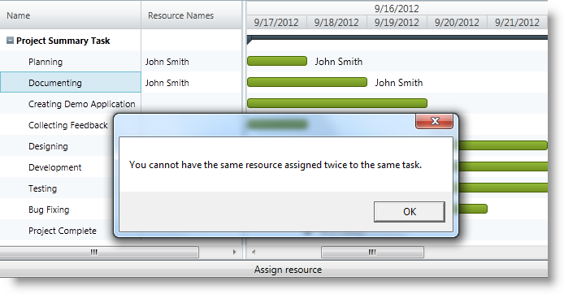

////

|metadata|
{
    "name": "xamgantt-managing-project-resources",
    "controlName": ["xamGantt"],
    "tags": ["Data Presentation","Getting Started","How Do I","Scheduling"],
    "guid": "c21e5be3-8251-40d0-a362-bb606e31a76e",  
    "buildFlags": [],
    "createdOn": "2016-05-25T18:21:55.598181Z"
}
|metadata|
////

= Managing Project Resources

== Topic Overview

=== Purpose

This topic explains how you create resources available for a project and assign them to the project’s tasks using the  _xamGantt™_   control.

=== Required background

The following topics are prerequisites to understanding this topic:

[options="header", cols="a,a"]
|====
|Topic|Purpose

| link:xamgantt-adding-xamgantt-to-a-page.html[Adding xamGantt to a Page]
|This topic describes how to add the _xamGantt_ control to a page.

|====

=== In this topic

This topic contains the following sections:

* <<_Ref335601194, Resources Configuration Summary >>
* <<_Ref335601202, Creating Project’s Resources Collection >>
* <<_Ref335601207, Assigning Project’s Resources to Tasks >>
* <<_Ref335749688, Handling Missing Resource Event >>
* <<_Ref335902141, Related Content >>

** <<_Ref335601219,Topics>>
** <<_Ref335601225,Samples>>

[[_Ref335601194]]
== Resources Configuration Summary

=== Resources configuration summary chart

The following table lists the configurable aspects relating to the resources in the  _xamGantt_   control. Additional details follow later in the topic.

[options="header", cols="a,a,a"]
|====
|Configurable aspect|Details|Property

|Creating a resource and adding it to the project
|Initialize a link:{ApiPlatform}controls.schedules.xamgantt{ApiVersion}~infragistics.controls.schedules.projectresource_members.html[ProjectResource] object and `Add` it to the link:{ApiPlatform}controls.schedules.xamgantt{ApiVersion}~infragistics.controls.schedules.project_members.html[Project] link:{ApiPlatform}controls.schedules.xamgantt{ApiVersion}~infragistics.controls.schedules.project~resourceitems.html[ResourceItems] collection.
| link:{ApiPlatform}controls.schedules.xamgantt{ApiVersion}~infragistics.controls.schedules.project~resourceitems.html[ResourceItems]

|Assigning a resource to a task
|Initialize a link:{ApiPlatform}controls.schedules.xamgantt{ApiVersion}~infragistics.controls.schedules.projecttaskresource_members.html[ProjectTaskResource] object with a resource unique ID as a mandatory parameter and `Add` it to the link:{ApiPlatform}controls.schedules.xamgantt{ApiVersion}~infragistics.controls.schedules.projecttask_members.html[ProjectTask] link:{ApiPlatform}controls.schedules.xamgantt{ApiVersion}~infragistics.controls.schedules.projecttask~resources.html[Resources] collection. 

In the `Add` method, you specify the resource units needed.
| link:{ApiPlatform}controls.schedules.xamgantt{ApiVersion}~infragistics.controls.schedules.projecttask~resources.html[Resources]

|Configuring if adding a resource through the _xamGantt_ control user interface automatically create a new resource in the project
|Returns or sets a Boolean value indicating the addition of a new `ProjectResource` to the `Project` `ResourceItems` collection when entering an unrecognized resource name into the `ProjectTask` link:{ApiPlatform}controls.schedules.xamgantt{ApiVersion}~infragistics.controls.schedules.projecttask~resourcestext.html[ResourcesText]. 

Enabled is the default setting for this operation.
| link:{ApiPlatform}controls.schedules.xamgantt{ApiVersion}~infragistics.controls.schedules.projectsettings~autoaddnewresources.html[AutoAddNewResources]

|====

[[_Ref335601202]]
== Creating Project’s Resources Collection

=== Overview

You can create resources and add them to a project’s resource collection in the  _xamGantt_   control. After that, you can assign resources to the tasks from the available project’s resources or create new ones via the user interface.

=== Property settings

The following table maps the example configuration to property settings.

[options="header", cols="a,a,a"]
|====
|In order to:|Use this property/event:|And set it to:

|Enable/disable adding new resources via the _xamGantt_ UI
| link:{ApiPlatform}controls.schedules.xamgantt{ApiVersion}~infragistics.controls.schedules.projectsettings~autoaddnewresources.html[AutoAddNewResources]
|`bool`

|Set a resource display name
| link:{ApiPlatform}controls.schedules.xamgantt{ApiVersion}~infragistics.controls.schedules.projectresource~displayname.html[DisplayName]
|`string`

|Set a resource unique ID
| link:{ApiPlatform}controls.schedules.xamgantt{ApiVersion}~infragistics.controls.schedules.projectresource~uniqueid.html[UniqueId]
|`string`

|Create a project’s resource collection
| link:{ApiPlatform}controls.schedules.xamgantt{ApiVersion}~infragistics.controls.schedules.project~resourceitems.html[ResourceItems]
| link:{ApiPlatform}controls.schedules.xamgantt{ApiVersion}~infragistics.controls.schedules.projectresourcecollection_members.html[ProjectResourceCollection]

|====

=== Example

The example code below demonstrates how to create a resource, add it the project’s available resources collection and disabling the addition of new resources via the  _xamGantt_   UI.

The screenshot illustrates the error tooltip that appears when a user attempts to assign a new unrecognized resource to a task:

*In C#:*

[source,csharp]
----
ProjectSettings settings = new ProjectSettings();
// Disable adding resources through the xamGantt UI 
// and via the ProjectTask ResourcesText property
settings.AutoAddNewResources = false;
this.gantt.Project.Settings = settings;
// Create ProjectResource with display name and unique ID
ProjectResource projectResource = new ProjectResource();
projectResource.DisplayName = "John Smith";
projectResource.UniqueId = "dev-jsmith-45673";
// Add created resource to the project ResourceItems collection
this.gantt.Project.ResourceItems.Add(projectResource);
----

*In Visual Basic:*

[source,vb]
----
Dim settings As New ProjectSettings()
' Disable adding resources through the xamGantt UI and via the ProjectTask ResourcesText property
settings.AutoAddNewResources = False
Me.gantt.Project.Settings = settings
' Create ProjectResource with display name and unique ID
Dim projectResource As New ProjectResource()
projectResource.DisplayName = "John Smith"
projectResource.UniqueId = "dev-jsmith-45673"
' Add created resource to the project ResourceItems collection
Me.gantt.Project.ResourceItems.Add(projectResource)
----

[[_Ref335601207]]
== Assigning Project’s Resources to Tasks

=== Overview

You can create resources and assign them to tasks using the  _xamGantt_   control. You may add as many resources to a task as required, but you may not add the same resource more than once to the same tasks.

=== Property settings

The following table maps the desired configuration to property settings.

[options="header", cols="a,a,a"]
|====
|In order to:|Use this property:|And set it to:

|Assign a ProjectTaskResource to a task
| link:{ApiPlatform}controls.schedules.xamgantt{ApiVersion}~infragistics.controls.schedules.projecttask~resources.html[Resources]
| link:{ApiPlatform}controls.schedules.xamgantt{ApiVersion}~infragistics.controls.schedules.projecttaskresourcecollection_members.html[ProjectTaskResourceCollection]

|====

=== Example

The example code demonstrates how to assign a resource to the currently active task on a Button Click event. Additionally, it depicts the error dialog box resulting from attempting to assign a resource to a task more than once:

*In C#:*

[source,csharp]
----
private void Btn_AddResource_Click(object sender, RoutedEventArgs e)
{
  // Create a ProjectTaskResource for the available project resource with specified unique ID 
    ProjectTaskResource taskResource = new ProjectTaskResource("dev-jsmith-45673");
    try
    {
        // Assign the resource to the task
        this.gantt.ActiveRow.Value.Task.Resources.Add(taskResource);
    }
    catch (Exception exc)
    {
        // Show a message if an exception occurs
        MessageBox.Show(exc.Message);
    }
}
----

*In Visual Basic:*

[source,vb]
----
Private Sub Btn_AddResource_Click(sender As Object, e As RoutedEventArgs)
      ' Create a ProjectTaskResource for the available project resource with specified unique ID 
      Dim taskResource As New ProjectTaskResource("dev-jsmith-45673")
      Try
            ' Assign the resource to the task
            Me.gantt.ActiveRow.Value.Task.Resources.Add(taskResource)
      Catch exc As Exception
            ' Show a message if an exception occurs
            MessageBox.Show(exc.Message)
      End Try
End Sub
----

[[_Ref335749688]]
[[_Ref335601214]]
== Handling Missing Resource Event

=== Overview

This example demonstrates error handling in the event that a user attempts to enter an unrecognized resource that is not included as part of the project’s available resources.

Use the link:{ApiPlatform}controls.schedules.xamgantt{ApiVersion}~infragistics.controls.schedules.project_members.html[Project] link:{ApiPlatform}controls.schedules.xamgantt{ApiVersion}~infragistics.controls.schedules.project~missingresourcewarning_ev.html[MissingResourceWarning] event and handle it to process this error.

=== Event settings

[options="header", cols="a,a"]
|====
|In order to:|Use this event:

|Handle the entering of an unrecognized resource string in the _xamGantt_ UI 

when forbidden by its configuration (`AutoAddNewResources` property is set to `False`).
| link:{ApiPlatform}controls.schedules.xamgantt{ApiVersion}~infragistics.controls.schedules.project~missingresourcewarning_ev.html[MissingResourceWarning]

|====

=== Example

The example below demonstrates how to handle the addition of an unrecognized resource error event:

*In C#:*

[source,csharp]
----
…
this.gantt.Project.MissingResourceWarning +=
new EventHandler<MissingResourceWarningEventArgs>(Project_MissingResourceWarning);
…
----

*In C#:*

[source,csharp]
----
private void Project_MissingResourceWarning(object sender, MissingResourceWarningEventArgs e)
{
    // Show a message if an exception occurs
    MessageBox.Show(string.Format("The {0} resource is an unrecognized resource.", e.ResourceName));
}
----

*In Visual Basic:*

[source,vb]
----
…
Me.gantt.Project.MissingResourceWarning = New EventHandler(Of MissingResourceWarningEventArgs)(Project_MissingResourceWarning)
…
----

*In Visual Basic:*

[source,vb]
----
Private Sub Project_MissingResourceWarning(sender As Object, e As MissingResourceWarningEventArgs)
      ' Show a message if an exception occurs
      MessageBox.Show(String.Format("The {0} resource is an unrecognized resource.", e.ResourceName))
End Sub
----

[[_Ref335902141]]
== Related Content

[[_Ref335601219]]

=== Topics

The following topics provide additional information related to this topic.

[options="header", cols="a,a"]
|====
|Topic|Purpose

| link:xamgantt-creating-custom-resources-for-xamgantt.html[Creating Custom Resources for xamGantt]
|This topic describes how to create a custom resource class and use it with _xamGantt_ .

|====

[[_Ref335601225]]

=== Samples

The following samples provide additional information related to this topic.

[options="header", cols="a,a"]
|====
|Sample|Purpose

| pick:[sl=" link:{SamplesURL}/gantt/#/managing-resources[Managing Resources]"] pick:[wpf=" link:{SamplesURL}/gantt/managing-resources[Managing Resources]"] 
|This sample demonstrates how resources can be associated with tasks in the _xamGantt_ control.

|====