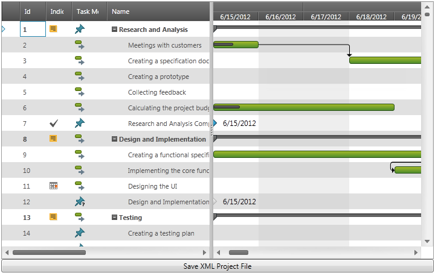

////
|metadata|
{
    "name": "xamgantt-saving-project-plan-to-ms-project-xml-file",
    "controlName": ["xamGantt"],
    "tags": ["Data Binding","Getting Started","How Do I"],
    "guid": "dbae982c-21d0-4f1e-a376-1f5e9184f9a0",
    "buildFlags": [],
    "createdOn": "2016-05-25T18:21:55.6151813Z"
}
|metadata|
////

= Saving a Project Plan to a Microsoft Project XML File (xamGantt)

== Topic Overview

=== Purpose

This topic explains how to save a  _xamGantt_   _™_   project plan in a Microsoft Project XML file.

=== Required background

The following topic is a prerequisite to understanding this topic:

[options="header", cols="a,a"]
|====
|Topic|Purpose

| link:xamgantt-adding-xamgantt-to-a-page.html[Adding xamGantt to a Page]
|This topic describes how you can add the _xamGantt_ control to a page.

|====

[[_Ref346027431]]

=== In this topic

This topic contains the following sections:

* <<_Ref346027773, Saving a Project Plan to an MS Project XML File >>
** <<_Ref346027418,Introduction>>
** <<OLE_LINK77,Preview>>
** <<OLE_LINK63,Overview>>
** <<_Ref346027446,Steps>>

* <<OLE_LINK48, Code Examples >>
** <<_Ref345947545,Code Example: Handle the Button Click Event to Save the Project Plan as XML File>>
** <<_Ref345947563,Code Example: Saving a  _xamGantt’s_   Project Plan to an MS Project XML File>>

* <<_Ref346027491, Related Content >>
** <<_Ref346027496,Topics>>
** <<_Ref346027500,Samples>>

[[_Ref346027773]]
== Saving a Project Plan to an MS Project XML File

[[_Ref346027418]]

=== Introduction

The procedure describes how to save a  _xamGantt_   project plan to an MS Project XML file.

.Note
[NOTE]
====
When saving the project plan, the  _xamGantt_   control only supports the MS Project 2010 file format.
====

=== Preview

The following screenshot is a preview of the results.

=== Overview

Following is a conceptual overview of the process:

1. Add a  _xamGantt_   control in XAML

2. Add an open dialog box button for saving the project plan as XML file

3. Add required references in code-behind

4. Handle the button click event

5. Save the project plan as MS Project XML file

[[_Ref346027446]]
=== Steps

The following steps demonstrate saving a  _xamGantt_   project plan to an XML file.

[start=1] 
. Add a xamGantt control in XAML
+
Add the  _xamGantt_   control to the first row of a Grid container:
+
*In XAML:*
+
[source,xaml]
----
<Grid>
    <Grid.RowDefinitions>
        <RowDefinition Height="*" />
        <RowDefinition Height="Auto" />
    </Grid.RowDefinitions>
    <ig:XamGantt x:Name="gantt" />
    <!-- Add other controls here -->
</Grid>
----

[start=2]
. Add a button for showing the save to XML file dialog
+
Add a Button control in the second row of the Grid container:
+
*In XAML:*
+
[source,xaml]
----
 <Button x:Name="Btn_SaveProject" 
        Grid.Row="1"
        Content="Save XML Project File"
        Click="Btn_SaveProject_Click"/>
----

[start=3]
. Add required references in code-behind
+
Add the following  _using_   or  _Imports_   declarations in the code-behind:
+
*In C#:*
+
[source,csharp]
----
using System;
using System.IO;
using System.Windows;
using Infragistics;
using Infragistics.Controls.Schedules;
using Microsoft.Win32;
----
+
*In Visual Basic:*
+
[source,vb]
----
Imports System.IO
Imports Infragistics
Imports Infragistics.Controls.Schedules
Imports Microsoft.Win32
----

[start=4]
. Handle the button click event
+
Handle the button click event to save the  _xamGantt_   project plan to an MS Project XML file.
+
For more information, see the <<_Ref345947545,Code Example: Handle the Button Click Event to Save the Project Plan as XML File>>

[start=5]
. Save the xamGantt project to an MS Project XML file
+
Use the link:{ApiPlatform}controls.schedules.xamgantt.v{ProductVersion}~infragistics.controls.schedules.project_members.html[Project]’s link:{ApiPlatform}controls.schedules.xamgantt.v{ProductVersion}~infragistics.controls.schedules.project~saveasprojectxml.html[SaveAsProjectXml] method to save a project plan to a stream.
+
For more information, see the <<_Ref345947563,Code Example: Saving a  _xamGantt’s_   Project Plan to an MS Project XML File>>
+
.Note
[NOTE]
====
The link:xamgantt-loading-project-plan-from-ms-project-xml-file.html[Loading a Project Plan from an MS Project XML File] topic demonstrates how to load sample data.
====

== Code Examples

=== Code examples summary

The following table lists the code examples included in this topic.

[options="header", cols="a,a"]
|====
|Example|Description

|<<_Ref345947545,Code Example: Handle the Button Click Event to Save the Project Plan as XML File>>
|The example code uses the SaveFileDialog class to save a _xamGantt’s_ project plan to an MS Project XML file.

|<<_Ref345947563,Code Example: Saving a xamGantt’s Project Plan to an MS Project XML File>>
|The example code saves the _xamGantt’s_ project plan to an MS Project XML file.

|====

[[_Ref345947545]]
== Code Example: Handle the Button Click Event to Save the Project Plan as XML File

=== Description

The example code uses the SaveFileDialog class to save a  _xamGantt’s_   project plan to an MS Project XML file.

=== Code

*In C#:*
[source,csharp]
----
using Microsoft.Win32;
private void Btn_SaveProject_Click(object sender, RoutedEventArgs e)
{
    SaveFileDialog dialog = new SaveFileDialog();
    dialog.InitialDirectory = "c:\\";
    dialog.Filter = "MS Project XML (.xml)|*.xml|All Files (*.*)|*.* ";
    bool? isSaved = dialog.ShowDialog();
    if (isSaved == true)
    {
        try
        {
            using (Stream stream = dialog.OpenFile())
            {
                SaveProjectToStream(stream);
                stream.Close();
            }
        }
        catch (Exception ex)
        {
            MessageBox.Show(ex.Message);
        }
    }
}
----

*In Visual Basic:*
[source,vb]
----
Imports Microsoft.Win32
Private Sub Btn_SaveProject_Click(sender As Object, e As RoutedEventArgs)
    Dim dialog As New SaveFileDialog()
    dialog.InitialDirectory = "c:\"
    dialog.Filter = "MS Project XML (.xml)|*.xml|All Files (*.*)|*.* "
    Dim isSaved As System.Nullable(Of Boolean) = dialog.ShowDialog()
    If isSaved = True Then
        Try
            Using stream As Stream = dialog.OpenFile()
                SaveProjectToStream(stream)
                stream.Close()
            End Using
        Catch ex As Exception
            MessageBox.Show(ex.Message)
        End Try
    End If
End Sub
----

[[_Ref345947563]]
== Code Example: Saving a  _xamGantt’s_   Project Plan to an MS Project XML File

=== Description

The following code examples demonstrate how to save  _xamGantt_   project plans to an MS Project XML file in both C# and Visual Basic.

=== Code

*In C#:*
[source,csharp]
----
private void SaveProjectToStream(Stream stream)
{
    // obtain the xamGantt Project
    var project = this.gantt.Project;
    project.SaveAsProjectXml(stream);
}
----

*In Visual Basic:*
[source,vb]
----
Private Sub SaveProjectToStream(stream As Stream)
    ' obtain the xamGantt Project
    Dim project = Me.gantt.Project
    project.SaveAsProjectXml(stream)
End Sub
----

[[_Ref346027491]]
== Related Content

[[_Ref346027496]]
=== Topics

The following topics provide additional information related to this topic.

[options="header", cols="a,a"]
|====
|Topic|Purpose

| link:xamgantt-data-binding-overview.html[Data Binding Overview]
|This topic gives an overview of _xamGantt_ control data binding.

| link:xamgantt-binding-to-data-using-project.html[Binding to Data Using Project]
|This topic describes how the _xamGantt_ control is bound to data via Project property.

| link:xamgantt-binding-arbitrary-tasks-collection-listbackedproject.html[Binding to Arbitrary Tasks Collection Using ListBackedProject]
|This topic describes how the _xamGantt_ control is bound to an arbitrary tasks collection via ListBackedProject.

| link:xamgantt-loading-project-plan-from-ms-project-xml-file.html[Loading a Project Plan from an MS Project XML File]
|This topic describes how an already created project plan saved in a Microsoft Project™ 2010 XML file is loaded in the _xamGantt_ control.

|====

[[_Ref346027500]]
=== Samples

The following sample provides additional information related to this topic.

[options="header", cols="a,a"]
|====
|Sample|Purpose

| link:{SamplesURL}/gantt/save-a-project-to-a-ms-project-xml-file[Save a Project to an MS Project XML File]
|This sample demonstrates how a project plan can be saved by the xamGantt control to a Microsoft Project 2010 XML file.

|====