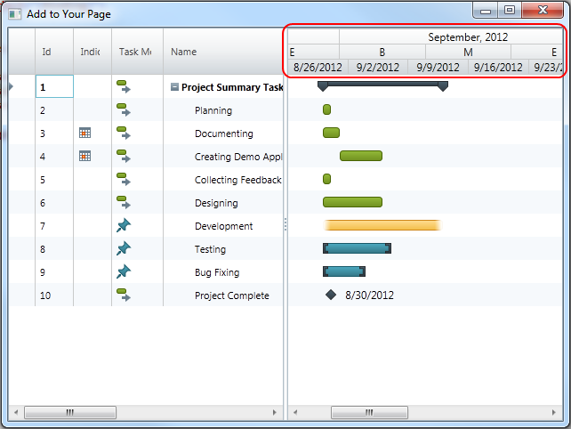

////

|metadata|
{
    "name": "xamgantt-setting-the-xamgantt-timescale-bands",
    "controlName": ["xamGantt"],
    "tags": ["Formatting","Grids","How Do I","Layouts","Scheduling"],
    "guid": "74670f86-b5bd-4d5c-914c-7686253c9cf1",  
    "buildFlags": [],
    "createdOn": "2016-05-25T18:21:55.5211388Z"
}
|metadata|
////

= Setting the xamGantt Timescale bands

== Topic Overview

=== Purpose

This topics describes how you can set timescale bands for a  _xamGantt™_   timescale.

=== Required background

The following topics are prerequisites to understanding this topic:

[options="header", cols="a,a"]
|====
|Topic|Purpose

| link:xamgantt-adding-xamgantt-to-a-page.html[Adding _xamGantt_ to a Page]
|This topic describes how you can add the _xamGantt™_ control to a page.

|====

=== In this topic

This topic contains the following sections:

* <<_Timescale_Bands_Introduction, Timescale Bands Introduction >>

** <<_Ref334101937,Introduction>>

** <<_Ref334101951,Bands>>

* <<_Code_Example_Setting_the_Timescale_Bands, Code Example: Setting the Timescale Bands >>

** <<_Ref333763526,Description>>

** <<_Ref334102005,Prerequisites>>

** <<_Ref334102013,Preview>>

** <<_Ref334102056,Code>>

* <<_Related_Content, Related Content >>

** <<_Ref333763550,Topics>>

** <<_Ref333763850,Samples>>

[[_Timescale_Bands_Introduction]]
== Timescale Bands Introduction

[[_Ref334101937]]

=== Introduction

link:{ApiPlatform}controls.schedules.xamgantt{ApiVersion}~infragistics.controls.schedules.timescaleband_members.html[TimescaleBand] class inherits the link:{ApiPlatform}controls.schedules.xamgantt{ApiVersion}~infragistics.controls.schedules.timescalebandbase_members.html[TimescaleBandBase] class. TimescaleBandBase is used to provide set of date time ranges representing the time intervals in the timescale.

XamGantt Timescale maintains a collection of `TimescaleBand` objects called link:{ApiPlatform}controls.schedules.xamgantt{ApiVersion}~infragistics.controls.schedules.timescale~bands.html[Bands] and a read-only collection of TimescaleBandBase objects called link:{ApiPlatform}controls.schedules.xamgantt{ApiVersion}~infragistics.controls.schedules.timescalebase~visiblebands.html[VisibleBands].

=== Bands

Bands collection provides tiers for the timescale. You set the timescale bands by using the Bands collection. You can have multiple instances of timescale bands in this collection and you can control which of them are shown in the chart section by setting the link:{ApiPlatform}controls.schedules.xamgantt{ApiVersion}~infragistics.controls.schedules.timescaleband~isvisible.html[IsVisible] property for each of them.

[[_Ref334101951]]

=== Visible Bands

Timescale VisibleBands property is populated with the bands whose IsVisible property is set to true. Bands in this collection are sorted based on their estimated duration of the band, so that the largest intervals is on top.

[[_Code_Example_Setting_the_Timescale_Bands]]
== Code Example: Setting the Timescale Bands

[[_Ref333763526]]

=== Description

This code example show you how to set the timescale bands. You can set them via XAML or via code-behind.

[[_Ref334102005]]

=== Prerequisites

** To complete the code example, you should have a xamGantt project . You can follow the instructions in link:xamgantt-adding-xamgantt-to-a-page.html[Adding  _xamGantt_  to a Page] in order to create sample xamGantt project.

[[_Ref334102013]]

=== Preview

This is a preview of completed sample project. Three TimescaleBands are set, each with different unit type.

[[_Ref334102056]]

=== Code

*In XAML:*

[source,xaml]
----
…
    <Grid>
        <ig:XamGantt x:Name="gantt" Project="{Binding}">
            <ig:XamGantt.ViewSettings>
                <ig:ProjectViewSettings>
                    <ig:ProjectViewSettings.Timescale>
                        <ig:Timescale>
                            <ig:TimescaleBand Unit="Months" IsVisible="True" HorizontalAlignment="Center" />
                            <ig:TimescaleBand Unit="ThirdsOfMonths" IsVisible="True" />
                            <ig:TimescaleBand Unit="Weeks" IsVisible="True" />
                        </ig:Timescale>
                    </ig:ProjectViewSettings.Timescale>
                </ig:ProjectViewSettings>
            </ig:XamGantt.ViewSettings>
        </ig:XamGantt>
    </Grid>
…
----

*In C#:*

[source,csharp]
----
…
            Timescale timescale = new Timescale();
            timescale.Bands.Add(new TimescaleBand { Unit = TimescaleUnit.Months, IsVisible = true });
            timescale.Bands.Add(new TimescaleBand { Unit = TimescaleUnit.ThirdsOfMonths, IsVisible = 
true });
            timescale.Bands.Add(new TimescaleBand { Unit = TimescaleUnit.Weeks, IsVisible = true });
            gantt.ViewSettings = new ProjectViewSettings();
            gantt.ViewSettings.Timescale = timescale;
…
----

*In Visual Basic:*

[source,vb]
----
Dim timescale As New Timescale()
timescale.Bands.Add(New TimescaleBand() With { 
      Key .Unit = TimescaleUnit.Months, 
      Key .IsVisible = True 
})
timescale.Bands.Add(New TimescaleBand() With { 
      Key .Unit = TimescaleUnit.ThirdsOfMonths, 
      Key .IsVisible = True 
})
timescale.Bands.Add(New TimescaleBand() With { 
      Key .Unit = TimescaleUnit.Weeks, 
      Key .IsVisible = True 
})
gantt.ViewSettings = New ProjectViewSettings()
gantt.ViewSettings.Timescale = timescale
----

[[_Related_Content]]
== Related Content

[[_Ref333763550]]

=== Topics

The following topics provide additional information related to this topic.

[options="header", cols="a,a"]
|====
|Topic|Purpose

| link:xamgantt-configuring-the-xamgantt-timescale.html[Configuring the Timescale]
|The topics in this group contains information about xamGantt™ Timescale.

| link:xamgantt-timescale-configuration-overview.html[xamGantt Timescale Configuration Overview]
|This topic gives an overview of the main features of xamGantt™ Timescale.

|====

[[_Ref333763850]]

=== Samples

The following samples provide additional information related to this topic.

[options="header", cols="a,a"]
|====
|Sample|Purpose

| pick:[sl=" link:{SamplesURL}/gantt/#/timescale-units[Timescale Units]"] pick:[wpf=" link:{SamplesURL}/gantt/timescale-units[Timescale Units]"] 
|This sample shows timescale units supported by xamGantt and demonstrate how you can change the units and unit count for timescale bands.

| pick:[sl=" link:{SamplesURL}/gantt/#/timescale-display-formats[Timescale Display Formats]"] pick:[wpf=" link:{SamplesURL}/gantt/timescale-display-formats[Timescale Display Formats]"] 
|This sample shows large set of supported display formats by the xamGantt control and demonstrates how you can change the display format for a timescale band.

|====