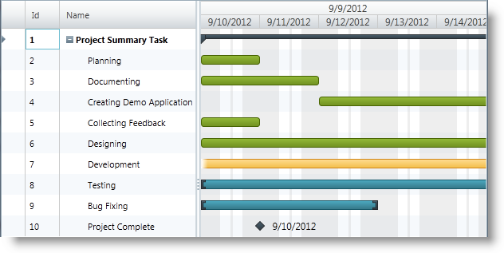

////

|metadata|
{
    "name": "xamgantt-showing-hiding-non-work-days-hours-background",
    "controlName": ["xamGantt"],
    "tags": ["Data Presentation","How Do I","Scheduling"],
    "guid": "73df1f59-efbc-4f82-9275-d6a021e4ca5a",  
    "buildFlags": [],
    "createdOn": "2016-05-25T18:21:55.3681675Z"
}
|metadata|
////

= Showing/Hiding Non-Work Days/Hours Background

== Topic Overview

=== Purpose

This topic explains how to configure highlighting of nonworking days/hours using the  _xamGantt™_   control.

=== Required background

The following topics are prerequisites to understanding this topic:

[options="header", cols="a,a"]
|====
|Topic|Purpose

| link:xamgantt-adding-xamgantt-to-a-page.html[Adding xamGantt to a Page]
|This topic describes how to add the _xamGantt_ control to a page.

|====

=== In this topic

This topic contains the following sections:

* <<_Ref335069331, Showing/Hiding Non-Work Days/Hours Background >>

** <<_Ref335271494,Overview>>
** <<_Ref335271506,Property settings>>
** <<_Ref335271513,Example>>

* <<_Ref335069336, Related Content >>

** <<_Ref335069342,Topics>>
** <<_Ref335069347,Samples>>

[[_Ref335069331]]
== Showing/Hiding Non-Work Days/Hours Background

[[_Ref335271494]]

=== Overview

By default, nonworking days appear highlighted in the chart section of the  _xamGantt_   control.

There are three configuration options for highlighting nonworking days:

* nonworking days with highlighting disabled
* highlighting of the entire timescale interval provided there are no working times intersecting with that interval
* highlighting all the nonworking time regardless of whether or not they intersect with the timescale intervals

[[_Ref335271506]]

=== Property settings

The following table maps the desired configuration to property settings.

[options="header", cols="a,a,a"]
|====
|In order to:|Use this property:|And set it to:

|Configure the highlighting of the non-working hours and days
| link:{ApiPlatform}controls.schedules.xamgantt.v{ProductVersion}~infragistics.controls.schedules.projectviewsettings~nonworkingtimehighlightstyle.html[NonWorkingTimeHighlightStyle]
|`Nullable`< link:{ApiPlatform}controls.schedules.xamgantt.v{ProductVersion}~infragistics.controls.schedules.nonworkingtimehighlightstyle.html[NonWorkingTimeHighlightStyle]>

|====

[[_Ref335271513]]

=== Example

The screenshot below demonstrates the highlighting applied to nonworking days and hours as a result of the following settings:

[options="header", cols="a,a"]
|====
|Property|Value

|`NonWorkingTimeHighlightStyle`
| link:{ApiPlatform}controls.schedules.xamgantt.v{ProductVersion}~infragistics.controls.schedules.nonworkingtimehighlightstyle.html[ActualNonWorkingHours]

|====

*In XAML:*

[source,xaml]
----
<ig:XamGantt x:Name="gantt" 
             Project="{Binding Project}">
    <ig:XamGantt.ViewSettings>
        <ig:ProjectViewSettings NonWorkingTimeHighlightStyle="ActualNonWorkingHours" />
    </ig:XamGantt.ViewSettings>
</ig:XamGantt>
----

[[_Ref335069336]]
== Related Content

[[_Ref335069342]]

=== Topics

The following topics provide additional information related to this topic.

[options="header", cols="a,a"]
|====
|Topic|Purpose

| link:xamgantt-project-view-settings-configuration-overview.html[Project View Settings Configuration Overview]
|This topic gives an overview of the _xamGantt_ ProjectViewSettings class and its configurable aspects.

|====

[[_Ref335069347]]

=== Samples

The following samples provide additional information related to this topic.

[options="header", cols="a,a"]
|====
|Sample|Purpose

| pick:[sl=" link:{SamplesURL}/gantt/#/highlight-non-working-time[Highlight Non-working Time]"] pick:[wpf=" link:{SamplesURL}/gantt/highlight-non-working-time[Highlight Non-working Time]"] 
|This sample demonstrates the highlighting of non-working time on the _xamGantt_ control.

|====