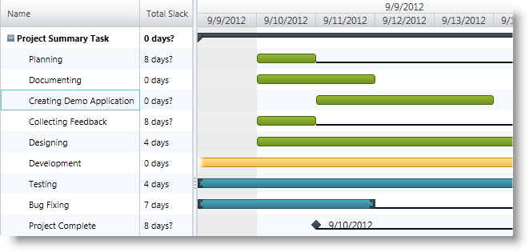

////

|metadata|
{
    "name": "xamgantt-showing-hiding-tasks-slack",
    "controlName": ["xamGantt"],
    "tags": ["Data Presentation","How Do I","Scheduling"],
    "guid": "5f62952f-1c0c-4698-b020-8b684299a78a",  
    "buildFlags": [],
    "createdOn": "2016-05-25T18:21:55.3621671Z"
}
|metadata|
////

= Showing/Hiding Tasks Slack

== Topic Overview

=== Purpose

This topic explains how to configure slack visibility in the  _xamGantt™_   control’s chart section.

=== Required background

The following topics are prerequisites to understanding this topic:

[options="header", cols="a,a"]
|====
|Topic|Purpose

| link:xamgantt-adding-xamgantt-to-a-page.html[Adding xamGantt to a Page]
|This topic describes how to add the _xamGantt_ control to a page.

|====

=== In this topic

This topic contains the following sections:

* <<_Ref334979090, Showing/Hiding Tasks Slack >>

** <<_Ref335272877,Overview>>
** <<_Ref335272884,Property settings>>
** <<_Ref335272891,Example>>

* <<_Ref334979096, Related Content >>

** <<_Ref334979104,Topics>>
** <<_Ref334979109,Samples>>

[[_Ref334979090]]
== Showing/Hiding Tasks Slack

[[_Ref335272877]]

=== Overview

The  _xamGantt_   control scheduling engine calculates the amount of slack for every task. Slack being the amount of time that a task may be delayed without affecting its dependent tasks.

There are several read-only properties that expose the task slack information; they are Start Slack, Finish Slack, Free Slack, and Total Slack in the  _xamGantt’s_   grid section.

By default, the  _xamGantt’s_   chart section does not display the slack; however, you can configure slack visibility via the link:{ApiPlatform}controls.schedules.xamgantt.v{ProductVersion}~infragistics.controls.schedules.projectviewsettings_members.html[ProjectViewSettings] link:{ApiPlatform}controls.schedules.xamgantt.v{ProductVersion}~infragistics.controls.schedules.projectviewsettings~isslackvisible.html[IsSlackVisible] property.

[[_Ref335272884]]

=== Property settings

The following table maps the desired configuration to property settings.

[options="header", cols="a,a,a"]
|====
|In order to:|Use this property:|And set it to:

|Show/hide the task slack in the char section of the _xamGantt_
|`IsSlackVisible`
|`Bool`

|====

[[_Ref335272891]]

=== Example

The screenshot below illustrates how the  _xamGantt_   chart section displays the slack as a result of the following settings:

[options="header", cols="a,a"]
|====
|Property|Value

|`IsSlackVisible`
|`True`

|====

*In XAML:*

[source,xaml]
----
<ig:XamGantt x:Name="gantt" 
             Project="{Binding Project}">
    <ig:XamGantt.ViewSettings>
        <ig:ProjectViewSettings IsSlackVisible="True" />
    </ig:XamGantt.ViewSettings>
</ig:XamGantt>
----

[[_Ref334979096]]
== Related Content

[[_Ref334979104]]

=== Topics

The following topics provide additional information related to this topic.

[options="header", cols="a,a"]
|====
|Topic|Purpose

| link:xamgantt-project-view-settings-configuration-overview.html[Project View Settings Configuration Overview]
|This topic gives an overview of the _xamGantt_ ProjectViewSettings class and its configurable aspects.

|====

[[_Ref334979109]]

=== Samples

The following samples provide additional information related to this topic.

[options="header", cols="a,a"]
|====
|Sample|Purpose

| pick:[sl=" link:{SamplesURL}/gantt/#/slack[Slack]"] pick:[wpf=" link:{SamplesURL}/gantt/slack[Slack]"] 
|This sample demonstrates how you can display the amount of slack for each task.

|====