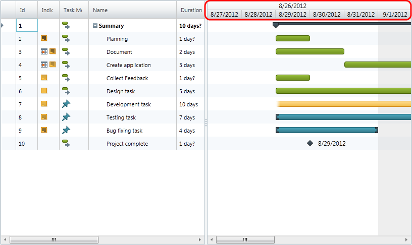

////

|metadata|
{
    "name": "xamgantt-timescale-configuration-overview",
    "controlName": ["xamGantt"],
    "tags": ["Charting","Data Presentation","Drilldown","Layouts","Scheduling"],
    "guid": "510b40c7-32df-4281-b96f-83067f883ee8",  
    "buildFlags": [],
    "createdOn": "2016-05-25T18:21:55.5621405Z"
}
|metadata|
////

= Timescale Configuration Overview (xamGantt)

== Topic Overview

=== Purpose

This topic gives an overview of the main features of  _xamGantt™_  Timescale.

=== In this topic

This topic contains the following sections:

* <<_xamGantt_Timescale_Overview, xamGantt Timescale Overview >>

** <<_Timescale_features_overview,Timescale features overview>>

** <<_Timescale_bands,Timescale bands>>

** <<_Timescale_band_units,Timescale band units>>

** <<_Timescale_band_formatting,Timescale band formatting>>

* <<_Related_Content, Related Content >>

[[_xamGantt_Timescale_Overview]]
== xamGantt Timescale Overview

[[_Timescale_features_overview]]

=== Timescale features overview

link:{ApiPlatform}controls.schedules.xamgantt{ApiVersion}~infragistics.controls.schedules.timescale_members.html[Timescale] class is the concrete implementation of the link:{ApiPlatform}controls.schedules.xamgantt{ApiVersion}~infragistics.controls.schedules.timescalebase_members.html[TimescaleBase] abstract class.

The following table summarizes the main features of the xamGantt Timescale.

[options="header", cols="a,a"]
|====
|Feature|Description

|Timescale bands
|`Timescale` exposes a collection of link:{ApiPlatform}controls.schedules.xamgantt{ApiVersion}~infragistics.controls.schedules.timescaleband_members.html[TimescaleBand] objects.The Timescale can have multiple bands. Each timescale band represents set of time intervals.

|Timescale band units
|Timescale bands can display time intervals in various types of units (minutes, hours, days, weeks, thirds of moths, months, quarters, half of years, years).

| link:{ApiPlatform}controls.schedules.xamgantt{ApiVersion}~infragistics.controls.schedules.timescalebase~scale.html[Scale]
|Scale property of the Timescale controls the percentage by which the preferred size of the intervals will be scaled.

|Timescale band formatting
|You can change the date time format of time shown in the timescale. You can also change the date/time strings alignment.

|====

[[_Timescale_bands]]

=== Timescale bands

Timescale bands are used to control the level of details in xamGantt chart section. By default Timescale has two bands.

==== Related Topics

link:xamgantt-setting-the-xamgantt-timescale-bands.html[Setting the xamGantt Timescale Bands]

[[_Timescale_band_units]]

=== Timescale band units

You can set the unit type, and you can set the number of units represented by each interval of the timescale band.

==== Related Topics

link:xamgantt-configuring-the-xamgantt-timescale-units.html[Configuring the xamGantt Timescale Units and Unit Count]

[[_Timescale_band_formatting]]

=== Timescale band formatting

Setting the desired date time format is made by setting the display format strings for a timescale band. Timescale supports .NET standard and custom date time format strings and a set of timescale format replacement tags, allowing you to fine tune the timescale date time strings display.

==== Related Topics

link:xamgantt-configuring-the-xamgantt-timescale-display-formats.html[Configuring the xamGantt Timescale Display Formats]

[[_Related_Content]]
== Related Content

=== Topics

The following topics provide additional information related to this topic.

[options="header", cols="a,a"]
|====
|Topic|Purpose

| link:xamgantt-configuring-the-xamgantt-timescale.html[Configuring the xamGantt Timescale]
|The topics in this group contains information about xamGantt™ Timescale.

|====

[[_Ref333763850]]

=== Samples

The following samples provide additional information related to this topic.

[options="header", cols="a,a"]
|====
|Sample|Purpose

| pick:[sl=" link:{SamplesURL}/gantt/#/timescale-units[Timescale Units]"] pick:[wpf=" link:{SamplesURL}/gantt/timescale-units[Timescale Units]"] 
|This sample shows timescale units supported by xamGantt and demonstrate how you can change the units and unit count for timescale bands.

| pick:[sl=" link:{SamplesURL}/gantt/#/timescale-display-formats[Timescale Display Formats]"] pick:[wpf=" link:{SamplesURL}/gantt/timescale-display-formats[Timescale Display Formats]"] 
|This sample shows large set of supported display formats by the xamGantt control and demonstrates how you can change the display format for a timescale band.

|====