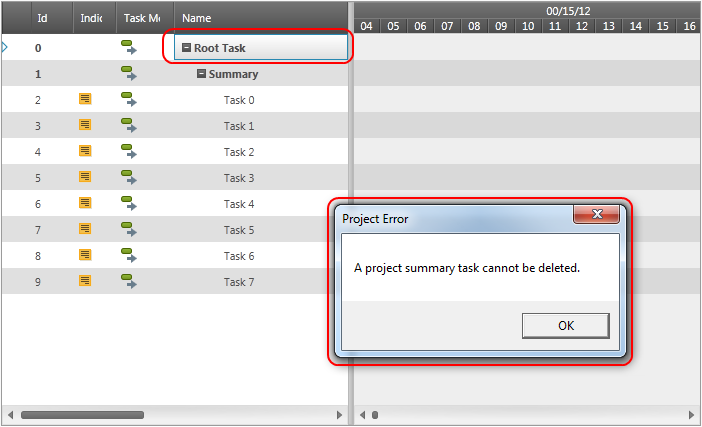
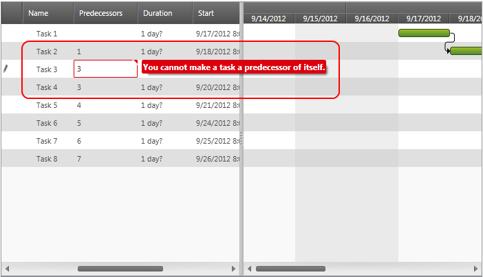
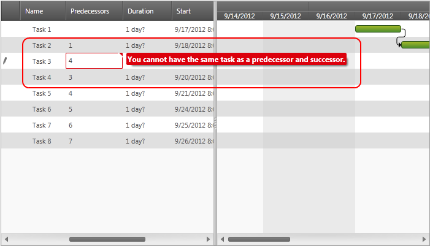
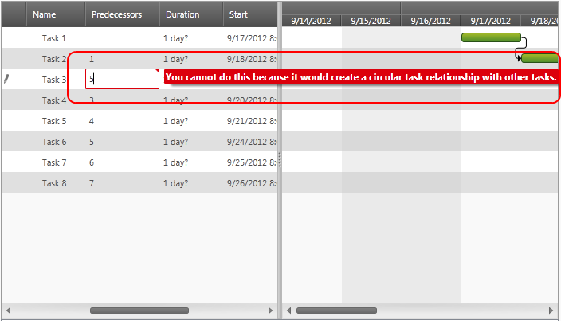
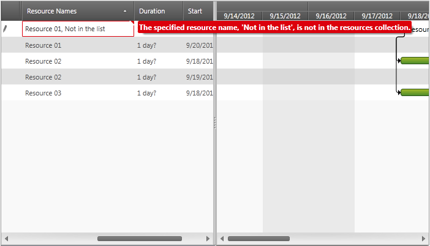

////

|metadata|
{
    "name": "xamgantt-user-notifications-shown-at-conflict-resolution",
    "controlName": ["xamGantt"],
    "tags": ["Error Handling","Events","Grids","Scheduling","Validation"],
    "guid": "f6e8f7d4-ccb5-48ec-af18-2baef4921a3c",  
    "buildFlags": [],
    "createdOn": "2016-05-25T18:21:55.6031806Z"
}
|metadata|
////

= User Notifications shown at Conflict Resolution (xamGantt)

== Topic Overview

=== Purpose

Certain invalid task values, project settings or rescheduling operations can cause conflicts.  _xamGantt™_   resolves those conflicts and displays an appropriate notification to users. This topic describes the available user notifications which occur upon conflict resolution.

=== Required background

The following topics are prerequisites to understanding this topic:

[options="header", cols="a,a"]
|====
|Topic|Purpose

|_ link:xamgantt-xamgantt-visual-elements.html[xamGantt Visual Elements]_
|This topic introduces the visual elements in the grid and chart sections of the _xamGantt_ control.

|====

=== In this topic

This topic contains the following sections:

* <<_Overview_of_User_Notifications_shown_at_Conflict_Resolution, Overview of User Notifications shown at Conflict Resolution >>

** <<_Overview,Overview>>

** <<_Project_Summary_task_cannot_be_deleted,Project summary task cannot be deleted>>

** <<_Dependency_Circularities,Dependency Circularities>>

** <<_Resouce_not_in_resource_collection,Resource not in resource collection>>

* <<_Related_Content, Related Content >>

[[_Overview_of_User_Notifications_shown_at_Conflict_Resolution]]
== Overview of User Notifications shown at Conflict Resolution

[[_Overview]]

=== Overview

The following table summarizes the  _xamGantt_   conflict resolution user notifications. Additional details follow below:

[options="header", cols="a,a"]
|====
|Notification|Description

|Project summary task cannot be deleted
|This notification is shown when the Delete Project Root Task conflict occurs.

|Dependency Circularity Warnings
|Those notifications occurs when the Dependency Circularity conflict occurs.

|Resource not in the resource collection
|This notification is shown when the Missing Resource Warning conflict occurs.

|====

You can find information about the conflicts in the link:xamgantt-conflict-resolution.html[ _xamGantt_   Conflict Resolution] topic.

[[_Project_Summary_task_cannot_be_deleted]]

=== Project summary task cannot be deleted.

Users can try to delete the project summary task. This is not allowed and  _xamGantt_   will display a warning message.

[[_Dependency_Circularities]]

=== Dependency Circularities

If there are dependent tasks and users try to change their references, this may result in creating a circularity chain. There are different warning tooltips displayed depending on the type of circularity chain:

Task cannot be predecessor/successor of itself.

Task cannot be a predecessor and successor of another task.

This warning tooltip is shown when a more complicated circular dependency chain may occur.

[[_Resouce_not_in_resource_collection]]

=== Resource not in resource collection

When the link:{ApiPlatform}controls.schedules.xamgantt.v{ProductVersion}~infragistics.controls.schedules.projectsettings~autoaddnewresources.html[AutoAddNewResources] property of project settings is set to `false` and a non-existing resource is going to be added to a task,  _xamGantt_   will not allow that and will show a validation tool-tip.

[[_Related_Content]]
== Related Content

[[_Ref335665218]]

=== Topics

The following topics provide additional information related to this topic.

[options="header", cols="a,a"]
|====
|Topic|Purpose

| link:xamgantt-conflict-resolution.html[ _xamGantt_ Conflict Resolution]
|This topic describes the _xamGantt_ Conflict Resolution.

| link:xamgantt-xamgantt-user-interactions-in-the-chart-section.html[ _xamGantt_ User Interactions in the Chart Section]
|This topic describes the user interactions that can be performed in the chart section of the _xamGantt_ control.

| link:xamgantt-xamgantt-user-interactions-in-the-grid-section.html[ _xamGantt_ User Interactions in the Grid Section]
|This topic describes the available user interactions using the _xamGantt_ control’s grid section.

| link:xamgantt-columns-editing.html[ _xamGantt_ Columns Editing]
|This topic describes the editors in some of the important grid columns in the _xamGantt_ control.

|====