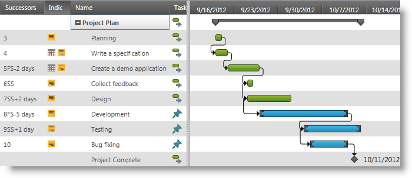
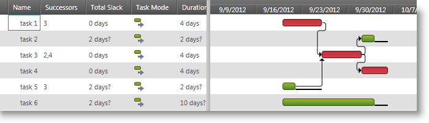

////

|metadata|
{
    "name": "xamgantt-xamgantt-overview",
    "controlName": ["xamGantt"],
    "tags": ["Getting Started"],
    "guid": "bc405a33-7557-4620-b794-ea5211d0b3a0",  
    "buildFlags": [],
    "createdOn": "2016-05-25T18:21:55.1321548Z"
}
|metadata|
////

= xamGantt Overview

== Topic Overview

=== Purpose

This topic gives you an overview of the  _xamGantt™_   control.

=== In this topic

This topic contains the following sections:

* <<_Ref335919820, Introduction >>
* <<_Ref335919824, Related Content >>

[[_Ref335919820]]
== Introduction

=== xamGantt summary

The  _xamGantt_   control is a cross platform control that provides a user interface similar to the Microsoft Project 2010.

You can create, edit and visualize your project plan, create deadlines, milestones and set dependencies between tasks using the  _xamGantt_   control. The control’s scheduling engine performs calculations on every edit to keep the plan up to date.

See the link:xamgantt-xamgantt-features.html[xamGantt Features] topic for the full list of features the  _xamGantt_   control provides.

The following screenshots illustrate project plans containing dependent tasks:

[[_Ref335919824]]
== Related Content

=== Topics

The following topics provide additional information related to this topic.

[options="header", cols="a,a"]
|====
|Topic|Purpose

| link:xamgantt-xamgantt-in-detail.html[xamGantt in Detail]
|This group of topics describes the _xamGantt_ control in details.

| link:xamgantt-xamgantt-data-binding.html[xamGantt Data Binding]
|The topics in this group explain data binding using the _xamGantt_ control.

| link:xamgantt-adding-xamgantt-to-a-page.html[Adding xamGantt to a Page]
|This topic describes how to add the _xamGantt_ control to a page.

| link:xamgantt-configuring-xamgantt.html[Configuring xamGantt]
|The topics in this group explain the main configurable aspects of the _xamGantt_ control.

|====