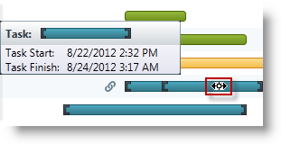
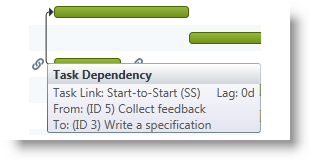

////
|metadata|
{
    "name": "xamgantt-xamgantt-user-interactions-in-the-chart-section",
    "controlName": ["xamGantt"],
    "tags": ["Data Presentation","Getting Started","How Do I","Layouts"],
    "guid": "fbd9785a-d8f7-47be-878f-d5e693aaa089",
    "buildFlags": [],
    "createdOn": "2016-05-25T18:21:55.181157Z"
}
|metadata|
////

= xamGantt User Interactions in the Chart Section

== Topic Overview

=== Purpose

This topic describes the available user interactions using the  _xamGantt™_   control’s chart section.

=== Required background

The following topics are prerequisites to understanding this topic:

[options="header", cols="a,a"]
|====
|Topic|Purpose

| link:xamgantt-xamgantt-visual-elements.html[xamGantt Visual Elements]
|This topic introduces the visual elements in the grid and chart sections of the _xamGantt_ control.

|====

=== In this topic

This topic contains the following sections:

* <<_Ref333244537, User Interactions in the Chart Section >>

** <<_Ref333339035,Dragging taskbars>>
** <<_Ref333339047,Dragging milestone>>
** <<_Ref333339052,Dragging deadlines>>
** <<_Ref333339060,Resizing taskbars>>
** <<_Ref333339077,Resizing progress bar>>
** <<_Ref333339082,Setting dependencies links between tasks>>
** <<_Ref333339088,Opening context menus>>
** <<_Ref333339093,Showing tooltips>>

* <<_Ref333340104, Related Content >>

** <<_Ref333476908,Topics>>

[[_Ref333244537]]
== User Interactions in the Chart Section

=== User interactions in the chart section summary

The following table summarizes the user interaction capabilities of the chart section of the  _xamGantt_   control. Additional details are available after the table.

[options="header", cols="a,a,a,a"]
|====
|The user can…|Using…|Details|Configurable?

|Drag a taskbar
|Mouse
|Dragging the taskbar changes the start and finish date of a task.
|image::images/Yes.png[] 

link:xamgantt-enabling-disabling-user-interactions.html[Enabling/Disabling User Interactions]

|Drag a milestone
|Mouse
|Dragging the milestone changes its finish date.
|image::images/Yes.png[] 

link:xamgantt-enabling-disabling-user-interactions.html[Enabling/Disabling User Interactions]

|Drag a deadline
|Mouse
|Dragging the deadline indicator changes the deadline date of a task.
|image::images/Yes.png[] 

link:xamgantt-enabling-disabling-user-interactions.html[Enabling/Disabling User Interactions]

|Resize a taskbar
|Mouse
|Resizing the taskbar changes the task duration.
| link:xamgantt-enabling-disabling-user-interactions.html[Enabling/Disabling User Interactions]

|Resize the progress bar
|Mouse
|Resizing the progress bar changes the task progress.
|image::images/Yes.png[] 

link:xamgantt-enabling-disabling-user-interactions.html[Enabling/Disabling User Interactions]

|Set dependencies links between tasks
|Mouse
|Setting links creates task dependencies.
|image::images/Yes.png[] 

link:xamgantt-enabling-disabling-user-interactions.html[Enabling/Disabling User Interactions]

|Open context menus
|Mouse
|Right mouse clicking on different elements results in opening of context menus with various commands.
|image::images/No.png[]

|Show tooltips
|Mouse
|When hovering over different elements, tooltips appear with additional information.
|image::images/No.png[]

|====

[[_Ref333339035]]

=== Dragging taskbars

The user can drag a taskbar in the chart section of the  _xamGantt_   control to change the task start and finish date.

This interaction is achieved by selecting a taskbar and holding the left mouse button while moving the taskbar to the left or to the right.

An information tooltip appears that shows how the task’s start and finish date change as the user drags the taskbar.

By default, the user can drag the taskbars of:

* the automatically scheduled tasks
* the manually scheduled tasks
* the manually scheduled summary tasks

.Note
[NOTE]
====
The dragging behavior is configurable. For more details, see the *Related Topics* section below.
====

Using the *ESCAPE* resets the changes and returns the taskbar to its initial position.

*Dragging automatically scheduled task*

*Dragging Manually scheduled task*

*Dragging summary task*

==== Related Topics:

* link:xamgantt-enabling-disabling-user-interactions.html[Enabling/Disabling User Interactions]

[[_Ref333339047]]

=== Dragging milestones

The user can drag a milestone in the chart section of the  _xamGantt_   control to change its finish date.

This interaction is achieved by selecting a milestone and holding the left mouse button while moving the milestone to the left or to the right.

An information tooltip appears and shows how the milestone’s finish date is changing as the user drags the milestone.

Using the *ESCAPE* resets the changes by returning the milestone to its initial position.

==== Related Topics:

* link:xamgantt-enabling-disabling-user-interactions.html[Enabling/Disabling User Interactions]

[[_Ref333339052]]

=== Dragging deadlines

The user can drag a deadline indicator on the taskbar in the chart section of the  _xamGantt_   control to change the task deadline date.

This interaction is achieved by selecting a deadline indicator while pressing the mouse’s left button while moving it to the left or to the right.

An informational tooltip appears, showing how the change to the deadline date as the user drags the indicator back and forth.

Using the *ESCAPE* resets the changes and returns the deadline indicator to its initial position.

==== Related Topics:

* link:xamgantt-enabling-disabling-user-interactions.html[Enabling/Disabling User Interactions]

[[_Ref333339060]]

=== Resizing taskbars

The user can resize a taskbar in the chart section of the  _xamGantt_   control to change the task duration.

To accomplish this interaction click on the edge of a taskbar while a resize indicator is visible. Pressing and holding the left mouse button while dragging the indicator causes the taskbar to resize and changes the task duration.

An information tooltip appears and shows how the user resizes the taskbar thereby changing the task duration.

By default, the user can resize the taskbars of :

* the automatically scheduled tasks
* the manually scheduled tasks
* the manually scheduled summary tasks

.Note
[NOTE]
====
The resizing behavior is configurable. For more details, see the *Related Topics* section below.
====

Using the *ESCAPE* resets the changes to the taskbar size to its initial size.

*Resizing automatically scheduled task*

*Resizing manually scheduled task*

*Resizing summary task*

==== Related Topics:

* link:xamgantt-enabling-disabling-user-interactions.html[Enabling/Disabling User Interactions]

[[_Ref333339077]]

=== Resizing progress bar

The user can resize the progress bar in the chart section of the  _xamGantt_   control to change the percent of completed work on a task.

The user achieves this interaction by clicking on a taskbar while the progress indicator is visible. Pressing and holding the left mouse button while dragging the indicator causes the task progress, expressed as a percentage, changes.

An information tooltip appears and shows how the task’s progress changes because of the user resizing the progress bar.

The user can resize the progress bar of :

* automatically scheduled tasks
* manually scheduled tasks

Using the *ESCAPE* resets the change in the progress bar back to its initial state.

==== Related Topics:

* link:xamgantt-enabling-disabling-user-interactions.html[Enabling/Disabling User Interactions]

[[_Ref333339082]]

=== Setting dependencies links between tasks

The user can link tasks in the  _xamGantt_   control’s chart section.

The user achieves this interaction by clicking on a link indicator causing an arrow to appear. Pressing and holding the left mouse button while dragging the arrow to another taskbar creates a dependency between the two tasks.

An information tooltip appears showing the dependency’s type (finish-to-start, start-to-start, finish-to-finish, or start-to-finish) and identifying the two dependent tasks.

Using the *ESCAPE* resets the changes.

[[_Ref333339088]]

=== Opening context menus

Context menus appear after a right mouse click in the  _xamGantt_   control’s chart section. The menus options depend on the element clicked on by the user.

Two context menus appear in the chart section.

The following screenshot illustrates the context menu that appears as a result of a mouse right click on the taskbar:

Available user actions in this menu are:

* Manually Schedule (toggles the task mode to manually scheduled)
* Auto Schedule (toggles the task mode to automatically scheduled)
* Inactivate Task (toggles the task state)
* Respect Links (recalculates the task’s information based on its dependencies)

The following screenshot illustrates the context menu that appears as a result of a mouse right click on a link:

Available user actions in this menu are:

* Delete Link (to delete tasks dependency)
* Scroll To Predecessor
* Scroll To Successor

Using the *ESCAPE* or clicking outside the menu hides the context menu.

[[_Ref333339093]]

=== Showing tooltips

Different tooltips appear when hovering over or interacting with different elements in the chart section in the  _xamGantt_   control.

* Hovering the mouse over a taskbar

* Hovering the mouse over a dependency link

[[_Ref333340104]]
== Related Content

[[_Ref333476908]]

=== Topics

The following topics provide additional information related to this topic.

[options="header", cols="a,a"]
|====
|Topic|Purpose

| link:xamgantt-xamgantt-user-interactions-in-the-grid-section.html[xamGantt User Interactions in the Grid Section]
|This topic describes the available user interactions using the _xamGantt_ control’s grid section.

| link:xamgantt-columns-editing.html[xamGantt Columns Editing]
|This topic describes the editing features available in some of the important grid columns in the _xamGantt_ control.

| link:xamgantt-keyboard-support.html[xamGantt Keyboard Support]
|This topic describes the _xamGantt_ control’s built-in keyboard support and lists the user actions that have a keyboard shortcut associated with them.

|====