////

|metadata|
{
    "name": "xamgantt-xamgantt-user-interactions-in-the-grid-section",
    "controlName": ["xamGantt"],
    "tags": ["Getting Started","How Do I"],
    "guid": "8f537a01-e2e6-496d-a18f-082238cf4f1a",  
    "buildFlags": [],
    "createdOn": "2016-05-25T18:21:55.1871578Z"
}
|metadata|
////

= xamGantt User Interactions in the Grid Section

== Topic Overview

=== Purpose

This topic describes the available user interactions using the  _xamGantt™_   control’s grid section.

=== Required background

The following topics are prerequisites to understanding this topic:

[options="header", cols="a,a"]
|====
|Topic|Purpose

| link:xamgantt-xamgantt-visual-elements.html[xamGantt Visual Elements]
|This topic introduces the visual elements in the grid and chart sections of the _xamGantt_ control.

|====

=== In this topic

This topic contains the following sections:

* <<_Ref333244537, User Interactions in the Grid Section >>

** <<_Ref333425337,Sorting columns>>
** <<_Ref333425341,Moving columns>>
** <<_Ref333425346,Showing columns>>
** <<_Ref333425352,Hiding columns>>
** <<_Ref333425357,Resizing columns>>
** <<_Ref333425365,Expanding/collapsing summary tasks>>
** <<_Ref333426323,Selection>>
** <<_Ref333483721,Inserting tasks>>
** <<_Ref333483727,Deleting tasks>>
** <<_Ref333425372,Opening context menus>>

* <<_Ref335407927, Related Content >>

[[_Ref333244537]]
== User Interactions in the Grid Section

=== User interactions in the grid section summary

The following table summarizes the  _xamGantt_   control’s grid section and its user interaction capabilities. Additional details follow later in this topic.

[options="header", cols="a,a,a,a"]
|====
|The user can…|Using…|Details|Configurable?

|Sort a column
|Mouse
|Performs column sorting by clicking the mouse’s left button on the column header you wish sorted.
|image::images/No.png[]

|Move a column
|Mouse
|Performs column moving by holding down the left mouse button while dragging the column header to the desired location.
|image::images/Yes.png[] 

link:xamgantt-enabling-disabling-user-interactions.html[Enabling/Disabling User Interactions]

|Show a column
|Mouse
|Performs showing a column by opening a context menu and choosing which column to show.
|image::images/Yes.png[] 

link:xamgantt-enabling-disabling-user-interactions.html[Enabling/Disabling User Interactions]

|Hide a column
|Mouse
|Performs column hiding by opening a context menu and choosing the “Hide Column” option.
|image::images/Yes.png[] 

link:xamgantt-enabling-disabling-user-interactions.html[Enabling/Disabling User Interactions]

|Resize a column
|Mouse
|Performs column resizing by dragging the right or left edge of the column header outwards to enlarge or inwards to contract the column’s width.
|image::images/Yes.png[] 

link:xamgantt-enabling-disabling-user-interactions.html[Enabling/Disabling User Interactions]

|Expand/collapse a summary task
|Mouse 

Keyboard
|Performs the summary tasks expanding and collapsing by clicking on the plus/minus icon in front of the task’s name.
|image::images/No.png[]

|Selection
|Mouse 

Keyboard
|The user can perform a single (continuous selection) or multiple selections of cells or rows or columns (discontinuous selection).
|image::images/No.png[]

|Insert a task
|Mouse
|Performs a task insertion via commands in a context menu.
|image::images/Yes.png[] 

link:xamgantt-enabling-disabling-user-interactions.html[Enabling/Disabling User Interactions]

|Delete a task
|Mouse 

Keyboard
|Performs a deleting task via a context menu command or using the keyboard Delete button.
|image::images/Yes.png[] 

link:xamgantt-enabling-disabling-user-interactions.html[Enabling/Disabling User Interactions]

|Open context menus
|Mouse
|Right mouse clicking on different elements results in context menus with various commands.
|image::images/Yes.png[] 

link:xamgantt-configuring-xamgantt-additional-context-menus.html[Configuring xamGantt Additional Context Menus] 

|====

[[_Ref333425337]]

=== Sorting columns

The user can sort a column in the grid section of the  _xamGantt_   control.

To achieve this interaction, click on the desired column in the Grid section and use the left mouse button on the column header. The sorting indicator shows the performed sorting type (ascending or descending).

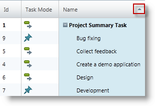

Use a  _xamGantt_   command to reset the sorted column back to its initial order.

==== Related Topics:

* link:xamgantt-using-xamgantt-commands.html[Using Commands]

[[_Ref333425341]]

=== Moving columns

The user can move a column in the grid section of the  _xamGantt_   control to change its position.

To achieve this interaction, click on a column header while holding down the mouse’s left button while dragging the column header. An indicator appears when is possible to place the column.

Use the *ESCAPE* while dragging to return the column to its previous position.

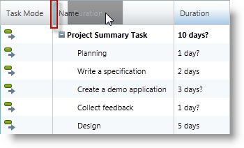

==== Related Topics:

* link:xamgantt-enabling-disabling-user-interactions.html[Enabling/Disabling User Interactions]

[[_Ref333425346]]

=== Showing columns

The user can show a column that is currently invisible on the  _xamGantt_   control’s view in the grid section.

To achieve this interaction, use a right mouse button click on the columns headers area. A context menu appears with option “Insert Column”. Hovering over the “Insert Column” menu item, a list of available columns displays from which to select the column to show.

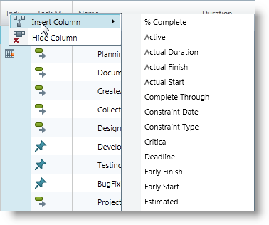

==== Related Topics:

* link:xamgantt-enabling-disabling-user-interactions.html[Enabling/Disabling User Interactions]
* link:xamgantt-using-xamgantt-commands.html[Using xamGantt Commands]
* link:xamgantt-code-example-creating-view-for-xamgantt-using-custom-classes.html[Code Example Creating View for xamGantt using Custom Classes]

[[_Ref333425352]]

=== Hiding columns

The user can hide a column that is currently visible in the grid section of the  _xamGantt_   control.

To achieve this interaction, perform a mouse right click on the column header area of the column. A context menu appears with option “Hide Column”. Clicking on this option hides the specified column.

==== Related Topics:

* link:xamgantt-enabling-disabling-user-interactions.html[Enabling/Disabling User Interactions]
* link:xamgantt-using-xamgantt-commands.html[Using Commands]

[[_Ref333425357]]

=== Resizing columns

The user can resize a column by dragging the left or right edge of the column header in the grid section of the  _xamGantt_   control.

Double mouse click on the right edge of the column header resizes the column to the width of its largest content.

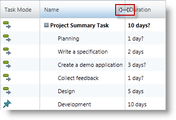

==== Related Topics:

* link:xamgantt-enabling-disabling-user-interactions.html[Enabling/Disabling User Interactions]

[[_Ref333425365]]

=== Expanding/collapsing summary tasks

The user can expand and collapse the summary tasks in the grid section of the  _xamGantt_   control.

To achieve this interaction, click on the plus/minus icon in front of the summary task name.

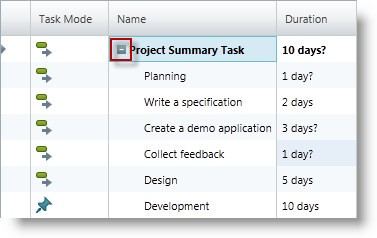

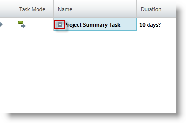

The expanding/collapsing of the summary tasks can be performed also using keyboard shortcuts:

* *expand* - Alt + Shift + Plus
* *collapse* - Alt + Shift + Minus

==== Related Topics:

* link:xamgantt-keyboard-support.html[xamGantt Keyboard Support]

[[_Ref333426323]]

=== Selection

The user can select rows, columns or cells in the grid section of the  _xamGantt_   control.

To do this, use either the mouse, the keyboard or both.

To perform single element selection:

* Click on a cell to select a cell
* Click on the row selector to select a row
* Click on the column header to select column

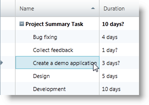

*Selecting a cell*

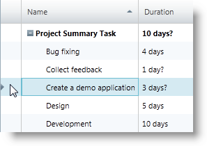

*Selecting a row*

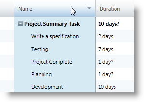

*Selecting a column*

To perform multiple elements selection, use:

* SHIFT + Mouse Click for multiple, continuous selection

* CTRL + Mouse Click for multiple, discontinuous selection

==== Related Topics:

* link:xamgantt-keyboard-support.html[xamGantt Keyboard Support]

[[_Ref333483721]]

=== Inserting tasks

The user can insert a new task in the grid section of the  _xamGantt_   control.

To achieve this interaction, right click with the mouse on the grid area to open a context menu and select from the several available options.

The user can:

* add a new sibling task below the currently selected task

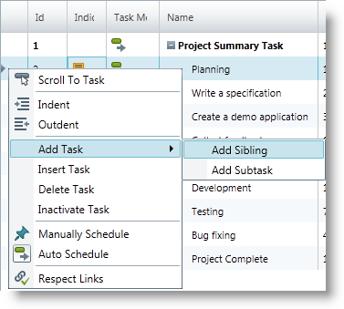

* add a new child task to the currently selected task

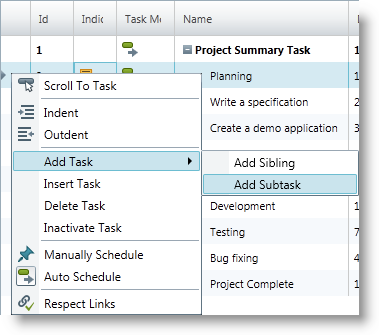

* insert a new task above the currently selected task

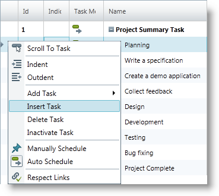

==== Related Topics:

* link:xamgantt-enabling-disabling-user-interactions.html[Enabling/Disabling User Interactions]
* link:xamgantt-using-xamgantt-commands.html[Using Commands]

[[_Ref333483727]]

=== Deleting tasks

The user can delete a task in the grid section of the  _xamGantt_   control.

Achieve this interaction by:

* right mouse clicking in the grid area to open a context menu and choose “Delete Task”

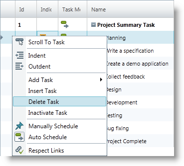

* selecting a row and use the *Delete* keyboard button

==== Related Topics:

* link:xamgantt-enabling-disabling-user-interactions.html[Enabling/Disabling User Interactions]
* link:xamgantt-using-xamgantt-commands.html[Using Commands]

[[_Ref333425372]]

=== Opening context menus

Context menus appear after a right click mouse event in the grid section of the  _xamGantt_   control. The menus options depend on the element on which the user clicked.

Several context menus appear in different areas of the grid section.

The following screenshot illustrates the context menu that appears after a right mouse click in the upper left corner of the  _xamGantt_   grid:

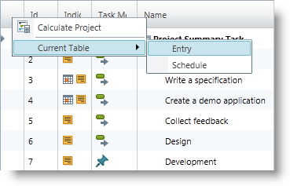

The available user actions in this menu include:

* Calculate Project (to execute project calculation)
* Current Table (to change the current table view)

** Entry (table view)
** Schedule (table view)

The following screenshot illustrates the context menu that appears after a right mouse click on a column header area:

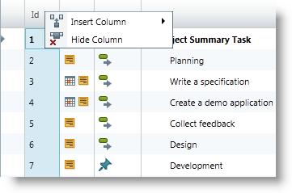

Available user actions in this menu are:

* Insert Column
* Hide Column

The following screenshot illustrates the context menu that appears after a right mouse click on:

* the selected row
* the row selector
* the selected cell

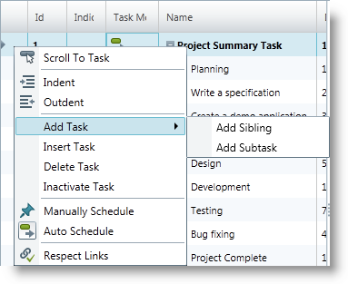

Available user actions in this menu are:

* Scroll To Task
* Indent
* Outdent
* Add Task

** Add Sibling
** Add Subtask

* Insert Task
* Delete Task
* Inactivate Task
* Manually Schedule
* Auto Schedule
* Respect Links

The following screenshot illustrates the context menu that appears after a right mouse click in the empty grid section:

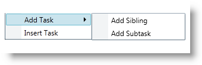

Available user actions in this menu are:

* Add Task

** Add Sibling
** Add Subtask

* Insert Task

Use the *ESCAPE* or click outside the menu to hide the context menu.

[[_Ref335407927]]

== Related Content

=== Topics

The following topics provide additional information related to this topic.

[options="header", cols="a,a"]
|====
|Topic|Purpose

| link:xamgantt-xamgantt-user-interactions-in-the-chart-section.html[xamGantt User Interactions in the Chart Section]
|This topic describes the user interactions that can be performed in the chart section of the _xamGantt_ control.

| link:xamgantt-columns-editing.html[xamGantt Columns Editing]
|This topic describes the editing features available in some of the important grid columns in the _xamGantt_ control.

| link:xamgantt-keyboard-support.html[xamGantt Keyboard Support]
|This topic describes the _xamGantt_ control’s built-in keyboard support and lists the user actions that have an associated keyboard shortcut.

|====