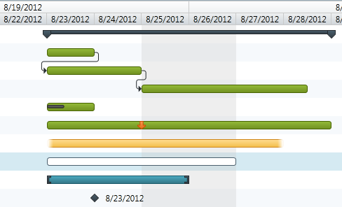

////
|metadata|
{
    "name": "xamgantt-xamgantt-visual-elements-in-the-chart-section",
    "controlName": ["xamGantt"],
    "tags": ["Data Presentation"],
    "guid": "c5cf520f-8a78-4afc-a408-021586a9bb5d",
    "buildFlags": [],
    "createdOn": "2016-05-25T18:21:55.5861765Z"
}
|metadata|
////

= xamGantt Visual Elements in the Chart Section

== Topic Overview

=== Purpose

This topic introduces the visual elements of the  _xamGantt™_   control’s chart section.

=== In this topic

This topic contains the following sections:

* <<_Ref335757043, Visual Elements in the Chart Section and Related Classes and Properties >>
* <<_Ref335757047, Related Content >>

[[_Ref335757043]]
== Visual Elements in the Chart Section and Related Classes and Properties

=== Visual elements summary

The following screenshot depicts the visual elements in the chart section of the xamGantt control. Configurable elements are available following the image.

*Configurable Visual Elements:*

* Timescale
* Timescale bands
* Taskbars
* Dependency links
* Non-working time background

=== Visual elements and related classes

The following table maps the visual elements in the chart section of the  _xamGantt_   control and their corresponding classes.

[options="header", cols="a,a,a"]
|====
|Visual Element|Class|Details

|Timescale
|
* link:{ApiPlatform}controls.schedules.xamgantt.v{ProductVersion}~infragistics.controls.schedules.timescale_members.html[Timescale] 

* link:{ApiPlatform}controls.schedules.xamgantt.v{ProductVersion}~infragistics.controls.schedules.timescaleinfo_members.html[TimescaleInfo] 

|The timescale is the time period indicator at the top of the chart section of the _xamGantt_ control.

|Timescale bands
| link:{ApiPlatform}controls.schedules.xamgantt.v{ProductVersion}~infragistics.controls.schedules.timescaleband_members.html[TimescaleBand]
|Each timescale band represents a set of time intervals. These intervals can be of various types of units (minutes, hours, days, weeks, thirds of moths, months, quarters, half of years, years).

|Taskbars
|-
|The taskbars have different visual representation according to the task state and mode.

|Dependency links
| link:{ApiPlatform}controls.schedules.xamgantt.v{ProductVersion}~infragistics.controls.schedules.projecttaskdependencylinetype.html[ProjectTaskDependencyLineType]
|The dependency links connect related tasks. You can hide the links, or specify their type – straight or curved lines.

|Non-working time background
| link:{ApiPlatform}controls.schedules.xamgantt.v{ProductVersion}~infragistics.controls.schedules.nonworkingtimehighlightstyle.html[NonWorkingTimeHighlightStyle]
|Highlights the non-work days in the _xamGantt_ control. You can configure the highlighting as well as disable it.

|====

[[_Ref335757047]]
== Related Content

=== Topics

The following topics provide additional information related to this topic.

[options="header", cols="a,a"]
|====
|Topic|Purpose

| link:xamgantt-xamgantt-visual-elements-overview.html[xamGantt Visual Elements Overview]
|This topic gives an overview of the main visual elements in the _xamGantt_ control.

| link:xamgantt-xamgantt-visual-elements-in-the-chart-section.html[xamGantt Visual Elements in the Grid Section]
|This topic introduces the visual elements in the grid section of the _xamGantt_ control.

|====