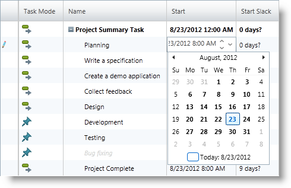

////
|metadata|
{
    "name": "xamgantt-xamgantt-visual-elements-in-the-grid-section",
    "controlName": ["xamGantt"],
    "tags": ["Data Presentation"],
    "guid": "0ced2bdf-65dc-41fc-aa7c-c5961d8dc137",
    "buildFlags": [],
    "createdOn": "2016-05-25T18:21:55.5801773Z"
}
|metadata|
////

= xamGantt Visual Elements in the Grid Section

== Topic Overview

=== Purpose

This topic introduces the visual elements of the _xamGantt_™ control’s grid section.

=== In this topic

This topic contains the following sections:

* <<_Ref335676321, Visual Elements in the Grid Section and Related Classes and Properties >>
* <<_Ref335749471, Available Grid Columns and Related Project Task Properties >>
* <<_Ref335749478, Task Indicators >>
* <<_Ref335749482, Related Content >>

[[_Ref335676321]]
== Visual Elements in the Grid Section and Related Classes and Properties

=== Visual elements summary

The following screenshot depicts the visual elements in the grid section of the _xamGantt_ control. A list of the configurable elements follows the image.

*Configurable Visual Elements:*

* Table
* Columns
* Tasks

=== Visual elements and related classes

The following table maps the visual elements in the grid section of the  _xamGantt_   control to their corresponding classes.

[options="header", cols="a,a,a,a"]
|====
|Visual Element|Class|Property|Details

|Table
| link:{ApiPlatform}controls.schedules.xamgantt{ApiVersion}~infragistics.controls.schedules.projecttable_members.html[ProjectTable]
| link:{ApiPlatform}controls.schedules.xamgantt{ApiVersion}~infragistics.controls.schedules.xamgantt_members.html[XamGantt]. link:{ApiPlatform}controls.schedules.xamgantt{ApiVersion}~infragistics.controls.schedules.xamgantt~table.html[Table]
|The `ProjectTable` class describes the displayed columns in the grid section of the _xamGantt_ control.

|Column
| link:{ApiPlatform}controls.schedules.xamgantt{ApiVersion}~infragistics.controls.schedules.projectcolumn_members.html[ProjectColumn]
| link:{ApiPlatform}controls.schedules.xamgantt{ApiVersion}~infragistics.controls.schedules.projecttable_members.html[ProjectTable]. link:{ApiPlatform}controls.schedules.xamgantt{ApiVersion}~infragistics.controls.schedules.projecttable~columns.html[Columns]
|The `ProjectColumn` represents a column in the `ProjectTable`.

|Column settings
| link:{ApiPlatform}controls.schedules.xamgantt{ApiVersion}~infragistics.controls.schedules.projectcolumnsettings_members.html[ProjectColumnSettings]
| link:{ApiPlatform}controls.schedules.xamgantt{ApiVersion}~infragistics.controls.schedules.projectcolumn_members.html[ProjectColumn]. link:{ApiPlatform}controls.schedules.xamgantt{ApiVersion}~infragistics.controls.schedules.projectcolumn~settings.html[Settings]
|The `ProjectColumnSettings` provides options for configuring a `ProjectColumn` settings.

|Tasks
| link:{ApiPlatform}controls.schedules.xamgantt{ApiVersion}~infragistics.controls.schedules.projecttask_members.html[ProjectTask]
| link:{ApiPlatform}controls.schedules.xamgantt{ApiVersion}~infragistics.controls.schedules.project_members.html[Project]. link:{ApiPlatform}controls.schedules.xamgantt{ApiVersion}~infragistics.controls.schedules.project_members.html[RootTask]. link:{ApiPlatform}controls.schedules.xamgantt{ApiVersion}~infragistics.controls.schedules.projecttask~tasks.html[Tasks]
|The `ProjectTask` represents a single task in a project.

|====

[[_Ref335749471]]
== Available Grid Columns and Related Project Task Properties

=== Available grid columns summary

[options="header", cols="a,a"]
|====
|Grid column name|Corresponding ProjectTask property

|Id
| link:{ApiPlatform}controls.schedules.xamgantt{ApiVersion}~infragistics.controls.schedules.projecttask~id.html[Id]

|Indicators
|See the <<_Ref335744520,Task indicators summary>> below.

|Task Mode
| link:{ApiPlatform}controls.schedules.xamgantt{ApiVersion}~infragistics.controls.schedules.projecttask~ismanual.html[IsManual]

|Name
| link:{ApiPlatform}controls.schedules.xamgantt{ApiVersion}~infragistics.controls.schedules.projecttask~taskname.html[TaskName]

|Duration
| link:{ApiPlatform}controls.schedules.xamgantt{ApiVersion}~infragistics.controls.schedules.projecttask~manualduration.html[ManualDuration]

|Start
| link:{ApiPlatform}controls.schedules.xamgantt{ApiVersion}~infragistics.controls.schedules.projecttask~manualstart.html[ManualStart]

|Finish
| link:{ApiPlatform}controls.schedules.xamgantt{ApiVersion}~infragistics.controls.schedules.projecttask~manualfinish.html[ManualFinish]

|Predecessors
| link:{ApiPlatform}controls.schedules.xamgantt{ApiVersion}~infragistics.controls.schedules.projecttask~predecessorsidtext.html[PredecessorsIdText]

|Resource Names
| link:{ApiPlatform}controls.schedules.xamgantt{ApiVersion}~infragistics.controls.schedules.projecttask~resourcestext.html[ResourcesText]

|% Complete
| link:{ApiPlatform}controls.schedules.xamgantt{ApiVersion}~infragistics.controls.schedules.projecttask~percentcomplete.html[PercentComplete]

|Active
| link:{ApiPlatform}controls.schedules.xamgantt{ApiVersion}~infragistics.controls.schedules.projecttask~isactive.html[IsActive]

|Actual Duration
| link:{ApiPlatform}controls.schedules.xamgantt{ApiVersion}~infragistics.controls.schedules.projecttask~actualduration.html[ActualDuration]

|Actual Finish
| link:{ApiPlatform}controls.schedules.xamgantt{ApiVersion}~infragistics.controls.schedules.projecttask~actualfinish.html[ActualFinish]

|Actual Start
| link:{ApiPlatform}controls.schedules.xamgantt{ApiVersion}~infragistics.controls.schedules.projecttask~actualstart.html[ActualStart]

|Complete Through
| link:{ApiPlatform}controls.schedules.xamgantt{ApiVersion}~infragistics.controls.schedules.projecttask~completethrough.html[CompleteThrough]

|Constraint Date
| link:{ApiPlatform}controls.schedules.xamgantt{ApiVersion}~infragistics.controls.schedules.projecttask~constraintdate.html[ConstraintDate]

|Constraint Type
| link:{ApiPlatform}controls.schedules.xamgantt{ApiVersion}~infragistics.controls.schedules.projecttask~constrainttype.html[ConstraintType]

|Critical
| link:{ApiPlatform}controls.schedules.xamgantt{ApiVersion}~infragistics.controls.schedules.projecttask~iscritical.html[IsCritical]

|Deadline
| link:{ApiPlatform}controls.schedules.xamgantt{ApiVersion}~infragistics.controls.schedules.projecttask~deadline.html[Deadline]

|Early Finish
| link:{ApiPlatform}controls.schedules.xamgantt{ApiVersion}~infragistics.controls.schedules.projecttask~earlyfinish.html[EarlyFinish]

|Early Start
| link:{ApiPlatform}controls.schedules.xamgantt{ApiVersion}~infragistics.controls.schedules.projecttask~earlystart.html[EarlyStart]

|Estimated
| link:{ApiPlatform}controls.schedules.xamgantt{ApiVersion}~infragistics.controls.schedules.iprojecttask~isestimated.html[IsEstimated]

|Finish Slack
| link:{ApiPlatform}controls.schedules.xamgantt{ApiVersion}~infragistics.controls.schedules.projecttask~finishslack.html[FinishSlack]

|Free Slack
| link:{ApiPlatform}controls.schedules.xamgantt{ApiVersion}~infragistics.controls.schedules.projecttask~freeslack.html[FreeSlack]

|Hide Bar
| link:{ApiPlatform}controls.schedules.xamgantt{ApiVersion}~infragistics.controls.schedules.projecttask~isbarhidden.html[IsBarHidden]

|Late Finish
| link:{ApiPlatform}controls.schedules.xamgantt{ApiVersion}~infragistics.controls.schedules.projecttask~latefinish.html[LateFinish]

|Late Start
| link:{ApiPlatform}controls.schedules.xamgantt{ApiVersion}~infragistics.controls.schedules.projecttask~latestart.html[LateStart]

|Marked
| link:{ApiPlatform}controls.schedules.xamgantt{ApiVersion}~infragistics.controls.schedules.projecttask~ismarked.html[IsMarked]

|Milestone
| link:{ApiPlatform}controls.schedules.xamgantt{ApiVersion}~infragistics.controls.schedules.projecttask~ismilestone.html[IsMilestone]

|Notes
| link:{ApiPlatform}controls.schedules.xamgantt{ApiVersion}~infragistics.controls.schedules.projecttask~notes.html[Notes]

|Outline Level
| link:{ApiPlatform}controls.schedules.xamgantt{ApiVersion}~infragistics.controls.schedules.projecttask~outlinelevel.html[OutlineLevel]

|Placeholder
| link:{ApiPlatform}controls.schedules.xamgantt{ApiVersion}~infragistics.controls.schedules.projecttask~isplaceholder.html[IsPlaceholder]

|Remaining Duration
| link:{ApiPlatform}controls.schedules.xamgantt{ApiVersion}~infragistics.controls.schedules.projecttask~remainingduration.html[RemainingDuration]

|Scheduled Duration
| link:{ApiPlatform}controls.schedules.xamgantt{ApiVersion}~infragistics.controls.schedules.projecttask~scheduledduration.html[ScheduledDuration]

|Scheduled Finish
| link:{ApiPlatform}controls.schedules.xamgantt{ApiVersion}~infragistics.controls.schedules.projecttask~scheduledfinish.html[ScheduledFinish]

|Scheduled Start
| link:{ApiPlatform}controls.schedules.xamgantt{ApiVersion}~infragistics.controls.schedules.projecttask~scheduledstart.html[ScheduledStart]

|Start Slack
| link:{ApiPlatform}controls.schedules.xamgantt{ApiVersion}~infragistics.controls.schedules.projecttask~startslack.html[StartSlack]

|Successors
| link:{ApiPlatform}controls.schedules.xamgantt{ApiVersion}~infragistics.controls.schedules.projecttask~successorsidtext.html[SuccessorsIdText]

|Summary
| link:{ApiPlatform}controls.schedules.xamgantt{ApiVersion}~infragistics.controls.schedules.projecttask~issummary.html[IsSummary]

|Total Slack
| link:{ApiPlatform}controls.schedules.xamgantt{ApiVersion}~infragistics.controls.schedules.projecttask~totalslack.html[TotalSlack]

|====

[[_Ref335749478]]
== Task Indicators

[[_Ref335744520]]
=== Task indicators summary

The *Indicators* column in the grid of the _xamGantt_ control has no corresponding ProjectTask property.

This column is a reflection of the task’ state and displays indicators (along with a tooltip that provide additional information). The cells of this column may display one or more of the following indicators.

The table below lists the indicator image and indicator description:

[options="header", cols="^15a,25a,60a"]
|====
|Image
|Indicator type
|Description

|image:images/xamGantt_indicator_inflexibleConstraint.png[]
|Inflexible constraint
|This type of constraint is an inflexible constraint such as "Must Start On." 

.Note 
[NOTE] 
==== 
This indicator appears only for automatically scheduled tasks. 
====

|
|Flexible constraint
|This constraint type is a flexible constraint such as "Start No Earlier Than" in a project scheduled from the start. 

.Note 
[NOTE] 
==== 
This indicator appears only for automatically scheduled tasks. 
====

|
|Constraint violation
|Failure to meet the constraint criteria (task’s constraint type and constraint date). 

.Note 
[NOTE] 
==== 
This indicator appears only for automatically scheduled tasks. 
====

|
|Notes
|The task contains a note.

|
|Deadline
|The task has exceeded its deadline.

|
|Completed
|Completed task where progress is 100%.

|====

[[_Ref335749482]]
== Related Content

=== Topics

The following topics provide additional information related to this topic.

[options="header", cols="a,a"]
|====
|Topic|Purpose

| link:xamgantt-xamgantt-visual-elements-overview.html[xamGantt Visual Elements Overview]
|This topic gives an overview of the main visual elements in the _xamGantt_ control.

| link:xamgantt-xamgantt-visual-elements-in-the-chart-section.html[xamGantt Visual Elements in the Chart Section]
|This topic introduces the visual elements of the _xamGantt_ control's chart section.

|====