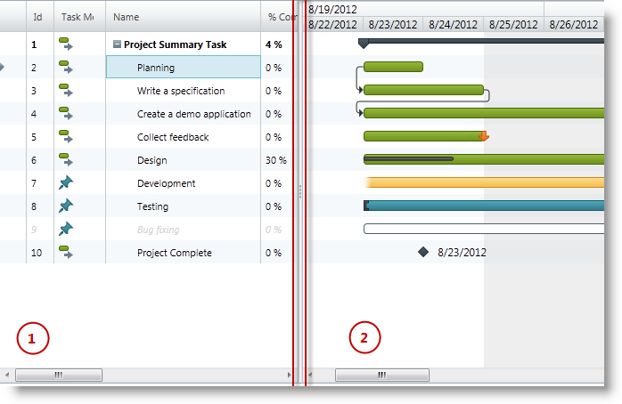

////
|metadata|
{
    "name": "xamgantt-xamgantt-visual-elements-overview",
    "controlName": ["xamGantt"],
    "tags": ["Data Presentation"],
    "guid": "6c71f25f-b3a3-4f3c-841c-37c3513beeff",
    "buildFlags": [],
    "createdOn": "2016-05-25T18:21:55.5741415Z"
}
|metadata|
////

= xamGantt Visual Elements Overview

== Topic Overview

=== Purpose

This topic illustrates the main visual elements in the  _xamGantt™_   control.

=== In this topic

This topic contains the following sections:

* <<_Ref333496014, Visual Elements of xamGantt Control >>
* <<_Ref333512375, Related Content >>

[[_Ref333496014]]
== Visual Elements of  _xamGantt_  Control

=== Visual elements summary

The following screenshot depicts the main visual elements of the  _xamGantt_   control.

*_xamGantt_ Main Visual Elements:*

* Grid Section (section 1)
* Chart Section (section 2)
* Splitter

[[_Ref333512375]]
== Related Content

=== Topics

The following topics provide additional information related to this topic.

[options="header", cols="a,a"]
|====
|Topic|Purpose

| link:xamgantt-xamgantt-visual-elements-in-the-grid-section.html[xamGantt Visual Elements in the Grid Section]
|This topic introduces the visual elements of the _xamGantt_ control’s grid section.

| link:xamgantt-xamgantt-visual-elements-in-the-chart-section.html[xamGantt Visual Elements in the Chart Section]
|This topic introduces the visual elements of the _xamGantt_ control’s chart section.

|====