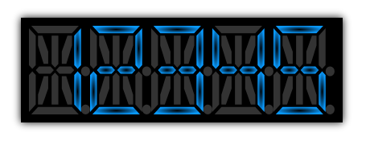
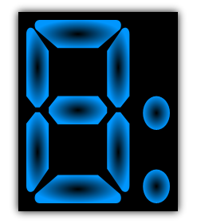
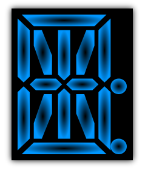

////

|metadata|
{
    "name": "xamgauge-adding-a-digital-gauge-to-your-page",
    "controlName": ["xamGauge","xamSegmentedDisplay"],
    "tags": ["Getting Started","How Do I"],
    "guid": "{6846319C-3F4F-4C5A-858A-97331EAAA698}",  
    "buildFlags": [],
    "createdOn": "2016-05-25T18:21:58.946368Z"
}
|metadata|
////

= Getting Started with xamSegmentedDisplay

== Before You Begin

The xamSegmentedDisplay™ control is a digital gauge that represents values similar to a digital watch or digital alarm clock. Just like a digital clock, each digit contains segments that are "illuminated" appropriately to render an alphanumeric character.

In order to work effectively with xamSegmentedDisplay, you will need to understand the following properties:

* link:{ApiPlatform}controls.charts.xamgauge.v{ProductVersion}~infragistics.controls.charts.xamsegmenteddisplay~digits.html[Digits]
* link:{ApiPlatform}controls.charts.xamgauge.v{ProductVersion}~infragistics.controls.charts.xamsegmenteddisplay~segmentmode.html[SegmentMode]
* link:{ApiPlatform}controls.charts.xamgauge.v{ProductVersion}~infragistics.controls.charts.xamsegmenteddisplay~text.html[Text]
* link:{ApiPlatform}controls.charts.xamgauge.v{ProductVersion}~infragistics.controls.charts.xamsegmenteddisplay~textforeground.html[TextForeground]
* link:{ApiPlatform}controls.charts.xamgauge.v{ProductVersion}~infragistics.controls.charts.xamsegmenteddisplay~textforegroundunlit.html[TextForegroundUnlit]

The xamSegmentedDisplay control can be represented as a seven or fourteen segment display. You can change the number of segments used to display text by setting the link:{ApiPlatform}controls.charts.xamgauge.v{ProductVersion}~infragistics.controls.charts.xamsegmenteddisplay~segmentmode.html[SegmentMode] property of the digital gauge. If you want the gauge to display letters as well as numbers, you must set the mode to "FourteenSegment". If you want your digital gauge to display numbers only, then you should set the mode to "SevenSegment".

A seven-segment display is composed of seven segments. The seven segments are arranged as a rectangle of two vertical segments on each side with one horizontal segment on the top, center, and bottom.

The following image shows the segments in a seven-segment display.

A fourteen-segment display consists of fourteen segments. It is an extension of the seven-segment display, having an additional four diagonal segments, two vertical segments through the center, and with a center horizontal segment split in half. A fourteen-segment display is similar to a typical car stereo display.

The following image shows the segments in a fourteen-segment display.

You can add xamSegmentedDisplay to a page using the same pattern as any control found in Microsoft® {PlatformName}™. This pattern involves using a layout container and adding the control to the Children collection of the layout container.

== What You Will Accomplish

You will add a xamSegmentedDisplay control to your page. When you run the finished project, you should see a xamSegmentedDisplay control in your browser that looks similar to the screen shot below.

== Follow these Steps

[start=1]
. Create a Microsoft {PlatformName} project.
[start=2]
. In the Solution Explorer, add the following references:

** {ApiPlatform}DataVisualization.v{ProductVersion}.dll
** {ApiPlatform}Controls.Charts.XamGauge.v{ProductVersion}.dll

[start=3]
. Place using/Imports directives in your code-behind or add an XML namespace declaration for xamSegmentedDisplay.

*In XAML:*

----
xmlns:ig="http://schemas.infragistics.com/xaml"
----

*In Visual Basic:*

----
Imports Infragistics.Controls.Charts
----

*In C#:*

----
using Infragistics.Controls.Charts;
----

[start=4]
. Add an instance of the xamSegmentedDisplay control to the default Grid layout panel named "LayoutRoot" and set the xamSegmentedDisplay control's link:{ApiPlatform}controls.charts.xamgauge.v{ProductVersion}~infragistics.controls.charts.xamsegmenteddisplay~text.html[Text] property to display a value.

If you are doing this in procedural code, you can handle the UserControl's Loaded event and place the code in the event handler.

*In XAML:*

----
<ig:XamSegmentedDisplay Name="XamSegmentedDisplay1" Text="12345">
</ig:XamSegmentedDisplay>
----

*In Visual Basic:*

----
Private xamSegmentedDisplay1 As xamSegmentedDisplay 
Private Sub UserControl_Loaded(ByVal sender As Object, ByVal e As RoutedEventArgs)
    xamSegmentedDisplay1 = New xamSegmentedDisplay With {.Text = "12345"}
    Me.LayoutRoot.Children.Add(XamSegmentedDisplay1)
End Sub
----

*In C#:*

----
private xamSegmentedDisplay xamSegmentedDisplay1;
private void UserControl_Loaded(object sender, RoutedEventArgs e)
{
    xamSegmentedDisplay1 = new xamSegmentedDisplay
    {
        Text = "12345"
    };
    this.LayoutRoot.Children.Add(XamSegmentedDisplay1);
}
----

[start=5]
. Run the project.

== Related Topics

* link:xamgauge.html[xamSegmentedDisplay]
* link:xamgauge-using-xamgauge.html[Using xamSegmentedDisplay]