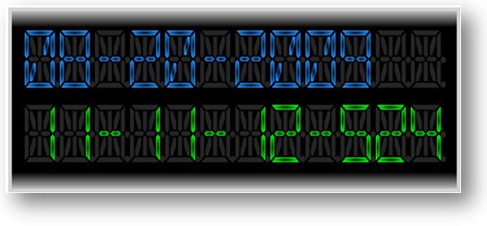

////

|metadata|
{
    "name": "xamgauge-create-digital-clock-using-gauge-control",
    "controlName": ["xamGauge","xamSegmentedDisplay"],
    "tags": ["Application Scenarios","Data Presentation","Styling"],
    "guid": "{F52D0E94-1F40-4BFF-930E-F6FB9F2260D0}",  
    "buildFlags": [],
    "createdOn": "2016-05-25T18:21:58.9773407Z"
}
|metadata|
////

= Create Digital Clock Using Segmented Display control

== Before You Begin

You can add xamSegmentedDisplay™ to a page using the same pattern as any control found in Microsoft® {PlatformName}™. This pattern involves using a layout container and adding the control to the Children collection of the layout container.

== What You Will Accomplish

You will create a digital clock using link:{ApiPlatform}controls.charts.xamgauge{ApiVersion}~infragistics.controls.charts.xamsegmenteddisplay.html[XamSegmentedDisplay] that displays the current date and time. When you run the finished project, you should see the digital clock control in your browser that looks similar to the screen shot below.

== Follow These Steps

[start=1]
. Create a Microsoft {PlatformName} project.
[start=2]
. In the Solution Explorer, add the following references to the {PlatformName} Application project

** {ApiPlatform}DataVisualization{ApiVersion}.dll
** {ApiPlatform}Controls.Charts.XamGauge{ApiVersion}.dll

[start=3]
. In the Main Page, add the following namespace.

*In XAML:*

----
xmlns:igGauge=http://schemas.infragistics.com/xaml
----

[start=4]
. Add a Canvas control to the main page

*In XAML:*

----
    <Canvas Width="700" Height="300" >
        <!-- TODO: add Rectangle for clock background -->
        <!-- TODO: add xamSegmentedDisplay for clock date -->
        <!-- TODO: add xamSegmentedDisplay for clock time -->
 </Canvas>
----

[start=5]
. Add a Rectangle control with the following style for the control background

*In XAML:*

----
        <Rectangle Stroke="LightGray"  StrokeThickness="5" Name="clockBorder" 
                   Width="631" Height="258" Margin="0,0,0,0">
            <Rectangle.Fill>
                <LinearGradientBrush EndPoint="0.5,1" StartPoint="0.5,0">
                    <GradientStop Color="LightGray" Offset="0"/>
                    <GradientStop Color="Black" Offset="0.1"/>
                    <GradientStop Color="Black" Offset="0.9"/>
                    <GradientStop Color="LightGray" Offset="1"/>
                </LinearGradientBrush>
            </Rectangle.Fill>
        </Rectangle>
        <!-- TODO: add xamSegmentedDisplay for clock date -->
----

[start=6]
. Add a link:{ApiPlatform}controls.charts.xamgauge{ApiVersion}~infragistics.controls.charts.xamsegmenteddisplay.html[XamSegmentedDisplay] control for displaying the clock date

*In XAML:*

----
    In XAML:
        <igGauge:XamSegmentedDisplay Name="xamDateDisplay" SegmentMode="FourteenSegment" Text="08-11-2009" Digits="12" 
Canvas.Left="23" Canvas.Top="32" Height="80">
            <igGauge:XamSegmentedDisplay.TextForeground>
                <RadialGradientBrush>
                    <GradientStop Color="Black" Offset="0"/>
                    <GradientStop Color="DodgerBlue" Offset="1"/>
                </RadialGradientBrush>
            </igGauge:XamSegmentedDisplay.TextForeground>
        </igGauge:XamSegmentedDisplay>
        <!-- TODO: add xamSegmentedDisplay for clock time -->
----

[start=7]
. Add a xamSegmentedDisplay control for displaying the clock time

*In XAML:*

----
        <igGauge:XamSegmentedDisplay x:Name="xamTimeDisplay" SegmentMode="FourteenSegment" Text="12-30-00-100" Digits="12" 
Canvas.Left="23" Canvas.Top="136" Height="80">
            <igGauge:XamSegmentedDisplay.TextForeground>
                <RadialGradientBrush>
                    <GradientStop Color="Black" Offset="0"/>
                    <GradientStop Color="Lime" Offset="1"/>
                </RadialGradientBrush>
            </igGauge:XamSegmentedDisplay.TextForeground>
        </igGauge:XamSegmentedDisplay>
----

[start=8]
. Save the MainPage.xaml file
[start=9]
. In the MainPage.xaml.cs file, add the following namespace

*In C#:*

----
using System.Windows.Threading;
----

*In Visual Basic:*

----
Imports System.Windows.Threading
----

[start=10]
. Add declarations for two DispacherTimer objects; one timer controls the actual presentation of the current date and time, the other timer is used in conjunction with the Boolean flag to manage the showing and hiding of the clock ticker visual cue.

*In C#:*

----
private DispatcherTimer _digtTimer = new DispatcherTimer(); // digital timer
private DispatcherTimer _tickTimer = new DispatcherTimer(); // tick timer
private bool _TickOn = true; // tick flag used to check if tick is on/off
----

*In Visual Basic:*

----
Private _digtTimer As New DispatcherTimer()    ' digital timer
Private _tickTimer As New DispatcherTimer()    ' tick timer
' tick flag used to check if tick is on/off
Private _TickOn As Boolean = True
----

[start=11]
. In the constructor of the Main Page add the following code

*In C#:*

----
public MainPage()
{
    InitializeComponent();
    // init and start digital timer
    _digtTimer = new DispatcherTimer();
    _digtTimer.Interval = new TimeSpan(0, 0, 0, 0, 5);
    _digtTimer.Tick += new EventHandler(_digtTimer_Tick);
    _digtTimer.Start();
    // init and start tick timer
    _tickTimer = new DispatcherTimer();
    _tickTimer.Interval = new TimeSpan(0, 0, 0, 0, 500);
    _tickTimer.Tick += new EventHandler(_tickTimer_Tick);
    _tickTimer.Start();
}
----

*In Visual Basic:*

----
Public Sub New()
        InitializeComponent()
        ' init and start digital timer
        _digtTimer = New DispatcherTimer()
        _digtTimer.Interval = New TimeSpan(0, 0, 0, 0, 5)
        AddHandler _digtTimer.Tick, AddressOf _digtTimer_Tick
        _digtTimer.Start()
        ' init and start tick timer
        _tickTimer = New DispatcherTimer()
        _tickTimer.Interval = New TimeSpan(0, 0, 0, 0, 500)
        AddHandler _tickTimer.Tick, AddressOf _tickTimer_Tick
        _tickTimer.Start()
End Sub
----

[start=12]
. Implement the digital timer object’s Tick event

*In C#:*

----
void _digtTimer_Tick(object sender, EventArgs e)
{
        this.xamDateDisplay.Text = GetCurrentDate();
        this.xamTimeDisplay.Text = GetCurrentTime();
}
----

*In Visual Basic:*

----
Private Sub _digtTimer_Tick(ByVal sender As Object, ByVal e As EventArgs)
        Me.xamDateDisplay.Text = GetCurrentDate()
        Me.xamTimeDisplay.Text = GetCurrentTime()
End Sub
----

[start=13]
. Implement the tick timer’s Tick event

*In C#:*

----
void _tickTimer_Tick(object sender, EventArgs e)
{
    _TickOn  = ! _TickOn;
}
----

*In Visual Basic:*

----
Private Sub _tickTimer_Tick(ByVal sender As Object, ByVal e As EventArgs)
        _TickOn = Not _TickOn
End Sub
----

[start=14]
. Add the following two methods for formatting the current date and time

*In C#:*

----
private string GetCurrentTime()
{
    // format current time to HH-MM-SS-MLS, e.g. 12-34-12-500
    System.DateTime dt = DateTime.Now;
    string dtStr = "";
    dtStr += String.Format("{0:00}", dt.Hour);
    dtStr += _TickOn ? "-" : " ";
    dtStr += String.Format("{0:00}", dt.Minute);
    dtStr += _TickOn ? "-" : " ";
    dtStr += String.Format("{0:00}", dt.Second);
    dtStr += _TickOn ? "-" : " ";
    dtStr += String.Format("{0:000}", dt.Millisecond);
    return dtStr;
}
private string GetCurrentDate()
{
    // format current date to MM-DD-YYYY, e.g. 08-11-2009
    System.DateTime dt = DateTime.Now;
    string dtStr = "";
    dtStr += String.Format("{0:00}", dt.Month);
    dtStr += _TickOn ? "-" : " ";
    dtStr += String.Format("{0:00}", dt.Day);
    dtStr += _TickOn ? "-" : " ";
    dtStr += String.Format("{0:0000}", dt.Year);
    return dtStr;
}
----

*In Visual Basic:*

----
Private Function GetCurrentTime() As String
        ' format current time to HH-MM-SS-MLS, e.g. 12-34-12-000
        Dim time As System.DateTime = DateTime.Now
        Dim dtStr As String = ""
        dtStr += String.Format("{0:00}", time.Hour)
        If _TickOn Then : dtStr += "-"
        Else : dtStr += " "
        End If
        dtStr += String.Format("{0:00}", time.Minute)
        If _TickOn Then : dtStr += "-"
        Else : dtStr += " "
        End If
        dtStr += String.Format("{0:00}", time.Second)
        If _TickOn Then : dtStr += "-"
        Else : dtStr += " "
        End If
        dtStr += String.Format("{0:000}", time.Millisecond)
        Return dtStr
End Function
Private Function GetCurrentDate() As String
        ' format current date to MM-DD-YYYY, e.g. 08-11-2009
        Dim dt As System.DateTime = DateTime.Now
        Dim dtStr As String = ""
        dtStr += String.Format("{0:00}", dt.Month)
        If _TickOn Then : dtStr += "-"
        Else : dtStr += " "
        End If
        dtStr += String.Format("{0:00}", dt.Day)
        If _TickOn Then : dtStr += "-"
        Else : dtStr += " "
        End If
        dtStr += [String].Format("{0:0000}", dt.Year)
        Return dtStr
End Function
----

[start=15]
. Run the application. The Digital Clock Control will display and start animate the current date and time.

== Related Topics

link:xamgauge-adding-a-digital-gauge-to-your-page.html[Getting Started with xamSegmentedDisplay]

link:xamgauge-style-digital-gauge.html[Style Segmented Display]