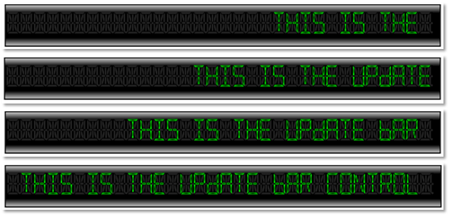

////

|metadata|
{
    "name": "xamgauge-create-update-news-bar-using-gauge-control",
    "controlName": ["xamGauge","xamSegmentedDisplay"],
    "tags": ["Application Scenarios","Data Presentation","How Do I","Styling"],
    "guid": "{EB2EA72D-4587-4A62-A5D5-FDE620EDC526}",  
    "buildFlags": [],
    "createdOn": "2016-05-25T18:21:58.9713408Z"
}
|metadata|
////

= Create Update-news Bar Using Segmented Display Control

== Before You Begin

You can add xamSegmentedDisplay™ to a page using the same pattern as any control found in Microsoft® {PlatformName}™. This pattern involves using a layout container and adding the control to the Children collection of the layout container.

== What You Will Accomplish

You will create an Update-News Bar control using link:{ApiPlatform}controls.charts.xamgauge{ApiVersion}~infragistics.controls.charts.xamsegmenteddisplay.html[XamSegmentedDisplay] that displays a message moving from right to left as it happens on TV news channels in bottom line of the screen. The movement of this message will take place in small time intervals and will go on continuously. When you run the finished project, you should see the Update-News Bar control in your browser that looks similar to the screen shots below.

== Follow These Steps

[start=1]
. Create a Microsoft {PlatformName} project.
[start=2]
. In the Solution Explorer, add the following references to the {PlatformName} Application project

** {ApiPlatform}DataVisualization.v{ProductVersion}.dll
** {ApiPlatform}Controls.Charts.XamGauge.v{ProductVersion}.dll

[start=3]
. In the Main Page, add the following namespace.

*In XAML:*

----
xmlns:igGauge="http://schemas.infragistics.com/xaml"
----

[start=4]
. Add a Border control with the following style for the control background

*In XAML:*

----
        <Border Width="840" Height="80" Margin="15"
                BorderThickness="2" BorderBrush="Black">
            <Border.Background>
                <LinearGradientBrush EndPoint="0.5,1" StartPoint="0.5,0">
                    <GradientStop Color="LightGray" Offset="0"/>
                    <GradientStop Color="Black" Offset="0.2"/>
                    <GradientStop Color="Black" Offset="0.8"/>
                    <GradientStop Color="LightGray" Offset="1"/>
                </LinearGradientBrush>
            </Border.Background>
               <!—TODO: add IG xamSegmentedDisplay control -->
        </Border>
----

[start=5]
. Add a link:{ApiPlatform}controls.charts.xamgauge{ApiVersion}~infragistics.controls.charts.xamsegmenteddisplay.html[XamSegmentedDisplay] control for displaying text message.

*In XAML:*

----
            <igGauge:XamSegmentedDisplay x:Name="xamUpdateBar"
                                            Text="" SegmentMode="FourteenSegment"    
                                            Digits="32" Margin="5" Height="40" >
                <igGauge:XamSegmentedDisplay.TextForeground>
                    <RadialGradientBrush>
                        <GradientStop Color="Black" Offset="0"/>
                        <GradientStop Color="Lime" Offset="1"/>
                    </RadialGradientBrush>
                </igGauge:XamSegmentedDisplay.TextForeground>
            </igGauge:XamSegmentedDisplay>
----

[start=6]
. Save the MainPage.xaml file.
[start=7]
. In the MainPage.xaml.cs file, add the following namespace.

*In C#:*

----
using System.Windows.Threading;  
using System.Diagnostics;
using System.Runtime.InteropServices;
----

*In Visual Basic:*

----
Imports System.Windows.Threading
Imports System.Diagnostics
Imports System.Runtime.InteropServices
----

[start=8]
. Add the declaration for the DispacherTimer object.

*In C#:*

----
private DispatcherTimer _timer = new DispatcherTimer(); // timer
private string _sampleText = 
"This is the Update Bar control created using Web Segmented Display control " +
"for more examples on how to use {PlatformName} Data Visualization controls " +
"from Infragistics visit its online documentation website ";
----

*In Visual Basic:*

----
    Private _timer As New DispatcherTimer()    ' timer
    Private _sampleText As String = _
    "This is the Update Bar control created using Web Segmented Display control " & _
    "for more examples on how to use {PlatformName} Data Visualization controls " & _
    "from Infragistics visit its online documentation website "
----

[start=9]
. In the constructor of the Main Page add the following code.

*In C#:*

----
        public MainPage()
        {
            InitializeComponent();
            // init and start timer
            _timer = new DispatcherTimer();
            _timer.Interval = new TimeSpan(0, 0, 0, 0, 200);
            _timer.Tick += new EventHandler(_timer_Tick);
            _timer.Start();
        }
----

*In Visual Basic:*

----
    Public Sub New()
        InitializeComponent()
        ' init and start timer
        _timer = New DispatcherTimer()
        _timer.Interval = New TimeSpan(0, 0, 0, 0, 200)
        AddHandler _timer.Tick, AddressOf _timer_Tick
        _timer.Start()
    End Sub
----

[start=10]
. Handle the timer object’s Tick event.

*In C#:*

----
        void _timer_Tick(object sender, EventArgs e)
        {
                // if end of message then reset to the smaple text
                if (this.xamUpdateBar.Text.Equals(string.Empty))
                        this.xamUpdateBar.Text = _sampleText.PadLeft(200);
                // show new text message on the update bar control
                this.xamUpdateBar.Text = this.xamUpdateBar.Text.Remove(0, 1);
}
----

*In Visual Basic:*

----
    Private Sub _timer_Tick(ByVal sender As Object, ByVal e As EventArgs)
        ' if end of message then reset to the smaple text
        If Me.xamUpdateBar.Text.Equals(String.Empty) Then
            Me.xamUpdateBar.Text = _sampleText.PadLeft(200)
        End If
        ' show new text message on the update bar control
        Me.xamUpdateBar.Text = Me.xamUpdateBar.Text.Remove(0, 1)
    End Sub
----

[start=11]
. Run the application. The Update-News Bar control will display a text message that moves from right to left.