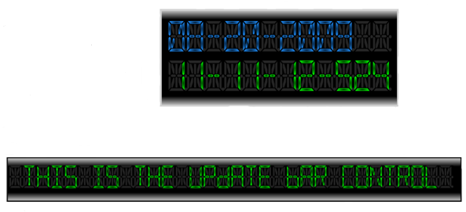

////

|metadata|
{
    "name": "xamgauge-custom-controls",
    "controlName": ["xamGauge","xamSegmentedDisplay"],
    "tags": [],
    "guid": "{667C7229-4D91-41D1-BE6B-124CDAC642B3}",  
    "buildFlags": [],
    "createdOn": "2016-05-25T18:21:58.9643694Z"
}
|metadata|
////

= Custom Controls

This section is your gateway to important task-based information that will help you create the following custom controls using xamSegmentedDisplay™ controls.

* link:xamgauge-create-digital-clock-using-gauge-control.html[Create Digital Clock Using Gauge control]
* link:xamgauge-create-update-news-bar-using-gauge-control.html[Create Update-news Bar Using Gauge Control]

