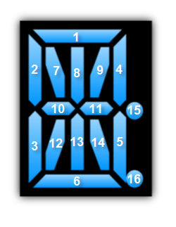

////

|metadata|
{
    "name": "xamgauge-style-digital-gauge",
    "controlName": ["xamGauge","xamSegmentedDisplay"],
    "tags": ["How Do I","Styling","Templating"],
    "guid": "{65791C14-DF4C-460D-8BFE-D0CDD8A6AB7A}",  
    "buildFlags": [],
    "createdOn": "2016-05-25T18:21:58.9583314Z"
}
|metadata|
////

= Style Segmented Display

You can define a custom visual tree for the digits in a xamSegmentedDisplay™ control by creating a control template that targets either the link:{ApiPlatform}controls.charts.xamgauge.v{ProductVersion}~infragistics.controls.charts.sevensegmentdigit.html[SevenSegmentDigit] object or the link:{ApiPlatform}controls.charts.xamgauge.v{ProductVersion}~infragistics.controls.charts.fourteensegmentdigit.html[FourteenSegmentDigit] object. The object that you need to target depends on the link:{ApiPlatform}controls.charts.xamgauge.v{ProductVersion}~infragistics.controls.charts.xamsegmenteddisplay~segmentmode.html[SegmentMode] property of xamSegmentedDisplay. For example, if you set the SegmentMode property to SevenSegment, you need to target the SevenSegmentDigit object. On the other hand, if you set the SegmentMode property to FourteenSegment, you need to target the FourteenSegmentDigit object.

The link:{ApiPlatform}controls.charts.xamgauge.v{ProductVersion}~infragistics.controls.charts.xamsegmenteddisplay.html[XamSegmentedDisplay] control exposes a link:{ApiPlatform}controls.charts.xamgauge.v{ProductVersion}~infragistics.controls.charts.xamsegmenteddisplay~digitstyle.html[DigitStyle] property that you can set to an instance of a Style object; therefore, you cannot simply use the control template as-is. You must create a Style object and add a Setter object that sets the Template property.

The following XAML snippet demonstrates this pattern:

*In XAML:*

----

----

Just like other Microsoft® {PlatformName}™ controls, xamSegmentedDisplay uses the "Parts Model" to define the names and types of elements that are required within its control template. If you do not add the required elements or if you do not name the elements using a set of pre-defined names, the control will not function properly. The following tables list the names and types of elements that are required for the SevenSegmentDigit object and the FourteenSegmentDigit object.

== Seven Segment Digit

[options="header", cols="a,a,a"]
|====
||Name|Type

|1
|top
|Shape

|2
|middle
|Shape

|3
|bottom
|Shape

|4
|leftTop
|Shape

|5
|leftBottom
|Shape

|6
|rightTop
|Shape

|7
|rightBottom
|Shape

|8
|dotTop
|Shape

|9
|dotBottom
|Shape

|====

== Fourteen Segment Digit

[options="header", cols="a,a,a"]
|====
||Name|Type

|1
|top
|Shape

|2
|leftTop
|Shape

|3
|leftBottom
|Shape

|4
|rightTop
|Shape

|5
|rightBottom
|Shape

|6
|bottom
|Shape

|7
|leftTopDiagonal
|Shape

|8
|centerTop
|Shape

|9
|rightTopDiagonal
|Shape

|10
|centerLeft
|Shape

|11
|centerRight
|Shape

|12
|leftBottomDiagonal
|Shape

|13
|centerBottom
|Shape

|14
|rightBottomDiagonal
|Shape

|15
|dotTop
|Shape

|16
|dotBottom
|Shape

|====

