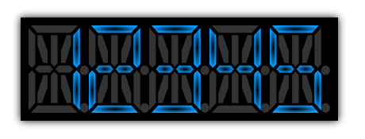

////

|metadata|
{
    "name": "xamgauge-using-xamgauge",
    "controlName": ["xamGauge","xamSegmentedDisplay"],
    "tags": ["Getting Started"],
    "guid": "{0F5327B0-C700-438A-8D88-34174AC5C837}",  
    "buildFlags": [],
    "createdOn": "2016-05-25T18:21:58.9403692Z"
}
|metadata|
////

= Using xamSegmentedDisplay

This section is your gateway to important task-based information that will help you to effectively use the various features and functionalities provided by xamSegementedDisplay™ control.

* link:xamgauge-custom-controls.html[Custom Controls]
* link:xamgauge-style-digital-gauge.html[Style Segmented Display]

