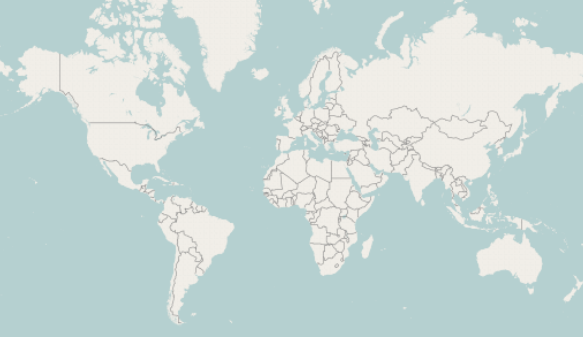

////
|metadata|
{
    "name": "xamgeographicmap-adding-xamgeographicmap-to-a-page",
    "controlName": ["xamGeographicMap"],
    "tags": ["Data Presentation","Getting Started"],
    "guid": "24003968-0ce5-49e1-840f-1fdf1bb083d6",
    "buildFlags": [],
    "createdOn": "2016-05-25T18:21:56.6362091Z"
}
|metadata|
////

= Adding xamGeographicMap to a Page

== Topic Overview

=== Purpose

This topic provides information on how to add the link:{ApiPlatform}controls.maps.xamgeographicmap{ApiVersion}~infragistics.controls.maps.xamgeographicmap_members.html[XamGeographicMap]™ control to an application page.

=== Required Background

The following table lists the topics required as a prerequisite to understanding this topic.

[options="header", cols="a,a"]
|====
|Topic|Purpose

| link:xamgeographicmap.html[xamGeographicMap]
|This topic provides an overview of key features in the _xamGeographicMap_ control.

|====

=== In This Topic

This topic contains the following sections

* <<_Ref320185118,Adding xamGeographicMap to Page>>

** <<_Ref320185129,Introduction>>
** <<_Ref320186496,Preview>>
** <<_Ref320185134,Requirements>>
** <<_Ref320186499,Overview>>
** <<_Ref320186502,Steps>>

* <<_Ref320185294,Related Content>>

[[_Ref320185118]]
== Adding xamGeographicMap to a Page

[[_Ref320185129]]

=== Introduction

The _xamGeographicMap_ control is designed to display geo-spatial data from shape files and geographic locations from view models on geographic imagery maps. However, this topic focuses on adding the _xamGeographicMap_ control with the minimum code and property settings required for display. By default the _xamGeographicMap_ control is displayed with geographic imagery tiles from Open Street Map service.

[[_Ref320186496]]

=== Preview

The following is a preview of the _xamGeographicMap_ control with geographic imagery tiles from Open Street Map service.

[[_Ref320185134]]

=== Requirements

The following table summarizes the requirements for adding the _xamGeographicMap_ control.

[options="header", cols="a,a"]
|====
| *Requirement* | *Description* 

|Prerequisites
|To complete the procedure section of this topic, you need to create a {PlatformName} project.

|Assembly references
|Add the following Infragistics assemblies as references in your project: 

* {ApiPlatform}Controls.Maps.XamGeographicMap.v{ProductVersion}.dll 

* {ApiPlatform}Controls.Charts.XamDataChart.v{ProductVersion}.dll 

* {ApiPlatform}DataVisualization.v{ProductVersion}.dll 

* {ApiPlatform}v{ProductVersion}.dll

|Data
|The _xamGeographicMap_ control does not require any data for its rendering because it displays geographic imagery tiles from Open Street Map in its background content. However, the _xamGeographicMap_ control can also display geo-spatial data from shape files and geographic locations from view models. Refer to the following topics for more information on how this is accomplished and for data requirements: 

* link:xamgeographicmap-using-geographic-imagery.html[Using Geographic Imagery] 

* link:xamgeographicmap-binding-shape-files-with-geospatial-data.html[Binding Shape Files with Geo-spatial Data] 

* link:xamgeographicmap-binding-geographic-data-models.html[Binding Geographic Data Models] 

|====

[[_Ref320186499]]

=== Overview

The following is a conceptual overview of the process:

[start=1]
. *Reference Infragistics assemblies in your project* 
[start=2]
. *Add Infragistics namespaces to your application's view* 
[start=3]
. *Add the Geographic Map control to your application's view* 
[start=4]
. *Verify the results* 

[[_Ref320186502]]

=== Steps

The following procedure takes you step-by-step toward adding the _xamGeographicMap_ control to a page.

=== Reference Infragistics assemblies in your project.

[start=1]
. Right click on your project and select the Add References… menu item.
[start=2]
. In the Add References dialog, browse to and add the following Infragistics assemblies:

* {ApiPlatform}Controls.Maps.XamGeographicMap.v{ProductVersion}.dll

* {ApiPlatform}Controls.Charts.XamDataChart.v{ProductVersion}.dll

* {ApiPlatform}DataVisualization.v{ProductVersion}.dll

* {ApiPlatform}v{ProductVersion}.dll

=== Add Infragistics namespaces to your application's view.

In the application page, add the following namespace declarations:

*In XAML:*

[source,xaml]
----
xmlns:ig="http://schemas.infragistics.com/xaml"
----

*In Visual Basic:*

[source,vb]
----
Imports Infragistics.Controls.Maps
----

*In C#:*

[source,csharp]
----
using Infragistics.Controls.Maps;
----

=== Add the Geographic Map control to your application's view.

The following code demonstrates adding the _xamGeographicMap_ control with the minimum code and property settings required for display:

*In XAML:*

[source,xaml]
----
<Grid x:Name="LayoutRoot">
    <ig:XamGeographicMap x:Name="GeoMap" />
</Grid>
----

*In Visual Basic:*

[source,vb]
----
Dim geoMap As New XamGeographicMap()
Me.LayoutRoot.Children.Add(geoMap)
----

*In C#:*

[source,csharp]
----
var geoMap = new XamGeographicMap();
this.LayoutRoot.Children.Add(geoMap);
----

=== Verify the results.

Build and run your project to verify the result. If you have implemented the steps correctly, the displayed _xamGeographicMap_ should look like the one in the <<_Ref320186496,Preview>> section above.

[[_Ref320185294]]
== Related Content

=== Topics

The following topics provide additional information related to this topic.

[options="header", cols="a,a"]
|====
| *Topic* | *Purpose* 

| link:xamgeographicmap-using-geographic-imagery.html[Using Geographic Imagery]
|This topic provides information on how to bind geographic imagery in the _xamGeographicMap_ control.

| link:xamgeographicmap-binding-shape-files-with-geospatial-data.html[Binding Shape Files with Geo-spatial Data]
|This topic provides information on how to bind shape files with geo-spatial data to the _xamGeographicMap_ control.

| link:xamgeographicmap-binding-geographic-data-models.html[Binding Geographic Data Models]
|This topic provides information on how to bind a view model with geo-spatial data to the _xamGeographicMap_ control

| link:xamgeographicmap-navigating-map-content.html[Navigating Map Content]
|This topic provides information on how to navigate the map content of the _xamGeographicMap_ control.

| link:xamgeographicmap-api-overview.html[API Overview]
|This topic provides an API overview of key classes and properties of the _xamGeographicMap_ control and its components.

|====