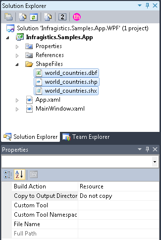
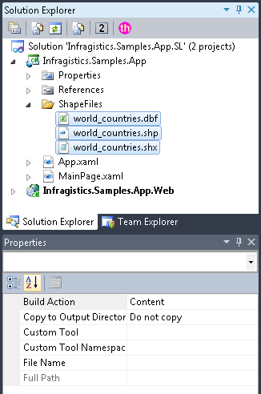
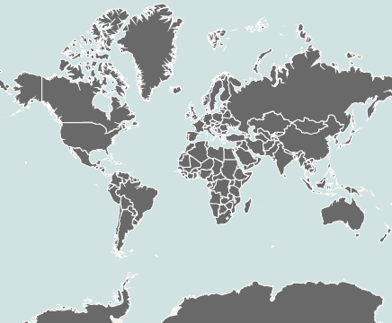

////

|metadata|
{
    "name": "xamgeographicmap-binding-shape-files-with-geospatial-data",
    "controlName": ["xamGeographicMap"],
    "tags": [],
    "guid": "ec412a28-a5fc-475c-9157-b0ebb86a1720",  
    "buildFlags": [],
    "createdOn": "2016-05-25T18:21:56.6532098Z"
}
|metadata|
////

= Binding Shape Files with Geo-spatial Data

== Topic Overview

=== Purpose

This topic provides information on how to load shape files and bind geo-spatial data to the link:{ApiPlatform}controls.maps.xamgeographicmap{ApiVersion}~infragistics.controls.maps.xamgeographicmap_members.html[xamGeographicMap]™ control.

=== Required background

The following table lists the topics required as a prerequisite to understanding this topic.

[options="header", cols="a,a"]
|====
|Topic|Purpose

| link:xamgeographicmap-adding-xamgeographicmap-to-a-page.html[Adding xamGeographicMap to a Page]
|This topic provides information on how to add the _xamGeographicMap_ control to an application page.

| link:xamgeographicmap-shape-files-reference.html[Shape Files Reference]
|This topic provides resources with information about maps, shape files, and geo-spatial related material. Use this topic to learn about and obtain geo-spatial shape files as well as tools for their editing.

| link:xamgeographicmap-using-geographic-series.html[Using Geographic Series]
|This topic provides an overview of supported types of geographic series by the _xamGeographicMap_ control.

|====

=== In this topic

This topic contains the following sections:

* <<_Ref320193469,Adding Shape Files To Application>>

** <<_Ref320193474,Overview>>
** <<_Ref320193482,Example>>

* <<_Ref320193486,Loading Geo-spatial Data from Shape Files>>

** <<_Ref317163220,Overview>>
** <<_Ref320193492,Example>>

* <<_Ref320193495,Binding Geo-spatial Data to Geographic Series>>

** <<_Ref320193500,Overview>>
** <<_Ref320226068,Preview>>
** <<_Ref320218367,Example>>

* <<_Ref320185294,Related Content>>

[[_Ref320193469]]
== Adding Shape Files to Application

[[_Ref320193474]]

=== Overview

Adding shape files to an application works the same way as adding typically non-executable data files such as image, audio, and video files. As a developer, you have a number of methods for deploying shape files with your application. These methods are explained in the following MSDN topic:

ifdef::sl[]
* link:http://msdn.microsoft.com/en-us/library/cc296240(v=vs.95).aspx[Deploying Files with SL Application]

endif::sl[]

ifdef::wpf[]
* link:http://msdn.microsoft.com/en-us/library/aa970494.aspx[Deploying Files with WPF Application]

endif::wpf[]

All shape files should be placed in the same folder in your application.

[[_Ref320193482]]

=== Example

ifdef::wpf[]
The following image show a sample structure of WPF application project with shape files added as Resource files:
endif::wpf[]

ifdef::wpf[]

endif::wpf[]

ifdef::sl[]
The following image show a sample structure of SL application project with shape files added as Content files:
endif::sl[]

ifdef::sl[]

endif::sl[]

[[_Ref320193486]]
== Loading Geo-spatial Data from Shape Files

[[_Ref317163220]]

=== Overview

In the _xamGeographicMap_ control, the link:{ApiPlatform}controls.maps.xamgeographicmap{ApiVersion}~infragistics.controls.maps.shapefileconverter_members.html[ShapefileConverter] class loads geo-spatial data from shape files and converts it to a collection of link:{ApiPlatform}controls.maps.xamgeographicmap{ApiVersion}~infragistics.controls.maps.shapefilerecord_members.html[ShapefileRecord] objects.

The following table explains properties of the link:{ApiPlatform}controls.maps.xamgeographicmap{ApiVersion}~infragistics.controls.maps.shapefileconverter_members.html[ShapefileConverter] class for loading shape files.

[options="header", cols="a,a,a"]
|====
|*Property*|*Type*|* Description*

| link:{ApiPlatform}controls.maps.xamgeographicmap{ApiVersion}~infragistics.controls.maps.shapefileconverter~shapefilesource.html[ShapefileSource]
|Uri
|Specifies the Uri to a shape file (.shp) that contains geo-spatial data items.

| link:{ApiPlatform}controls.maps.xamgeographicmap{ApiVersion}~infragistics.controls.maps.shapefileconverter~databasesource.html[DatabaseSource]
|Uri
|Specifies the Uri to a shape database file (.dbf) that contains a data table for geo-spatial data items.

|====

Both of the source properties for shape files are of Uri type. This means that shape files can be embedded resources in the application assembly, on the internet (via http) pick:[sl=", or in the XAP file (Silverlight only)"] . Refer to the previous section for more information on this process. The rules for resolving Uri objects are equivalent to any standard Uri property, for example the link:http://msdn.microsoft.com/en-us/library/system.windows.media.imaging.bitmapimage.urisource(v=vs.95).aspx[BitmapImage.UriSource] property.

When both source properties are set to non-null values, then the link:{ApiPlatform}controls.maps.xamgeographicmap{ApiVersion}~infragistics.controls.maps.shapefileconverter_members.html[ShapefileConverter] object’s ImportAsync method is invoked which in return performs fetching and reading the shape files and finally doing the conversion. After this operation is complete, the link:{ApiPlatform}controls.maps.xamgeographicmap{ApiVersion}~infragistics.controls.maps.shapefileconverter_members.html[ShapefileConverter] is populated with link:{ApiPlatform}controls.maps.xamgeographicmap{ApiVersion}~infragistics.controls.maps.shapefilerecord_members.html[ShapefileRecord] objects and the link:{ApiPlatform}controls.maps.xamgeographicmap{ApiVersion}~infragistics.controls.maps.shapefileconverter~importcompleted_ev.html[ImportCompleted] event is raised in order to notify about completed process of loading and converting geo-spatial data from shape files.

[[_Ref320193492]]

=== Example

The following code creates an instance of the link:{ApiPlatform}controls.maps.xamgeographicmap{ApiVersion}~infragistics.controls.maps.shapefileconverter_members.html[ShapefileConverter] object for loading a shape file that contains locations of major cities in the world. It also demonstrates how to handle the link:{ApiPlatform}controls.maps.xamgeographicmap{ApiVersion}~infragistics.controls.maps.shapefileconverter~importcompleted_ev.html[ImportCompleted] event as a prerequisite for binding data to the xamGeographicMap control.

*In XAML:*

[source,xaml]
----
xmlns:ig="http://schemas.infragistics.com/xaml"
<ig:ShapefileConverter x:Key="shapefileConverter"
      ImportCompleted="OnShapefileImportCompleted"
      ShapefileSource="ShapeFiles/world_countries.shp"
      DatabaseSource="ShapeFiles/world_countries.dbf" >
</ig:ShapefileConverter>
----

*In Visual Basic:*

[source,vb]
----
Imports Infragistics.Controls.Maps 
Dim shapefileConverter As New ShapefileConverter()
shapefileConverter.ImportCompleted += OnShapefileImportCompleted
shapefileConverter.ShapefileSource = New Uri("ShapeFiles/world_countries.shp", UriKind.RelativeOrAbsolute)
shapefileConverter.DatabaseSource = New Uri("ShapeFiles/world_countries.dbf", UriKind.RelativeOrAbsolute)
Private Sub OnShapefileCollectionChanged(sender As Object, e As System.ComponentModel.NotifyCollectionChangedEventArgs)
      ' TODO: bind shapefileConverter to the xamGeographicMap control
End Sub
----

*In C#:*

[source,csharp]
----
using Infragistics.Controls.Maps;
ShapefileConverter shapefileConverter = new ShapefileConverter();
shapefileConverter.ImportCompleted += OnShapefileImportCompleted;
shapefileConverter.ShapefileSource = new Uri("ShapeFiles/world_countries.shp", UriKind.RelativeOrAbsolute);
shapefileConverter.DatabaseSource = new Uri("ShapeFiles/world_countries.dbf", UriKind.RelativeOrAbsolute);
private void OnShapefileCollectionChanged(object sender, System.ComponentModel.NotifyCollectionChangedEventArgs e)
{
      // TODO: bind ShapefileConverter to the xamGeographicMap control
}
----

[[_Ref320193495]]
== Binding Geo-spatial Data to Geographic Series

[[_Ref320193500]]

=== Overview

In the xamGeographicMap control, Geographic Series are used for displaying geo-spatial data that is loaded from shape files. Refer to the link:xamgeographicmap-using-geographic-series.html[Using Geographic Series] topic for overview of supported Geographic Series by the xamGeographicMap control. All types of Geographic Series have an link:{ApiPlatform}controls.charts.xamdatachart{ApiVersion}~infragistics.controls.charts.series~itemssource.html[ItemsSource] property which can be bound to any object that implements the interface (for example: link:http://msdn.microsoft.com/en-us/library/6sh2ey19.aspx[List], link:http://msdn.microsoft.com/en-us/library/ms132397.aspx[Collection], link:http://msdn.microsoft.com/en-us/library/7977ey2c.aspx[Queue], link:http://msdn.microsoft.com/en-us/library/system.collections.stack.aspx[Stack]). The link:{ApiPlatform}controls.maps.xamgeographicmap{ApiVersion}~infragistics.controls.maps.shapefileconverter_members.html[ShapefileConverter] is another example of Enumerable object because it implements a collection of link:{ApiPlatform}controls.maps.xamgeographicmap{ApiVersion}~infragistics.controls.maps.shapefilerecord_members.html[ShapefileRecord] objects.

The link:{ApiPlatform}controls.maps.xamgeographicmap{ApiVersion}~infragistics.controls.maps.shapefilerecord_members.html[ShapefileRecord] class provides properties for storing geo-spatial data, listed in the following table.

[options="header", cols="a,a,a"]
|====
|*Property*|*Type*|* Description*

| link:{ApiPlatform}controls.maps.xamgeographicmap{ApiVersion}~infragistics.controls.maps.shapefilerecord~points.html[Points]
| link:http://msdn.microsoft.com/en-us/library/6sh2ey19(v=VS.80).aspx[List]< link:http://msdn.microsoft.com/en-us/library/6sh2ey19(v=VS.80).aspx[List]< link:http://msdn.microsoft.com/en-us/library/system.windows.point(v=VS.95).aspx[Point]>>
|Contains all the points in one geo-spatial shape loaded from a shape file (.shp). For example, the country of Japan in shape file the world would be represents as a List of a List of points object, where: 

* The first list of points describes shape of Hokkaido island 

* The second list of points describes shape of Honshu island 

* The third list of points describes shape of Kyushu island 

* The fourth list of points describes shape of Shikoku island 

And so on until all shapes/states/islands of a country are represented.

| link:{ApiPlatform}controls.maps.xamgeographicmap{ApiVersion}~infragistics.controls.maps.shapefilerecord~fields.html[Fields]
| link:{ApiPlatform}controls.maps.xamgeographicmap{ApiVersion}~infragistics.controls.maps.shapefilerecordfields_members.html[ShapefileRecordFields]
|Contains a row of data from the shape database file (.dbf) keyed by a column name. For example, a data about county of Japan which includes population, area, name of a capital, etc.

|====

This data structure is suitable for use in most Geographic Series as long as appropriate data columns are mapped to them.

The following topics explain in detail binding and data requirements for each type of Geographic Series:

* link:xamgeographicmap-using-geographic-shape-series.html[Using Geographic Shape Series]
* link:xamgeographicmap-using-geographic-symbol-series.html[Using Geographic Symbol Series]
* link:xamgeographicmap-using-geographic-polyline-series.html[Using Geographic Polyline Series]

[[_Ref320226068]]

=== Preview

The following image is a preview of the xamGeographicMap control with link:{ApiPlatform}controls.maps.xamgeographicmap{ApiVersion}~infragistics.controls.maps.geographicshapeseries_members.html[GeographicShapeSeries] bound to shape files of the world.

[[_Ref320218367]]

=== Example

This code example assumes that shape files were loaded using the link:{ApiPlatform}controls.maps.xamgeographicmap{ApiVersion}~infragistics.controls.maps.shapefileconverter_members.html[ShapefileConverter] as it explained in the <<_Ref320193486%20/$$*$$%20MERGEFORMAT,>><<_Ref320193469,Adding Shape Files to Application>> section of this topic.

The following code binds link:{ApiPlatform}controls.maps.xamgeographicmap{ApiVersion}~infragistics.controls.maps.geographicshapeseries_members.html[GeographicShapeSeries] in the xamGeographicMap control to the link:{ApiPlatform}controls.maps.xamgeographicmap{ApiVersion}~infragistics.controls.maps.shapefileconverter_members.html[ShapefileConverter] and maps the link:{ApiPlatform}controls.maps.xamgeographicmap{ApiVersion}~infragistics.controls.maps.shapefilerecord~points.html[Points] property of all link:{ApiPlatform}controls.maps.xamgeographicmap{ApiVersion}~infragistics.controls.maps.shapefilerecord_members.html[ShapefileRecord] objects.

*In XAML:*

[source,xaml]
----
<ig:XamGeographicMap x:Name="GeoMap">
     <ig:XamGeographicMap.Series>
          <ig:GeographicShapeSeries Brush="DimGray" 
                                    ItemsSource="{StaticResource shapeFileSource}"
                                    ShapeMemberPath="Points" >
          </ig:GeographicShapeSeries>
     </ig:XamGeographicMap.Series>
</ig:XamGeographicMap>
----

*In Visual Basic:*

[source,vb]
----
Private Sub OnShapefileCollectionChanged(sender As Object, e As System.ComponentModel.NotifyCollectionChangedEventArgs)
      Me.GeoMap.Series[0].ItemsSource = shapefileConverter
      Me.GeoMap.Series[0].ShapeMemberPath = “Points” 
End Sub
----

*In C#:*

[source,csharp]
----
private void OnShapefileCollectionChanged(object sender, System.ComponentModel.NotifyCollectionChangedEventArgs e)
{
      this.GeoMap.Series[0].ItemsSource = shapefileConverter;
      this.GeoMap.Series[0].ShapeMemberPath = “Points” ;
}
----

[[_Ref320185294]]
== Related Content

=== Topics

The following topics provide additional information related to this topic.

[options="header", cols="a,a"]
|====
| *Topic* | *Purpose* 

| link:xamgeographicmap-adding-xamgeographicmap-to-a-page.html[Adding xamGeographicMap to a Page]
|This topic provides information on how to add the xamGeographicMap control to an application page.

| link:xamgeographicmap-shape-files-reference.html[Shape Files Reference]
|This topic provides resources with information about maps, shape files, and geo-spatial related material. Use this topic to learn about and obtain geo-spatial shape files as well as tools for their editing.

| link:xamgeographicmap-using-geographic-series.html[Using Geographic Series]
|This topic provides an overview of supported types of geographic series by the xamGeographicMap control.

| link:xamgeographicmap-using-geographic-shape-series.html[Using Geographic Shape Series]
|This topic provides information on how to use the link:{ApiPlatform}controls.maps.xamgeographicmap{ApiVersion}~infragistics.controls.maps.geographicshapeseries_members.html[GeographicShapeSeries] in the xamGeographicMap control.

| link:xamgeographicmap-using-geographic-symbol-series.html[Using Geographic Symbol Series]
|This topic provides information on how to use the link:{ApiPlatform}controls.maps.xamgeographicmap{ApiVersion}~infragistics.controls.maps.geographicsymbolseries_members.html[GeographicSymbolSeries] in the xamGeographicMap control.

| link:xamgeographicmap-using-geographic-polyline-series.html[Using Geographic Polyline Series]
|This topic provides information on how to use the link:{ApiPlatform}controls.maps.xamgeographicmap{ApiVersion}~infragistics.controls.maps.geographicpolylineseries_members.html[GeographicPolylineSeries] in the xamGeographicMap control.

| link:xamgeographicmap-api-overview.html[API Overview]
|This topic provides an API overview of key classes and properties of the xamGeographicMap control and its components.

|====