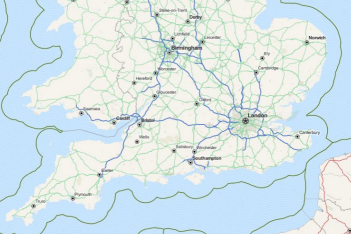

////

|metadata|
{
    "name": "xamgeographicmap-creating-custom-geographic-imagery-from-map-quest",
    "controlName": ["xamGeographicMap"],
    "tags": ["Application Scenarios","Data Binding","Data Presentation","Extending"],
    "guid": "13b1cbfd-f787-4e51-b820-474018df0190",  
    "buildFlags": [],
    "createdOn": "2016-05-25T18:21:56.6922082Z"
}
|metadata|
////

= Creating Custom Geographic Imagery from Map Quest

== Topic Overview

=== Purpose

This topic provides information on how to create and display custom geographic imagery from Map Quest in the background content of the link:{ApiPlatform}controls.maps.xamgeographicmap.v{ProductVersion}~infragistics.controls.maps.xamgeographicmap_members.html[xamGeographicMap]™ control.

=== Required background

The following table lists the topics required as a prerequisite to understanding this topic.

[options="header", cols="a,a"]
|====
|Topic|Purpose

| link:xamgeographicmap-adding-xamgeographicmap-to-a-page.html[Adding xamGeographicMap to a Page]
|This topic provides information on how to add the _xamGeographicMap_ control to an application page.

| link:xamgeographicmap-visual-elements-of-xamgeographicmap.html[Visual Elements of xamGeographicMap]
|This topic provides information about layout of map elements in the _xamGeographicMap_ control.

| link:xamgeographicmap-using-geographic-imagery.html[Using Geographic Imagery]
|This topic provides an overview of rendering geographic imagery in the background content of the _xamGeographicMap_ control.

|====

=== In This Topic

This topic contains the following sections:

* <<_Ref320388672,Geographic Imagery from Map Quest>>

** <<_Ref320618582,Introduction>>
** <<_Ref320388681,Preview>>
** <<_Ref320618599,Steps>>

* <<_Ref320185294,Related Content>>

[[_Ref320388672]]
== Geographic Imagery from Map Quest

[[_Ref320618582]]

=== Introduction

The Map Quest geographic imagery is a free mapping service created by MapQuest® company. This geographic imagery service can be access directly on link:http://www.mapquest.com[http://www.mapquest.com] web site.

By the default, the _xamGeographicMap_ control does not provide support for geographic imagery from the Map Quest service. However, the link:{ApiPlatform}controls.maps.xamgeographicmap.v{ProductVersion}~infragistics.controls.maps.geographicmapimagery_members.html[GeographicMapImagery] class can be extended to provide implementation for geographic imagery tiles from other geographic imagery sources.

[[_Ref320388681]]

=== Preview

The following image is a preview of the _xamGeographicMap_ control with geographic imagery tiles from the Map Quest service.

[[_Ref320618599]]

=== Steps

The following procedure demonstrates how to create and display geographic imagery from Map Quest in the background content of the _xamGeographicMap_ control by extending the link:{ApiPlatform}datavisualization.v{ProductVersion}~infragistics.controls.maps.maptilesource_members.html[MapTileSource] and link:{ApiPlatform}controls.maps.xamgeographicmap.v{ProductVersion}~infragistics.controls.maps.geographicmapimagery_members.html[GeographicMapImagery] classes.

=== Create multi-scale tile source for the Map Quests geographic imagery

Create multi-scale tile source for the Map Quests geographic imagery by inheriting link:{ApiPlatform}datavisualization.v{ProductVersion}~infragistics.controls.maps.maptilesource_members.html[MapTileSource] class.

*In Visual Basic:*

[source,vb]
----
Namespace IGGeographicMap.Extensions
      ''' 

      ''' Represents tile source for geographic imagery from the Map Quest service
      ''' 

      Public Class MapQuestTileSource
            Inherits Infragistics.Controls.Maps.MapTileSource
            Public Sub New()
                  MyBase.New(134217728, 134217728, 256, 256, 0)
            End Sub
            #Region "TileMapStyle"
            ''' 

            ''' Gets or sets map style for the tile source of MapQuest geographic imagery
            ''' 

            Public Property TileMapStyle() As MapQuestImageryStyle
                  Get
                        Return _TileMapStyle
                  End Get
                  Set
                        _TileMapStyle = Value
                  End Set
            End Property
            Private _TileMapStyle As MapQuestImageryStyle
            #End Region
            Private Const TileStreetPath As String = "http://otile4.mqcdn.com/tiles/1.0.0/osm/{Z}/{X}/{Y}.png"
            Private Const TileAerialPath As String = "http://oatile3.mqcdn.com/naip/{Z}/{X}/{Y}.png"
            ''' 

            ''' Gets path for the type of a geographic imagery tile
            ''' 

            ''' <returns></returns>
            Private Function GetTileType() As String
                  Return If(Me.TileMapStyle = MapQuestImageryStyle.SatelliteMapStyle, TileAerialPath, TileStreetPath)
            End Function
            ''' 

            ''' Overridden method for getting a geographic imagery tile at specific position of the map
            ''' 

            Protected Overrides Sub GetTileLayers(tileLevel As Integer, tilePositionX As Integer, tilePositionY As Integer, tileImageLayerSources As System.Collections.Generic.IList(Of Object))
                  Dim tilePath = GetTileType()
                  Dim zoom As Integer = tileLevel - 8
                  If zoom > 0 Then
                        Dim uriString As String = tilePath
                        uriString = uriString.Replace("{Z}", zoom.ToString())
                        uriString = uriString.Replace("{X}", tilePositionX.ToString())
                        uriString = uriString.Replace("{Y}", tilePositionY.ToString())
                        tileImageLayerSources.Add(New Uri(uriString))
                  End If
            End Sub
      End Class
      ''' 

      ''' Defines style of the MapQuest geographic imagery. 
      ''' 

      Public Enum MapQuestImageryStyle
            ''' 

            ''' Specifies street style of geographic imagery from the Map Quest service
            ''' 

            StreetMapStyle
            ''' 

            ''' Specifies satellite style of geographic imagery from the Map Quest service
            ''' 

            SatelliteMapStyle
      End Enum
End Namespace
----

*In C#:*

[source,csharp]
----
using System;
namespace IGGeographicMap.Extensions
{
    /// 

    /// Represents tile source for geographic imagery from the Map Quest service
    /// 

    public class MapQuestTileSource : Infragistics.Controls.Maps.MapTileSource
    {
        public MapQuestTileSource()
            : base(134217728, 134217728, 256, 256, 0)
        { }
        #region TileMapStyle
        /// 

        /// Gets or sets map style for the tile source of MapQuest geographic imagery
        /// 

        public MapQuestImageryStyle TileMapStyle { get; set; }
        #endregion
        private const string TileStreetPath = "http://otile4.mqcdn.com/tiles/1.0.0/osm/{Z}/{X}/{Y}.png";
        private const string TileAerialPath = "http://oatile3.mqcdn.com/naip/{Z}/{X}/{Y}.png";
        /// 

        /// Gets path for the type of a geographic imagery tile
        /// 

        /// <returns></returns>
        private string GetTileType()
        {
            return this.TileMapStyle == MapQuestImageryStyle.SatelliteMapStyle ? TileAerialPath : TileStreetPath;
        }
        /// 

        /// Overridden method for getting a geographic imagery tile at specific position of the map
        /// 

        protected override void GetTileLayers(int tileLevel, int tilePositionX, int tilePositionY, System.Collections.Generic.IList<object> tileImageLayerSources)
        {
            var tilePath = GetTileType();
            int zoom = tileLevel - 8;
            if (zoom > 0)
            {
                string uriString = tilePath;
                uriString = uriString.Replace("{Z}", zoom.ToString());
                uriString = uriString.Replace("{X}", tilePositionX.ToString());
                uriString = uriString.Replace("{Y}", tilePositionY.ToString());
                tileImageLayerSources.Add(new Uri(uriString));
            }
        }
    }
    /// 

    /// Defines style of the MapQuest geographic imagery. 
    /// 

    public enum MapQuestImageryStyle
    {
        /// 

        /// Specifies street style of geographic imagery from the Map Quest service
        /// 

        StreetMapStyle,
        /// 

        /// Specifies satellite style of geographic imagery from the Map Quest service
        /// 

        SatelliteMapStyle,
    }
}
----

=== Create geographic imagery classes for supported types of map styles of the Map Quests service

Create geographic imagery classes for supported types of map styles of the Map Quests service by inheriting from the link:{ApiPlatform}controls.maps.xamgeographicmap.v{ProductVersion}~infragistics.controls.maps.geographicmapimagery_members.html[GeographicMapImagery] class and providing Map Quests imagery source.

*In Visual Basic:*

[source,vb]
----
Imports Infragistics.Controls.Maps
Namespace IGGeographicMap.Extensions
      ''' 

      ''' Represents geographic imagery with street map style from the Map Quest service
      ''' 

      Public Class MapQuestStreetImagery
            Inherits GeographicMapImagery
            Public Sub New()
                  MyBase.New(New MapQuestTileSource() With { .TileMapStyle = MapQuestImageryStyle.StreetMapStyle       })
            End Sub
      End Class
      ''' 

      ''' Represents geographic imagery with satellite map style from the Map Quest service
      ''' 

      Public Class MapQuestSatelliteImagery
            Inherits GeographicMapImagery
            Public Sub New()
                  MyBase.New(New MapQuestTileSource() With { .TileMapStyle = MapQuestImageryStyle.SatelliteMapStyle })
            End Sub
      End Class
End Namespace
----

*In C#:*

[source,csharp]
----
using Infragistics.Controls.Maps;
namespace IGGeographicMap.Extensions
{
    /// 

    /// Represents geographic imagery with street map style from the Map Quest service
    /// 

    public class MapQuestStreetImagery : GeographicMapImagery
    {
        public MapQuestStreetImagery()
            : base(new MapQuestTileSource { TileMapStyle = MapQuestImageryStyle.StreetMapStyle })
        { }
    }
    /// 

    /// Represents geographic imagery with satellite map style from the Map Quest service
    /// 

    public class MapQuestSatelliteImagery : GeographicMapImagery
    {
        public MapQuestSatelliteImagery()
            : base(new MapQuestTileSource { TileMapStyle = MapQuestImageryStyle.SatelliteMapStyle })
        { }
    }
}
----

=== Set Map Background Content to the MapQuestStreetImagery

Create an instance of MapQuestStreetImagery object and set it to the Map Background Content of the _xamGeographicMap_ control.

*In XAML:*

[source,xaml]
----
<ig:XamGeographicMap x:Name="GeoMap">
      <ig:XamGeographicMap.BackgroundContent>
            <custom:MapQuestStreetImagery />
      </ig:XamGeographicMap.BackgroundContent>
</ig:XamGeographicMap>
----

*In Visual Basic:*

[source,vb]
----
Dim geoImagery = New MapQuestStreetImagery()
Me.GeoMap.BackgroundContent = geoImagery
----

*In C#:*

[source,csharp]
----
var geoImagery = new MapQuestStreetImagery();
this.GeoMap.BackgroundContent = geoImagery;
----

=== Verify the results

Build and run your project to verify the result. If you have implemented the steps correctly, the displayed _xamGeographicMap_ should look like the one in the <<_Ref320388681,Preview>> section above.

[[_Ref320185294]]
== Related Content

=== Topics

The following topics provide additional information related to this topic.

[options="header", cols="a,a"]
|====
| *Topic* | *Purpose* 

| link:xamgeographicmap-adding-xamgeographicmap-to-a-page.html[Adding xamGeographicMap to a Page]
|This topic provides information on how to bind geographic imagery in the _xamGeographicMap_ control.

| link:xamgeographicmap-visual-elements-of-xamgeographicmap.html[Visual Elements of xamGeographicMap]
|This topic provides information about layout of map elements in the _xamGeographicMap_ control.

| link:xamgeographicmap-using-geographic-imagery.html[Using Geographic Imagery]
|This topic provides information on how to use geographic imagery in the _xamGeographicMap_ control.

|====