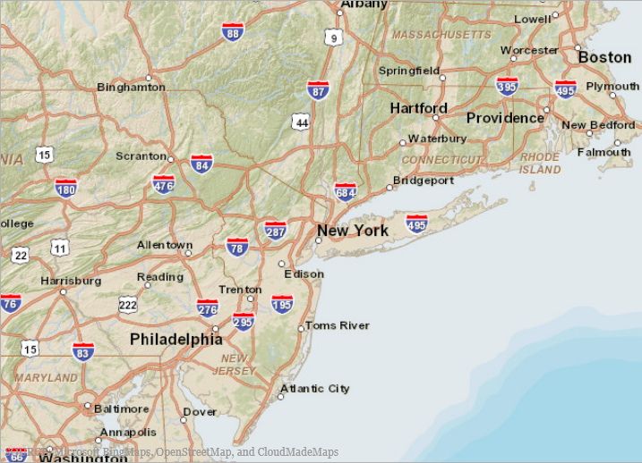

////
|metadata|
{
    "name": "xamgeographicmap-displaying-geographic-imagery-from-arcgis-online-servers",
    "controlName": ["xamGeographicMap"],
    "tags": ["Getting Started","How Do I"],
    "guid": "4f50b517-d17a-46b0-894c-cf2b2d328164",
    "buildFlags": [],
    "createdOn": "2016-05-25T18:21:56.7862092Z"
}
|metadata|
////

= Displaying Geographic Imagery from ArcGIS Online Servers

== Topic Overview

=== Purpose

This topic provides information on how to display geographic imagery from ArcGIS Online servers in the background content of the link:{ApiPlatform}controls.maps.xamgeographicmap.v{ProductVersion}~infragistics.controls.maps.xamgeographicmap_members.html[xamGeographicMap]™ control.

=== Required background

The following table lists the topics required as a prerequisite to understanding this topic.

[options="header", cols="a,a"]
|====
|Topic|Purpose

| link:xamgeographicmap-adding-xamgeographicmap-to-a-page.html[Adding xamGeographicMap to a Page] 

|This topic provides information on how to add the _xamGeographicMap_ control to an application page.

| link:xamgeographicmap-visual-elements-of-xamgeographicmap.html[Visual Elements of xamGeographicMap]
|This topic provides information about the layout of the visual elements in the _xamGeographicMap_ control

| link:xamgeographicmap-using-geographic-imagery.html[Using Geographic Imagery] 

|This topic provides an overview of rendering geographic imagery in the background content of the _xamGeographicMap_ control.

|====

=== In this topic

This topic contains the following sections:

* <<DisplayingGeographicImageryfromArcGISOnlineServers,Displaying Geographic Imagery from ArcGISOnline Servers>>

** <<Overview,Overview>>
** <<Preview,Preview>>

* <<PublicMaps,Public Maps>>

** <<Overview1,Overview>>
** <<Example1,Example>>

* <<PrivateMaps,Private Maps>>

** <<Overview2,Overview>>
** <<Credentials,Credentials>>
** <<Example2,Example>>

* <<RelatedContent,Related Content>>

[[DisplayingGeographicImageryfromArcGISOnlineServers]]
== Displaying Geographic Imagery from ArcGIS Online Servers

[[Overview]]

=== Overview

ArcGIS Online is an Esri product that allows you to create and share maps either publicly or privately. You can also access other maps created by Esri and other ArcGIS users.

You can see a list of some available public maps at the following location, *Esri Maps and Data Group* .

The _xamGeographicMap_ control displays geographic imagery from ArcGIS Online in the map background content using the link:{ApiPlatform}controls.maps.xamgeographicmap.v{ProductVersion}~infragistics.controls.maps.arcgisonlinemapimagery_members.html[ArcGISOnlineMapImagery] class.

Public maps can be displayed by setting the link:{ApiPlatform}controls.maps.xamgeographicmap.v{ProductVersion}~infragistics.controls.maps.arcgisonlinemapimagery~mapserveruri.html[MapServerUri] property of the link:{ApiPlatform}controls.maps.xamgeographicmap.v{ProductVersion}~infragistics.controls.maps.arcgisonlinemapimagery_members.html[ArcGISOnlineMapImagery] class to the map’s specified URI.

Private maps involve more configuration than simply setting the link:{ApiPlatform}controls.maps.xamgeographicmap.v{ProductVersion}~infragistics.controls.maps.arcgisonlinemapimagery~mapserveruri.html[MapServerUri]. You must use an access token either provided by the owner of the map or generated via a Username, and Password combination also provided by the owner.

[[Preview]]

=== Preview

The following screenshot is a preview of the _xamGeographicMap_ control with geographic imagery tile from map content on an ArcGIS Online server.

[[PublicMaps]]
== Public Maps

[[Overview1]]

=== Overview

The map owner can allow a map to be publicly accessible and provide the URI for that map.

In order to use geographic imagery from ArcGIS public maps, you must first obtain the map’s public URI. You must then set this map URI to the link:{ApiPlatform}controls.maps.xamgeographicmap.v{ProductVersion}~infragistics.controls.maps.arcgisonlinemapimagery_members.html[ArcGISOnlineMapImagery] object’s link:{ApiPlatform}controls.maps.xamgeographicmap.v{ProductVersion}~infragistics.controls.maps.arcgisonlinemapimagery~mapserveruri.html[MapServerUri] property.

[[Example1]]

=== Example

The following screenshot illustrates the rendering of the  _xamGeorgraphicMap_  control with the link:{ApiPlatform}controls.maps.xamgeographicmap.v{ProductVersion}~infragistics.controls.maps.xamgeographicmap~backgroundcontent.html[BackgroundContent] property set to the link:{ApiPlatform}controls.maps.xamgeographicmap.v{ProductVersion}~infragistics.controls.maps.arcgisonlinemapimagery_members.html[ArcGISOnlineMapImagery].

The link:{ApiPlatform}controls.maps.xamgeographicmap.v{ProductVersion}~infragistics.controls.maps.arcgisonlinemapimagery~mapserveruri.html[MapServerUri] property of the link:{ApiPlatform}controls.maps.xamgeographicmap.v{ProductVersion}~infragistics.controls.maps.arcgisonlinemapimagery_members.html[ArcGISOnlineMapImagery] object is set to following value:

[options="header", cols="a,a"]
|====
|*Property*|*Value*

| link:{ApiPlatform}controls.maps.xamgeographicmap.v{ProductVersion}~infragistics.controls.maps.arcgisonlinemapimagery~mapserveruri.html[MapServerUri]
|http://services.arcgisonline.com/ArcGIS/rest/services/World_Street_Map/MapServer

|====

*In XAML:* 

[source,xaml]
---- 
<ig:XamGeographicMap x:Name="GeoMap"  
                     Background="Transparent"  
                     PlotAreaBackground="Transparent">    
    <ig:XamGeographicMap.BackgroundContent>  
       <ig:ArcGISOnlineMapImagery 
           MapServerUri="http://services.arcgisonline.com/ArcGIS/rest/services/World_Street_Map/MapServer" />  
    </ig:XamGeographicMap.BackgroundContent> 
</ig:XamGeographicMap> 
----

*In C#:* 

[source,csharp]
---- 
var publicMap = new ArcGISOnlineMapImagery(); 
publicMap.MapServerUri ="http://services.arcgisonline.com/ArcGIS/rest/services/World_Street_Map/MapServer"; 
this.GeoMap.BackgroundContent = publicMap; 
---- 

*In Visual Basic:* 

[source,vb]
---- 
Dim publicMap As var = New ArcGISOnlineMapImagery
publicMap.MapServerUri ="http://services.arcgisonline.com/ArcGIS/rest/services/World_Street_Map/MapServer"
Me.GeoMap.BackgroundContent = publicMap 
---- 

[[PrivateMaps]]
== Private Maps

[[Overview2]]

=== Overview

The map owner can set their map to be private, controlling access to specific users. This map can then be accessed, either with an access token provided by the owner of the map or one generated from a Username and Password combination.

[[Credentials]]

=== Credentials

The following table summarizes the credential properties of the link:{ApiPlatform}controls.maps.xamgeographicmap.v{ProductVersion}~infragistics.controls.maps.arcgisonlinemapimagery_members.html[ArcGISOnlineMapImagery] object used for accessing the private map content on ArcGIS Online servers.

[options="header", cols="a,a,a"]
|====
|Property Name|Property Type|Descriptions

| link:{ApiPlatform}controls.maps.xamgeographicmap.v{ProductVersion}~infragistics.controls.maps.arcgisonlinemapimagery~username.html[UserName]
|String
|This property, required to generate a token, specifies the user name.

| link:{ApiPlatform}controls.maps.xamgeographicmap.v{ProductVersion}~infragistics.controls.maps.arcgisonlinemapimagery~password.html[Password]
|String
|This property, required to generate a token, specifies the password.

| link:{ApiPlatform}controls.maps.xamgeographicmap.v{ProductVersion}~infragistics.controls.maps.arcgisonlinemapimagery~usertoken.html[UserToken]
|String
|This property specifies the pre-generated token (either previously generated by the username/password combination or provided by the owner of the private map).

| link:{ApiPlatform}controls.maps.xamgeographicmap.v{ProductVersion}~infragistics.controls.maps.arcgisonlinemapimagery~refereruri.html[ReferURI]
|String
|This optional property specifies the `Referer` contained in the `WebRequest`. In the case of WPF a default value is set.

|====

[[Example2]]

=== Example

The following code example demonstrates how to set the link:{ApiPlatform}controls.maps.xamgeographicmap.v{ProductVersion}~infragistics.controls.maps.arcgisonlinemapimagery_members.html[ArcGISOnlineMapImagery] object’s properties required for a private map.

.Note
[NOTE]
====
You must replace strings set to the link:{ApiPlatform}controls.maps.xamgeographicmap.v{ProductVersion}~infragistics.controls.maps.arcgisonlinemapimagery~username.html[UserName], link:{ApiPlatform}controls.maps.xamgeographicmap.v{ProductVersion}~infragistics.controls.maps.arcgisonlinemapimagery~password.html[Password], link:{ApiPlatform}controls.maps.xamgeographicmap.v{ProductVersion}~infragistics.controls.maps.arcgisonlinemapimagery~mapserveruri.html[MapServerUri] and link:{ApiPlatform}controls.maps.xamgeographicmap.v{ProductVersion}~infragistics.controls.maps.arcgisonlinemapimagery~refereruri.html[ReferURI] properties to your own credentials and map information.
====

*In XAML:* 

[source,xaml]
---- 
<ig:ArcGISOnlineMapImagery    
   TokenGenerationEndPoint="https://www.arcgis.com/sharing/"
   IsMapPublic="False"
   UserName="USERNAME"
   Password="PASSWORD"
   DefaultTokenTimeout="65"
   MapServerUri="MAP_SERVER_URI"
   RefererUri="REFERER_URI" >  
</ig:ArcGISOnlineMapImagery> 
---- 

*In C#:* 

[source,csharp]
---- 
var privMap = new ArcGISOnlineMapImagery(); 
privMap.TokenGenerationEndPoint = "https://www.arcgis.com/sharing/"; 
privMap.IsMapPublic = false; 
privMap.UserName = "USERNAME"; 
privMap.Password = "PASSWORD"; 
privMap.DefaultTokenTimeout = 65; 
privMap.MapServerUri = "MAP_SERVER_URI"; 
privMap.RefererURI = "REFERER_URI"; 
---- 

*In Visual Basic:* 

[source,vb]
---- 
Dim privMap As var = New ArcGISOnlineMapImagery
privMap.TokenGenerationEndPoint = "https://www.arcgis.com/sharing/"
privMap.IsMapPublic = false
privMap.UserName = "USERNAME"
privMap.Password = "PASSWORD"
privMap.DefaultTokenTimeout = 65
privMap.MapServerUri = "MAP_SERVER_URI"
privMap.ReferURI = "REFERER_URI" 
---- 

[[RelatedContent]]
== Related Content

=== Topics

The following topics provide additional information related to this topic.

[options="header", cols="a,a"]
|====
|Topic|Purpose

| link:xamgeographicmap-adding-xamgeographicmap-to-a-page.html[Adding xamGeographicMap to a Page]
|This topic provides information on how to add the _xamGeographicMap_ control to an application page.

| link:xamgeographicmap-visual-elements-of-xamgeographicmap.html[Visual Elements of xamGeographicMap]
|This topic provides information about layout of map elements in the _xamGeographicMap_ control.

| link:xamgeographicmap-using-geographic-imagery.html[Using Geographic Imagery]
|This topic provides an overview of rendering geographic imagery in the background content of the _xamGeographicMap_ control

|====

ifdef::sl[]

=== Samples

ifdef::sl[]

The following sample provides additional information related to this topic.

[options="header", cols="a,a"]
|====
|Sample|Purpose

| link:{SamplesURL}/geographic-map/#/binding-geo-imagery[Binding Geo-Imagery]
|This sample demonstrates how to change background content of the Geographic Map control to external geo-spatial imagery services, including Open Street Maps, Microsoft Bing Maps, and ArcGIS Maps. This particular sample uses geo-spatial imagery tiles from Open Street Maps source. To use geo-spatial imagery tiles from ArcGIS Maps or Bing Maps sources, you must acquire a key from the respective vendor. This sample is updated in the 13.1 release to demonstrate the simplified Bing Maps interface which allows you to access Bing Maps with minimal set up and also to demonstrate how to access map content from the ArcGISOnline servers.

|====

endif::sl[]

endif::sl[]