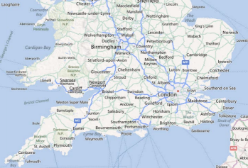

////
|metadata|
{
    "name": "xamgeographicmap-displaying-geographic-imagery-from-bing-maps",
    "controlName": ["xamGeographicMap"],
    "tags": ["Data Presentation","Extending","How Do I"],
    "guid": "d2b1d229-ef4e-4b7d-96c4-ac4d866e70e3",
    "buildFlags": [],
    "createdOn": "2016-05-25T18:21:56.7042047Z"
}
|metadata|
////

= Displaying Geographic Imagery from Bing Maps

== Topic Overview

=== Purpose

This topic provides information on displaying geographic imagery from Bing Maps in the background content of the link:{ApiPlatform}controls.maps.xamgeographicmap.v{ProductVersion}~infragistics.controls.maps.xamgeographicmap_members.html[xamGeographicMap]™ control.

=== Required background

The following table lists the topics required as a prerequisite to understanding this topic.

[options="header", cols="a,a"]
|====
|Topic|Purpose

| link:xamgeographicmap-adding-xamgeographicmap-to-a-page.html[Adding xamGeographicMap to a Page] 

|This topic provides information on how to add the _xamGeographicMap_ control to an application page.

| link:xamgeographicmap-visual-elements-of-xamgeographicmap.html[Visual Elements of xamGeographicMap]
|This topic provides information about the layout of the visual elements in the _xamGeographicMap_ control

| link:xamgeographicmap-using-geographic-imagery.html[Using Geographic Imagery] 

|This topic provides an overview of rendering geographic imagery in the background content of the _xamGeographicMap_ control.

|====

=== In this topic

This topic contains the following sections:

* <<_Ref320395369,Geographic Imagery from Bing Maps>>

** <<_Ref320193474,Overview>>
** <<_Ref320395376,Previews>>
** <<_Ref320471950,Requirements>>
** <<Example,Example>>

* <<_Ref320185294,Related Content>>

[[_Ref320395369]]
== Geographic Imagery from Bing Maps

[[_Ref320193474]]

=== Overview

Bing Maps is Microsoft’s® licensed geographic imagery mapping service. This geographic imagery service is accessible directly on the link:http://www.bing.com/maps[http://www.bing.com/maps] web site. The _xamGeographicMap_ control displays geographic imagery from Bing Maps in the map’s background content using the link:{ApiPlatform}controls.maps.xamgeographicmap.v{ProductVersion}~infragistics.controls.maps.bingmapsmapimagery.html[BingMapsMapImagery] class. However, by default the _xamGeographicMap_ control displays geographic imagery from the Open Street Maps in the map background content requiring you to configure the control to display Bing Maps’ geographic imagery. Prior to using Bing Maps’ geographic imagery, you must register and obtain a Bing Map API key rom link:http://evg-tbetts.infragistics.local:85/www.bingmapsportal.com[www.bingmapsportal.com]. You must use the Bing Maps’ API key to set the link:{ApiPlatform}controls.maps.xamgeographicmap.v{ProductVersion}~infragistics.controls.maps.bingmapsmapimagery.html[BingMapsMapImagery] object’s link:{ApiPlatform}controls.maps.xamgeographicmap.v{ProductVersion}~infragistics.controls.maps.bingmapsmapimagery~apikey.html[ApiKey] property.

Before the 13.1 release, you had to configure a REST Service to access Bing Maps and retrieve the required titles URIs. With the release of 13.1 this functionality is now built-in to the _xamGeographicMap_ control.

[[_Ref320395376]]

=== Previews

The following images are previews of the _xamGeographicMap_ control in supported map styles of geographic imagery from the Bing Maps service.

[cols="a"]
|====

|image::images/xamGeoMap_-_Displaying_Geographic_Imagery_from_Bing_Maps_2.png[] 

Bing Map imagery with *Road* style

|image::images/xamGeoMap_-_Displaying_Geographic_Imagery_from_Bing_Maps_1.png[] 

Bing Map imagery with *Aerial and Labels* style

|image::images/xamGeoMap_-_Displaying_Geographic_Imagery_from_Bing_Maps_3.png[] 

Bing Map imagery with *Aerial* style

|====

[[_Ref320471950]]

=== Requirements

In order to use geographic imagery from Bing Maps, you must first register and obtain a Map API key from the link:http:www.bingmapsportal.com[www.bingmapsportal.com] website. You must set this Bing API key as the link:{ApiPlatform}controls.maps.xamgeographicmap.v{ProductVersion}~infragistics.controls.maps.bingmapsmapimagery.html[BingMapsMapImagery] object’s link:{ApiPlatform}controls.maps.xamgeographicmap.v{ProductVersion}~infragistics.controls.maps.bingmapsmapimagery~apikey.html[ApiKey] property.

=== Property settings

The following table summarizes important members of the link:{ApiPlatform}controls.maps.xamgeographicmap.v{ProductVersion}~infragistics.controls.maps.bingmapsmapimagery.html[BingMapsMapImagery] class.

[options="header", cols="a,a,a"]
|====
|*Property* *Name*|*Property* *Type*|*Description*

| link:{ApiPlatform}controls.maps.xamgeographicmap.v{ProductVersion}~infragistics.controls.maps.bingmapsmapimagery~apikey.html[ApiKey]
|`String`
|Represents the property for setting an API key required for the Bing Maps imagery service. 

You must obtain this key from the link:http://www.bingmapsportal.com/[http://www.bingmapsportal.com] website.

| link:{ApiPlatform}controls.maps.xamgeographicmap.v{ProductVersion}~infragistics.controls.maps.bingmapsmapimagery~bingimageryresturi.html[BingImageryRestUri]
|`String`
|Represents the property for setting the Bing Imagery REST URI specifying where the TilePath and SubDomains will come from. This is an optional property, and if not specified it will use the default REST URI.

| link:{ApiPlatform}controls.maps.xamgeographicmap.v{ProductVersion}~infragistics.controls.maps.bingmapsmapimagery~culturename.html[CultureName]
|`String`
|Represents a property for setting the culture name for the tile source.

| link:{ApiPlatform}controls.maps.xamgeographicmap.v{ProductVersion}~infragistics.controls.maps.bingmapsimagerystyle.html[ImageryStyle]
| link:{ApiPlatform}controls.maps.xamgeographicmap.v{ProductVersion}~infragistics.controls.maps.bingmapsimagerystyle.html[BingMapsImageryStyle]
|Represents the property for setting the Bing Maps imagery tiles map style. This property can be set to the following link:{ApiPlatform}controls.maps.xamgeographicmap.v{ProductVersion}~infragistics.controls.maps.bingmapsimagerystyle.html[BingMapsImageryStyle] enumeration values: 

* Aerial - Specifies the Aerial map style without road or labels overlay 

* AerialWithLabels - Specifies the Aerial map style with road and labels overlay 

* Road - Specifies the Roads map style without Aerial overlay 

| link:{ApiPlatform}controls.maps.xamgeographicmap.v{ProductVersion}~infragistics.controls.maps.bingmapsmapimagery~isdeferredload.html[IsDeferredLoad]
|`Boolean`
|Represents the property that specifies whether or not the Bing Maps service should auto-initialized upon the assignment of valid property values.

| link:{ApiPlatform}controls.maps.xamgeographicmap.v{ProductVersion}~infragistics.controls.maps.bingmapsmapimagery~isinitialized.html[IsInitialized]
|`Boolean`
|Represents the property that is set to True occurs when geographic imagery tiles from Bing Maps service have been initialized and they are ready for rendering in the _xamGeographicMap_ control.

| link:{ApiPlatform}controls.maps.xamgeographicmap.v{ProductVersion}~infragistics.controls.maps.bingmapsmapimagery~subdomains.html[SubDomains]
|`ObservableCollection<string>`
|Represents an image collection of URI subdomains

| link:{ApiPlatform}controls.maps.xamgeographicmap.v{ProductVersion}~infragistics.controls.maps.bingmapsmapimagery~tilepath.html[TilePath]
|`String`
|Represents t property that sets the map tile image URI, this is the actual location of the Bing Maps

|====

=== Example

The screenshot following this table illustrates how to display geographic imagery from Bing Maps in the background content of the _xamGeographicMap_ control. This is accomplished by configuring the _xamGeographicMap_ control as follows:

[options="header", cols="a,a"]
|====
|*Property*|* Value*

| link:{ApiPlatform}controls.maps.xamgeographicmap.v{ProductVersion}~infragistics.controls.maps.xamgeographicmap~backgroundcontent.html[BackgroundContent]
|BingMapsMapImagery

| link:{ApiPlatform}controls.maps.xamgeographicmap.v{ProductVersion}~infragistics.controls.maps.bingmapsimagerystyle.html[ImageryStyle]
|Road

| link:{ApiPlatform}controls.maps.xamgeographicmap.v{ProductVersion}~infragistics.controls.maps.bingmapsmapimagery~apikey.html[ApiKey]
|Bing Map API key

|====

Following is the code used in implementing this example:

.Note
[NOTE]
====
You must replace those strings set to the `ApiKey` property with your own Bing Map API key.
====
 
*In XAML:* 

[source,xaml]
---- 
<ig:XamGeographicMap Name="igMap">
   <ig:XamGeographicMap.BackgroundContent>
      <ig:BingMapsMapImagery ImageryStyle="Road"
                    ApiKey="API_KEY" />
   </ig:XamGeographicMap.BackgroundContent>
</ig:XamGeographicMap>
---- 

*In Visual Basic:* 

[source,vb]
---- 
Dim igMap As XamGeographicMap
Dim bingMaps as BingMapsMapImagery
bingMaps.ImageryStyle = BingMapsImageryStyle.Aerial
bingMaps.ApiKey = "API_KEY"igMap.BackgroundContent = bingMaps
---- 

*In C#:* 

[source,csharp]
---- 
var igMap = new xamGeographicMap
var bingMaps = new BingMapsMapImagery();
bingMaps.ImageryStyle = BingMapsImageryStyle.Aerial; 
bingMaps.ApiKey = "API_KEY";
igMap.BackgroundContent = bingMaps;
---- 
 

[[_Ref320185294]]
== Related Content

=== Topics

The following topics provide additional information related to this topic.

[options="header", cols="a,a"]
|====
| *Topic* | *Purpose* 

| link:xamgeographicmap-adding-xamgeographicmap-to-a-page.html[Adding xamGeographicMap]
|This topic provides information on how to bind geographic imagery in the _xamGeographicMap_ control.

| link:xamgeographicmap-displaying-geographic-imagery-from-open-street-maps.html[Displaying Geographic Imagery from Open Street Maps]
|This topic provides information on how to display geographic imagery from Open Street Maps service in the _xamGeographicMap_ control.

|====