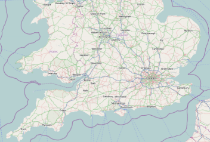

////
|metadata|
{
    "name": "xamgeographicmap-displaying-geographic-imagery-from-open-street-maps",
    "controlName": ["xamGeographicMap"],
    "tags": ["Data Binding","Getting Started","How Do I"],
    "guid": "5245febf-18b1-4851-b3e0-8d6531293036",
    "buildFlags": [],
    "createdOn": "2016-05-25T18:21:56.7102054Z"
}
|metadata|
////

= Displaying Geographic Imagery from Open Street Maps

== Topic Overview

=== Purpose

This topic provides information on how to display geographic imagery from Open Street Maps in the background content of the link:{ApiPlatform}controls.maps.xamgeographicmap.v{ProductVersion}~infragistics.controls.maps.xamgeographicmap_members.html[xamGeographicMap]™ control.

=== Required background

The following table lists the topics required as a prerequisite to understanding this topic.

[options="header", cols="a,a"]
|====
|Topic|Purpose

| link:xamgeographicmap-adding-xamgeographicmap-to-a-page.html[Adding xamGeographicMap to a Page]
|This topic provides information on how to add the _xamGeographicMap_ control to an application page.

| link:xamgeographicmap-visual-elements-of-xamgeographicmap.html[Visual Elements of xamGeographicMap] 

|This topic provides information about layout of map elements in the _xamGeographicMap_ control.

| link:xamgeographicmap-using-geographic-imagery.html[Using Geographic Imagery]
|This topic provides an overview of rendering geographic imagery in the background content of the _xamGeographicMap_ control.

|====

=== In this topic

This topic contains the following sections:

* <<_Ref320388672,Geographic Imagery from Open Street Maps>>

** <<_Ref320193474,Overview>>
** <<_Ref320388681,Preview>>
** <<_Ref320388684,Example>>

* <<_Ref320185294,Related Content>>

[[_Ref320388672]]
== Geographic Imagery from Open Street Maps

[[_Ref320193474]]

=== Overview

The Open Street Maps is a free geographic imagery mapping service created collaboratively by OpenStreetMap© contributors from around the world. It provides geographic imagery tiles of the world only in road map style without any configuration options. This geographic imagery service can be accessed directly on link:http://www.openstreetmap.org/[www.openstreetmap.org] web site.

By the default, the _xamGeographicMap_ control displays geographic imagery from the Open Street Maps in the map background content using the link:{ApiPlatform}controls.maps.xamgeographicmap.v{ProductVersion}~infragistics.controls.maps.openstreetmapimagery_members.html[OpenStreetMapImagery] class. Therefore, there is no need to configure the control to display geographic imagery from the Open Street Maps.

[[_Ref320388681]]

=== Preview

The following image is a preview of the _xamGeographicMap_ control with geographic imagery tile from the Open Street Maps service.

[[_Ref320388684]]

=== Example

This code example explicitly sets link:{ApiPlatform}controls.maps.xamgeographicmap.v{ProductVersion}~infragistics.controls.maps.xamgeographicmap~backgroundcontent.html[BackgroundContent] of the _xamGeographicMap_ control to the link:{ApiPlatform}controls.maps.xamgeographicmap.v{ProductVersion}~infragistics.controls.maps.openstreetmapimagery_members.html[OpenStreetMapImagery] object which provides geographic imagery tile from the Open Street Maps.

*In XAML:*

[source,xaml]
----
<ig:XamGeographicMap x:Name="GeoMap">
    <ig:XamGeographicMap.BackgroundContent>
        <ig:OpenStreetMapImagery />
    </ig:XamGeographicMap.BackgroundContent>
</ig:XamGeographicMap>
----

*In Visual Basic:*

[source,vb]
----
Dim geoMap As New XamGeographicMap()
Me.geoMap.BackgroundContent = New OpenStreetMapImagery()
----

*In C#:*

[source,csharp]
----
XamGeographicMap geoMap = new XamGeographicMap();
this.GeoMap.BackgroundContent = new OpenStreetMapImagery();
----

[[_Ref320185294]]
== Related Content

=== Topics

The following topics provide additional information related to this topic.

[options="header", cols="a,a"]
|====
| *Topic* | *Purpose* 

| link:xamgeographicmap-adding-xamgeographicmap-to-a-page.html[Adding xamGeographicMap to a Page]
|This topic provides information on how to bind geographic imagery in the _xamGeographicMap_ control.

| link:xamgeographicmap-visual-elements-of-xamgeographicmap.html[Visual Elements of xamGeographicMap] 

|This topic provides information about layout of map elements in the _xamGeographicMap_ control.

| link:xamgeographicmap-displaying-geographic-imagery-from-bing-maps.html[Displaying Geographic Imagery from Bing Maps]
|This topic provides information on how to display geographic imagery from Bing Maps service in the _xamGeographicMap_ control.

|====