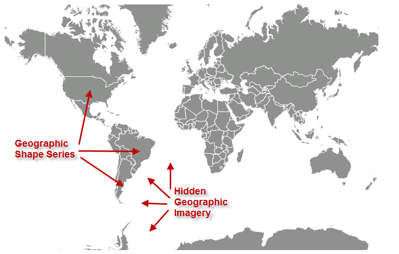

////

|metadata|
{
    "name": "xamgeographicmap-hiding-geographic-imagery-in-map-background-content",
    "controlName": ["xamGeographicMap"],
    "tags": ["Data Presentation","How Do I"],
    "guid": "cddf4fe4-7b8e-4e5a-94e6-8e6ebc0fbfa3",  
    "buildFlags": [],
    "createdOn": "2016-05-25T18:21:56.7162054Z"
}
|metadata|
////

= Hiding Geographic Imagery in Map Background Content

== Topic Overview

=== Purpose

This topic provides information on how to hide geographic imagery in the background content of the link:{ApiPlatform}controls.maps.xamgeographicmap.v{ProductVersion}~infragistics.controls.maps.xamgeographicmap_members.html[xamGeographicMap]™ control.

=== Required background

The following table lists the topics required as a prerequisite to understanding this topic.

[options="header", cols="a,a"]
|====
|Topic|Purpose

| link:xamgeographicmap-adding-xamgeographicmap-to-a-page.html[Adding xamGeographicMap to a Page]
|This topic provides information on how to add the _xamGeographicMap_ control to an application page.

| link:xamgeographicmap-visual-elements-of-xamgeographicmap.html[Visual Elements of xamGeographicMap] 

|This topic provides information about layout of map elements in the _xamGeographicMap_ control.

| link:xamgeographicmap-using-geographic-imagery.html[Using Geographic Imagery]
|This topic provides an overview of rendering geographic imagery in the background content of the _xamGeographicMap_ control.

| link:xamgeographicmap-using-geographic-series.html[Using Geographic Series]
|This topic provides information on how to use geographic series in the _xamGeographicMap_ control.

|====

=== In this topic

This topic contains the following sections:

* <<_Ref320388672,Geographic Imagery from Open Street Maps>>

** <<_Ref320193474,Overview>>
** <<_Ref320388681,Preview>>
** <<_Ref320388684,Example>>

* <<_Ref320185294,Related Content>>

[[_Ref320388672]]
== Map Background Content

[[_Ref320193474]]

=== Overview

By the default, the _xamGeographicMap_ control displays geographic imagery from the Open Street Maps in the map background content using the link:{ApiPlatform}controls.maps.xamgeographicmap.v{ProductVersion}~infragistics.controls.maps.openstreetmapimagery_members.html[OpenStreetMapImagery] class. However, there might be scenarios (for example, geographic shape series with detailed shape files of the world) where geo-spatial data from shape files provides enough geographic contexts and geographic imagery is not desired in the map background content.

[[_Ref320388681]]

=== Preview

The following image is a preview of the _xamGeographicMap_ control with hidden geographic imagery in the map background content.

[[_Ref320388684]]

=== Example

This code example hides geographic imagery by setting the _xamGeographicMap_ control’s link:{ApiPlatform}controls.maps.xamgeographicmap.v{ProductVersion}~infragistics.controls.maps.xamgeographicmap~backgroundcontent.html[BackgroundContent] to a null value.

*In XAML:*

[source,xaml]
----
<ig:XamGeographicMap x:Name="GeoMap" BackgroundContent="{x:Null}">
    <ig:XamGeographicMap.Series>
        <!-- add geographic series here -->
    </ig:GeographicShapeSeries>
</ig:XamGeographicMap>
----

*In Visual Basic:*

[source,vb]
----
Dim geoMap As New XamGeographicMap()
Me.geoMap.BackgroundContent = Nothing
----

*In C#:*

[source,csharp]
----
XamGeographicMap geoMap = new XamGeographicMap();
this.GeoMap.BackgroundContent = null;
----

[[_Ref320185294]]
== Related Content

=== Topics

The following topics provide additional information related to this topic.

[options="header", cols="a,a"]
|====
| *Topic* | *Purpose* 

| link:xamgeographicmap-adding-xamgeographicmap-to-a-page.html[Adding xamGeographicMap to a Page]
|This topic provides information on how to bind geographic imagery in the _xamGeographicMap_ control.

| link:xamgeographicmap-visual-elements-of-xamgeographicmap.html[Visual Elements of xamGeographicMap] 

|This topic provides information about layout of map elements in the _xamGeographicMap_ control.
 
| link:xamgeographicmap-using-geographic-series.html[Using Geographic Series]
|This topic provides information on how to use geographic series in the _xamGeographicMap_ control.

|====