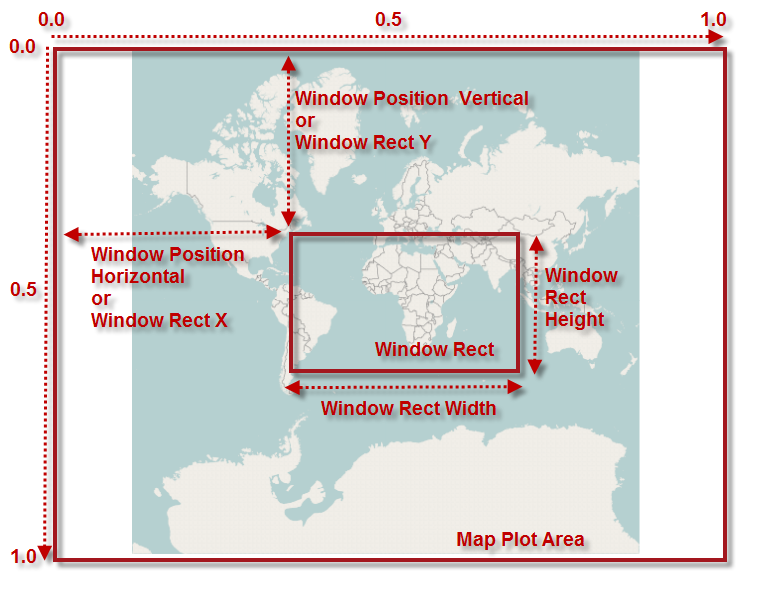
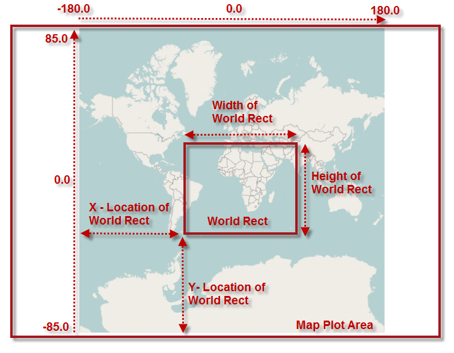

////
|metadata|
{
    "name": "xamgeographicmap-navigating-map-content-using-code",
    "controlName": ["xamGeographicMap"],
    "tags": ["How Do I","Navigation"],
    "guid": "b5ce189f-b011-4f21-a34b-5a58566a125d",
    "buildFlags": [],
    "createdOn": "2016-05-25T18:21:56.7272057Z"
}
|metadata|
////

= Navigating Map Content Using Code

== Topic Overview

=== Purpose

This topic provides information about navigating the map content in the link:{ApiPlatform}controls.maps.xamgeographicmap.v{ProductVersion}~infragistics.controls.maps.xamgeographicmap_members.html[xamGeographicMap]™ control using code.

=== Required background

The following table lists the topics required as a prerequisite to understanding this topic.

[options="header", cols="a,a"]
|====
|Topic|Purpose

| link:xamgeographicmap-visual-elements-of-xamgeographicmap.html[Visual Elements of xamGeographicMap] 

|This topic provides information about layout of map elements in the _xamGeographicMap_ control.

| link:xamgeographicmap-navigating-map-content.html[Navigating Map Content]
|This topic provides conceptual information about navigating map content in the _xamGeographicMap_ control as well as all supported navigation features of the control.

|====

=== In This Topic

This topic contains the following sections:

* <<_Ref320554189,Map Navigation>>

** <<_Ref320573436,Overview>>
** <<_Ref320787194,Window navigation system>>
** <<_Ref320787228,World navigation system>>

* <<_Ref320573442,Map Navigation Features>>
* <<_Ref320185294,Related Content>>

[[_Ref320554189]]
== Map Navigation

[[_Ref320573436]]

=== Overview

In the _xamGeographicMap_ control, there are two navigation techniques for navigating the map content using code. The first technique allows map navigation using window navigation system and the second one using world navigation system.

* Window Navigation System
* World Navigation System

The _xamGeographicMap_ control provides methods for converting values between both navigation systems. These methods are explained in the <<_Ref320573406,Examples>> section of this topic.

[[_Ref320573428]]

=== Window navigation system

The window navigation system consists of properties for setting position and size of link:{ApiPlatform}controls.charts.xamdatachart.v{ProductVersion}~infragistics.controls.seriesviewer~windowrect.html[WindowRect] – a map view in window coordinates. In this navigation system values can be set between 0 and 1 for properties of the map window view.

The following image is a preview of _xamGeographicMap_ control with highlighted position and size of the link:{ApiPlatform}controls.charts.xamdatachart.v{ProductVersion}~infragistics.controls.seriesviewer~windowrect.html[WindowRect] when zoomed to some region of the map content (for example, Africa and Europe continents).

The following table summarizes properties for setting position and size of map window in the _xamGeographicMap_ control.

[options="header", cols="a,a,a"]
|====
|Property|Type|Description

| link:{ApiPlatform}controls.charts.xamdatachart.v{ProductVersion}~infragistics.controls.seriesviewer~windowrect.html[WindowRect]
|
|Specifies position and size of the map window - currently viewable area of the map content in window coordinates and the anchor point is located in the top left corner of the window rect.

| link:{ApiPlatform}controls.charts.xamdatachart.v{ProductVersion}~infragistics.controls.seriesviewer~windowpositionhorizontal.html[WindowPositionHorizontal]
|double
|Specifies horizontal position of the map window’s anchor point from the left edge of the _xamGeographicMap_ control. It is equivalent to value stored in the Left of the link:{ApiPlatform}controls.charts.xamdatachart.v{ProductVersion}~infragistics.controls.seriesviewer~windowrect.html[WindowRect] property.

| link:{ApiPlatform}controls.charts.xamdatachart.v{ProductVersion}~infragistics.controls.seriesviewer~windowpositionvertical.html[WindowPositionVertical]
|double
|Specifies vertical position of the map window’s anchor point from the top edge of the _xamGeographicMap_ control. It is equivalent to value stored in the Top of the link:{ApiPlatform}controls.charts.xamdatachart.v{ProductVersion}~infragistics.controls.seriesviewer~windowrect.html[WindowRect] property.

|====

[[_Ref320573431]]

=== World navigation system

The world navigation system consists of properties for setting position and size of the link:{ApiPlatform}controls.maps.xamgeographicmap.v{ProductVersion}~infragistics.controls.maps.xamgeographicmap~worldrect.html[WorldRect] – a map view in geographic coordinates. In this navigation system values can be set between -180 and 180 for longitude properties of the link:{ApiPlatform}controls.maps.xamgeographicmap.v{ProductVersion}~infragistics.controls.maps.xamgeographicmap~worldrect.html[WorldRect] and values between -85 and 85 for latitude properties of the link:{ApiPlatform}controls.maps.xamgeographicmap.v{ProductVersion}~infragistics.controls.maps.xamgeographicmap~worldrect.html[WorldRect] view.

The following image is a preview of _xamGeographicMap_ control with highlighted position and size of the link:{ApiPlatform}controls.maps.xamgeographicmap.v{ProductVersion}~infragistics.controls.maps.xamgeographicmap~worldrect.html[WorldRect] when zoomed to some region of the map content (for example, Africa and Europe continents).

The following table summarizes properties for setting position and size of map window in the _xamGeographicMap_ control.

[options="header", cols="a,a,a"]
|====
|Property|Type|Description

| link:{ApiPlatform}controls.maps.xamgeographicmap.v{ProductVersion}~infragistics.controls.maps.xamgeographicmap~worldrect.html[WorldRect]
|
|Specifies position and size of the map navigation bounds – an area of the map content in world geographic coordinates within map navigation is allowed.

|====

[[_Ref320554189]]
[[_Ref320573442]]
== Map Navigation Features

[[_Ref320573406]]

=== Examples

The following table summarizes code navigation features supported in the _xamGeographicMap_ control

[options="header", cols="a,a"]
|====
|*The user can…*|*Using* *Code** …*

|Zoom in the map content
|*In C#:* 

[source,csharp]
---- 
// zoom in to the center of map by factor of 0.1 
var widthScale = (0.1 * this.GeoMap.WindowRect.Width); 
var heightScale = (0.1 * this.GeoMap.WindowRect.Height); 
var x = this.GeoMap.WindowRect.X + (widthScale / 2); 
var y = this.GeoMap.WindowRect.Y + (heightScale / 2);
var w = this.GeoMap.WindowRect.Width - widthScale; 
var h = this.GeoMap.WindowRect.Height - heightScale; 
this.GeoMap.WindowRect = new Rect(x, y, w, h);
---- 

*In Visual Basic:*

[source,vb]
---- 
' zoom in to the center of map by factor of 0.1 
Dim widthScale = (0.1 * Me.GeoMap.WindowRect.Width) 
Dim heightScale = (0.1 * Me.GeoMap.WindowRect.Height) 
Dim x = Me.GeoMap.WindowRect.X + (widthScale / 2) 
Dim y = Me.GeoMap.WindowRect.Y + (heightScale / 2) 
Dim w = Me.GeoMap.WindowRect.Width - widthScale 
Dim h = Me.GeoMap.WindowRect.Height - heightScale 
Me.GeoMap.WindowRect = New Rect(x, y, w, h) 
---- 

|Zoom out the map content
|*In C#:* 

[source,csharp]
---- 
// zoom out the map by factor of 0.1 
var widthScale = (0.1 * this.GeoMap.WindowRect.Width); 
var heightScale = (0.1 * this.GeoMap.WindowRect.Height); 
var x = this.GeoMap.WindowRect.X - (widthScale / 2); 
var y = this.GeoMap.WindowRect.Y - (heightScale / 2); 
var w = this.GeoMap.WindowRect.Width + widthScale;
var h = this.GeoMap.WindowRect.Height + heightScale; 
this.GeoMap.WindowRect = new Rect(x, y, w, h);
---- 

*In Visual Basic:*

[source,vb]
---- 
' zoom out the map by factor of 0.1 
Dim widthScale = (0.1 * Me.GeoMap.WindowRect.Width) 
Dim heightScale = (0.1 * Me.GeoMap.WindowRect.Height) 
Dim x = Me.GeoMap.WindowRect.X - (widthScale / 2) 
Dim y = Me.GeoMap.WindowRect.Y - (heightScale / 2) 
Dim w = Me.GeoMap.WindowRect.Width + widthScale 
Dim h = Me.GeoMap.WindowRect.Height + heightScale 
Me.GeoMap.WindowRect = New Rect(x, y, w, h) 
---- 

|Zoom to an area of the map content
|*In C#:* 

[source,csharp]
---- 
// zoom to map area using map window coordinates 
this.GeoMap.WindowRect = new Rect(0.2, 0.3, 0.6, 0.4); 
---- 

*In Visual Basic:*

[source,vb]
---- 
' zoom to map area using map window coordinates 
Me.GeoMap.WindowRect = New Rect(0.2, 0.3, 0.6, 0.4) 
---- 

|Zoom to geographic region of the map content
|*In C#:* 

[source,csharp]
---- 
// zoom to map area using world geographic coordinates 
var geoRegion = new Rect(-30, -40, 120, 80);
this.GeoMap.WindowRect = this.GeoMap.GetZoomFromGeographic(geoRegion); 
---- 

*In Visual Basic:*

[source,vb]
---- 
' zoom to map area using world geographic coordinates 
Dim geoRegion = New Rect(-30, -40, 120, 80) 
Me.GeoMap.WindowRect = Me.GeoMap.GetZoomFromGeographic(geoRegion)
---- 

|Fit the map content to viewable area
|*In C#:* 

[source,csharp]
---- 
// fit map content to maximum vieable area using map window coordinates this.GeoMap.WindowRect = new Rect(0.0, 0.0, 1.0, 1.0); 
// fit map content to maximum vieable area using world geographic coordinates 
var geoRegion = new Rect(-180, -75, 360, 150); 
this.GeoMap.WindowRect = this.GeoMap.GetZoomFromGeographic(geoRegion); 
---- 

*In Visual Basic:*

[source,vb]
---- 
' fit map content to maximum vieable area using map window coordinates 
Me.GeoMap.WindowRect = New Rect(0.0, 0.0, 1.0, 1.0) 
' fit map content to maximum vieable area using world geographic coordinates
Dim geoRegion = New Rect(-180, -75, 360, 150) 
Me.GeoMap.WindowRect = Me.GeoMap.GetZoomFromGeographic(geoRegion)
---- 

|Bind the map content to geographic regions
|*In C#:* 

[source,csharp]
---- 
// bound and limit navigation of the map content to geographic region
this.GeoMap.WorldRect = new Rect(-30, -40, 120, 80); 
---- 

*In Visual Basic:*

[source,vb]
---- 
' bound and limit navigation of the map content to geographic region 
Me.GeoMap.WorldRect = New Rect(-30, -40, 120, 80) 
---- 

|Pan the map content
|*In C#:* 

[source,csharp]
---- 
// pan left (west direction) by factor of 0.05 
this.GeoMap.WindowPositionHorizontal = this.GeoMap.WindowRect.X - 0.05; 
// pan right (east direction) by factor of 0.05 
this.GeoMap.WindowPositionHorizontal = this.GeoMap.WindowRect.X + 0.05; 
// pan up (north direction) by factor of 0.05
this.GeoMap.WindowPositionVertical = this.GeoMap.WindowRect.Y - 0.05; 
// pan down (south direction) by factor of 0.05 
this.GeoMap.WindowPositionVertical = this.GeoMap.WindowRect.Y + 0.05; 
---- 

*In Visual Basic:*

[source,vb]
---- 
' pan left (west direction) by factor of 0.05 
Me.GeoMap.WindowPositionHorizontal = Me.GeoMap.WindowRect.X - 0.05 
' pan right (east direction) by factor of 0.05 
Me.GeoMap.WindowPositionHorizontal = Me.GeoMap.WindowRect.X + 0.05 
' pan up (north direction) by factor of 0.05 
Me.GeoMap.WindowPositionVertical = Me.GeoMap.WindowRect.Y - 0.05 
' pan down (south direction) by factor of 0.05 
Me.GeoMap.WindowPositionVertical = Me.GeoMap.WindowRect.Y + 0.05
---- 

|====

[[_Ref320185294]]
== Related Content

=== Topics

The following topics provide additional information related to this topic.

[options="header", cols="a,a"]
|====
| *Topic* | *Purpose* 

| link:xamgeographicmap-visual-elements-of-xamgeographicmap.html[Visual Elements of xamGeographicMap] 

|This topic provides information about layout of map elements in the _xamGeographicMap_ control.

| link:xamgeographicmap-navigating-map-content.html[Navigating Map Content]
|This topic provides conceptual information about navigating map content in the _xamGeographicMap_ control as well as all supported navigation features of the control.

| link:xamgeographicmap-navigating-map-content-using-keyboard.html[Navigating Map Content Using Keyboard]
|This topic provides information about navigating the map content in the _xamGeographicMap_ control using inputs from a keyboard.

| link:xamgeographicmap-navigating-map-content-using-a-mouse.html[Navigating Map Content Using a Mouse]
|This topic provides information about navigating the map content in the _xamGeographicMap_ control using inputs from a mouse.

|====