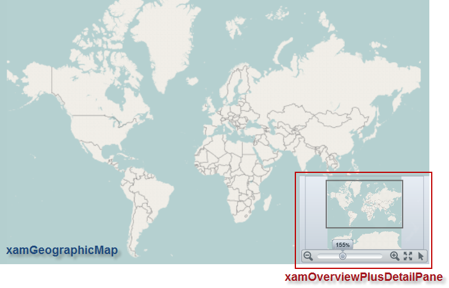
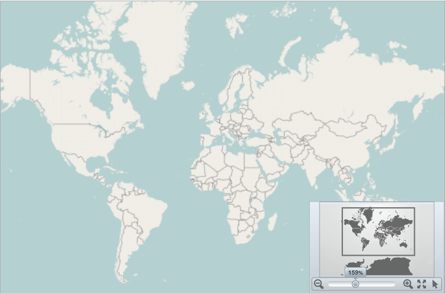
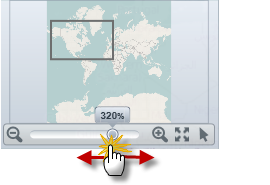
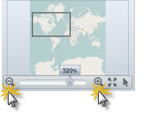
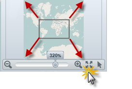
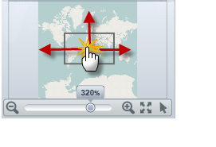
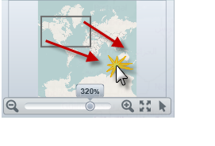
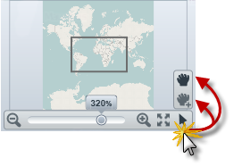

////

|metadata|
{
    "name": "xamgeographicmap-navigating-map-content-using-overview-plus-detail-pane",
    "controlName": ["xamGeographicMap"],
    "tags": ["Getting Started","How Do I"],
    "guid": "3d4e485b-43af-4936-8eeb-28bce2bc443f",  
    "buildFlags": [],
    "createdOn": "2016-05-25T18:21:56.7452067Z"
}
|metadata|
////

= Navigating Map Content Using Overview Plus Detail Pane

== Topic Overview

=== Purpose

This topic provides information how to use the link:{ApiPlatform}datavisualization.v{ProductVersion}~infragistics.controls.xamoverviewplusdetailpane_members.html[xamOverviewPlusDetailPane]™ control to navigate map content in the link:{ApiPlatform}controls.maps.xamgeographicmap.v{ProductVersion}~infragistics.controls.maps.xamgeographicmap_members.html[xamGeographicMap]™ control.

=== Required background

The following table lists the topics required as a prerequisite to understanding this topic.

[options="header", cols="a,a"]
|====
|Topic|Purpose

| link:xamgeographicmap.html[xamGeographicMap]
|This topic provides an overview of key features in the `xamGeographicMap` control.

| link:xamgeographicmap-navigating-map-content.html[Navigating Map Content]
|This topic provides conceptual information about navigating map content in the `xamGeographicMap` control as well as all supported navigation features of the control.

|====

=== In this topic

This topic contains the following sections

* <<_Ref321140025, Displaying Map Overview Pane >>

** <<_Ref320185129,Introduction>>
** <<_Ref321140031,Preview>>
** <<_Ref321140034,Example>>

* <<Thumbnail, Changing Thumbnail image in Map Overview Pane >>

** <<_Ref320185129,Introduction>>
** <<_Ref321140031,Preview>>
** <<_Ref321140034,Example>>

* <<_Ref321140037, Interacting with Map Overview Pane >>
* <<_Ref321140041, User interactions summary >>

** <<_Ref321140043,Zooming a map incrementally>>
** <<_Ref321140046,Zooming a map to specific zoom level>>
** <<_Ref321140051,Resetting a map to 100% zoom level>>
** <<_Ref321140055,Panning a map in all directions>>
** <<_Ref321140058,Panning to a specific region of a map>>
** <<_Ref321140062,Changing mouse drag interaction with a map>>

* <<_Ref320185294, Related Content >>

[[_Ref321140025]]
== Displaying Map Overview Pane

[[_Ref320185129]]

=== Introduction

In the _xamGeographicMap_ control, an overview of map content is represented by the xamOverviewPlusDetailPane control. This control provides a thumbnail of the world as well as navigation functionalities.

[[_Ref321140031]]

=== Preview

The following is a preview of the  _xamOverviewPlusDetailPane_   control with an overview of the _xamGeographicMap_ control displaying the world.

[[_Ref321140034]]

=== Example

The following code demonstrates how to display the xamOverviewPlusDetailPane control in the lower right corner of the _xamGeographicMap_ control.

.Note:
[NOTE]
====
More layout locations of OPD control can be achieved by setting a style with custom margins for the xamOverviewPlusDetailPane control to the link:{ApiPlatform}controls.maps.xamgeographicmap.v{ProductVersion}~infragistics.controls.maps.xamgeographicmap~overviewplusdetailpanestyle.html[OverviewPlusDetailPaneStyle] property of map control.
====

*In XAML:*

[source,xaml]
----
<ig:XamGeographicMap x:Name="map" 
 OverviewPlusDetailPaneVisibility="Visible" 
 OverviewPlusDetailPaneHorizontalAlignment="Right" 
 OverviewPlusDetailPaneVerticalAlignment="Bottom"> 
</ig:XamGeographicMap>
----

*In Visual Basic:*

[source,vb]
----
Dim map As New XamGeographicMap()
map.OverviewPlusDetailPaneHorizontalAlignment = HorizontalAlignment.Right
map.OverviewPlusDetailPaneVerticalAlignment = VerticalAlignment.Bottom
map.OverviewPlusDetailPaneVisibility = Visibility.Visible
----

*In C#:*

[source,csharp]
----
XamGeographicMap map = new XamGeographicMap();
map.OverviewPlusDetailPaneHorizontalAlignment = HorizontalAlignment.Right;
map.OverviewPlusDetailPaneVerticalAlignment = VerticalAlignment.Bottom;
map.OverviewPlusDetailPaneVisibility = Visibility.Visible;
----

[[Thumbnail]]

== Changing Thumbnail Image in Map Overview Pane

=== Introduction

The `xamGeographicMap` control displays a preview of the world as a static image in the `xamOverviewPlusDetailPane` control. The default image was captured from the geographic imagery provided by the Open Street Maps service. For more information on the geographic imagery, please refer to the link:xamgeographicmap-using-geographic-imagery.html[Using Geographic Imagery] topic.

.Note:
[NOTE]
====
At present, the `xamGeographicMap` control does not support a preview of geographic series in the `xamOverviewPlusDetailPane` control. However, you can capture a screenshot of the geographic series rendered in the `xamGeographicMap` control and used as a thumbnail image in the `xamOverviewPlusDetailPane` control.
====

=== Preview

The following is a preview of the `xamGeographicMap` control with overridden style for the `xamOverviewPlusDetailPane` control that provides a custom static image as thumbnail of the map content.

=== Example

Use the link:{ApiPlatform}controls.maps.xamgeographicmap.v{ProductVersion}~infragistics.controls.maps.xamgeographicmap~overviewplusdetailpanestyle.html[OverviewPlusDetailPaneStyle] property for the purpose of changing thumbnail of the map content as well as other properties of the `xamOverviewPlusDetailPane` control.

.Note:
[NOTE]
====
In order to fill content the `xamOverviewPlusDetailPane` control, the thumbnail image should have 16:10 aspect ratio between width and height (e.g. 320 x 200 pixels).
====

The following code demonstrates how to apply a style of the `xamOverviewPlusDetailPane` type with desired thumbnail image to the `xamGeographicMap` control.

*In XAML:*

[source,xaml]
----
<ig:XamGeographicMap.OverviewPlusDetailPaneStyle>
      
            </Setter.Value> 
        </Setter>
    </Style>
</ig:XamGeographicMap.OverviewPlusDetailPaneStyle>
----

[[_Ref321140037]]
== Interacting with Map Overview Pane

[[_Ref321140041]]

=== User interactions summary

The following table summarizes the user interaction capabilities of the `xamOverviewPlusDetailPane` control.

[options="header", cols="a,a,a"]
|====
|The user can…|Using…|Details

|Zoom a map incrementally
|The mouse scroll wheel or zoom in/out buttons of the `xamOverviewPlusDetailPane` control.
|Clicking on the zoom in/out buttons of the `xamOverviewPlusDetailPane` control or scrolling mouse wheel over the preview area zooms in/out the map content.

|Zoom a map to a specific zoom level
|The zoom slider of the `xamOverviewPlusDetailPane` control.
|Changing the zoom slider of the `xamOverviewPlusDetailPane` control zooms in/out the map content to a specific zoom level.

|Reset a map to 100% zoom level
|The zoom reset button of the `xamOverviewPlusDetailPane` control.
|Clicking on the zoom reset button of the `xamOverviewPlusDetailPane` control, resets the map to its 100% zoom level.

|Pan a map in all directions
|The window rectangle of the `xamOverviewPlusDetailPane` control.
|Dragging the window rectangle in preview area of the `xamOverviewPlusDetailPane` control, pans the map content in a given direction.

|Pan to a specific region of a map
|The preview area of the `xamOverviewPlusDetailPane` control.
|Clicking outside of the window rectangle in preview area of the `xamOverviewPlusDetailPane` control, pans the map content to map region where the mouse cursor was clicked.

|Change mouse drag interaction with a map
|The cursor button of the `xamOverviewPlusDetailPane` control.
|Clicking on the cursor button of the `xamOverviewPlusDetailPane` control, changes mouse drag interaction with map to pan on mouse dragging or to zoom on mouse dragging interactions.

|====

[[_Ref321140046]]

=== Zooming a map to a specific zoom level

The following picture illustrates how to zoom content of the map to a specific zoom level using the zoom slider of the `xamOverviewPlusDetailPane` control.

[[_Ref321140043]]

=== Zooming a map incrementally

The following picture illustrates how to zoom content of the map incrementally using the mouse zoom in/out buttons located on both side of the `xamOverviewPlusDetailPane` control’s zoom slider.

[[_Ref321140051]]

=== Resetting a map to 100% zoom level

The following picture illustrates how to reset content of the map to 100% zoom level using the zoom reset button of the `xamOverviewPlusDetailPane` control.

[[_Ref321140055]]

=== Panning a map in all directions

The following picture illustrates how to pan content of the map in all directions using the window rectangle of the `xamOverviewPlusDetailPane` control.

[[_Ref321140058]]

=== Panning to a specific region of a map

The following picture illustrates how to pan content of the map to a specific region of a map using the window rectangle of the `xamOverviewPlusDetailPane` control.

[[_Ref321140062]]

=== Changing mouse drag interaction with a map

The following picture illustrates how to change a mouse drag interaction with a map using the cursor button of the `xamOverviewPlusDetailPane` control.

[[_Ref320185294]]
== Related Content

=== Topics

The following topics provide additional information related to this topic.

[options="header", cols="a,a"]
|====
| *Topic* | *Purpose* 

| link:xamgeographicmap-navigating-map-content.html[Navigating Map Content]
|This topic provides conceptual information about navigating map content in the `xamGeographicMap` control as well as all supported navigation features of the control.

| link:xamgeographicmap-navigating-map-content-using-a-mouse.html[Navigating Map Content Using a Mouse]
|This topic provides information about navigating the map content in the `xamGeographicMap` control using inputs from a mouse.

| link:xamgeographicmap-using-geographic-imagery.html[Using Geographic Imagery]
|This topic provides an overview of rendering geographic imagery in the background content of the `xamGeographicMap` control.

|====