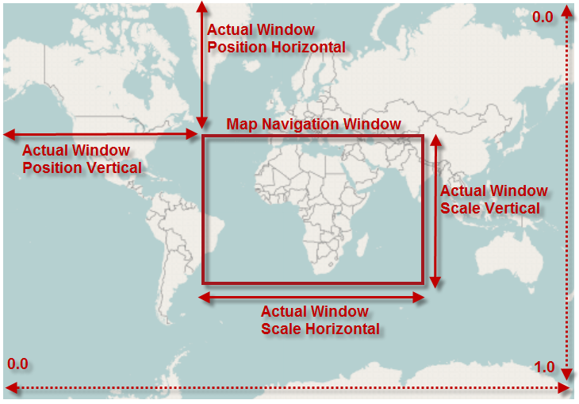

////

|metadata|
{
    "name": "xamgeographicmap-navigating-map-content",
    "controlName": ["xamGeographicMap"],
    "tags": ["How Do I","Navigation"],
    "guid": "b9095d42-f890-4d0b-b7af-d123964e572f",  
    "buildFlags": [],
    "createdOn": "2016-05-25T18:21:56.7222057Z"
}
|metadata|
////

= Navigating Map Content

== Topic Overview

=== Purpose

This topic provides conceptual information about navigating map content in the link:{ApiPlatform}controls.maps.xamgeographicmap{ApiVersion}~infragistics.controls.maps.xamgeographicmap_members.html[xamGeographicMap]™ control as well as all supported navigation features of the control.

=== Required background

The following table lists the topics required as a prerequisite to understanding this topic.

[options="header", cols="a,a"]
|====
|Topic|Purpose

| link:xamgeographicmap-visual-elements-of-xamgeographicmap.html[Visual Elements of xamGeographicMap] 

|This topic provides information about layout of map elements in the _xamGeographicMap_ control.

|====

=== In This Topic

This topic contains the following sections:

* <<_Ref320573147,Map Navigation>>
* <<_Ref320573152,Map Navigation Window>>
* <<_Ref320573096,Map Navigation Features>>
* <<_Ref320185294,Related Content>>

[[_Ref320573147]]
== Map Navigation

=== Overview

The _xamGeographicMap_ control inherits navigation functionalities from link:{ApiPlatform}controls.charts.xamdatachart{ApiVersion}~infragistics.controls.seriesviewer_members.html[SeriesViewer] control which is also used in the  _xamDataChart_   control.

Navigation in the _xamGeographicMap_ control is enabled by default and it allows zooming and panning of the map content. However, this behavior can be changed using the link:{ApiPlatform}controls.maps.xamgeographicmap{ApiVersion}~infragistics.controls.maps.xamgeographicmap~zoomable.html[Zoomable] property. It is important to know that the _xamGeographicMap_ control allows only synchronized zooming - scaling the map content with preserved aspect ratio. As result, it is not possible to scale the map content vertically without scaling it also horizontally and vice versa.

[[_Ref320572996]]
[[_Ref320573152]]
== Map Navigation Window

In the _xamGeographicMap_ control, navigation window represents currently viewable area of the map content. The link:{ApiPlatform}controls.charts.xamdatachart{ApiVersion}~infragistics.controls.seriesviewer~actualwindowrect.html[ActualWindowRect] property tracks position and size of the navigation window. Each time panning or zooming operation is performed in the in the _xamGeographicMap_ control, the navigation window changes and the link:{ApiPlatform}controls.charts.xamdatachart{ApiVersion}~infragistics.controls.seriesviewer~actualwindowrect.html[ActualWindowRect] property is updated with new values.

The following table summarizes properties used to track navigation window the in the _xamGeographicMap_ control:

[options="header", cols="a,a,a,a"]
|====
|Property|Type|Description|Default Value

| link:{ApiPlatform}controls.charts.xamdatachart{ApiVersion}~infragistics.controls.seriesviewer~actualwindowrect.html[ActualWindowRect]
| link:http://msdn.microsoft.com/en-us/library/system.windows.rect.aspx[Rect]
|Indicates position and size of the navigation window which indicates currently viewable area of the map content in the _xamGeographicMap_ control.
|0, 0, 1, 1 

Displays the entire map content in the navigation window.

| link:{ApiPlatform}controls.charts.xamdatachart{ApiVersion}~infragistics.controls.seriesviewer~actualwindowpositionhorizontal.html[ActualWindowPositionHorizontal]
|double
|Indicates horizontal position of the navigation window’s anchor point from the left edge of the _xamGeographicMap_ control. It is equivalent to value stored in the Left of the link:{ApiPlatform}controls.charts.xamdatachart{ApiVersion}~infragistics.controls.seriesviewer~actualwindowrect.html[ActualWindowRect] property.
|0 

Displays the left portion of the map content in the navigation window.

| link:{ApiPlatform}controls.charts.xamdatachart{ApiVersion}~infragistics.controls.seriesviewer~actualwindowpositionvertical.html[ActualWindowPositionVertical]
|double
|Indicates vertical position of the navigation window’s anchor point from the top edge of the _xamGeographicMap_ control. It is equivalent to value stored in the Top of the link:{ApiPlatform}controls.charts.xamdatachart{ApiVersion}~infragistics.controls.seriesviewer~actualwindowrect.html[ActualWindowRect] property.
|0 

Displays the top portion of the map content in the navigation window.

| link:{ApiPlatform}controls.maps.xamgeographicmap{ApiVersion}~infragistics.controls.maps.xamgeographicmap~actualwindowscale.html[ActualWindowScale]
|double
|Indicates size of the navigation window in of the _xamGeographicMap_ control. It is equivalent to value stored in the link:{ApiPlatform}controls.charts.xamdatachart{ApiVersion}~infragistics.controls.seriesviewer~actualwindowrect.html[ActualWindowRect] property.
|1 

Displays the entire horizontal map content in the navigation window.

|====

The following image is a preview of _xamGeographicMap_ control with position and size of the navigation window highlighted when the control was zoomed to some region of the map content (for example, Africa continent).

[[_Ref320573096]]
== Map Navigation Features

The following table summarizes navigation features supported in the _xamGeographicMap_ control.

[options="header", cols="a,a"]
|====
|Navigation Feature|Description

|Panning in all map directions
|Allows users basic panning of the map content in all directions using combination of mouse and keyboard inputs. Functionality of this feature is described in the following topics: 

* link:xamgeographicmap-navigating-map-content-using-a-mouse.html[Navigating Map Content Using a Mouse] 

* link:xamgeographicmap-navigating-map-content-using-keyboard.html[Navigating Map Content Using Keyboard] 

|Fit the map content to viewable area of the map.
|Allows users to scale the map content to fit viewable area of the _xamGeographicMap_ control using keyboard inputs or in code-behind. Functionality of this feature is described in the following topics: 

* link:xamgeographicmap-navigating-map-content-using-code.html[Navigating Map Content Using Code] 

* link:xamgeographicmap-navigating-map-content-using-keyboard.html[Navigating Map Content Using Keyboard] 

|Zooming in and out
|Allows users basic zooming in and out of the map content using combination of mouse and keyboard inputs. Functionality of this feature is described in the following topics: 

* link:xamgeographicmap-navigating-map-content-using-code.html[Navigating Map Content Using Code] 

* link:xamgeographicmap-navigating-map-content-using-keyboard.html[Navigating Map Content Using Keyboard] 

* link:xamgeographicmap-navigating-map-content-using-a-mouse.html[Navigating Map Content Using a Mouse] 

|Zooming to map area
|Allows users to zoom the map content to an area of the map using combination of mouse and keyboard inputs. Functionality of this feature is described in the following topics: 

* link:xamgeographicmap-navigating-map-content-using-code.html[Navigating Map Content Using Code] 

* link:xamgeographicmap-navigating-map-content-using-a-mouse.html[Navigating Map Content Using a Mouse] 

|Zooming to geographic regions
|Allows you to implement custom navigation actions to zoom the map content to geographic regions of the map in code-behind. Functionality of this feature is described in the following topics: 

link:xamgeographicmap-navigating-map-content-using-code.html[Navigating Map Content Using Code]

|Bound the map content geographic regions
|Allows you to bound and limit navigation of the map content to geographic regions of the map in code-behind. Functionality of this feature is described in the following topics: 

link:xamgeographicmap-navigating-map-content-using-code.html[Navigating Map Content Using Code]

|====

[[_Ref320185294]]
== Related Content

=== Topics

The following topics provide additional information related to this topic.

[options="header", cols="a,a"]
|====
| *Topic* | *Purpose* 

| link:xamgeographicmap-visual-elements-of-xamgeographicmap.html[Visual Elements of xamGeographicMap] 

|This topic provides information about layout of map elements in the _xamGeographicMap_ control.

| link:xamgeographicmap-navigating-map-content-using-keyboard.html[Navigating Map Content Using Keyboard]
|This topic provides information about navigating the map content in the _xamGeographicMap_ control using inputs from a keyboard.

| link:xamgeographicmap-navigating-map-content-using-a-mouse.html[Navigating Map Content Using a Mouse]
|This topic provides information about navigating the map content in the _xamGeographicMap_ control using inputs from a mouse.

| link:xamgeographicmap-navigating-map-content-using-code.html[Navigating Map Content Using Code]
|This topic provides information about navigating the map content in the _xamGeographicMap_ control using code.

| link:xamgeographicmap-navigating-map-content-using-overview-plus-detail-pane.html[Navigating Map Content Using Overview Plus Detail Pane]
|This topic provides information how to use the _xamOverviewPlusDetailPane_™ control to navigate map content in the _xamGeographicMap_ control.

|====