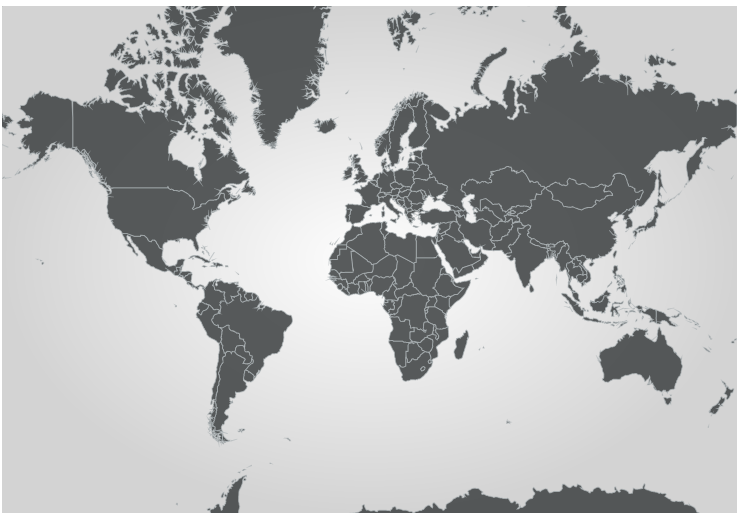
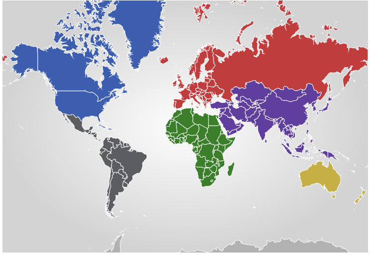

////
|metadata|
{
    "name": "xamgeographicmap-styling-shapes-in-geographic-series",
    "controlName": ["xamGeographicMap"],
    "tags": ["Data Presentation","How Do I","Styling"],
    "guid": "8c050783-d1dc-4d73-b396-de6d09f4601c",
    "buildFlags": [],
    "createdOn": "2016-05-25T18:21:56.7512075Z"
}
|metadata|
////

= Styling Shapes in Geographic Series

== Topic Overview

=== Purpose

This topic provides information on how to style shapes of geographic series in the link:{ApiPlatform}controls.maps.xamgeographicmap{ApiVersion}~infragistics.controls.maps.xamgeographicmap_members.html[xamGeographicMap] control.

=== Required background

The following table lists the topics required as a prerequisite to understanding this topic.

[options="header", cols="a,a"]
|====
|Topic|Purpose

| link:xamgeographicmap-shape-files-reference.html[Shape Files Reference]
|This topic provides resources with information about maps, shape files, and geo-spatial related material. Use these resources to learn about and obtain geo-spatial shape files as well as tools for their editing.

| link:xamgeographicmap-binding-shape-files-with-geospatial-data.html[Binding Shape Files with Geo-spatial Data]
|This topic provides information on how to bind shape files with geo-spatial data to the _xamGeographicMap_ control.

| link:xamgeographicmap-using-geographic-series.html[Using Geographic Series]
|This topic provides information about supported types of geographic series in the _xamGeographicMap_ control.

|====

=== In this topic

This topic contains the following sections:

* <<_Ref320651776, Introduction >>
* <<_RefExamples, Code Examples >>
* <<_Ref320833482, Code Example: Applying a Style to Shapes of Geographic Series >> 

* <<_Ref320833487, Code Example: Applying a Style Selector to Shapes of Geographic Series >> 

* <<_Ref320185294, Related Content >>

[[_Ref320651776]]
=== Introduction

In the _xamGeographicMap_ control, shapes are visual elements that represent polygons or polylines in a geographic context. These shapes are defined by a data column mapped to the link:{ApiPlatform}controls.maps.xamgeographicmap{ApiVersion}~infragistics.controls.maps.geographicshapeseriesbase~shapememberpath.html[ShapeMemberPath] property of geographic series.

The following types of geographic series support shapes:

* link:{ApiPlatform}controls.maps.xamgeographicmap{ApiVersion}~infragistics.controls.maps.geographicshapeseries_members.html[GeographicShapeSeries]
* link:{ApiPlatform}controls.maps.xamgeographicmap{ApiVersion}~infragistics.controls.maps.geographicpolylineseries_members.html[GeographicPolylineSeries]

The following table summarized properties for styling shape elements in geographic series:

[options="header", cols="a,a"]
|====
|Property|Description

| link:{ApiPlatform}controls.charts.xamdatachart{ApiVersion}~infragistics.controls.charts.series~brush.html[Brush]
|Specifies a brush for rendering fill of shape elements.

| link:{ApiPlatform}controls.charts.xamdatachart{ApiVersion}~infragistics.controls.charts.series~outline.html[Outline]
|Specifies a brush for rendering stroke of shape elements.
 
| link:{ApiPlatform}controls.maps.xamgeographicmap{ApiVersion}~infragistics.controls.Maps.GeographicShapeSeries~ShapeStyle.html[ShapeStyle]
|Specifies a style for rendering shape elements.

| link:{ApiPlatform}controls.maps.xamgeographicmap{ApiVersion}~infragistics.controls.Maps.GeographicShapeSeries~ShapeStyleSelector.html[ShapeStyleSelector]
|Specifies a style selector that randomly or conditionally selects a style for rendering shape elements

|====

[[_RefExamples]]
== Examples
The following table lists the code examples included in this topic.

[options="header", cols="a,a"]
|====
|Example|Description

| Applying a Style to Shapes of Geographic Series
|Demonstrates how to apply a style to shapes elements using the link:{ApiPlatform}controls.maps.xamgeographicmap{ApiVersion}~infragistics.controls.Maps.GeographicShapeSeries~ShapeStyle.html[ShapeStyle] property of geographic series.

| Applying a Style Selector to Shapes of Geographic Series
|Demonstrates how to apply a style selector with conditional rules for rendering shape elements using the link:{ApiPlatform}controls.maps.xamgeographicmap{ApiVersion}~infragistics.controls.Maps.GeographicShapeSeries~ShapeStyleSelector.html[ShapeStyleSelector] property of geographic series.
 
|Specifies a style selector that randomly or conditionally selects a style for rendering shape elements

|====
 

=== Code Example: Applying a Style to Shapes of Geographic Series

The link:https://msdn.microsoft.com/en-us/library/system.windows.style.targettype.aspx[TargetType] property of a link:https://msdn.microsoft.com/en-us/library/system.windows.style.aspx[Style] applied to the link:{ApiPlatform}controls.maps.xamgeographicmap{ApiVersion}~infragistics.controls.Maps.GeographicShapeSeries~ShapeStyle.html[ShapeStyle] property must match the type of shape elements used by geographic series.

The following table maps the types geographic series to expected types of shape elements:

[options="header", cols="a,a"]
|====
|Geographic Series|Target Type

|link:{ApiPlatform}controls.maps.xamgeographicmap{ApiVersion}~infragistics.controls.Maps.GeographicPolylineSeries.html[GeographicPolylineSeries].link:{ApiPlatform}controls.maps.xamgeographicmap{ApiVersion}~infragistics.controls.Maps.GeographicPolylineSeries~ShapeStyle.html[ShapeStyle] 
|Path

|link:{ApiPlatform}controls.maps.xamgeographicmap{ApiVersion}~infragistics.controls.Maps.GeographicShapeSeries.html[GeographicShapeSeries].link:{ApiPlatform}controls.maps.xamgeographicmap{ApiVersion}~infragistics.controls.Maps.GeographicShapeSeries~ShapeStyle.html[ShapeStyle] 
|Path

|link:{ApiPlatform}controls.maps.xamgeographicmap{ApiVersion}~infragistics.controls.Maps.GeographicShapeControlSeries.html[GeographicShapeControlSeries].link:{ApiPlatform}controls.maps.xamgeographicmap{ApiVersion}~infragistics.controls.Maps.GeographicShapeControlSeries~ShapeStyle.html[ShapeStyle] 
|ShapeControl
 
  

|====

The following is a preview of the _xamGeographicMap_ with a style applied to shape elements of geographic series.

*In XAML:*

[source,xaml]
----
<ig:XamGeographicMap x:Name="GeoMap">
    <ig:XamGeographicMap.Series>
        <ig:GeographicShapeSeries x:Name="geoSeries" >
           <ig:GeographicShapeSeries.ShapeStyle>
                 
           </ig:GeographicShapeSeries.ShapeStyle>
        </ig:GeographicShapeSeries>
    </ig:XamGeographicMap.Series>
</ig:XamGeographicMap>
----

*In Visual Basic:*

[source,vb]
----
Dim style = New Style(typeof(Path));
style.Setters.Add(new Setter(Path.FillProperty, "#E2444748"))
style.Setters.Add(new Setter(Path.StrokeProperty, "#B1B0B7BA"))
style.Setters.Add(new Setter(Path.StrokeThicknessProperty, 1))
Dim geoSeries = New GeographicShapeSeries()
geoSeries.ShapeStyle = style 
Me.GeoMap.Series.Add(geoSeries)
----

*In C#:*

[source,csharp]
----
var style = new Style(typeof(Path));
style.Setters.Add(new Setter(Path.FillProperty, "#E2444748"));
style.Setters.Add(new Setter(Path.StrokeProperty, "#B1B0B7BA"));
style.Setters.Add(new Setter(Path.StrokeThicknessProperty, 1));
var geoSeries = new GeographicShapeSeries();
geoSeries.ShapeStyle = style; 
this.GeoMap.Series.Add(geoSeries);
----

=== Code Example: Applying a Style Selector to Shapes of Geographic Series

The following table summarizes types of style selector that can be applied to the link:{ApiPlatform}controls.maps.xamgeographicmap{ApiVersion}~infragistics.controls.Maps.GeographicShapeSeries~ShapeStyleSelector.html[ShapeStyleSelector] property of a geographic series.
 
[options="header", cols="a,a"]
|====
|Geographic Series|Target Type
 

|link:{ApiPlatform}controls.maps.XamGeographicMap{ApiVersion}~infragistics.controls.Charts.RandomFillStyleSelector.html[RandomFillStyleSelector]
|Provides rendering fill of shape elements using a collection of brushes set to the Brushes property.

|link:{ApiPlatform}controls.maps.XamGeographicMap{ApiVersion}~infragistics.controls.Charts.RandomSelectStyleSelector.html[RandomSelectStyleSelector] 
|Provides a random rendering of shape elements using a collection of Style objects set to the Styles property.

|link:{ApiPlatform}controls.maps.XamGeographicMap{ApiVersion}~infragistics.controls.Charts.ConditionalStyleSelector.html[ConditionalStyleSelector] 
|Provides conditional rendering of shape elements using a collection of ConditionalStyleRule objects set to the Rules property.
 
  

|====

The following is a preview of the _xamGeographicMap_ with conditional styling of shape elements of geographic series.

The following code applies the ConditionalStyleSelector with conditional rules for rendering shape elements based on values of data items bound to the ItemsSource property of the GeographicShapeSeries.

*In XAML:*

[source,xaml]
----
<ig:XamGeographicMap x:Name="GeoMap">
    <ig:XamGeographicMap.Resources>      
        
        
        
        
        
        
     </ig:XamGeographicMap.Resources>
    <ig:XamGeographicMap.Series>
        <ig:GeographicShapeSeries 
            ItemsSource="{StaticResource shapeFileSource}"
            ShapeMemberPath="Points">
            <ig:GeographicShapeSeries.ShapeStyleSelector>
               <ig:ConditionalStyleSelector>
                    <ig:ConditionalStyleSelector.Rules>
                        <ig:EqualToConditionalStyleRule ValueMemberPath="Fields[REGION]" ComparisonValue="Asia" StyleToApply="{StaticResource shapeAsiaStyle}" />
                        <ig:EqualToConditionalStyleRule ValueMemberPath="Fields[REGION]" ComparisonValue="Europe" StyleToApply="{StaticResource shapeEuropeStyle}" />
                        <ig:EqualToConditionalStyleRule ValueMemberPath="Fields[REGION]" ComparisonValue="Africa" StyleToApply="{StaticResource shapeAfricaStyle}" />
                        <ig:EqualToConditionalStyleRule ValueMemberPath="Fields[REGION]" ComparisonValue="North America" StyleToApply="{StaticResource shapeNorthAmericaStyle}" />
                        <ig:EqualToConditionalStyleRule ValueMemberPath="Fields[REGION]" ComparisonValue="Latin America" StyleToApply="{StaticResource shapeLatinAmericaStyle}" />
                        <ig:EqualToConditionalStyleRule ValueMemberPath="Fields[REGION]" ComparisonValue="Australia" StyleToApply="{StaticResource shapeAustraliaStyle}" />
                    </ig:ConditionalStyleSelector.Rules>
                </ig:ConditionalStyleSelector>
            </ig:GeographicShapeSeries.ShapeStyleSelector>
        </ig:GeographicShapeSeries>
    </ig:XamGeographicMap.Series>
</ig:XamGeographicMap>
----

*In Visual Basic:*

[source,vb]
----
Dim shapeAsiaStyle = New Style(typeof(Path))
style.Setters.Add(New Setter(Path.FillProperty, "#FF5F3E9D"))
style.Setters.Add(New Setter(Path.StrokeProperty, "White")) 
Dim shapeEuropeStyle = New Style(typeof(Path))
style.Setters.Add(New Setter(Path.FillProperty, "#FFBF3D3D"))
style.Setters.Add(New Setter(Path.StrokeProperty, "White")) 
Dim shapeAfricaStyle = New Style(typeof(Path))
style.Setters.Add(New Setter(Path.FillProperty, "#FF3B7F2A"))
style.Setters.Add(New Setter(Path.StrokeProperty, "White")) 
Dim shapeNorthAmericaStyle = New Style(typeof(Path))
style.Setters.Add(New Setter(Path.FillProperty, "#FF3D5DAF"))
style.Setters.Add(New Setter(Path.StrokeProperty, "White")) 
Dim shapeLatinAmericaStyle = New Style(typeof(Path))
style.Setters.Add(New Setter(Path.FillProperty, "#FFC6B046"))
style.Setters.Add(New Setter(Path.StrokeProperty, "White")) 
Dim shapeAustraliaStyle = New Style(typeof(Path))
style.Setters.Add(New Setter(Path.FillProperty, "#FFC6B046"))
style.Setters.Add(New Setter(Path.StrokeProperty, "White")) 

Dim selector = New ConditionalStyleSelector()
selector.Rules.Add(New EqualToConditionalStyleRule { ValueMemberPath = "Fields[REGION]", ComparisonValue = "Asia", StyleToApply = shapeAsiaStyle } )
selector.Rules.Add(New EqualToConditionalStyleRule { ValueMemberPath = "Fields[REGION]", ComparisonValue = "Europe", StyleToApply = shapeEuropeStyle });
selector.Rules.Add(New EqualToConditionalStyleRule { ValueMemberPath = "Fields[REGION]", ComparisonValue = "Africa", StyleToApply = shapeAfricaStyle })
selector.Rules.Add(New EqualToConditionalStyleRule { ValueMemberPath = "Fields[REGION]", ComparisonValue = "North America", StyleToApply = shapeNorthAmericaStyle })
selector.Rules.Add(New EqualToConditionalStyleRule { ValueMemberPath = "Fields[REGION]", ComparisonValue = "Latin America", StyleToApply = shapeLatinAmericaStyle })
selector.Rules.Add(New EqualToConditionalStyleRule { ValueMemberPath = "Fields[REGION]", ComparisonValue = "Australia", StyleToApply = shapeAustraliaStyle })

var geoSeries = New GeographicShapeSeries()
geoSeries.StyleSelector = selector
GeoMap.Series.Add(geoSeries)
----

*In C#:*

[source,csharp]
----

var shapeAsiaStyle = new Style(typeof(Path));
style.Setters.Add(new Setter(Path.FillProperty, "#FF5F3E9D"));
style.Setters.Add(new Setter(Path.StrokeProperty, "White")); 
var shapeEuropeStyle = new Style(typeof(Path));
style.Setters.Add(new Setter(Path.FillProperty, "#FFBF3D3D"));
style.Setters.Add(new Setter(Path.StrokeProperty, "White")); 
var shapeAfricaStyle = new Style(typeof(Path));
style.Setters.Add(new Setter(Path.FillProperty, "#FF3B7F2A"));
style.Setters.Add(new Setter(Path.StrokeProperty, "White")); 
var shapeNorthAmericaStyle = new Style(typeof(Path));
style.Setters.Add(new Setter(Path.FillProperty, "#FF3D5DAF"));
style.Setters.Add(new Setter(Path.StrokeProperty, "White"));
var shapeLatinAmericaStyle = new Style(typeof(Path));
style.Setters.Add(new Setter(Path.FillProperty, "#FFC6B046"));
style.Setters.Add(new Setter(Path.StrokeProperty, "White"));
var shapeAustraliaStyle = new Style(typeof(Path));
style.Setters.Add(new Setter(Path.FillProperty, "#FFC6B046"));
style.Setters.Add(new Setter(Path.StrokeProperty, "White"));

var selector = new ConditionalStyleSelector();
selector.Rules.Add(new EqualToConditionalStyleRule { ValueMemberPath = "Fields[REGION]", ComparisonValue = "Asia", StyleToApply = shapeAsiaStyle } );
selector.Rules.Add(new EqualToConditionalStyleRule { ValueMemberPath = "Fields[REGION]", ComparisonValue = "Europe", StyleToApply = shapeEuropeStyle }); 
selector.Rules.Add(new EqualToConditionalStyleRule { ValueMemberPath = "Fields[REGION]", ComparisonValue = "Africa", StyleToApply = shapeAfricaStyle });
selector.Rules.Add(new EqualToConditionalStyleRule { ValueMemberPath = "Fields[REGION]", ComparisonValue = "North America", StyleToApply = shapeNorthAmericaStyle });
selector.Rules.Add(new EqualToConditionalStyleRule { ValueMemberPath = "Fields[REGION]", ComparisonValue = "Latin America", StyleToApply = shapeLatinAmericaStyle });
selector.Rules.Add(new EqualToConditionalStyleRule { ValueMemberPath = "Fields[REGION]", ComparisonValue = "Australia", StyleToApply = shapeAustraliaStyle });

var geoSeries = new GeographicShapeSeries();
geoSeries.StyleSelector = selector; 
GeoMap.Series.Add(geoSeries);
----

[[_Ref320185294]]
== Related Content

=== Topics

The following topics provide additional information related to this topic.

[options="header", cols="a,a"]
|====
|Topic|Purpose
 
| link:xamgeographicmap-shape-files-reference.html[Shape Files Reference]
|This topic provides resources with information about maps, shape files, and geo-spatial related material. Use these resources to learn about and obtain geo-spatial shape files as well as tools for their editing.

| link:xamgeographicmap-binding-shape-files-with-geospatial-data.html[Binding Shape Files with Geo-spatial Data]
|This topic provides information on how to bind shape files with geo-spatial data to the _xamGeographicMap_ control.

| link:xamgeographicmap-using-geographic-series.html[Using Geographic Series]
|This topic provides information about supported types of geographic series in the _xamGeographicMap_ control.

|====