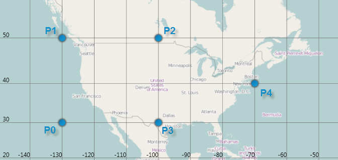
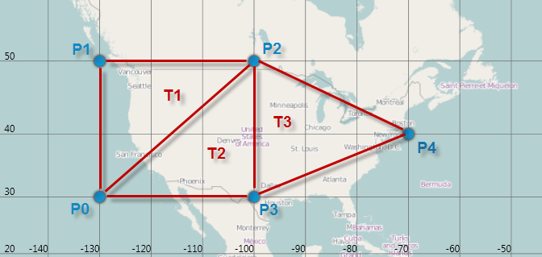

////
|metadata|
{
    "name": "xamgeographicmap-triangulating-geographic-data",
    "controlName": ["xamGeographicMap"],
    "tags": ["Getting Started","How Do I","Performance"],
    "guid": "55cfeef0-7c0b-459b-958b-3984bec1b35d",
    "buildFlags": [],
    "createdOn": "2016-05-25T18:21:56.7622078Z"
}
|metadata|
////

= Triangulating Geographic Data

== Topic Overview

=== Purpose

This topic provides information on how triangulation of data points works as well as how it can improve the performance of rendering data in the link:{ApiPlatform}controls.maps.xamgeographicmap.v{ProductVersion}~infragistics.controls.maps.xamgeographicmap_members.html[xamGeographicMap]™ control.

=== Required background

The following table lists the topics required as a prerequisite to understanding this topic.

[options="header", cols="a,a"]
|====
|Topic|Purpose

| link:xamgeographicmap-binding-shape-files-with-geospatial-data.html[Binding Shape Files with Geo-spatial Data]
|This topic provides information on how to bind shape files with geo-spatial data to the `xamGeographicMap` control.

| link:xamgeographicmap-shape-files-reference.html[Shape Files Reference]
|This topic provides resources about maps and geo-spatial related material as well as information about shape files. Use these resources to learn about and obtain shape files as well as tools for their editing before starting to bind geo-spatial data to the `xamGeographicMap` control.

|====

=== In this topic

This topic contains the following sections

* <<_Ref335170748, Understanding Triangulation >>
** <<_Ref320185129,Introduction>>
** <<_Ref335170769,Triangulation Source>>
** <<_Ref335170772,Triangulation Files>>
** <<_Ref335170776,Triangulation Methods>>
** <<_Ref335170779,Pre-Triangulation Process>>

* <<_Ref335170156, Creating Triangulation from Shape Files >>
** <<_Ref335170799,Overview>>
** <<_Ref335170804,Example>>

* <<_Ref335170185, Saving Triangulation to an ITF file >>
** <<_Ref335170830,Overview>>
** <<_Ref335170832,Example>>

* <<_Ref335170196, Loading Triangulation from an ITF file >>
** <<_Ref335170868,Overview>>
** <<_Ref335170871,Example>>

* <<_Ref320185294, Related Content >>

[[_Ref335170748]]
== Understanding Triangulation

[[_Ref320185129]]

=== Introduction

Triangulation is a process of triangulating data points with the same values based on their longitude and latitude locations. Consider the following simplified scenario of triangulating data in a geographic context:

The following is a screenshot of (-130, 30), (-130, 50), (-100, 50), (-100, 30), (-70, 40) geographic locations plotted using the link:{ApiPlatform}controls.maps.xamgeographicmap.v{ProductVersion}~infragistics.controls.maps.geographicscatterareaseries_members.html[GeographicScatterAreaSeries].

For the above five points, there are three triangles and their triangle vertex indices are as follows: (0, 1, 2), (0, 2, 3), (2, 3, 4).

The following image shows these triangles and their vertex indices.

[[_Ref335170769]]

=== Triangulation Source

In the `xamGeographicMap` control, the link:{ApiPlatform}datavisualization.v{ProductVersion}~infragistics.controls.charts.triangulationsource_members.html[TriangulationSource] class represents the data source for creating, loading, and saving triangulation. A complete data structure for link:{ApiPlatform}datavisualization.v{ProductVersion}~infragistics.controls.charts.triangulationsource_members.html[TriangulationSource] consist of two properties that are listed in the following table:

[options="header", cols="a,a,a"]
|====
|Property Name|Property Type|Description

| link:{ApiPlatform}datavisualization.v{ProductVersion}~infragistics.controls.charts.triangulationsource~points.html[Points]
|ObservableCollection< link:{ApiPlatform}datavisualization.v{ProductVersion}~infragistics.controls.charts.triangulationsourcepointrecord_members.html[TriangulationSourcePointRecord]>
|Gets or sets a collection of link:{ApiPlatform}datavisualization.v{ProductVersion}~infragistics.controls.charts.triangulationsourcepointrecord_members.html[TriangulationSourcePointRecord] objects that store points combined with numeric values from which triangulation is created..

| link:{ApiPlatform}datavisualization.v{ProductVersion}~infragistics.controls.charts.triangulationsource~triangles.html[Triangles]
|ObservableCollection< link:{ApiPlatform}datavisualization.v{ProductVersion}~infragistics.controls.charts.triangle_members.html[Triangle]>
|Gets or sets a collection of link:{ApiPlatform}datavisualization.v{ProductVersion}~infragistics.controls.charts.triangle_members.html[Triangle] objects that store three indices with each one corresponding to a point in the link:{ApiPlatform}datavisualization.v{ProductVersion}~infragistics.controls.charts.triangulationsource~points.html[Points] collection.

|====

The link:{ApiPlatform}datavisualization.v{ProductVersion}~infragistics.controls.charts.triangulationsourcepointrecord_members.html[TriangulationSourcePointRecord] class represents one of the triangle points in triangulation. The following table lists key properties of the link:{ApiPlatform}datavisualization.v{ProductVersion}~infragistics.controls.charts.triangulationsourcepointrecord_members.html[TriangulationSourcePointRecord] class.

[options="header", cols="a,a,a"]
|====
|Property Name|Property Type|Description

| link:{ApiPlatform}datavisualization.v{ProductVersion}~infragistics.controls.charts.triangulationsourcepointrecord~point.html[Point]
|Point
|Gets or sets a point that represents a two dimensional (2-D) location of one of triangle points.

|Value
|float
|Gets or sets a value associated with a one of triangle points.

|====

The link:{ApiPlatform}datavisualization.v{ProductVersion}~infragistics.controls.charts.triangle_members.html[Triangle] class represents a record with three integer values or triangle vertex indices. Each integer is an index which corresponds to a point in the link:{ApiPlatform}datavisualization.v{ProductVersion}~infragistics.controls.charts.triangulationsource~points.html[Points] collection. The following table lists key properties of the link:{ApiPlatform}datavisualization.v{ProductVersion}~infragistics.controls.charts.triangle_members.html[Triangle] class.

[options="header", cols="a,a,a"]
|====
|Property Name|Property Type|Description

| link:{ApiPlatform}datavisualization.v{ProductVersion}~infragistics.controls.charts.triangle~v1.html[V1]
|integer
|Gets or sets an index of the first vertex of a triangle.

| link:{ApiPlatform}datavisualization.v{ProductVersion}~infragistics.controls.charts.triangle~v2.html[V2]
|integer
|Gets or sets an index of the second vertex of a triangle.

| link:{ApiPlatform}datavisualization.v{ProductVersion}~infragistics.controls.charts.triangle~v3.html[V3]
|integer
|Gets or sets an index of the third vertex of a triangle.

|====

[[_Ref335170772]]

=== Triangulation Files

Triangulation data can also be stored in triangulation files that use the Intermediate Triangular Irregular Network Format (or ITF for short). For more information on this file format and its specifications, please visit this link:http://vterrain.org/Implementation/Formats/ITF.html[website].

[[_Ref335170776]]

=== Triangulation Methods

The link:{ApiPlatform}datavisualization.v{ProductVersion}~infragistics.controls.charts.triangulationsource_members.html[TriangulationSource] class provides methods for creating triangulation, saving and loading triangulation data to and from ITF files.

The following table lists key methods in the link:{ApiPlatform}datavisualization.v{ProductVersion}~infragistics.controls.charts.triangulationsource_members.html[TriangulationSource] class for working with triangulation data

[options="header", cols="a,a"]
|====
|Method Name|Description

| link:{ApiPlatform}datavisualization.v{ProductVersion}~infragistics.controls.charts.triangulationsource~create.html[Create]
|A method for creating triangulation of geographic data.

| link:{ApiPlatform}datavisualization.v{ProductVersion}~infragistics.controls.charts.triangulationsource~saveitf.html[SaveItf]
|A method for saving triangulation of geographic data to binary ITF file.

| link:{ApiPlatform}datavisualization.v{ProductVersion}~infragistics.controls.charts.triangulationsource~loaditf.html[LoadItf]
|A method for loading triangulation of geographic data from binary ITF file.

|====

.Note:
[NOTE]
====
A detailed explanation of each of these methods along with some code examples follow at end of this topic.
====

[[_Ref335170779]]

=== Pre-Triangulation Process

In the `xamGeographicMap` control, the following types of geographic series that can use pre-triangulated of data or perform triangulation of data at runtime if no triangulation source is specified:

[options="header", cols="a,a"]
|====
|Type of Geographic Series|Description

| link:{ApiPlatform}controls.maps.xamgeographicmap.v{ProductVersion}~infragistics.controls.maps.geographicscatterareaseries_members.html[GeographicScatterAreaSeries]
|This series represents a geographic series that draws a colored surface, in a geographic context, based on a triangulation of longitudinal and latitudinal data with numeric values assigned to each point. Refer to link:xamgeographicmap-using-geographic-scatter-area-series.html[Using Geographic Scatter Area Series] topic for more information about this geographic series.

| link:{ApiPlatform}controls.maps.xamgeographicmap.v{ProductVersion}~infragistics.controls.maps.geographiccontourlineseries_members.html[GeographicContourLineSeries]
|This series represents a geographic series that draws colored contour lines, in a geographic context, based on a triangulation of longitudinal and latitudinal data with numeric values assigned to each point. Refer to link:xamgeographicmap-using-geographic-contour-line-series.html[Using Geographic Contour Line Series] topic for more information about this geographic series.

|====

These types of series provide built-in data triangulation that is automatically performed on items in the ItemsSource if no triangulation is set to the link:{ApiPlatform}controls.maps.xamgeographicmap.v{ProductVersion}~infragistics.controls.maps.geographicxytriangulatingseries~trianglessource.html[TrianglesSource] property. However, computing triangulation can be a very time-consuming process, so the runtime performance will be better when specifying a link:{ApiPlatform}datavisualization.v{ProductVersion}~infragistics.controls.charts.triangulationsource_members.html[TriangulationSource] for this property, especially when a large number of data items are present. Therefore, you should avoid this computation at run-time by “pre-triangulating” the data and providing the triangulation to a geographic series.

The following table list the main steps of pre-triangulation process:

[options="header", cols="a,a"]
|====
|Triangulation Process |Description

| <<_Ref335170156, Creating Triangulation from Shape Files >>
| Creates triangulation data as a link:{ApiPlatform}datavisualization.v{ProductVersion}~infragistics.controls.charts.triangulationsource_members.html[TriangulationSource] object from shape files using the link:{ApiPlatform}controls.maps.xamgeographicmap.v{ProductVersion}~infragistics.controls.maps.shapefileconverter_members.html[ShapefileConverter] class.

| <<_Ref335170185, Saving Triangulation to an ITF file >>
| Saves triangulation data to an ITF file that can be deployed with your application.

| <<_Ref335170196, Loading Triangulation from an ITF file >>
| Loads triangulation data from an ITF file stores it as a link:{ApiPlatform}datavisualization.v{ProductVersion}~infragistics.controls.charts.triangulationsource_members.html[TriangulationSource] object.

|====

  
After completing the pre-triangulation process, a step for binding a geographic series to triangulation data is necessary. Please refer to the following topics for a more detailed explanation. in:

* link:xamgeographicmap-using-geographic-scatter-area-series.html[Using Geographic Scatter Area Series]
* link:xamgeographicmap-using-geographic-contour-line-series.html[Using Geographic Contour Line Series]

[[_Ref335170156]]
== Creating Triangulation from Shape Files

[[_Ref335170799]]

=== Overview

The link:{ApiPlatform}datavisualization.v{ProductVersion}~infragistics.controls.charts.triangulationsource_members.html[TriangulationSource] class provides the link:{ApiPlatform}datavisualization.v{ProductVersion}~infragistics.controls.charts.triangulationsource~create.html[Create] method for creating triangulation of geographic data. This static method creates a TriangulationSource using delegates to get the link:{ApiPlatform}datavisualization.v{ProductVersion}~infragistics.controls.charts.triangulationsource~points.html[Points] and link:{ApiPlatform}datavisualization.v{ProductVersion}~infragistics.controls.charts.triangulationsource~triangles.html[Triangles] to create a triangulation.

[[_Ref335170804]]

=== Example

The following code demonstrates how to create triangulation from shape files by implementing a handler for link:{ApiPlatform}controls.maps.xamgeographicmap.v{ProductVersion}~infragistics.controls.maps.shapefileconverter~importcompleted_ev.html[ImportCompleted] event of the link:{ApiPlatform}controls.maps.xamgeographicmap.v{ProductVersion}~infragistics.controls.maps.shapefileconverter_members.html[ShapefileConverter] class and passing delegates to get Points and link:{ApiPlatform}controls.maps.xamgeographicmap.v{ProductVersion}~infragistics.controls.maps.shapefilerecord~fields.html[Fields] collections to the link:{ApiPlatform}datavisualization.v{ProductVersion}~infragistics.controls.charts.triangulationsource~create.html[Create] method of the link:{ApiPlatform}datavisualization.v{ProductVersion}~infragistics.controls.charts.triangulationsource_members.html[TriangulationSource] class.

.Note:
[NOTE]
====
This code example uses a shape file that contains precipitation data from link:http://water.weather.gov/precip/download.php[NOAA website] and it assumes that you already know how to add shape files to your project and use it with the link:{ApiPlatform}controls.maps.xamgeographicmap.v{ProductVersion}~infragistics.controls.maps.shapefileconverter_members.html[ShapefileConverter]. Also, stores values associated with geographic data points in “Globvalue” data column of the database (DBF) file, but the name of the data column containing values might be different in your shape file, in which case you will need to update the key passed to the link:{ApiPlatform}controls.maps.xamgeographicmap.v{ProductVersion}~infragistics.controls.maps.shapefilerecord~fields.html[Fields] collections the link:{ApiPlatform}controls.maps.xamgeographicmap.v{ProductVersion}~infragistics.controls.maps.shapefileconverter_members.html[ShapefileConverter].
====

*In Visual Basic:*

[source,vb]
----
Imports Infragistics.Controls.Charts
Imports Infragistics.Controls.Maps
Imports System.ComponentModel

Dim converter As New ShapefileConverter()
converter.ImportCompleted += OnShapeFileConverterImportCompleted
converter.ShapefileSource = New Uri("nws_precip_1day_observed_20110419.shp", System.UriKind.RelativeOrAbsolute)
converter.DatabaseSource = New Uri("nws_precip_1day_observed_20110419.dbf", System.UriKind.RelativeOrAbsolute)

Private Sub OnShapeFileConverterImportCompleted(sender As Object, e As AsyncCompletedEventArgs)
      Dim triangulationSource As TriangulationSource = TriangulationSource.Create(converter.Count, 
                    Function(i) converter(i).Points(0)(0), 
                    Function(i) Convert.ToSingle(converter(i).Fields("Globvalue")))
End Sub
----

*In C#:*

[source,csharp]
----
using Infragistics.Controls.Charts;
using Infragistics.Controls.Maps;
using System.ComponentModel;

var converter = new ShapefileConverter();
converter.ImportCompleted += OnShapeFileConverterImportCompleted;
converter.ShapefileSource= new Uri("nws_precip_1day_observed_20110419.shp", System.UriKind.Relative);
converter.DatabaseSource = new Uri("nws_precip_1day_observed_20110419.dbf", System.UriKind.Relative);

void OnShapeFileConverterImportCompleted(object sender, AsyncCompletedEventArgs e)
{
  TriangulationSource triangulationSource = TriangulationSource.Create(converter.Count, 
        (i) => converter[i].Points[0][0], 
        (i) => Convert.ToSingle(converter[i].Fields["Globvalue"]));
}
----

[[_Ref335170185]]
== Saving Triangulation to an ITF file

[[_Ref335170830]]

=== Overview

The link:{ApiPlatform}datavisualization.v{ProductVersion}~infragistics.controls.charts.triangulationsource_members.html[TriangulationSource] class provides the link:{ApiPlatform}datavisualization.v{ProductVersion}~infragistics.controls.charts.triangulationsource~saveitf.html[SaveItf] method for saving triangulation of geographic data. This static method saves a triangulation to binary ITF file that you can deploy with your application and use later for loading triangulation data.

[[_Ref335170832]]

=== Example

The following code demonstrates how to save triangulation data to an ITF file by providing an link:http://msdn.microsoft.com/en-us/library/system.io.isolatedstorage.isolatedstoragefilestream.aspx[IsolatedStorageFileStream] to the link:{ApiPlatform}datavisualization.v{ProductVersion}~infragistics.controls.charts.triangulationsource~saveitf.html[SaveItf] method of the link:{ApiPlatform}datavisualization.v{ProductVersion}~infragistics.controls.charts.triangulationsource_members.html[TriangulationSource] class.

.Note:
[NOTE]
====
This code example assumes an approved request for allocating appropriate space for size of the ITF file in isolated storage.
====

*In Visual Basic:*

[source,vb]
----
Using iso As IsolatedStorageFile = IsolatedStorageProvider.GetIsolatedStorageFile()
      Dim filePath As String = "TriangulatedFile.itf"
      Using stream = New IsolatedStorageFileStream(filePath, FileMode.Create, iso)
            triangulationSource.SaveItf(stream)
            stream.Close()
      End Using
End Using
----

*In C#:*

[source,csharp]
----
using (IsolatedStorageFile iso = IsolatedStorageProvider.GetIsolatedStorageFile())
{
    string filePath = "TriangulatedFile.itf";
    using (var stream = new IsolatedStorageFileStream(filePath, FileMode.Create, iso))
    {
        triangulationSource.SaveItf(stream);
        stream.Close();
    }
}
----

[[_Ref335170196]]
== Loading Triangulation from an ITF file

[[_Ref335170868]]

=== Overview

Similar to saving triangulation method, the link:{ApiPlatform}datavisualization.v{ProductVersion}~infragistics.controls.charts.triangulationsource_members.html[TriangulationSource] class also provides the link:{ApiPlatform}datavisualization.v{ProductVersion}~infragistics.controls.charts.triangulationsource~loaditf.html[LoadItf] method for loading triangulation of geographic data. This static method loads a triangulation data from binary ITF file.

[[_Ref335170871]]

=== Example

The following code demonstrates how to load triangulation from an ITF file by providing an link:http://msdn.microsoft.com/en-us/library/system.io.isolatedstorage.isolatedstoragefilestream.aspx[IsolatedStorageFileStream] of an ITF file and passing it to the link:{ApiPlatform}datavisualization.v{ProductVersion}~infragistics.controls.charts.triangulationsource_members.html[TriangulationSource] class’ link:{ApiPlatform}datavisualization.v{ProductVersion}~infragistics.controls.charts.triangulationsource~loaditf.html[LoadItf] method.

.Note:
[NOTE]
====
This code example assumes the ITF file already exists and is accessible in isolated storage.
====

*In Visual Basic:*

[source,vb]
----
Dim triangulationSource As TriangulationSource
Using iso As IsolatedStorageFile = IsolatedStorageFile.GetUserStoreForAssembly()
      Dim filePath As String = "TriangulatedFile.itf"  
      If iso.FileExists(filePath) Then
            Using stream = New IsolatedStorageFileStream(filePath, FileMode.Open, iso)
                  triangulationSource = TriangulationSource.LoadItf(stream)
                  stream.Close()
            End Using
      End If
End Using
----

*In C#:*

[source,csharp]
----
TriangulationSource triangulationSource;
using (IsolatedStorageFile iso = IsolatedStorageFile.GetUserStoreForAssembly();
{
    string filePath = "TriangulatedFile.itf";
    if (iso.FileExists(filePath))
    {
        using (var stream = new IsolatedStorageFileStream(filePath, FileMode.Open, iso))
        {
            triangulationSource = TriangulationSource.LoadItf(stream);
            stream.Close();
        }
    }    
}
----

Using the link:{ApiPlatform}controls.maps.xamgeographicmap.v{ProductVersion}~infragistics.controls.maps.itfconverter_members.html[ItfConverter] method is an alternative for loading triangulation data from an ITF file as demonstrated in the following code:

*In XAML:*

[source,xaml]
----
<ig:ItfConverter x:Key="itfConverter"
                 Source="TriangulatedFile.itf" >
</ig:ItfConverter>
----

*In Visual Basic:*

[source,vb]
----
Dim itfConverter = New ItfConverter()
itfConverter.Source = New Uri("TriangulatedFile.itf", UriKind.RelativeOrAbsolute)
Dim triangulationSource As TriangulationSource = itfConverter.TriangulationSource
----

*In C#:*

[source,csharp]
----
var itfConverter = new ItfConverter();
itfConverter.Source = new Uri("TriangulatedFile.itf", UriKind.RelativeOrAbsolute);
TriangulationSource triangulationSource = itfConverter.TriangulationSource;
----

[[_Ref320185294]]
== Related Content

=== Topics

The following topics provide additional information related to this topic.

[options="header", cols="a,a"]
|====
| *Topic* | *Purpose* 

| link:xamgeographicmap-binding-shape-files-with-geospatial-data.html[Binding Shape Files with Geo-spatial Data]
|This topic provides information on how to bind shape files with geo-spatial data to the `xamGeographicMap` control.

| link:xamgeographicmap-shape-files-reference.html[Shape Files Reference]
|This topic provides resources about maps and geo-spatial related material as well as information about shape files. Use these resources to learn about and obtain shape files as well as tools for their editing before starting to bind geo-spatial data to the `xamGeographicMap` control.

| link:xamgeographicmap-using-geographic-scatter-area-series.html[Using Geographic Scatter Area Series]
|This topic provides information on how to use the link:{ApiPlatform}controls.maps.xamgeographicmap.v{ProductVersion}~infragistics.controls.maps.geographicscatterareaseries_members.html[GeographicScatterAreaSeries] element in the `xamGeographicMap` control.

| link:xamgeographicmap-using-geographic-contour-line-series.html[Using Geographic Contour Line Series]
|This topic provides information on how to use the link:{ApiPlatform}controls.maps.xamgeographicmap.v{ProductVersion}~infragistics.controls.maps.geographiccontourlineseries_members.html[GeographicContourLineSeries] element in the `xamGeographicMap` control.

|====