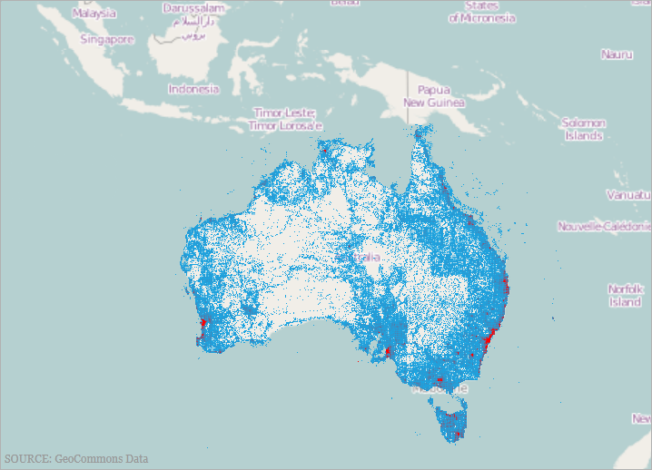
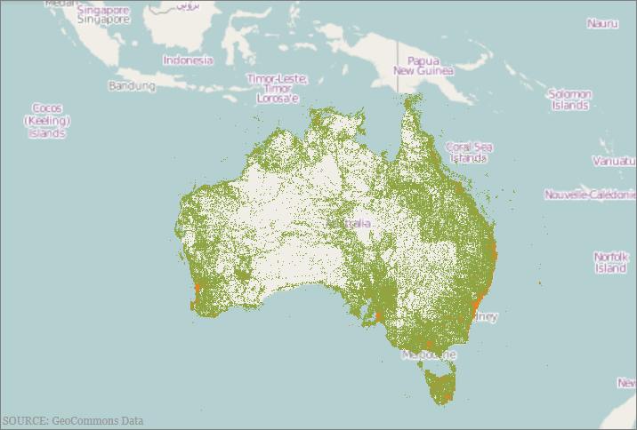
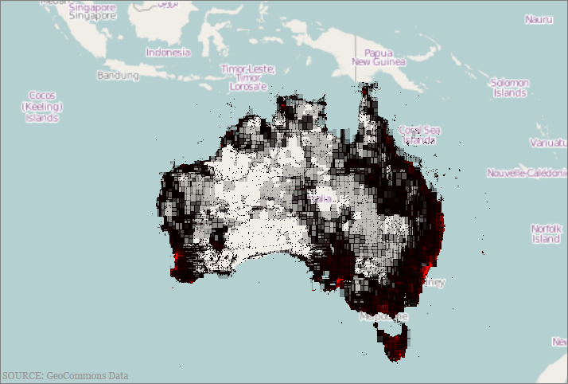
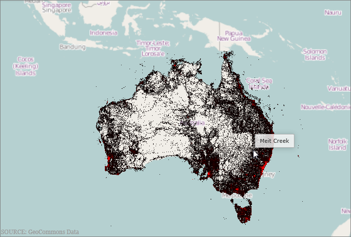
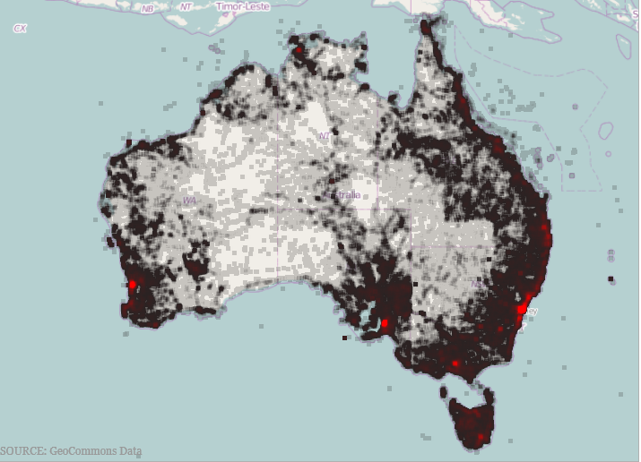

////
|metadata|
{
    "name": "xamgeographicmap-using-geographic-high-density-scatter-series",
    "tags": ["Getting Started","How Do I"],
    "controlName": ["xamDataChart"],
    "guid": "af7c1c39-905e-4058-a44b-d3cfec3a4487",
    "buildFlags": [],
    "createdOn": "2016-05-25T18:21:56.8692231Z"
}
|metadata|
////

= Using Geographic High Density Scatter Series

== Topic Overview

=== Purpose

This topic provides information on adding and configuring the link:{ApiPlatform}controls.maps.xamgeographicmap.v{ProductVersion}~infragistics.controls.maps.xamgeographicmap_members.html[xamGeographicMap]™ control’s link:{ApiPlatform}controls.maps.xamgeographicmap.v{ProductVersion}~infragistics.controls.maps.geographichighdensityscatterseries_members.html[GeographicHighDensityScatterSeries] type of series.

=== Required background

The following topics are prerequisites to understanding this topic:

[options="header", cols="a,a"]
|====
|Topic|Purpose

| link:xamgeographicmap-adding-xamgeographicmap-to-a-page.html[Adding xamGeographicMap to a Page]
|This topic provides information on how to add the _xamGeographicMap_ control to an application page.

| link:xamgeographicmap-using-geographic-series.html[Using Geographic Series]
|This topic provides information about supported types of geographic series in the _xamGeographicMap_ control.

|====

=== In this topic

This topic contains the following sections:

* <<GeographicHighDensityScatterSeries,Geographic High Density Scatter Series>>

** <<Overview,Overview>>
** <<Preview,Preview>>
** <<DataRequirements,Data Requirements>>
** <<DataBinding,Data Binding>>
** <<HeatColorScale,Heat Color Scale>>
** <<Example,Example>>

* <<Performance,Performance>>

** <<Overview1,Overview>>
** <<SeriesResolution,Series Resolution>>
** <<Example1,Example>>
** <<ProgressiveLoading,Progressive Loading>>
** <<Example2,Example>>
** <<MouseOverSupport,Mouse Over Support>>
** <<Example3,Example>>
** <<BruteForceMode,Brute Force Mode>>
** <<Example4,Example>>
** <<PointSize,Point Size>>
** <<Example5,Example>>

* <<RelatedContent,Related Content>>

[[GeographicHighDensityScatterSeries]]
== Geographic High Density Scatter Series

[[Overview]]

=== Overview

Use the _xamGeographicMap_ control’s link:{ApiPlatform}controls.maps.xamgeographicmap.v{ProductVersion}~infragistics.controls.maps.geographichighdensityscatterseries_members.html[GeographicHighDensityScatterSeries] series to bind and show scatter data ranging from hundreds to millions of data points requiring exceedingly little loading time. Because there are so many data points, the series displays the scatter data as tiny dots as opposed to full size markers, and displays areas with the most data using a higher color density representing a cluster of data points.

[[Preview]]

=== Preview

The following screenshot is a preview of the link:{ApiPlatform}controls.maps.xamgeographicmap.v{ProductVersion}~infragistics.controls.maps.geographichighdensityscatterseries_members.html[GeographicHighDensityScatterSeries] series in the _xamGeographicMap_ control bound to hundreds or even thousands of data points representing Australia’s population density. The map plot area with more densely populated data points represented as coalescences of red pixels and loosely distributed data points by discrete blue pixels.

[[DataRequirements]]

=== Data Requirements

Similar to other types of scatter series in the _xamGeographicMap_ control, the link:{ApiPlatform}controls.maps.xamgeographicmap.v{ProductVersion}~infragistics.controls.maps.geographichighdensityscatterseries_members.html[GeographicHighDensityScatterSeries] series has the link:{ApiPlatform}controls.maps.xamgeographicmap.v{ProductVersion}~infragistics.controls.maps.geographichighdensityscatterseries~itemssource.html[ItemsSource] property for data binding. This property can be bound to objects implementing an link:http://msdn.microsoft.com/en-us/library/system.collections.ienumerable.aspx[IEnumerable] interface.

In addition, each item in the items source must have two data columns that store geographic longitude and latitude coordinates and uses the link:{ApiPlatform}controls.maps.xamgeographicmap.v{ProductVersion}~infragistics.controls.maps.geographichighdensityscatterseries~longitudememberpath.html[LongitudeMemberPath] and link:{ApiPlatform}controls.maps.xamgeographicmap.v{ProductVersion}~infragistics.controls.maps.geographichighdensityscatterseries~latitudememberpath.html[LatitudeMemberPath] properties to map these data columns.

[[DataBinding]]

=== Data Binding

The following table summarizes the link:{ApiPlatform}controls.maps.xamgeographicmap.v{ProductVersion}~infragistics.controls.maps.geographichighdensityscatterseries_members.html[GeographicHighDensityScatterSeries] series properties used for data binding.

[options="header", cols="a,a,a"]
|====
|*Property Name*|*Property Type*|*Description*

| link:{ApiPlatform}controls.maps.xamgeographicmap.v{ProductVersion}~infragistics.controls.maps.geographichighdensityscatterseries~itemssource.html[ItemsSource]
|`IEnumerable`
|Gets or sets the items source

| link:{ApiPlatform}controls.maps.xamgeographicmap.v{ProductVersion}~infragistics.controls.maps.geographichighdensityscatterseries~longitudememberpath.html[LongitudeMemberPath]
|`String`
|Uses the link:{ApiPlatform}controls.maps.xamgeographicmap.v{ProductVersion}~infragistics.controls.maps.geographichighdensityscatterseries~itemssource.html[ItemsSource] property to determine the location of the longitude values on the assigned items

| link:{ApiPlatform}controls.maps.xamgeographicmap.v{ProductVersion}~infragistics.controls.maps.geographichighdensityscatterseries~latitudememberpath.html[LatitudeMemberPath]
|`String`
|Uses the link:{ApiPlatform}controls.maps.xamgeographicmap.v{ProductVersion}~infragistics.controls.maps.geographichighdensityscatterseries~itemssource.html[ItemsSource] property to determine the location of the latitude values on the assigned items

|====

[[HeatColorScale]]

=== Heat Color Scale

The Heat Color Scale, an optional feature, determines the color pattern within the series. The following table summarizes the properties used for determining the color scale.

[options="header", cols="a,a,a"]
|====
|*Property Name*|*Property Type*|* Description*

| link:{ApiPlatform}controls.maps.xamgeographicmap.v{ProductVersion}~infragistics.controls.maps.geographichighdensityscatterseries~heatminimum.html[HeatMinimum]
|`Double`
|Defines the double value representing the minimum end of the color scale

| link:{ApiPlatform}controls.maps.xamgeographicmap.v{ProductVersion}~infragistics.controls.maps.geographichighdensityscatterseries~heatmaximum.html[HeatMaximum]
|`Double`
|Defines the double value representing the maximum end of the color scale

| link:{ApiPlatform}controls.maps.xamgeographicmap.v{ProductVersion}~infragistics.controls.maps.geographichighdensityscatterseries~heatminimumcolor.html[HeatMinimumColor]
|`Color`
|Defines the point density color used at the bottom end of the color scale

| link:{ApiPlatform}controls.maps.xamgeographicmap.v{ProductVersion}~infragistics.controls.maps.geographichighdensityscatterseries~heatmaximumcolor.html[HeatMaximumColor]
|`Color`
|Defines the point density color used at the top end of the color scale

|====

[[Example]]

=== Example

The screenshot, following the table, demonstrates how the _xamGeographicMap_ with the link:{ApiPlatform}controls.maps.xamgeographicmap.v{ProductVersion}~infragistics.controls.maps.geographichighdensityscatterseries~heatminimumcolor.html[HeatMinimumColor] and link:{ApiPlatform}controls.maps.xamgeographicmap.v{ProductVersion}~infragistics.controls.maps.geographichighdensityscatterseries~heatmaximumcolor.html[HeatMaximumColor] properties of the link:{ApiPlatform}controls.maps.xamgeographicmap.v{ProductVersion}~infragistics.controls.maps.geographichighdensityscatterseries_members.html[GeographicHighDensityScatterSeries] render as a result of the following settings:

[options="header", cols="a,a"]
|====
|Property|Value

| link:{ApiPlatform}controls.maps.xamgeographicmap.v{ProductVersion}~infragistics.controls.maps.geographichighdensityscatterseries~heatminimumcolor.html[HeatMinimumColor]
|Green

| link:{ApiPlatform}controls.maps.xamgeographicmap.v{ProductVersion}~infragistics.controls.maps.geographichighdensityscatterseries~heatmaximumcolor.html[HeatMaximumColor]
|Orange

|====

Following is the code that implements this example:

*In XAML:*

[source,xaml]
----
<ig:XamGeographicMap.Series>
   <ig:GeographicHighDensityScatterSeries
      LatitudeMemberPath="Latitude"
      LongitudeMemberPath="Longitude"
      HeatMaximumColor="Orange"
      HeatMinimumColor="Green">
   </ig:HighDensityScatterSeries>
</ig:XamGeographicMap.Series>
----

*In C#:*

[source,csharp]
----
series.LatitudeMemberPath = "Latitude";
series.LongitudeMemberPath = "Longitude";
series.HeatMaximumColor = Color.FromArgb(255, 46, 139, 87);
series.HeatMinimumColor = Color.FromArgb(255, 238, 154, 0);
----

*In Visual Basic:*

[source,vb]
----
series.LatitudeMemberPath = "Latitude"
series.LongitudeMemberPath = "Longitude"
series.HeatMaximumColor = Color.FromArgb(255, 46, 139, 87)
series.HeatMinimumColor = Color.FromArgb(255, 238, 154, 0)
----

[[Performance]]
== Performance

[[Overview1]]

=== Overview

The link:{ApiPlatform}controls.maps.xamgeographicmap.v{ProductVersion}~infragistics.controls.maps.geographichighdensityscatterseries_members.html[GeographicHighDensityScatterSeries] series of the _xamGeographicMap_ is performance optimized. There are many performance specific properties and methods designed to optimize the  _xamGeographicMap’s_   performance when using hundreds to millions of data points.

[[SeriesResolution]]

=== Resolution

The link:{ApiPlatform}controls.maps.xamgeographicmap.v{ProductVersion}~infragistics.controls.maps.geographichighdensityscatterseries_members.html[GeographicHighDensityScatterSeries] series’ link:{ApiPlatform}controls.maps.xamgeographicmap.v{ProductVersion}~infragistics.controls.maps.geographichighdensityscatterseries~resolution.html[Resolution] property determines how aggressively the series consolidates display data. The higher the value, the more aggressively data is merged, and the greater the performance of the series. While using lower values enhances display resolution, it does so with correspondingly diminished performance.

[[Example1]]

=== Example

The screenshot, following the table, demonstrates how the _xamGeographicMap_ renders with setting the link:{ApiPlatform}controls.maps.xamgeographicmap.v{ProductVersion}~infragistics.controls.maps.geographichighdensityscatterseries~resolution.html[Resolution] property link:{ApiPlatform}controls.maps.xamgeographicmap.v{ProductVersion}~infragistics.controls.maps.geographichighdensityscatterseries_members.html[GeographicHighDensityScatterSeries] as follows:

[options="header", cols="a,a"]
|====
|Property|Value

| link:{ApiPlatform}controls.maps.xamgeographicmap.v{ProductVersion}~infragistics.controls.maps.geographichighdensityscatterseries~resolution.html[Resolution]
|10

|====

Following is the code implemented for this example:

*In XAML:*

[source,xaml]
----
<ig:XamGeographicMap.Series>
   <ig:GeographicHighDensityScatterSeries
      LatitudeMemberPath="Latitude"
      LongitudeMemberPath="Longitude"
      Resolution="10">
   </ig:GeographicHighDensityScatterSeries>
</ig:XamGeographicMap.Series>
----

*In C#:*

[source,csharp]
----
series.LatitudeMemberPath = "Latitude";
series.LongitudeMemberPath = "Longitude";
series.Resolution = 10;
----

*In Visual Basic:*

[source,vb]
----
series.LatitudeMemberPath = "Latitude"
series.LongitudeMemberPath = "Longitude"
series.Resolution = 10
----

[[ProgressiveLoading]]

=== Progressive Loading

The _xamGeographicMap_ control progressively renders the link:{ApiPlatform}controls.maps.xamgeographicmap.v{ProductVersion}~infragistics.controls.maps.geographichighdensityscatterseries_members.html[GeographicHighDensityScatterSeries] series loading the data in pieces so that the UI remains responsive for the entire time it takes to load the _xamGeographicMap_ . By default, the link:{ApiPlatform}controls.maps.xamgeographicmap.v{ProductVersion}~infragistics.controls.maps.geographichighdensityscatterseries~progressiveload.html[ProgressiveLoad] property is set to true. While _xamGeographicMap_ is rendering, the link:{ApiPlatform}controls.maps.xamgeographicmap.v{ProductVersion}~infragistics.controls.maps.geographichighdensityscatterseries_members.html[GeographicHighDensityScatterSeries] series provides two ways for displaying the loading status:

* Listens for the link:{ApiPlatform}controls.maps.xamgeographicmap.v{ProductVersion}~infragistics.controls.maps.geographichighdensityscatterseries~progressiveloadstatuschanged_ev.html[ProgressiveLoadStatusChanged] event allowing the loading status to display
* The link:{ApiPlatform}controls.maps.xamgeographicmap.v{ProductVersion}~infragistics.controls.maps.geographichighdensityscatterseries~progressivestatus.html[ProgressiveStatus] property represents the progressive load series status with values ranging from 0 to 100; 100 being fully loaded. This property binds to controls that indicate the loading status such as a progress bar.

[[Example2]]

=== Example

The screenshot, following this table, illustrates how the _xamGeographicMap_ renders with the link:{ApiPlatform}controls.maps.xamgeographicmap.v{ProductVersion}~infragistics.controls.maps.geographichighdensityscatterseries_members.html[GeographicHighDensityScatterSeries] series link:{ApiPlatform}controls.maps.xamgeographicmap.v{ProductVersion}~infragistics.controls.maps.geographichighdensityscatterseries~progressiveloadstatuschanged_ev.html[ProgressiveLoadStatusChanged] event configured thusly:

[options="header", cols="a,a"]
|====
|Property|Value

| link:{ApiPlatform}controls.maps.xamgeographicmap.v{ProductVersion}~infragistics.controls.maps.geographichighdensityscatterseries~progressiveload.html[ProgressiveLoad]
|`True`

| link:{ApiPlatform}controls.maps.xamgeographicmap.v{ProductVersion}~infragistics.controls.maps.geographichighdensityscatterseries~progressiveloadstatuschanged_ev.html[ProgressiveLoadStatusChanged]
|`OnSeriesProgressiveLoadStatusChanged`

|====

The following is the code used to implement the preceding example:

*In XAML:*

[source,xaml]
----
<ig:XamGeographicMap.Series>
   <ig:GeographicHighDensityScatterSeries
      LatitudeMemberPath="Latitude"
      LongitudeMemberPath="Longitude"
      ProgressiveLoad="True"
      ProgressiveLoadStatusChanged="OnSeriesProgressiveLoadStatusChanged">
   </ig:GeographicHighDensityScatterSeries>
</ig:XamGeographicMap.Series>
----

*In C#:*

[source,csharp]
----
private void OnSeriesProgressiveLoadStatusChanged(object sender, ProgressiveLoadStatusEventArgs e)
{
   this.SeriesLoadingProgressBar.Value = e.CurrentStatus;
   if (e.CurrentStatus == 100)
   {
      SeriesLoadingPanel.Visibility = Visibility.Collapsed;
   }
}
----

*In Visual Basic:*

[source,vb]
----
Private Sub OnSeriesProgressiveLoadStatusChanged(ByVal sender As Object, ByVal e As ProgressiveLoadStatusEventArgs) 
    Me.SeriesLoadingProgressBar.Value = e.CurrentStatus 
    If (e.CurrentStatus = 100) Then     
        SeriesLoadingPanel.Visibility = Visibility.Collapsed 
    End If
End Sub
----

[[MouseoverSupport]]

=== Mouse over Support

The link:{ApiPlatform}controls.maps.xamgeographicmap.v{ProductVersion}~infragistics.controls.maps.geographichighdensityscatterseries_members.html[GeographicHighDensityScatterSeries] series’ link:{ApiPlatform}controls.maps.xamgeographicmap.v{ProductVersion}~infragistics.controls.maps.geographichighdensityscatterseries~mouseoverenabled.html[MouseOverEnabled] property specifies whether or not the `MouseOver` event fires whose default property is `False`. The mouse over support for this series can be extraordinarily expensive in terms of memory and performance. The main disadvantage of setting this value to false is the inability to render Tooltips.

[[Example3]]

=== Example

The screenshot, following this table, illustrates the rendering of the _xamGeographicMap_ with the link:{ApiPlatform}controls.maps.xamgeographicmap.v{ProductVersion}~infragistics.controls.maps.geographichighdensityscatterseries_members.html[GeographicHighDensityScatterSeries] series’ link:{ApiPlatform}controls.maps.xamgeographicmap.v{ProductVersion}~infragistics.controls.maps.geographichighdensityscatterseries~mouseoverenabled.html[MouseOverEnabled] property set as follows, and with a custom ToolTip:

[options="header", cols="a,a"]
|====
|Property|Value

| link:{ApiPlatform}controls.maps.xamgeographicmap.v{ProductVersion}~infragistics.controls.maps.geographichighdensityscatterseries~mouseoverenabled.html[MouseOverEnabled]
|`True`

|====

The following is the code used to implement the preceding example:

*In XAML:*

[source,xaml]
----
<ig:XamGeographicMap.Series>
   <ig:GeographicHighDensityScatterSeries
      LatitudeMemberPath="Latitude"
      LongitudeMemberPath="Longitude"
      MouseOverEnabled="True">
      <ig:GeographicHighDensityScatterSeries.ToolTip>
         <Border Padding="4”>
            <TextBlock Text="Binding Path=Item.Name" />
         </Border>
      </ig:GeographicHighDensityScatterSeries.ToolTip>
   </ig:GeographicHighDensityScatterSeries>
</ig:XamGeographicMap.Series>
----

*In C#:*

[source,csharp]
----
series.LatitudeMemberPath = "Latitude";
series.LongitudeMemberPath = "Longitude";
series.MouseOverEnabled = "True";
----

*In Visual Basic:*

[source,vb]
----
series.LatitudeMemberPath = "Latitude"
series.LongitudeMemberPath = "Longitude"
series.MouseOverEnabled = "True"
----

[[BruteForceMode]]

=== Brute Force Mode

The link:{ApiPlatform}controls.maps.xamgeographicmap.v{ProductVersion}~infragistics.controls.maps.geographichighdensityscatterseries~usebruteforce.html[UseBruteForce] property of the link:{ApiPlatform}controls.maps.xamgeographicmap.v{ProductVersion}~infragistics.controls.maps.geographichighdensityscatterseries_members.html[GeographicHighDensityScatterSeries] series determines how the series renders. Renders all the data points every time, when true, rather than building its internal data structures, affording quicker initial load time and less memory usage; however, subsequent navigation through the data is significantly slower.

[[Example4]]

=== Example

The screenshot following this table illustrates how to render the _xamGeographicMap_ with the link:{ApiPlatform}controls.maps.xamgeographicmap.v{ProductVersion}~infragistics.controls.maps.geographichighdensityscatterseries_members.html[GeographicHighDensityScatterSeries] series’ link:{ApiPlatform}controls.maps.xamgeographicmap.v{ProductVersion}~infragistics.controls.maps.geographichighdensityscatterseries~usebruteforce.html[UseBruteForce] property set as follows:

[options="header", cols="a,a"]
|====
|Property|Value

| link:{ApiPlatform}controls.maps.xamgeographicmap.v{ProductVersion}~infragistics.controls.maps.geographichighdensityscatterseries~usebruteforce.html[UseBruteForce]
|True

|====

The following is the code used to implement the preceding example:

*In XAML:*

[source,xaml]
----
<ig:XamGeographicMap.Series>
   <ig:GeographicHighDensityScatterSeries
       LatitudeMemberPath="Latitude"
       LongitudeMemberPath="Longitude"
       ProgressiveLoadStatusChanged="OnSeriesProgressiveLoadStatusChanged"
       UseBruteForce="True">
   </ig:GeographicHighDensityScatterSeries>
</ig:XamGeographicMap.Series>
----

*In C#:*

[source,csharp]
----
series.LatitudeMemberPath = "Latitude";
series.LongitudeMemberPath = "Longitude";
series.UseBruteForce = "True";
series.ProgressiveLoadStatusChanged += series_ProgressiveLoadStatusChanged;
----

*In Visual Basic:*

[source,vb]
----
series.LatitudeMemberPath = "Latitude"
series.LongitudeMemberPath = "Longitude"
series.HeatMaximumColor = "True"
series.ProgressiveLoadStatusChanged += series_ProgressiveLoadStatusChanged
----

[[PointSize]]

=== Point Size

The link:{ApiPlatform}controls.maps.xamgeographicmap.v{ProductVersion}~infragistics.controls.maps.geographichighdensityscatterseries_members.html[GeographicHighDensityScatterSeries] series’ link:{ApiPlatform}controls.maps.xamgeographicmap.v{ProductVersion}~infragistics.controls.maps.geographichighdensityscatterseries~pointextent.html[PointExtent] property increases the minimum point size used for rendering high density scatter series’ points. The point size directly affects the series performance, where the higher the link:{ApiPlatform}controls.maps.xamgeographicmap.v{ProductVersion}~infragistics.controls.maps.geographichighdensityscatterseries~pointextent.html[PointExtent] property value the lower the performance.

[[Example5]]

=== Example

The screenshot, following this table, illustrates how the _xamGeographicMap_ renders with the link:{ApiPlatform}controls.maps.xamgeographicmap.v{ProductVersion}~infragistics.controls.maps.geographichighdensityscatterseries_members.html[GeographicHighDensityScatterSeries] series’ link:{ApiPlatform}controls.maps.xamgeographicmap.v{ProductVersion}~infragistics.controls.maps.geographichighdensityscatterseries~pointextent.html[PointExtent] property configured thusly:

[options="header", cols="a,a"]
|====
|Property|Value

| link:{ApiPlatform}controls.maps.xamgeographicmap.v{ProductVersion}~infragistics.controls.maps.geographichighdensityscatterseries~pointextent.html[PointExtent]
| _3_ 

|====

The following is the code used to implement the preceding example:

*In XAML:*

[source,xaml]
----
<ig:XamGeographicMap.Series>
   <ig:GeographicHighDensityScatterSeries
      LatitudeMemberPath="Latitude"
      LongitudeMemberPath="Longitude"
      PointExtent="3">
   </ig:GeographicHighDensityScatterSeries>
</ig:XamGeographicMap.Series>
----

*In C#:*

[source,csharp]
----
series.LatitudeMemberPath = "Latitude";
series.LongitudeMemberPath = "Longitude";
series.PointExtent = 3;
----

*In Visual Basic:*

[source,vb]
----
series.LatitudeMemberPath = "Latitude"
series.LongitudeMemberPath = "Longitude"
series.PointExtent = 3
----

[[RelatedContent]]
== Related Content

=== Topics

The following topics provide additional information related to this topic:

[options="header", cols="a,a"]
|====
|Topic|Purpose

| link:xamgeographicmap-adding-xamgeographicmap-to-a-page.html[Adding xamGeographicMap to a Page]
|This topic provides information on how to add the _xamGeographicMap_ control to an application page.

| link:xamgeographicmap-using-geographic-series.html[Using Geographic Series]
|This topic provides information about supported types of geographic series in the _xamGeographicMap_ control.

|====

=== Samples

The following sample provides additional information related to this topic.

[options="header", cols="a,a"]
|====
|Sample|Purpose

| 

link:{SamplesURL}/geographic-map/#/geographic-high-density-series[Geographic High Density Series]
|This sample demonstrates how a high density scatter series in the Geographic Map control can be used to show millions of data points. The map plot area with more densely populated data points are represented by condensed red color pixels and loosely distributed data points are represented by blue color pixels. In addition, there is an option to change min/max heat properties of the series in order to adjust how heat colors are mapped

|====