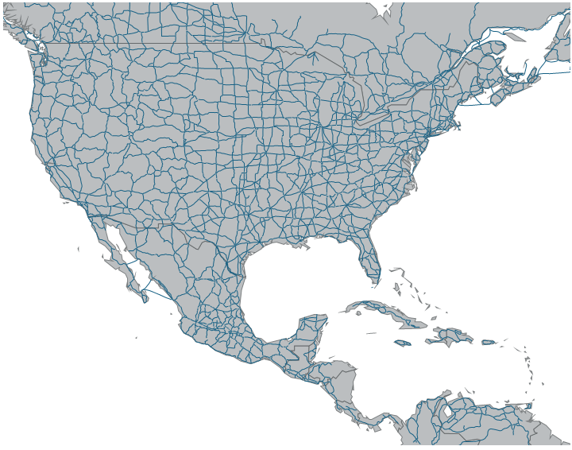

////

|metadata|
{
    "name": "xamgeographicmap-using-geographic-polyline-series",
    "controlName": ["xamGeographicMap"],
    "tags": ["Data Binding","Data Presentation","How Do I"],
    "guid": "48db919a-e224-4496-b73e-dc303a6ea1b8",  
    "buildFlags": [],
    "createdOn": "2016-05-25T18:21:56.8272139Z"
}
|metadata|
////

= Using Geographic Polyline Series

== Topic Overview

=== Purpose

This topic provides information on how to use the link:{ApiPlatform}controls.maps.xamgeographicmap.v{ProductVersion}~infragistics.controls.maps.geographicpolylineseries_members.html[GeographicPolylineSeries] element in the link:{ApiPlatform}controls.maps.xamgeographicmap.v{ProductVersion}~infragistics.controls.maps.xamgeographicmap_members.html[xamGeographicMap]™ control.

=== Required background

The following table lists the topics required as a prerequisite to understanding this topic.

[options="header", cols="a,a"]
|====
|Topic|Purpose

| link:xamgeographicmap-adding-xamgeographicmap-to-a-page.html[Adding xamGeographicMap to a Page] 

|This topic provides information on how to add the _xamGeographicMap_ control to an application page.

| link:xamgeographicmap-visual-elements-of-xamgeographicmap.html[Visual Elements of xamGeographicMap]
|This topic provides information about layout of map elements in the _xamGeographicMap_ control.

| link:xamgeographicmap-shape-files-reference.html[Shape Files Reference]
|This topic provides resources with information about maps, shape files, and geo-spatial related material. Use these resources to learn about and obtain geo-spatial shape files as well as tools for their editing.

| link:xamgeographicmap-binding-shape-files-with-geospatial-data.html[Binding Shape Files with Geo-spatial Data]
|This topic provides information on how to bind shape files with geo-spatial data to the _xamGeographicMap_ control.

| link:xamgeographicmap-binding-shape-files-with-geospatial-data.html[Binding Shape Files with Geo-spatial Data]
|This topic provides information about supported types of geographic series in the _xamGeographicMap_ control.

|====

=== In this topic

This topic contains the following sections:

* <<_Ref320651776, Geographic Polyline Series >>

** <<_Ref320193474,Overview>>
** <<_Ref320651783,Preview>>
** <<_Ref320651786,Data Requirements>>
** <<_Ref320651790,Example>>

* <<_Ref320185294,Related Content>>

[[_Ref320651776]]
== Geographic Polyline Series

[[_Ref320193474]]

=== Overview

In the _xamGeographicMap_ control, the link:{ApiPlatform}controls.maps.xamgeographicmap.v{ProductVersion}~infragistics.controls.maps.geographicpolylineseries_members.html[GeographicPolylineSeries] is a visual map element that displays geo-spatial data using polylines in a geographic context. This type of geographic series is often used to render roads or connections between geographic locations such as cities or airports. The link:{ApiPlatform}controls.maps.xamgeographicmap.v{ProductVersion}~infragistics.controls.maps.geographicpolylineseries_members.html[GeographicPolylineSeries] works a lot like the link:{ApiPlatform}controls.maps.xamgeographicmap.v{ProductVersion}~infragistics.controls.maps.geographicshapeseries_members.html[GeographicShapeSeries] except that geo-spatial data is rendered with polylines instead of polygons.

[[_Ref320651783]]

=== Preview

The following is a preview of the _xamGeographicMap_ control with the link:{ApiPlatform}controls.maps.xamgeographicmap.v{ProductVersion}~infragistics.controls.maps.geographicpolylineseries_members.html[GeographicPolylineSeries] plotting roads the North America.

[[_Ref320651786]]

=== Data Requirements

Similarly to other types of geographic series in the _xamGeographicMap_ control, the link:{ApiPlatform}controls.maps.xamgeographicmap.v{ProductVersion}~infragistics.controls.maps.geographicpolylineseries_members.html[GeographicPolylineSeries] has the link:{ApiPlatform}controls.charts.xamdatachart.v{ProductVersion}~infragistics.controls.charts.series~itemssource.html[ItemsSource] property for the purpose of data binding. This property can be bound to an object that implements the link:http://msdn.microsoft.com/en-us/library/system.collections.ienumerable.aspx[IEnumerable] interface (e.g. link:http://msdn.microsoft.com/en-us/library/6sh2ey19.aspx[List], link:http://msdn.microsoft.com/en-us/library/ms132397.aspx[Collection], link:http://msdn.microsoft.com/en-us/library/7977ey2c.aspx[Queue], link:http://msdn.microsoft.com/en-us/library/system.collections.stack.aspx[Stack]). In addition, each item in this object must have one data column that stores geographic locations (longitude and latitude) of connected items using the link:http://msdn.microsoft.com/en-us/library/system.collections.ienumerable.aspx[IEnumerable]< link:http://msdn.microsoft.com/en-us/library/system.windows.point.aspx[Point]> or link:http://msdn.microsoft.com/en-us/library/system.collections.ienumerable.aspx[IEnumerable]< link:http://msdn.microsoft.com/en-us/library/system.collections.ienumerable.aspx[IEnumerable]< link:http://msdn.microsoft.com/en-us/library/system.windows.point.aspx[Point]>> structure. The latter is the standard data structure used by shape files and the link:{ApiPlatform}controls.maps.xamgeographicmap.v{ProductVersion}~infragistics.controls.maps.shapefileconverter_members.html[ShapefileConverter] object. This data column is then mapped to the link:{ApiPlatform}controls.maps.xamgeographicmap.v{ProductVersion}~infragistics.controls.maps.geographicshapeseriesbase~shapememberpath.html[ShapeMemberPath] property. The link:{ApiPlatform}controls.maps.xamgeographicmap.v{ProductVersion}~infragistics.controls.maps.geographicpolylineseries_members.html[GeographicPolylineSeries] uses points of this mapped data column to plot polygons in the _xamGeographicMap_ control.

[[_Ref320651790]]

=== Example

The following code shows how to bind the link:{ApiPlatform}controls.maps.xamgeographicmap.v{ProductVersion}~infragistics.controls.maps.geographicpolylineseries_members.html[GeographicPolylineSeries] to locations of cities loaded from a shape file using the ShapefileConverter.

*In XAML:*

[source,xaml]
----
<ig:ShapefileConverter x:Key="shapefileConverter"
                        ShapefileSource="ShapeFiles/north_america_primary_roads.shp"
                        DatabaseSource="ShapeFiles/north_america_primary_roads.dbf" >
</ig:ShapefileConverter>
<ig:XamGeographicMap x:Name="GeoMap">
    <ig:XamGeographicMap.Series>
        <ig:GeographicPolylineSeries ItemsSource="{StaticResource shapefileConverter}"
                                   ShapeMemberPath="Points">
        </ig:GeographicPolylineSeries>
    </ig:XamGeographicMap.Series>
</ig:XamGeographicMap>
----

*In Visual Basic:*

[source,vb]
----
' create and set data binding to the GeographicPolylineSeries
Dim geoSeries = New GeographicPolylineSeries()
geoSeries.ItemsSource = shapefileConverter
geoSeries.ShapeMemberPath = "Points"
' add the GeographicPolylineSeries to the the xamGeographicMap
Me.GeoMap.Series.Add(geoSeries)
----

*In C#:*

[source,csharp]
----
// create and set data binding to the GeographicPolylineSeries
var geoSeries = new GeographicPolylineSeries();
geoSeries.ItemsSource = shapefileConverter;
geoSeries.ShapeMemberPath = "Points";
// add the GeographicPolylineSeries to the the xamGeographicMap
this.GeoMap.Series.Add(geoSeries);
----

[[_Ref320185294]]
== Related Content

=== Topics

The following topics provide additional information related to this topic.

[options="header", cols="a,a"]
|====
|Topic|Purpose

| link:xamgeographicmap-adding-xamgeographicmap-to-a-page.html[Adding xamGeographicMap to a Page] 

|This topic provides information on how to add the _xamGeographicMap_ control to an application page.

| link:xamgeographicmap-visual-elements-of-xamgeographicmap.html[Visual Elements of xamGeographicMap]
|This topic provides information about layout of map elements in the _xamGeographicMap_ control.

| link:xamgeographicmap-shape-files-reference.html[Shape Files Reference]
|This topic provides resources with information about maps, shape files, and geo-spatial related material. Use these resources to learn about and obtain geo-spatial shape files as well as tools for their editing.

| link:xamgeographicmap-binding-shape-files-with-geospatial-data.html[Binding Shape Files with Geo-spatial Data]
|This topic provides information on how to bind shape files with geo-spatial data to the _xamGeographicMap_ control.

| link:xamgeographicmap-using-geographic-series.html[Using Geographic Series]
|This topic provides information about supported types of geographic series in the _xamGeographicMap_ control.

|====