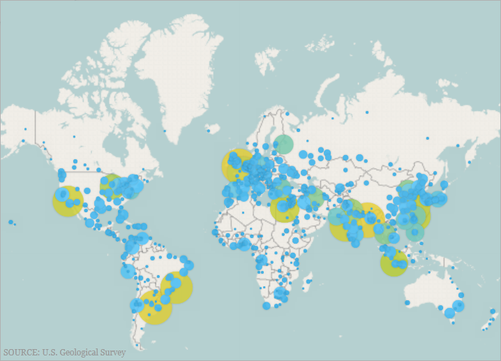
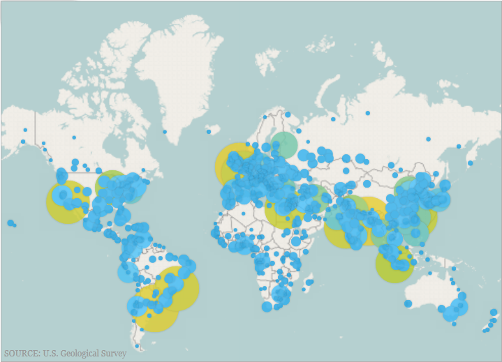
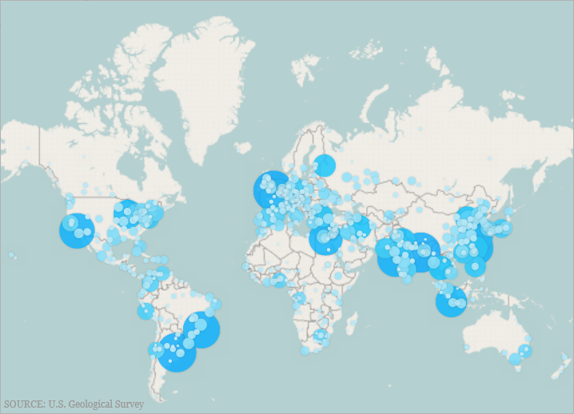

////

|metadata|
{
    "name": "xamgeographicmap-using-geographic-proportional-symbol-series",
    "controlName": ["xamGeographicMap"],
    "tags": ["Data Presentation","Getting Started","How Do I"],
    "guid": "a2e32fd3-8f0d-45ae-972f-30429d91b156",  
    "buildFlags": [],
    "createdOn": "2016-05-25T18:21:56.8532239Z"
}
|metadata|
////

= Using Geographic Proportional Symbol Series

== Topic Overview

=== Purpose

This topic provides information on how to use the link:{ApiPlatform}controls.maps.xamgeographicmap.v{ProductVersion}~infragistics.controls.maps.geographicproportionalsymbolseries_members.html[GeographicProportionalSymbolSeries] element in the  _xamGeographicMap™_   control.

=== Required background

The following topics are prerequisites to understanding this topic:

[options="header", cols="a,a"]
|====
|Topic|Purpose

| link:xamgeographicmap-adding-xamgeographicmap-to-a-page.html[Adding xamGeographicMap to a Page]
|This topic provides information on how to add the _xamGeographicMap_ control to an application page.

| link:xamgeographicmap-visual-elements-of-xamgeographicmap.html[Visual Elements of xamGeographicMap]
|This topic provides information about layout of map elements in the _xamGeographicMap_ control.

| link:xamgeographicmap-shape-files-reference.html[Shape Files Reference]
|This topic provides resources about maps and geo-spatial related material as well as information about shape files. Use these resources to learn about and obtain shape files as well as tools for their editing before starting to bind geo-spatial data to the xamGeographicMap™ control.

| link:xamgeographicmap-binding-shape-files-with-geospatial-data.html[Binding Shape Files with Geo-spatial Data]
|This topic provides information on how to bind shape files with geo-spatial data to the _xamGeographicMap_ control.

| link:xamgeographicmap-using-geographic-series.html[Using Geographic Series]
|This topic provides information about supported types of geographic series in the _xamGeographicMap_ control.

|====

=== In this topic

This topic contains the following sections:

* <<GeographicProportionalSymbolSeries,Geographic Proportional Symbol Series>>

** <<Overview,Overview>>
** <<Preview,Preview>>
** <<DataRequirements,Data Requirements>>
** <<DataBinding,Data Binding>>

* <<SizeScale,Size Scale>>

** <<SizeScaleOverview,Overview>>
** <<SizeScalePreview,Preview>>
** <<SizeScaleExample,Example>>

* <<FillScale,Fill Scale>>

** <<FillScaleOverview,Overview>>
** <<FillScalePreview,Preview>>
** <<FillScaleExample,Example>>

* <<RelatedContent,Related Content>>

[[GeographicProportionalSymbolSeries]]
== Geographic Proportional Symbol Series

[[Overview]]

=== Overview

The link:{ApiPlatform}controls.maps.xamgeographicmap.v{ProductVersion}~infragistics.controls.maps.geographicproportionalsymbolseries_members.html[GeographicProportionalSymbolSeries] is a Scatter Series with data-driven symbol sizes. It implements link:{ApiPlatform}controls.maps.xamgeographicmap.v{ProductVersion}~infragistics.controls.maps.geographicproportionalsymbolseries.html[GeographicProportionalSeries] and has all the basic characteristics of the  _xamDataChart_   control’s link:{ApiPlatform}controls.charts.xamdatachart.v{ProductVersion}~infragistics.controls.charts.bubbleseries_members.html[BubbleSeries].

[[Preview]]

=== Preview

The following screenshot is a preview of the link:{ApiPlatform}controls.maps.xamgeographicmap.v{ProductVersion}~infragistics.controls.maps.geographicproportionalsymbolseries_members.html[GeographicProportionalSymbolSeries] series in the _xamGeographicMap_ control displaying the locations of the most populated cites in the world. The link:{ApiPlatform}controls.maps.xamgeographicmap.v{ProductVersion}~infragistics.controls.maps.geographicproportionalsymbolseries~radiusscale.html[RadiusScale] of the symbols uses proportional radius scale in order to indicate the significance of these cities based on their population.

[[DataRequirements]]

=== Data Requirements

Similar to other types of geographic series in the _xamGeographicMap_ control, the link:{ApiPlatform}controls.maps.xamgeographicmap.v{ProductVersion}~infragistics.controls.maps.geographicproportionalsymbolseries_members.html[GeographicProportionalSymbolSeries] possess an link:{ApiPlatform}controls.maps.xamgeographicmap.v{ProductVersion}~infragistics.controls.maps.geographicproportionalsymbolseries~itemssource.html[ItemsSource] property for data binding. This property can be bound to an object that implements an link:http://msdn.microsoft.com/en-us/library/system.collections.ienumerable.aspx[IEnumerable] interface.

Additionally, each item in the items source must have two numeric data columns for storing geographic location (longitude and latitude) and one numeric column for storing the symbol size. These data columns map to the link:{ApiPlatform}controls.maps.xamgeographicmap.v{ProductVersion}~infragistics.controls.maps.geographicproportionalsymbolseries~longitudememberpath.html[LongitudeMemberPath], link:{ApiPlatform}controls.maps.xamgeographicmap.v{ProductVersion}~infragistics.controls.maps.geographicproportionalsymbolseries~latitudememberpath.html[LatitudeMemberPath] and link:{ApiPlatform}controls.maps.xamgeographicmap.v{ProductVersion}~infragistics.controls.maps.geographicproportionalsymbolseries~radiusmemberpath.html[RadiusMemberPath] properties respectively.

[[DataBinding]]

=== Data Binding

The following table summarizes properties of the link:{ApiPlatform}controls.maps.xamgeographicmap.v{ProductVersion}~infragistics.controls.maps.geographicproportionalsymbolseries_members.html[GeographicProportionalSymbolSeries] used for data binding.

[options="header", cols="a,a,a"]
|====
|*Property Name*|*Property Type*|* Description*

| link:{ApiPlatform}controls.maps.xamgeographicmap.v{ProductVersion}~infragistics.controls.maps.geographicproportionalsymbolseries~itemssource.html[ItemsSource]
|IEnumerable
|Gets or sets the source of items

| link:{ApiPlatform}controls.maps.xamgeographicmap.v{ProductVersion}~infragistics.controls.maps.geographicproportionalsymbolseries~longitudememberpath.html[LongitudeMemberPath]
|String
|Sets the symbol’s longitude coordinate

| link:{ApiPlatform}controls.maps.xamgeographicmap.v{ProductVersion}~infragistics.controls.maps.geographicproportionalsymbolseries~latitudememberpath.html[LatitudeMemberPath]
|String
|Sets the symbol’s latitude coordinate

| link:{ApiPlatform}controls.maps.xamgeographicmap.v{ProductVersion}~infragistics.controls.maps.geographicproportionalsymbolseries~radiusmemberpath.html[RadiusMemberPath]
|String
|Sets the symbol’s size

| link:{ApiPlatform}controls.maps.xamgeographicmap.v{ProductVersion}~infragistics.controls.maps.geographicproportionalsymbolseries~fillmemberpath.html[FillMemberPath]
|String
|The name of the ItemsSource item’s property containing the numeric value to convert to a `Brush` using the link:{ApiPlatform}controls.maps.xamgeographicmap.v{ProductVersion}~infragistics.controls.maps.geographicproportionalsymbolseries~fillscale.html[FillScale]

|====

[[Example]]

=== Example

*In XAML:*

[source,xaml]
----
<ig:XamGeographicMap x:Name="map">    
 <ig:XamGeographicMap.Series>        
 <ig:GeographicProportionalSymbolSeries ItemsSource="{StaticResource sampleData}"                              
 LatitudeMemberPath="LatColumnName"                              
 LongitudeMemberPath="LongColumnName"
 RadiusMemberPath="RadiusColumnName"/>    
 </ig:XamGeographicMap.Series>
</ig:XamGeographicMap>
----

*In Visual Basic:*

[source,vb]
----
Imports Infragistics.Controls.Charts
Imports Infragistics.Controls.Maps
Imports System.ComponentModel
' create and set data binding to the GeographicProportionalSymbolSeries
Dim geoSeries = New GeographicProportionalSymbolSeries()
geoSeries.ItemsSource = sampleData
geoSeries.LongitudeMemberPath = "LongColumnName"
geoSeries.LatitudeMemberPath = "LatColumnName"
geoSeries.RadiusMemberPath = "RadiusColumnName"
' add the GeographicProportionalSymbolSeries to the the xamGeographicMap
Me.GeoMap.Series.Add(geoSeries)
----

*In C#:*

[source,csharp]
----
using Infragistics.Controls.Charts;
using Infragistics.Controls.Maps;
using System.ComponentModel;
// create and set data binding to the GeographicProportionalSymbolSeries
var geoSeries = new GeographicProportionalSymbolSeries();
geoSeries.ItemsSource = sampleData;
geoSeries.LongitudeMemberPath = "LongColumnName";
geoSeries.LatitudeMemberPath = "LatColumnName";
geoSeries.RadiusMemberPath = "RadiusColumnName";
// add the GeographicProportionalSymbolSeries to the the xamGeographicMap
this.GeoMap.Series.Add(geoSeries);
----

[[SizeScale]]
== Size Scale

[[SizeScaleOverview]]

=== Overview

The link:{ApiPlatform}controls.charts.xamdatachart.v{ProductVersion}~infragistics.controls.charts.sizescale_members.html[SizeScale] determines the size of the symbols in the series. If the link:{ApiPlatform}controls.charts.xamdatachart.v{ProductVersion}~infragistics.controls.charts.sizescale_members.html[SizeScale] value is not set, each of the symbol’s sizes is equal to the value of the link:{ApiPlatform}controls.maps.xamgeographicmap.v{ProductVersion}~infragistics.controls.maps.geographicproportionalsymbolseries~radiusmemberpath.html[RadiusMemberPath] column. When setting the link:{ApiPlatform}controls.charts.xamdatachart.v{ProductVersion}~infragistics.controls.charts.sizescale_members.html[SizeScale] the smallest symbol equals link:{ApiPlatform}controls.charts.xamdatachart.v{ProductVersion}~infragistics.controls.charts.sizescale~minimumvalue.html[MinimumValue] and the largest symbol equals link:{ApiPlatform}controls.charts.xamdatachart.v{ProductVersion}~infragistics.controls.charts.sizescale~maximumvalue.html[MaximumValue], with all of the remaining symbols scaled proportionately within this range. The link:{ApiPlatform}controls.charts.xamdatachart.v{ProductVersion}~infragistics.controls.charts.sizescale_members.html[SizeScale] can be either linear or logarithmic.

[[SizeScaleExample]]

=== Example

The following screenshot demonstrates how the _xamGeographicMap_ control’s link:{ApiPlatform}controls.maps.xamgeographicmap.v{ProductVersion}~infragistics.controls.maps.geographicproportionalsymbolseries_members.html[GeographicProportionalSymbolSeries] series renders as a result of the following link:{ApiPlatform}controls.charts.xamdatachart.v{ProductVersion}~infragistics.controls.charts.sizescale_members.html[SizeScale] settings:

[options="header", cols="a,a"]
|====
|Property|Value

| link:{ApiPlatform}controls.charts.xamdatachart.v{ProductVersion}~infragistics.controls.charts.sizescale~minimumvalue.html[MinimumValue]
|5

| link:{ApiPlatform}controls.charts.xamdatachart.v{ProductVersion}~infragistics.controls.charts.sizescale~maximumvalue.html[MaximumValue]
|70

|====

Following is the code that implements this example.

*In XAML:*

[source,xaml]
----
<ig:SizeScale x:Key="sizeScale"              
 MinimumValue="5" 
 MaximumValue="70"              
 LogarithmBase="10"              
 IsLogarithmic="/>
 <ig:GeographicProportionalSymbolSeries 
       ...              
 RadiusScale="{StaticResource sizeScale}" />
----

[[FillScale]]
== Fill Scale

[[FillScaleOverview]]

=== Overview

A fill scale defines the color pattern within a single link:{ApiPlatform}controls.maps.xamgeographicmap.v{ProductVersion}~infragistics.controls.maps.geographicproportionalsymbolseries_members.html[GeographicProportionalSymbolSeries]. The link:{ApiPlatform}controls.maps.xamgeographicmap.v{ProductVersion}~infragistics.controls.maps.geographicproportionalsymbolseries_members.html[GeographicProportionalSymbolSeries] series’ link:{ApiPlatform}controls.maps.xamgeographicmap.v{ProductVersion}~infragistics.controls.maps.geographicproportionalsymbolseries~fillscale.html[FillScale] property sets the symbols color with each color axis possessing its own collection of Brushes.

The link:{ApiPlatform}controls.maps.xamgeographicmap.v{ProductVersion}~infragistics.controls.maps.geographicproportionalsymbolseries_members.html[GeographicProportionalSymbolSeries] supports two fill scales:

* link:{ApiPlatform}controls.charts.xamdatachart.v{ProductVersion}~infragistics.controls.charts.custompalettebrushscale_members.html[CustomPaletteBrushScale] – Uses the symbol marker’s index to select a brush from the Brushes collection
* link:{ApiPlatform}controls.charts.xamdatachart.v{ProductVersion}~infragistics.controls.charts.valuebrushscale_members.html[ValueBrushScale] – Uses a set of values, which can be logarithmic, from one of the numeric columns in the ItemsSource to interpolate a brush. The link:{ApiPlatform}controls.maps.xamgeographicmap.v{ProductVersion}~infragistics.controls.maps.geographicproportionalsymbolseries_members.html[GeographicProportionalSymbolSeries] series determines which values to use in two ways:
** link:{ApiPlatform}controls.maps.xamgeographicmap.v{ProductVersion}~infragistics.controls.maps.geographicproportionalsymbolseries~fillmemberpath.html[FillMemberPath] - the property explicitly specifies which column to use
** link:{ApiPlatform}controls.charts.xamdatachart.v{ProductVersion}~infragistics.controls.charts.sizescale~minimumvalue.html[MinimumValue] and link:{ApiPlatform}controls.charts.xamdatachart.v{ProductVersion}~infragistics.controls.charts.sizescale~maximumvalue.html[MaximumValue] – user defined values used to determine the range of values

[[FillScaleExample]]

=== Example

The following screenshot demonstrates how the `xamGeographicMap` control’s link:{ApiPlatform}controls.maps.xamgeographicmap.v{ProductVersion}~infragistics.controls.maps.geographicproportionalsymbolseries_members.html[GeographicProportionalSymbolSeries] series renders as a result of the following settings:

[options="header", cols="a,a"]
|====
|Property|Value

| link:{ApiPlatform}controls.maps.xamgeographicmap.v{ProductVersion}~infragistics.controls.maps.geographicproportionalsymbolseries~fillscale.html[FillScale]
|CustomPaletteBrushScale

|====

image::images/Using_Geographic_Proportional_Symbol_Series_3.png[]

Following is the code that implements this example.

*In XAML:*

[source,xaml]
----
<ig:CustomPaletteBrushScale x:Key="CustomPaletteBrushScale" >    
 <ig:CustomPaletteBrushScale.Brushes>        
 <SolidColorBrush Color="Red"/>        
 <SolidColorBrush Color="Green"/>        
 <SolidColorBrush Color="Blue"/>    
 </ig:CustomPaletteBrushScale.Brushes/>
</ig:CustomPaletteBrushScale>
<ig:GeographicProportionalSymbolSeries 
   ...
 FillScale="{StaticResource CustomPaletteBrushScale}" />
----

The following screenshot demonstrates how the _xamGeographicMap_ control’s link:{ApiPlatform}controls.maps.xamgeographicmap.v{ProductVersion}~infragistics.controls.maps.geographicproportionalsymbolseries_members.html[GeographicProportionalSymbolSeries] series renders as a result of the following settings:

[options="header", cols="a,a"]
|====
|Property|Value

| link:{ApiPlatform}controls.maps.xamgeographicmap.v{ProductVersion}~infragistics.controls.maps.geographicproportionalsymbolseries~fillscale.html[FillScale]
|ValueBrushScale

| link:{ApiPlatform}controls.maps.xamgeographicmap.v{ProductVersion}~infragistics.controls.maps.geographicproportionalsymbolseries~fillmemberpath.html[FillMemberPath]
|Population

|====

Following is the code that implements this example.

*In XAML:*

[source,xaml]
----
<ig:ValueBrushScale x:Key="ValueBrushScale"          
 MinimumValue="1000"           
 MaximumValue="25000000"          
 IsLogarithmic="           
 LogarithmBase="10">    
 <ig:ValueBrushScale.Brushes>        
 <SolidColorBrush Color="#FFC6EEFB" />   
 <SolidColorBrush Color="#FF08C3FE" />                                    
 <SolidColorBrush Color="#FF08A5FE" />                                    
 <SolidColorBrush Color="#FF086AFE" />                                    
 <SolidColorBrush Color="#FF084CFE" />
 </ig:ValueBrushScale.Brushes>
</ig:ValueBrushScale>
<ig:GeographicProportionalSymbolSeries 
   ...
 FillScale="{StaticResource ValueBrushScale}"                      
 FillMemberPath="Population" />
----

[[RelatedContent]]
== Related Content

=== Topics

The following topics provide additional information related to this topic.

[options="header", cols="a,a"]
|====
|Topic|Purpose

| link:xamgeographicmap-adding-xamgeographicmap-to-a-page.html[Adding xamGeographicMap to a Page]
|This topic provides information on how to add the link:{ApiPlatform}controls.maps.xamgeographicmap.v{ProductVersion}~infragistics.controls.maps.xamgeographicmap_members.html[XamGeographicMap]™ control to an application page.

| link:xamgeographicmap-using-geographic-symbol-series.html[Using Geographic Symbol Series]
|This topic provides information on how to use the element in the link:{ApiPlatform}controls.maps.xamgeographicmap.v{ProductVersion}~infragistics.controls.maps.xamgeographicmap_members.html[xamGeographicMap]™ control.

|====

ifdef::sl[]

=== Samples

ifdef::sl[]

The following sample provides additional information related to this topic.

[options="header", cols="a,a"]
|====
|Sample|Purpose

| link:{SamplesURL}/geographic-map/#/geographic-proportional-symbol-series[Geographic Proportional Symbol Series]
|This sample demonstrates how to use a proportional symbol series in the Geographic Map control shows the locations of most populated cities in the world and scale radius of symbol markers using proportional radius scale in order to indicate significance of these cities based on their population.

|====

endif::sl[]

endif::sl[]