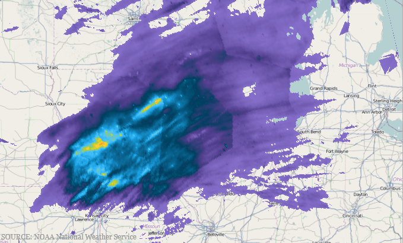

////
|metadata|
{
    "name": "xamgeographicmap-using-geographic-scatter-area-series",
    "controlName": ["xamGeographicMap"],
    "tags": ["Getting Started","How Do I"],
    "guid": "3d76849d-07c0-4a49-b640-0f8ce989440a",
    "buildFlags": [],
    "createdOn": "2016-05-25T18:21:56.8402183Z"
}
|metadata|
////

= Using Geographic Scatter Area Series

== Topic Overview

=== Purpose

This topic provides information on how to use the link:{ApiPlatform}controls.maps.xamgeographicmap{ApiVersion}~infragistics.controls.maps.geographicscatterareaseries_members.html[GeographicScatterAreaSeries] type of series in the link:{ApiPlatform}controls.maps.xamgeographicmap{ApiVersion}~infragistics.controls.maps.xamgeographicmap_members.html[xamGeographicMap]™ control.

=== Required background

The following table lists the topics required as a prerequisite to understanding this topic.

[options="header", cols="a,a"]
|====
|Topic|Purpose

| link:xamgeographicmap-visual-elements-of-xamgeographicmap.html[Visual Elements of xamGeographicMap]
|This topic provides information about layout of map elements in the `xamGeographicMap` control.

| link:xamgeographicmap-triangulating-geographic-data.html[Triangulating Geographic Data]
|This topic provides information on how triangulation of data points works as well as how it can improve performance of rendering data in the `xamGeographicMap` control.

| link:xamgeographicmap-binding-shape-files-with-geospatial-data.html[Binding Shape Files with Geo-spatial Data]
|This topic provides information on how to bind shape files with geo-spatial data to the `xamGeographicMap` control.

|====

=== In this topic

This topic contains the following sections:

* <<_Ref320651776, Geographic Scatter Area Series >>

** <<_Ref320193474,Overview>>
** <<_Ref320651783,Preview>>
** <<_Ref320651786,Data Requirements>>
** <<_Ref335249132,Data Binding>>
** <<_Ref335248897,Color Scale>>
** <<_Ref320651790,Example>>

* <<_Ref320185294,Related Content>>

[[_Ref320651776]]
== Geographic Scatter Area Series

[[_Ref320193474]]

=== Overview

In the `xamGeographicMap` control, the link:{ApiPlatform}controls.maps.xamgeographicmap{ApiVersion}~infragistics.controls.maps.geographicscatterareaseries_members.html[GeographicScatterAreaSeries] is a visual map element that draws a colored surface, in a geographic context, based on a triangulation of longitude and latitude data with a numeric value assigned to each point.

This type of geographic series is useful for rendering scattered data, defined by geographic locations such as weather temperature, precipitation, population distribution, air pollution, etc. The link:{ApiPlatform}controls.maps.xamgeographicmap{ApiVersion}~infragistics.controls.maps.geographicscatterareaseries_members.html[GeographicScatterAreaSeries] works a lot like the link:{ApiPlatform}controls.maps.xamgeographicmap{ApiVersion}~infragistics.controls.maps.geographiccontourlineseries_members.html[GeographicContourLineSeries] except that it represents data as interpolated and colored surface instead of contour lines connecting data points with the same values.

[[_Ref320651783]]

=== Preview

The following is a preview of the `xamGeographicMap` control with link:{ApiPlatform}controls.maps.xamgeographicmap{ApiVersion}~infragistics.controls.maps.geographicscatterareaseries_members.html[GeographicScatterAreaSeries] plotting precipitation over the United States. Darker blue regions of the surface indicate higher precipitation and the lighter blue regions indicate lower precipitation.

[[_Ref320651786]]

=== Data Requirements

Similar to other types of geographic series in the `xamGeographicMap` control, the link:{ApiPlatform}controls.maps.xamgeographicmap{ApiVersion}~infragistics.controls.maps.geographicscatterareaseries_members.html[GeographicScatterAreaSeries] has the link:{ApiPlatform}controls.maps.xamgeographicmap{ApiVersion}~infragistics.controls.maps.geographicscatterareaseries~itemssource.html[ItemsSource] property for the purpose of data binding. This property can be bound to an object that implements an link:http://msdn.microsoft.com/en-us/library/system.collections.ienumerable.aspx[IEnumerable] interface.

In addition, each item in the items source must have three data columns, two that store a geographic longitude and latitude coordinates and one data column that stores a value associated with the geographic location. The link:{ApiPlatform}controls.maps.xamgeographicmap{ApiVersion}~infragistics.controls.maps.geographicxytriangulatingseries~longitudememberpath.html[LongitudeMemberPath], link:{ApiPlatform}controls.maps.xamgeographicmap{ApiVersion}~infragistics.controls.maps.geographicxytriangulatingseries~latitudememberpath.html[LatitudeMemberPath], and link:{ApiPlatform}controls.maps.xamgeographicmap{ApiVersion}~infragistics.controls.maps.geographicscatterareaseries~colormemberpath.html[ColorMemberPath] properties of the geographic series identify these data column.

The link:{ApiPlatform}controls.maps.xamgeographicmap{ApiVersion}~infragistics.controls.maps.geographicscatterareaseries_members.html[GeographicScatterAreaSeries] automatically performs built-in data triangulation on items in the link:{ApiPlatform}controls.maps.xamgeographicmap{ApiVersion}~infragistics.controls.maps.geographicscatterareaseries~itemssource.html[ItemsSource] if no triangulation is set to the link:{ApiPlatform}controls.maps.xamgeographicmap{ApiVersion}~infragistics.controls.maps.geographicxytriangulatingseries~trianglessource.html[TrianglesSource] property. However, computing triangulation can be a very time-consuming process, so the runtime performance will be better when specifying a link:{ApiPlatform}datavisualization{ApiVersion}~infragistics.controls.charts.triangulationsource_members.html[TriangulationSource] for this property, especially when a large number of data items are present.

.Note:
[NOTE]
====
Refer to the link:xamgeographicmap-triangulating-geographic-data.html[Triangulating Geographic Data] topic for more information about the process of creating, saving, and loading triangulation data.
====

[[_Ref335249132]]

=== Data Binding

The following table summarizes properties of link:{ApiPlatform}controls.maps.xamgeographicmap{ApiVersion}~infragistics.controls.maps.geographicscatterareaseries_members.html[GeographicScatterAreaSeries] used for data binding.

[options="header", cols="a,a,a"]
|====
|Property Name|Property Type|Description

| link:{ApiPlatform}controls.maps.xamgeographicmap{ApiVersion}~infragistics.controls.maps.geographicscatterareaseries~itemssource.html[ItemsSource]
|IEnumerable
|Gets or sets the source of items to triangulate if the link:{ApiPlatform}controls.maps.xamgeographicmap{ApiVersion}~infragistics.controls.maps.geographicxytriangulatingseries~trianglessource.html[TrianglesSource] property has no triangulation data provided.

| link:{ApiPlatform}controls.maps.xamgeographicmap{ApiVersion}~infragistics.controls.maps.geographicxytriangulatingseries~trianglessource.html[TrianglesSource]
|IEnumerable
|Gets or sets the source of triangulation data. Setting link:{ApiPlatform}datavisualization{ApiVersion}~infragistics.controls.charts.triangulationsource~triangles.html[Triangles] of the link:{ApiPlatform}datavisualization{ApiVersion}~infragistics.controls.charts.triangulationsource_members.html[TriangulationSource] object to this property improves both runtime performance and geographic series rendering.

| link:{ApiPlatform}controls.maps.xamgeographicmap{ApiVersion}~infragistics.controls.maps.geographicxytriangulatingseries~longitudememberpath.html[LongitudeMemberPath]
|string
|The name of the property containing the Longitude for each item in the ItemsSource.

| link:{ApiPlatform}controls.maps.xamgeographicmap{ApiVersion}~infragistics.controls.maps.geographicxytriangulatingseries~latitudememberpath.html[LatitudeMemberPath]
|string
|The name of the property containing the Latitude for each item in the ItemsSource.

| link:{ApiPlatform}controls.maps.xamgeographicmap{ApiVersion}~infragistics.controls.maps.geographicscatterareaseries~colormemberpath.html[ColorMemberPath]
|string
|The name of the property on each data item containing a numeric value, which can be converted to a color by a color scale, set to the link:{ApiPlatform}controls.maps.xamgeographicmap{ApiVersion}~infragistics.controls.maps.geographicscatterareaseries~colorscale.html[ColorScale] property.

| link:{ApiPlatform}controls.maps.xamgeographicmap{ApiVersion}~infragistics.controls.maps.geographicxytriangulatingseries~trianglevertexmemberpath1.html[TriangleVertexMemberPath1]
|string
|The name of the property of the link:{ApiPlatform}controls.maps.xamgeographicmap{ApiVersion}~infragistics.controls.maps.geographicxytriangulatingseries~trianglessource.html[TrianglesSource] items which, for each triangle, contains the index of the first vertex point in the ItemsSource. It is not mandatory to set this property. It is taken by default unless custom triangulation logic is provided.

| link:{ApiPlatform}controls.maps.xamgeographicmap{ApiVersion}~infragistics.controls.maps.geographicxytriangulatingseries~trianglevertexmemberpath2.html[TriangleVertexMemberPath2]
|string
|The name of the property of the link:{ApiPlatform}controls.maps.xamgeographicmap{ApiVersion}~infragistics.controls.maps.geographicxytriangulatingseries~trianglessource.html[TrianglesSource] items which, for each triangle, contains the index of the first vertex point in the ItemsSource. It is not mandatory to set this property. It is taken by default unless custom triangulation logic is provided.

| link:{ApiPlatform}controls.maps.xamgeographicmap{ApiVersion}~infragistics.controls.maps.geographicxytriangulatingseries~trianglevertexmemberpath3.html[TriangleVertexMemberPath3]
|string
|The name of the property of the link:{ApiPlatform}controls.maps.xamgeographicmap{ApiVersion}~infragistics.controls.maps.geographicxytriangulatingseries~trianglessource.html[TrianglesSource] items which, for each triangle, contains the index of the first vertex point in the ItemsSource. It is not mandatory to set this property. It is taken by default unless custom triangulation logic is provided.

|====

[[_Ref335248897]]

=== Color Scale

Use the link:{ApiPlatform}controls.maps.xamgeographicmap{ApiVersion}~infragistics.controls.maps.geographicscatterareaseries~colorscale.html[ColorScale] property of the link:{ApiPlatform}controls.maps.xamgeographicmap{ApiVersion}~infragistics.controls.maps.geographicscatterareaseries_members.html[GeographicScatterAreaSeries] to resolve colors values of points and thus fill surface of the geographic series. The colors are smoothly interpolated around the shape of the surface by applying a pixel-wise triangle rasterizer to a triangulation data. Because rendering of the surface is pixel-wise, the color scale uses colors instead of brushes.

The provided link:{ApiPlatform}controls.maps.xamgeographicmap{ApiVersion}~infragistics.controls.charts.custompalettecolorscale_members.html[CustomPaletteColorScale] class should satisfy most coloring needs, but the link:{ApiPlatform}controls.maps.xamgeographicmap{ApiVersion}~infragistics.controls.maps.geographicscatterareaseries~colorscale.html[ColorScale] base class can be inherited by the application for custom coloring logic.

The following table list properties of the link:{ApiPlatform}controls.maps.xamgeographicmap{ApiVersion}~infragistics.controls.charts.custompalettecolorscale_members.html[CustomPaletteColorScale] affecting surface coloring of the link:{ApiPlatform}controls.maps.xamgeographicmap{ApiVersion}~infragistics.controls.maps.geographicscatterareaseries_members.html[GeographicScatterAreaSeries].

[options="header", cols="a,a,a"]
|====
|Property Name|Property Type|Description

| link:{ApiPlatform}controls.editors.xamcolorpicker{ApiVersion}~infragistics.controls.editors.colorpalette_members.html[Palette]
|ObservableCollection<Color>
|Gets or sets the collection of colors to select from or to interpolate between.

| link:{ApiPlatform}controls.maps.xamgeographicmap{ApiVersion}~infragistics.controls.charts.custompalettecolorscale~interpolationmode.html[InterpolationMode]
| link:{ApiPlatform}controls.maps.xamgeographicmap{ApiVersion}~infragistics.controls.charts.colorscaleinterpolationmode.html[ColorScaleInterpolationMode]
|Gets or sets the method getting a color from the link:{ApiPlatform}controls.editors.xamcolorpicker{ApiVersion}~infragistics.controls.editors.colorpalette_members.html[Palette].

| link:{ApiPlatform}controls.maps.xamgeographicmap{ApiVersion}~infragistics.controls.charts.custompalettecolorscale~maximumvalue.html[MaximumValue]
|double
|The highest value to assign a color. Any given value greater than this value will be Transparent.

| link:{ApiPlatform}controls.maps.xamgeographicmap{ApiVersion}~infragistics.controls.charts.custompalettecolorscale~minimumvalue.html[MinimumValue]
|double
|The lowest value to assign a color. Any given value less than this value will be Transparent.

|====

[[_Ref320651790]]

=== Example

The following code shows how to bind the link:{ApiPlatform}controls.maps.xamgeographicmap{ApiVersion}~infragistics.controls.maps.geographicscatterareaseries_members.html[GeographicScatterAreaSeries] to triangulation data representing precipitation over the United States.

*In XAML:*

[source,xaml]
----
<ig:ItfConverter x:Key="itfConverter" Source="precipitation_observed_20110831.itf" />
<ig:XamGeographicMap.Series>
    <ig:GeographicScatterAreaSeries 
          ColorMemberPath="Value"  
          LongitudeMemberPath="Point.X"
          LatitudeMemberPath="Point.Y"
          ItemsSource="{Binding TriangulationSource.Points, Source={StaticResource itfConverter}}"
          TrianglesSource="{Binding TriangulationSource.Triangles, Source={StaticResource itfConverter}}"
          TriangleVertexMemberPath1="V1"
          TriangleVertexMemberPath2="V2"
          TriangleVertexMemberPath3="V3">
        <ig:GeographicScatterAreaSeries.ColorScale>
            <ig:CustomPaletteColorScale MinimumValue="0.05" MaximumValue="1.75"
                                        InterpolationMode="InterpolateRGB"
                                        Palette="DarkBlue, Blue, DodgerBlue">
            </ig:CustomPaletteColorScale>
        </ig:GeographicScatterAreaSeries.ColorScale>
    </ig:GeographicScatterAreaSeries>
</ig:XamGeographicMap.Series>
----

*In Visual Basic:*

[source,vb]
----
Dim itfConverter = New ItfConverter()
itfConverter.Source = New Uri("precipitation_observed_20110831.itf", UriKind.RelativeOrAbsolute)
Dim colorScale = New CustomPaletteColorScale()
colorScale.MinimumValue = 0.05
colorScale.MinimumValue = 1.75
colorScale.Palette = New ObservableCollection(Of Color)() From { Colors.DarkBlue, Colors.Blue, Colors.DodgerBlue }
Dim geoSeries = New GeographicScatterAreaSeries()
geoSeries.ColorScale = colorScale
geoSeries.LongitudeMemberPath = "Point.X"
geoSeries.LatitudeMemberPath = "Point.Y"
geoSeries.TriangleVertexMemberPath1 = "V1"
geoSeries.TriangleVertexMemberPath2 = "V2"
geoSeries.TriangleVertexMemberPath3 = "V3"
geoSeries.ItemsSource = itfConverter.TriangulationSource.Points
geoSeries.TrianglesSource = itfConverter.TriangulationSource.Triangles
----

*In C#:*

[source,csharp]
----
var itfConverter = new ItfConverter();
itfConverter.Source = new Uri("precipitation_observed_20110831.itf", UriKind.RelativeOrAbsolute);
var colorScale = new CustomPaletteColorScale();
colorScale.MinimumValue = 0.05;
colorScale.MinimumValue = 1.75;
colorScale.Palette = new ObservableCollection<Color>
{
     Colors.DarkBlue,
     Colors.Blue,
     Colors.DodgerBlue
};
var geoSeries = new GeographicScatterAreaSeries();
geoSeries.ColorScale = colorScale;
geoSeries.LongitudeMemberPath = "Point.X";
geoSeries.LatitudeMemberPath = "Point.Y";
geoSeries.TriangleVertexMemberPath1 = "V1";
geoSeries.TriangleVertexMemberPath2 = "V2";
geoSeries.TriangleVertexMemberPath3 = "V3";
geoSeries.ItemsSource = itfConverter.TriangulationSource.Points;
geoSeries.TrianglesSource = itfConverter.TriangulationSource.Triangles;
----

[[_Ref320185294]]

== Related Content

=== Topics

The following topics provide additional information related to this topic.

[options="header", cols="a,a"]
|====
|Topic|Purpose

| link:xamgeographicmap-visual-elements-of-xamgeographicmap.html[Visual Elements of xamGeographicMap]
|This topic provides information about layout of map elements in the `xamGeographicMap` control.

| link:xamgeographicmap-triangulating-geographic-data.html[Triangulating Geographic Data]
|This topic provides information on how triangulation of data points works as well as how it can improve performance of rendering data in the `xamGeographicMap` control.

| link:xamgeographicmap-binding-shape-files-with-geospatial-data.html[Binding Shape Files with Geo-spatial Data]
|This topic provides information on how to bind shape files with geo-spatial data to the `xamGeographicMap` control.

| link:xamgeographicmap-using-geographic-contour-line-series.html[Using Geographic Contour Line Series]
|This topic provides information on how to use the GeographicContourLineSeries type of series in the `xamGeographicMap` control.

|====