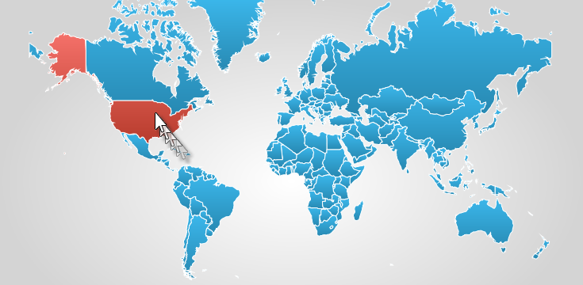

////

|metadata|
{
    "name": "xamgeographicmap-using-geographic-shape-control-series",
    "controlName": ["xamGeographicMap"],
    "tags": ["Getting Started","How Do I"],
    "guid": "79690046-4d44-4ad8-9320-bbfd309df52e",  
    "buildFlags": [],
    "createdOn": "2016-05-25T18:21:56.8472194Z"
}
|metadata|
////

= Using Geographic Shape Control Series

== Topic Overview

=== Purpose

This topic provides information on how to use the link:{ApiPlatform}controls.maps.xamgeographicmap.v{ProductVersion}~infragistics.controls.maps.geographicshapecontrolseries_members.html[GeographicShapeControlSeries] element in the link:{ApiPlatform}controls.maps.xamgeographicmap.v{ProductVersion}~infragistics.controls.maps.xamgeographicmap_members.html[xamGeographicMap]™ control.

=== Required background

The following table lists the topics required as a prerequisite to understanding this topic.

[options="header", cols="a,a"]
|====
|Topic|Purpose

| link:xamgeographicmap-adding-xamgeographicmap-to-a-page.html[Adding xamGeographicMap to a Page]
|This topic provides information on how to add the `xamGeographicMap` control to an application page.

| link:xamgeographicmap-visual-elements-of-xamgeographicmap.html[Visual Elements of xamGeographicMap]
|This topic provides information about layout of map elements in the `xamGeographicMap` control.

| link:xamgeographicmap-shape-files-reference.html[Shape Files Reference]
|This topic provides resources with information about maps, shape files, and geo-spatial related material. Use these resources to learn about and obtain geo-spatial shape files as well as tools for their editing.

| link:xamgeographicmap-binding-shape-files-with-geospatial-data.html[Binding Shape Files with Geo-spatial Data]
|This topic provides information on how to bind shape files with geo-spatial data to the `xamGeographicMap` control.

|====

=== In this topic

This topic contains the following sections:

* <<_Ref320651776, Geographic Shape Control Series >>
** <<_Ref320193474,Overview>>
** <<_Ref320651783,Preview>>
** <<_Ref320651786,Data Requirements>>
** <<_Ref335249132,Data Binding>>
** <<_Ref320651790,Example>>

* <<_Ref320185294,Related Content>>

== Geographic Shape Control Series

[[_Ref320193474]]

=== Overview

In the _xamGeographicMap_ control, the link:{ApiPlatform}controls.maps.xamgeographicmap.v{ProductVersion}~infragistics.controls.maps.geographicshapecontrolseries_members.html[GeographicShapeControlSeries] is a visual map element that renders shapes of geo-spatial data using the link:{ApiPlatform}controls.maps.xamgeographicmap.v{ProductVersion}~infragistics.controls.charts.shapecontrol_members.html[ShapeControl] template in a geographic context. This costs some performance in rendering the geo-spatial series, but adds certain features unique to the link:http://msdn.microsoft.com/en-us/library/system.windows.forms.control.aspx[Control] elements, such as the link:http://msdn.microsoft.com/en-us/library/system.windows.visualstatemanager(v=vs.95).aspx[VisualStateManager].

This type of geographic series is often used to render shapes of countries or regions defined by geographic locations. The link:{ApiPlatform}controls.maps.xamgeographicmap.v{ProductVersion}~infragistics.controls.maps.geographicshapecontrolseries_members.html[GeographicShapeControlSeries] works a lot like the link:{ApiPlatform}controls.maps.xamgeographicmap.v{ProductVersion}~infragistics.controls.maps.geographicpolylineseries_members.html[GeographicPolylineSeries] except that it renders geo-spatial data with polygons instead of polylines.

[[_Ref320651783]]

=== Preview

The following is a preview of the _xamGeographicMap_ control with link:{ApiPlatform}controls.maps.xamgeographicmap.v{ProductVersion}~infragistics.controls.maps.geographicshapecontrolseries_members.html[GeographicShapeControlSeries] that provides custom hover over visual states for shapes representing countries of the world.

[[_Ref320651786]]

=== Data Requirements

Similar to other types of geographic series in the `xamGeographicMap` control, the link:{ApiPlatform}controls.maps.xamgeographicmap.v{ProductVersion}~infragistics.controls.maps.geographicshapecontrolseries_members.html[GeographicShapeControlSeries] has the link:{ApiPlatform}controls.maps.xamgeographicmap.v{ProductVersion}~infragistics.controls.maps.geographicshapecontrolseries~itemssource.html[ItemsSource] property for the purpose of data binding. This property can be bound to an object that implements an link:http://msdn.microsoft.com/en-us/library/system.collections.ienumerable.aspx[IEnumerable] interface. In addition, each item in this object must have one data column that stores geographic locations (longitude and latitude) of a shape using the link:http://msdn.microsoft.com/en-us/library/system.collections.ienumerable.aspx[IEnumerable]< link:http://msdn.microsoft.com/en-us/library/system.windows.point.aspx[Point]> or link:http://msdn.microsoft.com/en-us/library/system.collections.ienumerable.aspx[IEnumerable]< link:http://msdn.microsoft.com/en-us/library/system.collections.ienumerable.aspx[IEnumerable]< link:http://msdn.microsoft.com/en-us/library/system.windows.point.aspx[Point]>> structure. The latter is the standard data structure used by shape files and the link:{ApiPlatform}controls.maps.xamgeographicmap.v{ProductVersion}~infragistics.controls.maps.shapefileconverter_members.html[ShapefileConverter] class. This data column is then mapped to the link:{ApiPlatform}controls.maps.xamgeographicmap.v{ProductVersion}~infragistics.controls.maps.geographicshapeseriesbase~shapememberpath.html[ShapeMemberPath] property. The link:{ApiPlatform}controls.maps.xamgeographicmap.v{ProductVersion}~infragistics.controls.maps.geographicshapecontrolseries_members.html[GeographicShapeControlSeries] uses points of this mapped data column to plot polygons in the `xamGeographicMap` control.

[[_Ref335249132]]

=== Data Binding

The following table summarizes properties of link:{ApiPlatform}controls.maps.xamgeographicmap.v{ProductVersion}~infragistics.controls.maps.geographicshapecontrolseries_members.html[GeographicShapeControlSeries] used for data binding.

[options="header", cols="a,a,a"]
|====
|Property Name|Property Type|Description

| link:{ApiPlatform}controls.maps.xamgeographicmap.v{ProductVersion}~infragistics.controls.maps.geographicshapecontrolseries~itemssource.html[ItemsSource]
|IEnumerable
|Gets or sets the source of items from which shape paths will be rendered.

| link:{ApiPlatform}controls.maps.xamgeographicmap.v{ProductVersion}~infragistics.controls.maps.geographicshapeseriesbase~shapememberpath.html[ShapeMemberPath]
|string
|The name of the property, from which to extract points of a shape for each item in the ItemsSource.

|====

[[_Ref320651790]]

=== Example

The following code shows how to bind the link:{ApiPlatform}controls.maps.xamgeographicmap.v{ProductVersion}~infragistics.controls.maps.geographicshapecontrolseries_members.html[GeographicShapeControlSeries] to shapes of countries in the world loaded from a shape file using the link:{ApiPlatform}controls.maps.xamgeographicmap.v{ProductVersion}~infragistics.controls.maps.shapefileconverter_members.html[ShapefileConverter].

*In XAML:*

[source,xaml]
----
<ig:ShapefileConverter x:Key="shapefileConverter"
                        ShapefileSource="ShapeFiles/world_countries.shp"
                        DatabaseSource="ShapeFiles/world_countries.dbf" >
</ig:ShapefileConverter>
<ig:XamGeographicMap x:Name="GeoMap">
    <ig:XamGeographicMap.Series>
        <ig:GeographicShapeControlSeries ItemsSource="{StaticResource shapefileConverter}"
                                         ShapeMemberPath="Points">
        </ig:GeographicShapeControlSeries>
    </ig:XamGeographicMap.Series>
</ig:XamGeographicMap>
----

*In Visual Basic:*

[source,vb]
----
' create and set data binding to the GeographicShapeControlSeries
Dim geoSeries = New GeographicShapeControlSeries()
geoSeries.ItemsSource = shapefileConverter
geoSeries.ShapeMemberPath = "Points"
' add the GeographicShapeControlSeries to the the xamGeographicMap
Me.GeoMap.Series.Add(geoSeries)
----

*In C#:*

[source,csharp]
----
// create and set data binding to the GeographicShapeControlSeries
var geoSeries = new GeographicShapeControlSeries();
geoSeries.ItemsSource = shapefileConverter;
geoSeries.ShapeMemberPath = "Points";
// add the GeographicShapeControlSeries to the the xamGeographicMap
this.GeoMap.Series.Add(geoSeries);
----

By default, the link:{ApiPlatform}controls.maps.xamgeographicmap.v{ProductVersion}~infragistics.controls.maps.geographicshapecontrolseries_members.html[GeographicShapeControlSeries] provides a visual state that temporarily increases thickness of a shape whenever the mouse cursor hover over it. You can change this behavior and add other visual state to animate the shape elements. You accomplish this by creating a style for link:{ApiPlatform}controls.maps.xamgeographicmap.v{ProductVersion}~infragistics.controls.charts.shapecontrol_members.html[ShapeControl] with the desired visual states in link:http://msdn.microsoft.com/en-us/library/system.windows.visualstategroup(v=vs.95).aspx[VisualStateGroups] of link:http://msdn.microsoft.com/en-us/library/system.windows.visualstatemanager(v=vs.95).aspx[VisualStateManager] and then setting this style to the link:{ApiPlatform}controls.maps.xamgeographicmap.v{ProductVersion}~infragistics.controls.maps.geographicshapecontrolseries_members.html[GeographicShapeControlSeries]' link:{ApiPlatform}controls.maps.xamgeographicmap.v{ProductVersion}~infragistics.controls.maps.geographicshapeseries~shapestyle.html[ShapeStyle] property.

The following code shows how to provide a style with a visual state that changes the color of shapes whenever the mouse cursor hovers over them.

*In XAML:*

[source,xaml]
----
<ig:GeographicShapeControlSeries>
   <ig:GeographicShapeControlSeries.ShapeStyle>
        
   </ig:GeographicShapeControlSeries.ShapeStyle>
</ig:GeographicShapeControlSeries>
----

[[_Ref320185294]]

== Related Content

=== Topics

The following topics provide additional information related to this topic.

[options="header", cols="a,a"]
|====
|Topic|Purpose

| link:xamgeographicmap-adding-xamgeographicmap-to-a-page.html[Adding xamGeographicMap to a Page]
|This topic provides information on how to add the `xamGeographicMap` control to an application page.

| link:xamgeographicmap-visual-elements-of-xamgeographicmap.html[Visual Elements of xamGeographicMap]
|This topic provides information about layout of map elements in the `xamGeographicMap` control.

| link:xamgeographicmap-shape-files-reference.html[Shape Files Reference]
|This topic provides resources with information about maps, shape files, and geo-spatial related material. Use these resources to learn about and obtain geo-spatial shape files as well as tools for their editing.

| link:xamgeographicmap-binding-shape-files-with-geospatial-data.html[Binding Shape Files with Geo-spatial Data]
|This topic provides information on how to bind shape files with geo-spatial data to the `xamGeographicMap` control.

|====