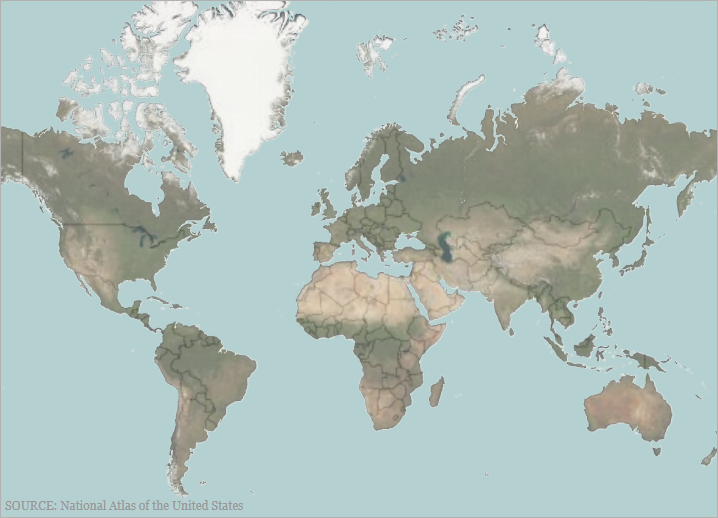

////

|metadata|
{
    "name": "xamgeographicmap-using-geographic-tile-series",
    "controlName": ["xamGeographicMap"],
    "tags": ["Getting Started","How Do I"],
    "guid": "62d265c7-dbe3-4ae3-9131-155edd757bb1",  
    "buildFlags": [],
    "createdOn": "2016-05-25T18:21:56.8622141Z"
}
|metadata|
////

= Using Geographic Tile Series

== Topic Overview

=== Purpose

This topic provides information on how to use the link:{ApiPlatform}controls.maps.xamgeographicmap{ApiVersion}~infragistics.controls.maps.geographictileseries_members.html[GeographicTileSeries] type of series in the  _xamGeographicMap_™ control.

=== Required background

The following topics are prerequisites to understanding this topic:

[options="header", cols="a,a"]
|====
|Topic|Purpose

| link:xamgeographicmap-adding-xamgeographicmap-to-a-page.html[Adding xamGeographicMap to a Page]
|This topic provides information on how to add the _xamGeographicMap_ control to an application page.

| link:xamgeographicmap-using-geographic-series.html[Using Geographic Series]
|This topic provides information about supported types of geographic series in the _xamGeographicMap_ control.

| link:xamgeographicmap-visual-elements-of-xamgeographicmap.html[Visual Elements of xamGeographicMap]
|This topic provides information about layout of map elements in the _xamGeographicMap_ control.

|====

=== In this topic

This topic contains the following sections:

* Geographic Tile Series

** <<Overview,Overview>>
** <<Preview,Preview>>
** <<IileImagery,Tile Imagery>>
** <<ItemsSource,Items Source>>
** <<DataBinding,Data Binding>>
** <<TileImagery,Tile Imagery>>

* <<UsingTileImageryProperty,Using TileImagery Property>>
* <<UsingItemsSourceProperty,Using ItemsSource Property>>
* <<RelatedContent,Related Content>>

== Geographic Tile Series

[[Overview]]

=== Overview

The link:{ApiPlatform}controls.maps.xamgeographicmap{ApiVersion}~infragistics.controls.maps.geographictileseries_members.html[GeographicTileSeries] is a visual map element belonging to the _xamGeographicMap_ control that overlays additional tile imagery over the base tile imagery defined in the _xamGeographicMap_ control’s link:{ApiPlatform}controls.maps.xamgeographicmap{ApiVersion}~infragistics.controls.maps.xamgeographicmap~backgroundcontent.html[BackgroundContent] property.

The link:{ApiPlatform}controls.maps.xamgeographicmap{ApiVersion}~infragistics.controls.maps.geographictileseries_members.html[GeographicTileSeries] is similar to the GeographicPolylineSeries except that the polylines function is to clip the tile visuals rather than to draw polylines.

Setting the Opacity property of the link:{ApiPlatform}controls.maps.xamgeographicmap{ApiVersion}~infragistics.controls.maps.geographictileseries_members.html[GeographicTileSeries] series allows you to create composite/overlaid tile maps using the _xamGeographicMap_ control’s multiple link:{ApiPlatform}controls.maps.xamgeographicmap{ApiVersion}~infragistics.controls.maps.geographictileseries_members.html[GeographicTileSeries] series.

[[Preview]]

=== Preview

The following screenshot previews the _xamGeographicMap_ control with Open Source Maps set as the link:{ApiPlatform}controls.maps.xamgeographicmap{ApiVersion}~infragistics.controls.maps.xamgeographicmap~backgroundcontent.html[BackgroundContent], and Bing Maps set as the link:{ApiPlatform}controls.maps.xamgeographicmap{ApiVersion}~infragistics.controls.maps.geographictileseries~tileimagery.html[TileImagery] clipped to a Shapefile of the world.

image::images/Using_Geographic_Tile_Series_1.png[]

[[TileImagery]]

=== Tile Imagery

Use the link:{ApiPlatform}controls.maps.xamgeographicmap{ApiVersion}~infragistics.controls.maps.geographictileseries_members.html[GeographicTileSeries] series’ link:{ApiPlatform}controls.maps.xamgeographicmap{ApiVersion}~infragistics.controls.maps.geographictileseries~tileimagery.html[TileImagery] property to display the series’ geographic imagery source. This property can be set the same way as setting the _xamGeographicMap_ control’s link:{ApiPlatform}controls.maps.xamgeographicmap{ApiVersion}~infragistics.controls.maps.xamgeographicmap~backgroundcontent.html[BackgroundContent]. The link:{ApiPlatform}controls.maps.xamgeographicmap{ApiVersion}~infragistics.controls.maps.geographictileseries_members.html[GeographicTileSeries] supports the same types of geographic imagery sources such as Bing Maps. For more information, see the link:xamgeographicmap-using-geographic-imagery.html[Using Geographic Imagery] topic.

[[ItemsSource]]

=== Items Source

Similar to other types of geographic series in the _xamGeographicMap_ control, the link:{ApiPlatform}controls.maps.xamgeographicmap{ApiVersion}~infragistics.controls.maps.geographictileseries_members.html[GeographicTileSeries] has the link:{ApiPlatform}controls.maps.xamgeographicmap{ApiVersion}~infragistics.controls.maps.geographictileseries~itemssource.html[ItemsSource] property for data binding. This optional property can be bound to objects implementing an interface. Additionally, each item in this object must have one data column that stores the shape’s geographic locations (longitude and latitude) using the < link:http://msdn.microsoft.com/en-us/library/system.windows.point.aspx[Point]> or < link:http://msdn.microsoft.com/en-us/library/system.collections.ienumerable.aspx[IEnumerable]< link:http://msdn.microsoft.com/en-us/library/system.windows.point.aspx[Point]>> structure. The latter is the standard data structure used by shape files and the link:{ApiPlatform}controls.maps.xamgeographicmap{ApiVersion}~infragistics.controls.maps.shapefileconverter_members.html[ShapefileConverter] class. Map this data column to the link:{ApiPlatform}controls.maps.xamgeographicmap{ApiVersion}~infragistics.controls.maps.geographicshapeseriesbase~shapememberpath.html[ShapeMemberPath] property. The link:{ApiPlatform}controls.maps.xamgeographicmap{ApiVersion}~infragistics.controls.maps.geographictileseries_members.html[GeographicTileSeries] uses points of this mapped data column to clip polylines in the xamGeographicMap control.

[[DataBinding]]

=== Data Binding

The following table summarizes the data binding properties of the link:{ApiPlatform}controls.maps.xamgeographicmap{ApiVersion}~infragistics.controls.maps.geographictileseries_members.html[GeographicTileSeries].

[options="header", cols="a,a,a"]
|====
|*Property Name*|*Property Type*|* Description*

| link:{ApiPlatform}controls.maps.xamgeographicmap{ApiVersion}~infragistics.controls.maps.geographictileseries~itemssource.html[ItemsSource]
|IEnumerable
|Gets or sets the source of items from which shape files will be rendered.

| link:{ApiPlatform}controls.maps.xamgeographicmap{ApiVersion}~infragistics.controls.maps.geographicshapeseriesbase~shapememberpath.html[ShapeMemberPath]
|String
|The name of the property, from which to extract points of a shape for each item in the link:{ApiPlatform}controls.maps.xamgeographicmap{ApiVersion}~infragistics.controls.maps.geographictileseries~itemssource.html[ItemsSource].

| link:{ApiPlatform}controls.maps.xamgeographicmap{ApiVersion}~infragistics.controls.maps.geographictileseries~tileimagery.html[TileImagery]
|GeographicMapImagery
|The type of imagery used to display geographic imagery for the series.

|====

[[UsingTileImageryProperty]]
== Using the TileImagery Property

=== Example

The following screenshot demonstrates how the  _xamGeorgraphicMap_  control with the link:{ApiPlatform}controls.maps.xamgeographicmap{ApiVersion}~infragistics.controls.maps.geographictileseries~tileimagery.html[TileImagery] and Opacity properties of the link:{ApiPlatform}controls.maps.xamgeographicmap{ApiVersion}~infragistics.controls.maps.geographictileseries_members.html[GeographicTileSeries] looks as a result of the following settings:

[options="header", cols="a,a"]
|====
|*Property*|*Value*

| link:{ApiPlatform}controls.maps.xamgeographicmap{ApiVersion}~infragistics.controls.maps.geographictileseries~tileimagery.html[TileImagery]
|BingMapsMapImagery

|Opacity
|0.5

|====

Where the link:{ApiPlatform}controls.maps.xamgeographicmap{ApiVersion}~infragistics.controls.maps.bingmapsmapimagery~imagerystyle.html[ImageryStyle] of the link:{ApiPlatform}controls.maps.xamgeographicmap{ApiVersion}~infragistics.controls.maps.bingmapsmapimagery_members.html[BingMapsMapImagery] class is set as BingMapsImageryStyle.Aerial.

*In XAML:*

[source,xaml]
----
<ig:XamGeographicMap x:Name="GeoMap"
                     Zoomable="True"
                     >
   <ig:XamGeographicMap.BackgroundContent>
      <ig:OpenStreetMapImagery/>
   </ig:XamGeographicMap.BackgroundContent>
   <ig:XamGeographicMap.Series>
      <ig:GeographicTileSeries Opacity="0.5">
         <ig:GeographicTileSeries.TileImagery>
            <ig:BingMapsMapImagery ApiKey="API_KEY" ImageryStyle="Aerial" 
                                   />
         </ig:GeographicTileSeries.TileImagery>
      </ig:GeographicTileSeries>
   </ig:XamGeographicMap.Series>
</ig:XamGeographicMap>
----

*In C#:*

[source,csharp]
----
var series = this.GeoMap.Series.OfType<GeographicTileSeries>().First();
series.Opacity = 0.5;
series.TileImagery = new BingMapsMapImagery { ImageryStyle = BingMapsImageryStyle.Aerial, ApiKey = API_KEY};
----

*In Visual Basic:*

[source,vb]
----
Dim series As var = Me.GeoMap.Series.OfType.First
Series.Opacity = 0.5;series.TileImagery = New BingMapsMapImagery() {ImageryStyle=BingMapsImageryStyle.Aerial, ApiKey=API_KEY}
----

[[UsingItemsSourceProperty]]
== Using the ItemsSource Property

The following screenshot demonstrates how the  _xamGeorgraphicMap_  control renders with the link:{ApiPlatform}controls.maps.xamgeographicmap{ApiVersion}~infragistics.controls.maps.geographictileseries~itemssource.html[ItemsSource] property set to a simple geographic rectangle.

*In C#:*

[source,csharp]
----
var customRegion = new List<List<Point>>();
var shapePoints = new List<Point> { new Point(-100, 60), new Point(100, 60), 
new Point(100, -30), 
new Point(-100, -30) };
customRegion.Add(shapePoints);
var series = this.GeoMap.Series.OfType<GeographicTileSeries>().First();
series.ShapeMemberPath = "";
series.ItemsSource = customRegion;
----

*In Visual Basic:*

[source,vb]
----
Dim customRegion As var = New List(Of List)
Dim shapePoints As var = New List(Of Point)() 
{New Point(-100, 60), New Point(100, 60), 
New Point(100, -30), 
NewPoint(-100, -30)}
customRegion.Add(shapePoints) 
Dim series As var = Me.GeoMap.Series.OfType.First
series.ShapeMemberPath = ""
series.ItemsSource = customRegion
----

The screenshot following the table illustrates how the  _xamGeorgraphicMap_  control renders with the link:{ApiPlatform}controls.maps.xamgeographicmap{ApiVersion}~infragistics.controls.maps.geographictileseries~itemssource.html[ItemsSource] property set to a ShapeFileConverter using the following settings:

[options="header", cols="a,a"]
|====
|*Property*|*Value*

| link:{ApiPlatform}controls.maps.xamgeographicmap{ApiVersion}~infragistics.controls.maps.geographictileseries~itemssource.html[ItemsSource]
|WorldContinentsShapefile

| link:{ApiPlatform}controls.maps.xamgeographicmap{ApiVersion}~infragistics.controls.maps.geographicshapeseriesbase~shapememberpath.html[ShapeMemberPath]
|Points

|====

image::images/Using_Geographic_Tile_Series_1.png[]

*In XAML:*

[source,xaml]
----
<ResourceDictionary>
   <!-- ShapeFileProvider provides absolute path to a shape file -->
   <providers:ShapeFileProvider x:Key="WorldContinentsProvider" 
   ShapeFileRelativePath="/world/world_continents.shp"
   ShapeDatabaseRelativePath="world/world_continents.dbf"/>
   <!-- ShapefileConverter loads shapes from shape files (SHP) and -->
   <!-- stores them in the Points property as List<List<Point>> object type -->
   <ig:ShapefileConverter x:Key="WorldContinentsShapefile"
                          ImportCompleted="OnShapefileImportCompleted"
                          CollectionChanged="OnShapefileCollectionChanged"
                          ShapefileSource="{Binding Path=ShapeFileAbsolutePath, Source={StaticResource WorldContinentsProvider}}"
                          DatabaseSource="{Binding Path=ShapeDatabaseAbsolutePath, Source={StaticResource WorldContinentsProvider}}" />
</ResourceDictionary>
<Grid x:Name="LayoutRoot">
   <ig:XamGeographicMap x:Name="GeoMap"
                        Zoomable="True"
                        BackgroundContent="{x:Null}" >
      <ig:XamGeographicMap.Series>
         <ig:GeographicTileSeries ItemsSource="{StaticResource WorldContinentsShapefile}" 
                                  ShapeMemberPath="Points"  >
            <ig:GeographicTileSeries.TileImagery>
               <ig:OpenStreetMapImagery />
            </ig:GeographicTileSeries.TileImagery>
         </ig:GeographicTileSeries>
      </ig:XamGeographicMap.Series>
   </ig:XamGeographicMap>
</Grid>
----

*In C#:*

[source,csharp]
----
series.ShapeMemberPath = "Points";
series.ItemsSource = this.Resources["WorldContinentsShapefile"] as ShapefileConverter;
----

*In Visual Basic:*

[source,vb]
----
series.ShapeMemberPath = "Points"series.ItemsSource = CType(Me.Resources("WorldContinentsShapefile"),ShapefileConverter)
----

[[RelatedContent]]
== Related Content

=== Topics

The following topics provide additional information related to this topic.

[options="header", cols="a,a"]
|====
|Topic|Purpose

| link:xamgeographicmap-adding-xamgeographicmap-to-a-page.html[Adding xamGeographicMap to a Page]
|This topic provides information on how to add the _xamGeographicMap_ control to an application page.

| link:xamgeographicmap-visual-elements-of-xamgeographicmap.html[Visual Elements of xamGeographicMap]
|This topic provides information about layout of map elements in the _xamGeographicMap_ control.

| link:xamgeographicmap-shape-files-reference.html[Shape Files Reference]
|This topic provides resources with information about maps, shape files, and geo-spatial related material. Use these resources to learn about and obtain geo-spatial shape files as well as tools for their editing.

|====

ifdef::sl[]

=== Samples

The following sample provides additional information related to this topic.

ifdef::sl[]

[cols="a,a"]
|====
ifdef::sl[]
|Sample|Purpose
endif::sl[]

ifdef::sl[]
| link:{SamplesURL}/geographic-map/#/geographic-tile-imagery-series[Geographic Tile Imagery Series]
|This sample demonstrates the xamGeographicMap control with Open Source Maps set as the background content and Bing Maps set as the tile imagery clipped to a Shapefile of the world.
endif::sl[]

ifdef::sl[]
| link:{SamplesURL}/geographic-map/#/binding-geographic-tile-series[Binding Geographic Tile Series]
|This sample demonstrates how to set the tile imagery of the GeographicTileSeries to external geo-spatial imagery services including Open Street Maps, Microsoft Bing Maps, and ArcGIS Maps. To use geo-spatial imagery tiles from ArcGIS Maps or Bing Maps sources, you must acquire a key from the respective vendor.
endif::sl[]

|====

endif::sl[]

endif::sl[]