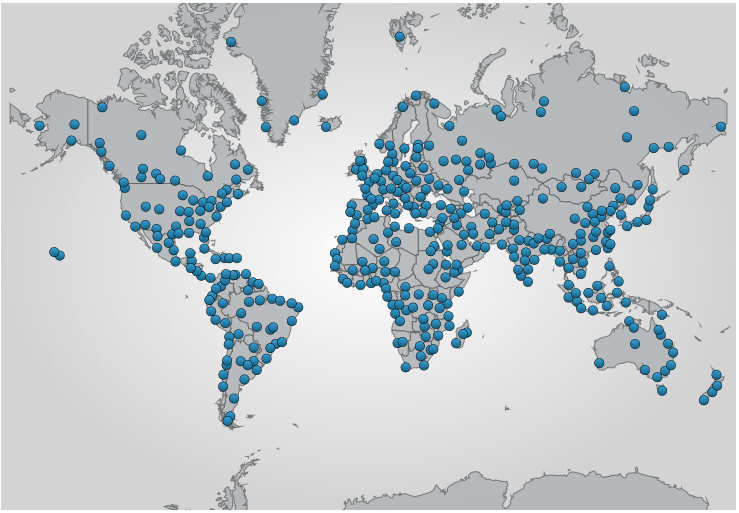
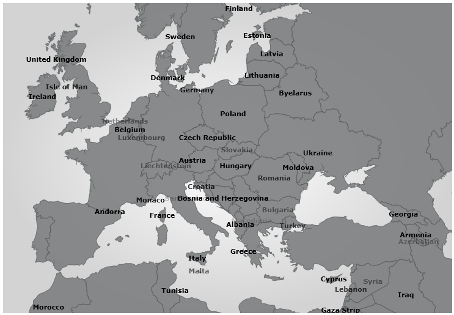

////

|metadata|
{
    "name": "xamgeographicmap-using-markers-in-geographic-series",
    "controlName": ["xamGeographicMap"],
    "tags": ["Data Binding","Data Presentation","How Do I","Styling","Templating"],
    "guid": "df06052e-33e3-4f0a-8d5d-e8306053d8cc",  
    "buildFlags": [],
    "createdOn": "2016-05-25T18:21:56.7682082Z"
}
|metadata|
////

= Using Markers in Geographic Series

== Topic Overview

=== Purpose

This topic provides information on how to use markers in geographic series of the link:{ApiPlatform}controls.maps.xamgeographicmap.v{ProductVersion}~infragistics.controls.maps.xamgeographicmap_members.html[xamGeographicMap]™ control.

=== Required background

The following table lists the topics required as a prerequisite to understanding this topic.

[options="header", cols="a,a"]
|====
|Topic|Purpose

| link:xamgeographicmap-shape-files-reference.html[Shape Files Reference]
|This topic provides resources with information about maps, shape files, and geo-spatial related material. Use these resources to learn about and obtain geo-spatial shape files as well as tools for their editing.

| link:xamgeographicmap-binding-shape-files-with-geospatial-data.html[Binding Shape Files with Geo-spatial Data]
|This topic provides information on how to bind shape files with geo-spatial data to the _xamGeographicMap_ control.

| link:xamgeographicmap-using-geographic-symbol-series.html[Using Geographic Symbol Series]
|This topic provides information on how to use the link:{ApiPlatform}controls.maps.xamgeographicmap.v{ProductVersion}~infragistics.controls.maps.geographicsymbolseries_members.html[GeographicSymbolSeries] element in the _xamGeographicMap_ control.

| link:xamgeographicmap-using-geographic-shape-series.html[Using Geographic Shape Series]
|This topic provides information on how to use the link:{ApiPlatform}controls.maps.xamgeographicmap.v{ProductVersion}~infragistics.controls.maps.geographicshapeseries_members.html[GeographicShapeSeries] element in the _xamGeographicMap_ control.

|====

=== In this topic

This topic contains the following sections:

* <<_Ref320745633, Displaying Basic Markers in Geographic Series >>

** <<_Ref320745641,Overview>>
** <<_Ref320745644,Property settings>>
** <<_Ref320745648,Example>>
** <<_Ref320745654,Code>>

* <<_Ref320745637, Creating Custom Markers in Geographic Series >>

** <<_Ref320745659,Overview>>
** <<_Ref320745688,Preview>>
** <<_Ref320745668,Example>>

* <<_Ref320185294, Related Content >>

[[_Ref320745633]]
[[_Ref320651776]]
== Displaying Basic Markers in Geographic Series

[[_Ref320745641]]

=== Overview

In the _xamGeographicMap_ control, markers are visual elements that display values of data items bound to geographic series in geographic locations of the map. Marker can be represented as labels, symbols or custom data templates.

The following types of geographic series support markers:

* link:{ApiPlatform}controls.maps.xamgeographicmap.v{ProductVersion}~infragistics.controls.maps.geographicsymbolseries_members.html[GeographicSymbolSeries]
* link:{ApiPlatform}controls.maps.xamgeographicmap.v{ProductVersion}~infragistics.controls.maps.geographicshapeseries_members.html[GeographicShapeSeries]

[[_Ref320745644]]

=== Property settings

The following table maps the desired configuration to property settings of geographic series.

[options="header", cols="a,a,a"]
|====
|In order to:|Use this property:|And set it to:

|Display markers
| link:{ApiPlatform}controls.maps.xamgeographicmap.v{ProductVersion}~infragistics.controls.maps.geographicsymbolseries~markertype.html[MarkerType]
| link:{ApiPlatform}controls.maps.xamgeographicmap.v{ProductVersion}~infragistics.controls.maps.geographicsymbolseries~markertype.html[MarkerType].Circle

|Change markers’ brush
| link:{ApiPlatform}controls.maps.xamgeographicmap.v{ProductVersion}~infragistics.controls.maps.geographicsymbolseries~markerbrush.html[MarkerBrush]
| link:http://msdn.microsoft.com/en-us/library/system.windows.media.brush.aspx[Brush]

|Change markers’ outline
| link:{ApiPlatform}controls.maps.xamgeographicmap.v{ProductVersion}~infragistics.controls.maps.geographicsymbolseries~markeroutline.html[MarkerOutline]
| link:http://msdn.microsoft.com/en-us/library/system.windows.media.brush.aspx[Brush]

|Enable markers’ collision avoidance
| link:{ApiPlatform}controls.maps.xamgeographicmap.v{ProductVersion}~infragistics.controls.maps.geographicsymbolseries~markercollisionavoidance.html[MarkerCollisionAvoidance]
| link:{ApiPlatform}controls.maps.xamgeographicmap.v{ProductVersion}~infragistics.controls.maps.geographicsymbolseries~markercollisionavoidance.html[CollisionAvoidanceType].Fade

|====

[[_Ref320745648]]

=== Example

The screenshot below demonstrates how the _xamGeographicMap_ control looks as a result of the following settings:

[options="header", cols="a,a"]
|====
|Property|Value

| link:{ApiPlatform}controls.maps.xamgeographicmap.v{ProductVersion}~infragistics.controls.maps.geographicsymbolseries~markertype.html[MarkerType]
| link:{ApiPlatform}controls.maps.xamgeographicmap.v{ProductVersion}~infragistics.controls.maps.geographicsymbolseries~markertype.html[MarkerType].Circle

| link:{ApiPlatform}controls.maps.xamgeographicmap.v{ProductVersion}~infragistics.controls.maps.geographicsymbolseries~markerbrush.html[MarkerBrush]
|Blue

| link:{ApiPlatform}controls.maps.xamgeographicmap.v{ProductVersion}~infragistics.controls.maps.geographicsymbolseries~markeroutline.html[MarkerOutline]
|Black

| link:{ApiPlatform}controls.maps.xamgeographicmap.v{ProductVersion}~infragistics.controls.maps.geographicsymbolseries~markercollisionavoidance.html[MarkerCollisionAvoidance]
| link:{ApiPlatform}controls.maps.xamgeographicmap.v{ProductVersion}~infragistics.controls.maps.geographicsymbolseries~markercollisionavoidance.html[CollisionAvoidanceType].None

|====

[[_Ref320745654]]

=== Code

The following code changes the appearance of markers in the link:{ApiPlatform}controls.maps.xamgeographicmap.v{ProductVersion}~infragistics.controls.maps.geographicsymbolseries_members.html[GeographicSymbolSeries]

*In XAML:*

[source,xaml]
----
<ig:XamGeographicMap.Series>
    <ig:GeographicSymbolSeries ItemsSource="{StaticResource shapefileConverter}"
                                MarkerBrush="Blue" 
                                MarkerOutline="Black"
                                MarkerCollisionAvoidance="None"
                                LongitudeMemberPath="Points[0][0].X"
                                LatitudeMemberPath="Points[0][0].Y">
    </ig:GeographicSymbolSeries>
</ig:XamGeographicMap.Series>
----

[[_Ref320745637]]
== Creating Custom Markers in Geographic Series

[[_Ref320745659]]

=== Overview

The link:{ApiPlatform}controls.maps.xamgeographicmap.v{ProductVersion}~infragistics.controls.maps.geographicshapeseries~markertemplate.html[MarkerTemplate] property of geographic series can be used to provide custom data templates to display custom symbols and/or values of data items. Custom data templates can access values of data items bound to the ItemsSource property of geographic series by binding to the Item property. When a geographic series is bound to the link:{ApiPlatform}controls.maps.xamgeographicmap.v{ProductVersion}~infragistics.controls.maps.shapefileconverter_members.html[ShapefileConverter] then the Item property is resolved to a link:{ApiPlatform}controls.maps.xamgeographicmap.v{ProductVersion}~infragistics.controls.maps.shapefilerecord_members.html[ShapefileRecord] object and values loaded from a shape database (.dbf) file can be accessed through the link:{ApiPlatform}controls.maps.xamgeographicmap.v{ProductVersion}~infragistics.controls.maps.shapefilerecord~fields.html[Fields] property.

[[_Ref320745688]]

=== Preview

The following is a preview of the _xamGeographicMap_ control with markers displaying names of countries on all shapes of link:{ApiPlatform}controls.maps.xamgeographicmap.v{ProductVersion}~infragistics.controls.maps.geographicshapeseries_members.html[GeographicShapeSeries].

[[_Ref320745668]]

=== Example

The following code creates a custom data template for markers of link:{ApiPlatform}controls.maps.xamgeographicmap.v{ProductVersion}~infragistics.controls.maps.geographicshapeseries_members.html[GeographicShapeSeries] with binding to a data column that contains names of countries.

*In XAML:*

[source,xaml]
----
<ig:GeographicShapeSeries ItemsSource="{StaticResource shapefileConverter}"
                          ShapeMemberPath="Points"
                          MarkerCollisionAvoidance="Fade">
    <ig:GeographicShapeSeries.MarkerTemplate>
        <DataTemplate>
            <TextBlock Text="{Binding Path=Item.Fields[CNTRY_NAME]}" FontWeight="Bold" />
        </DataTemplate>
    </ig:GeographicShapeSeries.MarkerTemplate>
</ig:GeographicShapeSeries>
----

[[_Ref320185294]]
== Related Content

=== Topics

The following topics provide additional information related to this topic.

[options="header", cols="a,a"]
|====
|Topic|Purpose

| link:xamgeographicmap-shape-files-reference.html[Shape Files Reference]
|This topic provides resources with information about maps, shape files, and geo-spatial related material. Use these resources to learn about and obtain geo-spatial shape files as well as tools for their editing.

| link:xamgeographicmap-binding-shape-files-with-geospatial-data.html[Binding Shape Files with Geo-spatial Data]
|This topic provides information on how to bind shape files with geo-spatial data to the _xamGeographicMap_ control.

| link:xamgeographicmap-using-geographic-series.html[Using Geographic Series]
|This topic provides information about supported types of geographic series in the _xamGeographicMap_ control.

|====