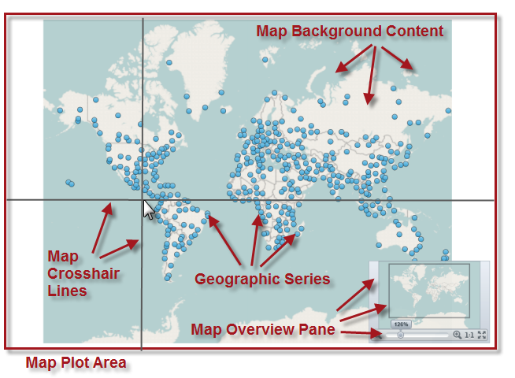

////

|metadata|
{
    "name": "xamgeographicmap-visual-elements-of-xamgeographicmap",
    "controlName": ["xamGeographicMap"],
    "tags": ["Getting Started","Layouts"],
    "guid": "4650cf33-0e7d-45e7-a6d4-de8904f957e2",  
    "buildFlags": [],
    "createdOn": "2016-05-25T18:21:56.7572078Z"
}
|metadata|
////

= Visual Elements of xamGeographicMap

== Topic Overview

=== Purpose

This topic provides information about the layout of the visual elements in the link:{ApiPlatform}controls.maps.xamgeographicmap{ApiVersion}~infragistics.controls.maps.xamgeographicmap_members.html[xamGeographicMap]™ control.

=== In this topic

This topic contains the following sections:

* <<_Ref320715791,Visual Elements of xamGeographicMap Control and Related Properties>>

** <<_Ref320715795,Visual elements summary>>
** <<_Ref320715799,Visual elements and related properties>>

* <<_Ref320185294,Related Content>>

[[_Ref320715791]]
== Visual Elements of xamGeographicMap Control and Related Properties

[[_Ref320715795]]

=== Visual elements summary

The following screenshot depicts the visual elements of the _xamGeographicMap_ control. Configurable elements are listed after the image.

*Configurable Visual Elements:*

* Map Plot Area
* Map Background Content
* Geographic Series
* Map Crosshair Lines
* Map Overview Pane

[[_Ref320715799]]

=== Visual elements and related properties

The following table maps the visual elements of the _xamGeographicMap_ control and the properties that configure them.

[options="header", cols="a,a,a"]
|====
|Visual Element|Description|Property

|Map Plot Area
|Represents an area within the _xamGeographicMap_ control used for plotting geographic imagery tiles and geo-spatial data using geographic series as well as displaying map crosshair lines and map overview pane. Background of this area can changed to any link:http://msdn.microsoft.com/en-us/library/system.windows.media.brush.aspx[Brush] object by setting the link:{ApiPlatform}controls.charts.xamdatachart{ApiVersion}~infragistics.controls.seriesviewer~plotareabackground.html[PlotAreaBackground] property of the _xamGeographicMap_ control.
| link:{ApiPlatform}controls.charts.xamdatachart{ApiVersion}~infragistics.controls.seriesviewer~plotareabackground.html[PlotAreaBackground]

|Map Background Content
|Represents an area of the _xamGeographicMap_ control for plotting geographic imagery tiles from supported mapping services such as Open Street Map, ArcGIS Maps, and Bing Maps. Refer to the link:xamgeographicmap-using-geographic-imagery.html[Using Geographic Imagery] topic for more information about this map element.
| link:{ApiPlatform}controls.maps.xamgeographicmap{ApiVersion}~infragistics.controls.maps.xamgeographicmap~backgroundcontent.html[BackgroundContent]

|Geographic Series
|Represent map elements for rendering geo-spatial vector data -points ( link:{ApiPlatform}controls.maps.xamgeographicmap{ApiVersion}~infragistics.controls.maps.geographicsymbolseries_members.html[GeographicSymbolSeries]), polylines ( link:{ApiPlatform}controls.maps.xamgeographicmap{ApiVersion}~infragistics.controls.maps.geographicpolylineseries_members.html[GeographicPolylineSeries]), or polygons ( link:{ApiPlatform}controls.maps.xamgeographicmap{ApiVersion}~infragistics.controls.maps.geographicshapeseries_members.html[GeographicShapeSeries]) in geographic context. The _xamGeographicMap_ control’ link:{ApiPlatform}controls.charts.xamdatachart{ApiVersion}~infragistics.controls.seriesviewer~series.html[Series] property is a collection of geographic series objects. For more information about geographic series elements supported in the _xamGeographicMap_ control, refer to the link:xamgeographicmap-using-geographic-series.html[Using Geographic Series] topic.
| link:{ApiPlatform}controls.charts.xamdatachart{ApiVersion}~infragistics.controls.seriesviewer~series.html[Series]

|Map Crosshair Lines
|Represents vertical and horizontal lines that intersect at the location of mouse cursor when it hovers over the map plot area of the _xamGeographicMap_ control.
| link:{ApiPlatform}controls.charts.xamdatachart{ApiVersion}~infragistics.controls.seriesviewer~crosshairvisibility.html[CrosshairVisibility] link:{ApiPlatform}controls.charts.xamdatachart{ApiVersion}~infragistics.controls.seriesviewer~crosshairlinestyle.html[CrosshairLineStyle]

|Map Overview Pane
|Represents the link:{ApiPlatform}datavisualization{ApiVersion}~infragistics.controls.xamoverviewplusdetailpane_members.html[xamOverviewPlusDetailPane] control with configurable location and easy-to-use zooming and panning functionalities for navigating map content of the _xamGeographicMap_ control.
| link:{ApiPlatform}controls.charts.xamdatachart{ApiVersion}~infragistics.controls.seriesviewer~overviewplusdetailpanevisibility.html[OverviewPlusDetailPaneVisibility] link:{ApiPlatform}controls.charts.xamdatachart{ApiVersion}~infragistics.controls.seriesviewer~overviewplusdetailpanestyle.html[OverviewPlusDetailPaneStyle]

|====

[[_Ref320185294]]
== Related Content

=== Topics

The following topics provide additional information related to this topic.

[options="header", cols="a,a"]
|====
| *Topic* | *Purpose* 

| link:xamgeographicmap-using-geographic-imagery.html[Using Geographic Imagery]
|This topic provides information on how to use geographic imagery tiles in the _xamGeographicMap_ control.

| link:xamgeographicmap-using-geographic-series.html[Using Geographic Series]
|This topic provides information on common usage of all types of geographic series in the _xamGeographicMap_ control, their benefits, and shared features.

| link:xamgeographicmap-navigating-map-content.html[Navigating Map Content]
|This topic provides information on how to navigate map content in the _xamGeographicMap_ control.

| link:xamgeographicmap-api-overview.html[API Overview]
|This topic provides an API overview of key classes and properties of the _xamGeographicMap_ control and its components.

|====