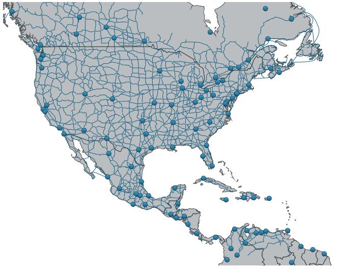
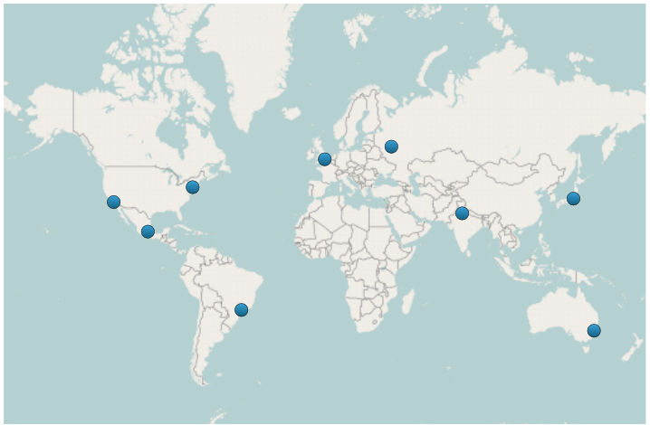
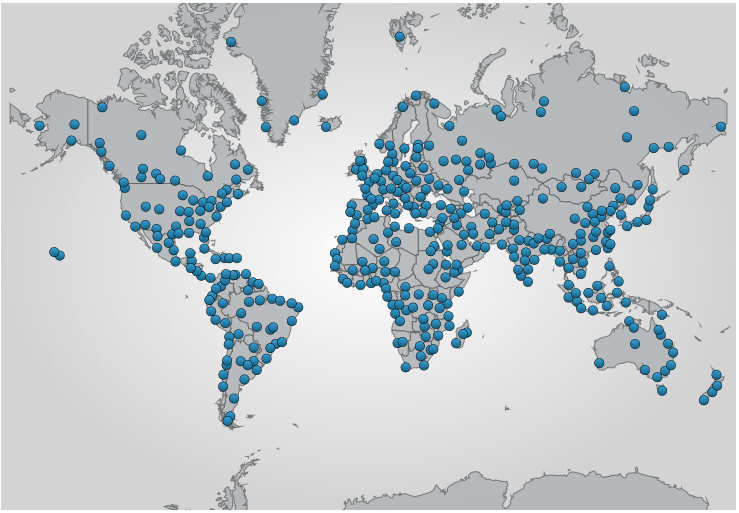
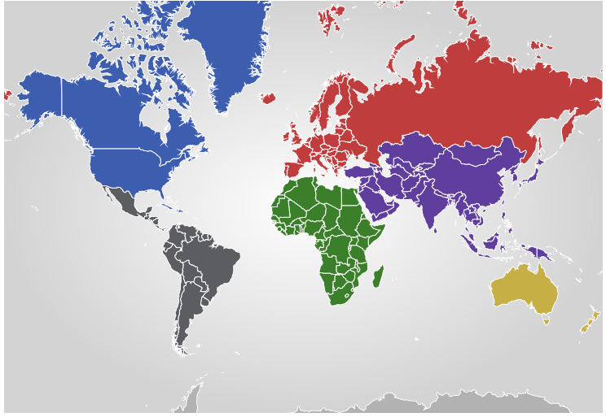
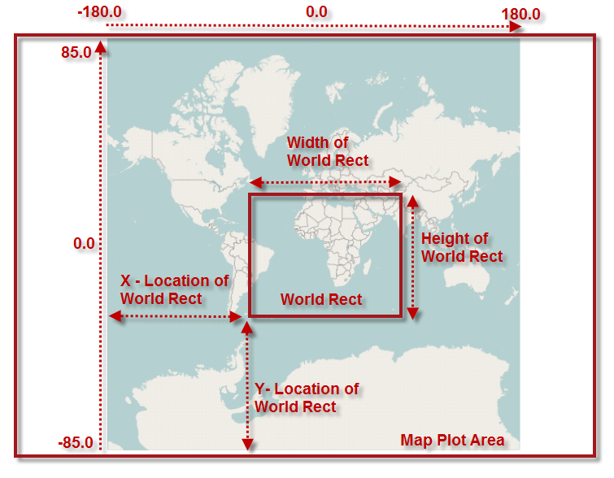

////
|metadata|
{
    "name": "xamgeographicmap",
    "controlName": ["xamGeographicMap"],
    "tags": ["Data Binding","Getting Started","How Do I","Navigation"],
    "guid": "33ab6baa-2f57-4b27-b4a5-6b04a90b8423",
    "buildFlags": [],
    "createdOn": "2016-05-25T18:21:56.6302095Z"
}
|metadata|
////

= xamGeographicMap

=== Introduction

The link:{ApiPlatform}controls.maps.xamgeographicmap{ApiVersion}~infragistics.controls.maps.xamgeographicmap_members.html[xamGeographicMap]™ control allows you to display data that contains geographic locations from view models or geo-spatial data loaded from shape files on geographic imagery maps.

=== In this Topic

This topic contains the following sections

* <<_Ref321151531,Features Overview>>
* <<_Ref321151536,Geographic Imagery Maps>>
* <<_Ref321151541,Geographic Series>>
* <<_Ref321151550,Shape File Converter>>
* <<_Ref321151553,Data Binding>>
* <<_Ref321151558,High Performance Rendering>>
* <<_Ref321151561,Customizable Shape Templates>>
* <<_Ref321151565,Customizable Marker Templates>>
* <<_Ref321151568,Map Navigation>>

[[_Ref321151531]]

=== Features Overview

The following table summarizes the features of the _xamGeographicMap_ control. Additional details are available after the following summary table.

[options="header", cols="a,a"]
|====
| *Feature* | *Description* 

|<<_Ref321151536,Geographic Imagery Maps>>
|Provides rendering geographic imagery from Bing Maps™, Open Street Maps, and ArcGIS Maps. Also, it supports creation of maps from other geographic imagery sources such as Map Quest©.

|<<_Ref321151541,Geographic Series>>
|Provides rendering of an unlimited number of geographic series that can display geo-spatial data as points, polylines, and polygons. Multiple geographic series can be used to create a complex layering of map elements; e.g. states, cities, and roads.

|<<_Ref321151550,Shape File Converter>>
|Provides loading geo-spatial data from shape files and converting it to data models that can be bound to geographic series as items sources.

|<<_Ref321151553,Data Binding>>
|Provides data binding to other data sources with geographic data using the data binding and data mapping properties of geographic series.

|<<_Ref321151558,High Performance Rendering>>
|Provides plotting of tens of thousands of data points, and update them every few milliseconds so that the control can handle your real-time feeds.

|<<_Ref321151561,Customizable Shape Templates>>
|Provides customizable shape templates that can be styled conditionally based on data values.

|<<_Ref321151565,Customizable Marker Templates>>
|Provides customizable marker templates for displaying geographic locations as cities, airports, earthquakes, or points of interest.

|<<_Ref321151568,Map Navigation>>
|Provides customizable navigation behaviors for navigating map content using mouse, keyboard, or code-behind.

|====

[[_Ref321151536]]

=== Geographic Imagery Maps

The _xamGeographicMap_ control allows you to render geographic imagery from Bing Maps™, Open Street Maps, and ArcGIS Maps. Also, it supports creation of maps from other geographic imagery sources such as Map Quest©.

The following are preview of the _xamGeographicMap_ control with maps from different geographic imagery sources

[cols="a,a"]
|====

|image::images/xamGeographicMap_1.png[] 

Figure 1: Geographic Map with geographic imagery from Open Street Maps.

|image::images/xamGeographicMap_3.png[] 

Figure 2: Geographic Map with geographic imagery from Bing Maps. 

|====

*Related Topics:*

* link:xamgeographicmap-using-geographic-imagery.html[Using Geographic Imagery]
* link:xamgeographicmap-displaying-geographic-imagery-from-bing-maps.html[Displaying Geographic Imagery from Bing Maps]
* link:xamgeographicmap-displaying-geographic-imagery-from-open-street-maps.html[Displaying Geographic Imagery from Open Street Maps]
* link:xamgeographicmap-creating-custom-geographic-imagery-from-map-quest.html[Creating Custom Geographic Imagery from Map Quest]

[[_Ref321151541]]

=== Geographic Series

The _xamGeographicMap_ control’s link:{ApiPlatform}controls.charts.xamdatachart{ApiVersion}~infragistics.controls.seriesviewer~series.html[Series] property is used to support rendering an unlimited number of geographic series. This property is a collection of geographic series objects and any type of geographic series can be added to it. For example, link:{ApiPlatform}controls.maps.xamgeographicmap{ApiVersion}~infragistics.controls.maps.geographicsymbolseries_members.html[GeographicSymbolSeries] can be added for plotting geographic locations such as cities and the link:{ApiPlatform}controls.maps.xamgeographicmap{ApiVersion}~infragistics.controls.maps.geographicpolylineseries_members.html[GeographicPolylineSeries] for plotting connections (e.g. roads) between these geographic locations.

*Related Topics:*

* link:xamgeographicmap-using-geographic-series.html[Using Geographic Series]
* link:xamgeographicmap-using-geographic-shape-series.html[Using Geographic Shape Series]
* link:xamgeographicmap-using-geographic-symbol-series.html[Using Geographic Symbol Series]
* link:xamgeographicmap-using-geographic-polyline-series.html[Using Geographic Polyline Series]
* link:xamgeographicmap-displaying-multiple-geographic-series.html[Displaying Multiple Geographic Series]

[[_Ref321151550]]

=== Shape File Converter

In the _xamGeographicMap_ control, the link:{ApiPlatform}controls.maps.xamgeographicmap{ApiVersion}~infragistics.controls.maps.shapefileconverter_members.html[ShapefileConverter] class loads geo-spatial data from shape files and converts it to a collection of link:{ApiPlatform}controls.maps.xamgeographicmap{ApiVersion}~infragistics.controls.maps.shapefilerecord_members.html[ShapefileRecord] objects. Geographic series can be bound to this collection and render geo-spatial data.

*Related Topics:*

* link:xamgeographicmap-binding-shape-files-with-geospatial-data.html[Binding Shape Files with Geo-spatial Data]
* link:xamgeographicmap-using-geographic-series.html[Using Geographic Series]

[[_Ref321151553]]

=== Data Binding

In addition to rendering data from shape files and geographic imagery maps, the _xamGeographicMap_ control also provides data binding to other data sources with geographic data using the data binding and data mapping properties of geographic series.

The following is a preview of the _xamGeographicMap_ control with link:{ApiPlatform}controls.maps.xamgeographicmap{ApiVersion}~infragistics.controls.maps.geographicsymbolseries_members.html[GeographicSymbolSeries] bound to a data model that contains locations of some cities of the world.

*Related Topics:*

* link:xamgeographicmap-binding-geographic-data-models.html[Binding Geographic Data Models]
* link:xamgeographicmap-binding-shape-files-with-geospatial-data.html[Binding Shape Files with Geo-spatial Data]
* link:xamgeographicmap-using-geographic-series.html[Using Geographic Series]

[[_Ref321151558]]

=== High Performance Rendering

The _xamGeographicMap_ control provides plotting of tens of thousands of data points, and updates them every few milliseconds so that the control can handle your real-time feeds.

The following is a preview of the _xamGeographicMap_ control with link:{ApiPlatform}controls.maps.xamgeographicmap{ApiVersion}~infragistics.controls.maps.geographicsymbolseries_members.html[GeographicSymbolSeries] bound to a data source with hundreds of data points.

*Related Topics:*

* link:xamgeographicmap-using-geographic-series.html[Using Geographic Series]
* link:xamgeographicmap-using-geographic-shape-series.html[Using Geographic Shape Series]
* link:xamgeographicmap-using-geographic-symbol-series.html[Using Geographic Symbol Series]
* link:xamgeographicmap-using-geographic-polyline-series.html[Using Geographic Polyline Series]
* link:xamgeographicmap-displaying-multiple-geographic-series.html[Displaying Multiple Geographic Series]

[[_Ref321151561]]

=== Customizable Shape Templates

The _xamGeographicMap_ control provides customizable shape templates that can be styled conditionally based on data values.

The following is a preview of the _xamGeographicMap_ control with conational styling of shape elements of geographic series.

[[_Ref321151565]]

=== Customizable Marker Templates

The _xamGeographicMap_ control provides customizable marker templates for displaying geographic locations as cities, airports, earthquakes, or points of interest.

*Related Topics:*

* link:xamgeographicmap-using-markers-in-geographic-series.html[Using Markers in Geographic Series]
* link:xamgeographicmap-using-geographic-symbol-series.html[Using Geographic Symbol Series]
* link:xamgeographicmap-using-geographic-shape-series.html[Using Geographic Shape Series]

[[_Ref321151568]]

=== Map Navigation

The _xamGeographicMap_ control provides customizable navigation behaviors for navigating map content using mouse, keyboard, or code-behind.

The following is a preview of _xamGeographicMap_ control with highlighted position and size of the link:{ApiPlatform}controls.maps.xamgeographicmap{ApiVersion}~infragistics.controls.maps.xamgeographicmap~worldrect.html[WorldRect] when zoomed to some region of the map content (e.g. Africa and Europe continents).

*Related Topics:*

* link:xamgeographicmap-navigating-map-content.html[Navigating Map Content]
* link:xamgeographicmap-navigating-map-content-using-code.html[Navigating Map Content Using Code]
* link:xamgeographicmap-navigating-map-content-using-keyboard.html[Navigating Map Content Using Keyboard]
* link:xamgeographicmap-navigating-map-content-using-a-mouse.html[Navigating Map Content Using a Mouse]