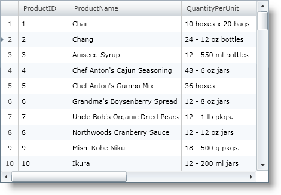
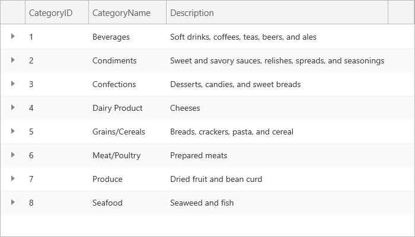

////

|metadata|
{
    "name": "xamgrid-about-xamgrid",
    "controlName": ["xamGrid"],
    "tags": ["Grids"],
    "guid": "{E897E36E-E4C5-4B65-BD8B-42C7BBF05BC7}",  
    "buildFlags": [],
    "createdOn": "2016-05-25T18:21:55.6451453Z"
}
|metadata|
////

= About xamGrid

ifdef::sl,wpf[]
The xamGrid™ control is a hierarchical data grid control designed for stylability and high performance. This control allows you to display your data in the style and manner that best fits your needs.
endif::sl,wpf[]

ifdef::win-rt[]
The xamGrid control is a hierarchical data grid control that provides rich functionality. This control allows you to display your data in the style and manner that best fits your needs.
endif::win-rt[]

The following is a list of key features of the xamGrid control:

ifdef::sl,wpf[]
*High Performance* – Data and UI virtualization makes xamGrid extremely lightweight and extremely fast when handling large amounts of data.
endif::sl,wpf[]

*Hierarchical Data* - You can display complex hierarchical data with master/detail data relationships and different column layouts at each level.

ifdef::win-rt[]
*Improved touch support* - Enabled features appear in columns' menu that is very easy to interact with in touch environment.
endif::win-rt[]

*Fixed Columns* – Your end users can fix columns in position so that those columns are always visible when scrolling horizontally.

*Movable Columns* – Your end users can interact with xamGrid by dragging the columns into a position that best suits them.

*Sortable Columns* – Your end users can sort on one or multiple columns.

*Resizable Columns* – Your end users can resize one or multiple columns.

*Group By* – Your end users can group the xamGrid data by columns.

*Paging* – You can break a large data set into pages.

*Templates* – You can style your xamGrid so that you can maintain a consistent look and feel throughout your entire application.

ifdef::sl,wpf[]

endif::sl,wpf[]

ifdef::win-rt[]

endif::win-rt[]

== *Related Topics*

link:xamgrid-adding-xamgrid-to-your-page.html[Adding xamGrid to Your Page]

link:xamgrid-using-xamgrid.html[Using xamGrid]