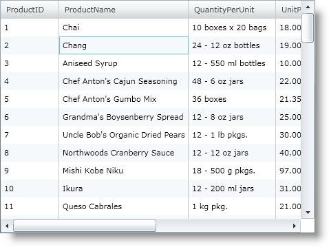
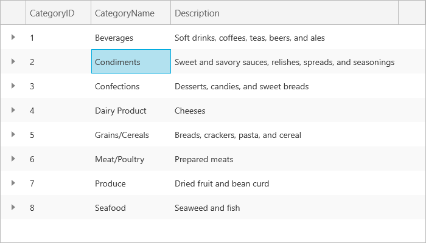

////

|metadata|
{
    "name": "xamgrid-activation",
    "controlName": ["xamGrid"],
    "tags": ["Grids","Navigation","Paging","Selection"],
    "guid": "{AC4A873E-2076-4C83-8E20-1F50FBC4A85A}",  
    "buildFlags": [],
    "createdOn": "2016-05-25T18:21:55.6561837Z"
}
|metadata|
////

= Activation

The xamGrid™ control supports activation of its cells. A cell is considered to be active if it is the current cell that has focus. Activation is implemented on the xamGrid control so that actions that can only be executed on a single cell, such as editing, can be performed.

*Activation Behavior*

The xamGrid control’s cell activation behaves in the following ways:

ifdef::win-rt[]
* When your end user taps on a cell, that cell will become active

endif::win-rt[]

* When your end user clicks on a cell, that cell will become active
* When your end user tabs into xamGrid, the first cell will become active, they can then continue to tab into other cells, or use the arrow keys to navigate.
* Activation and focus are not related, for example, once a cell has been activated, xamGrid will maintain its activation even if it loses focus.
* When a row selector is clicked the first cell in that row will be activated.

*Activation with Code*

You can get or set the active cell using the xamGrid control’s link:{ApiPlatform}controls.grids.xamgrid.v{ProductVersion}~infragistics.controls.grids.xamgrid~activecell.html[ActiveCell] property. The following code demonstrates how to set the cell located in the second Row and second Column as active.

*In Visual Basic:*

----
Me.MyGrid.ActiveCell = Me.MyGrid.Rows(1).Cells(1)
----

*In C#:*

----
this.MyGrid.ActiveCell = this.MyGrid.Rows[1].Cells[1];
----

You can also set an active cell using the Cell object's link:{ApiPlatform}controls.grids.xamgrid.v{ProductVersion}~infragistics.controls.grids.cellbase~isactive.html[IsActive] property. The following code demonstrates how to set the cell located in the second Row and second Column as active.

*In Visual Basic:*

----
Me.MyGrid.Rows(1).Cells(1).IsActive = True
----

*In C#:*

----
this.MyGrid.Rows[1].Cells[1].IsActive = true;
----

*Activation with Keyboard*

The following are the ways to activate xamGrid with the keyboard:

*PLUS SIGN (+)*

* Expands the active row

*MINUS SIGN (-)*

* Collapses the active row

*Tab*

* Advances the current active cell one position to the right.
* If the active cell is in the last column, the active cell moves to the next row.
* If the active cell is in the last column, in the last row, focus moves to the next control on the page.

*Shift + Tab*

* Performs exactly like Tab but in reverse. However, this will only occur if the TabNavigation property on xamGrid is set to KeyboardNavigationMode Once.

*Page Up / Page Down*

* Moves up or down one page, where a page is defined as the number of rows currently visible.

*Home*

* If the active cell is not on the first visible column, then the first visible column in that row becomes active.
* If the active cell is on the first visible column, however not the first row in the current band, the first cell in the first row of the current band becomes the active cell.
* If the active cell is the first cell of the first row of the current band, then the first cell of the first row in the parent band becomes active. If the active cell is on the root level, then nothing should occur.

*End*

* If the active cell is not on the last visible column, then the last visible column in that row becomes active
* If the active cell is on the last visible column, however not the last row in the current band, the last cell in the last row of the current band becomes the active cell
* If the active cell is the last cell of the last row of the current band, then the last cell of the last row in the parent band becomes active. If the active cell is on the root level, then nothing should occur.

*Up Arrow Key*

* link:{ApiPlatform}controls.grids.xamgrid.v{ProductVersion}~infragistics.controls.grids.keyboardnavigation.html[KeyboardNavigation.CurrentLayout] – The same column of the previous sibling row of the same band becomes the active cell.
* link:{ApiPlatform}controls.grids.xamgrid.v{ProductVersion}~infragistics.controls.grids.keyboardnavigation.html[KeyboardNavigation.AllLayouts] – The same visible column index of the previous row becomes the active cell. If the previous row has fewer columns than the current active cells column index, the last visible column of that row becomes active.

*Down Arrow Key*

* KeyboardNavigation.CurrentLayout – The same column of the next sibling row of the same band becomes the active cell.
* KeyboardNavigation.AllLayouts – The same visible column index of the next row becomes the active cell. If the next row has fewer columns than the current active cells column index, the last visible column of that row becomes active.

*Left Arrow Key*

* Moves the active cell to its previous visible sibling.
* If the active cell is on the first visible column of a row whose previous row sibling is not expanded, it moves to the last visible cell of the previous sibling row.
* If the active cell is on the first visible column of a row whose previous sibling row is expanded, it moves to the last visible cell of the last child row of the previous sibling row.

*Right Arrow Key*

* Moves the active cell to its next visible sibling.
* If the active cell is on the last visible column of a row that is not expanded, it moves to the first visible cell of the next sibling row.
* If the active cell is on the last visible column of a row that is expanded, it moves to the first visible cell of the first child row.
* If the active cell is on the last visible column of a row that is expanded and the ChildBandHeaderRows are visible for its children, the first childBandHeader will become the active cell.

*Spacebar*

* Select/Deselects the active cell. This only happens when the CTRL key is pressed.

ifdef::win-rt[]
For more information about activation using touch gestures, see the link:xamgrid-touch-support.html[Touch support] topic.
endif::win-rt[]

The following code snippet demonstrates how to set the KeyboardNavigation property.

*In XAML:*

----
<ig:XamGrid KeyboardNavigation="CurrentLayout" x:Name="MyGrid" AutoGenerateColumns=">
   ...
</ig:XamGrid>
----

*In Visual Basic:*

----
Imports Infragistics.Controls.Grids
...
Me.MyGrid.KeyboardNavigation = KeyboardNavigation.CurrentLayout
----

*In C#:*

----
using Infragistics.Controls.Grids;
...
this.MyGrid.KeyboardNavigation = KeyboardNavigation.CurrentLayout;
----

The following screen shot shows the cell located in the second Row and second Column of xamGrid as active.

ifdef::sl,wpf[]

endif::sl,wpf[]

ifdef::win-rt[]

endif::win-rt[]

== Related Topic

link:xamgrid-activation-events.html[Activation Events]

ifdef::win-rt[]
link:xamgrid-touch-support.html[Touch Support]
endif::win-rt[]