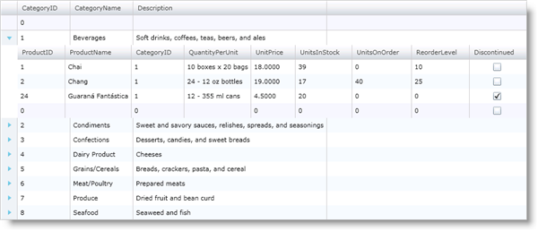
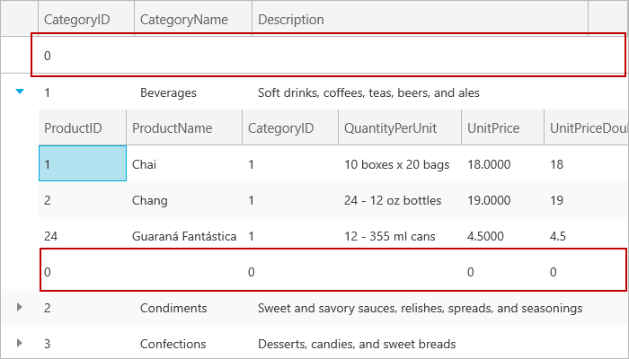
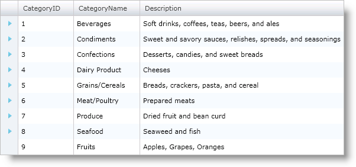
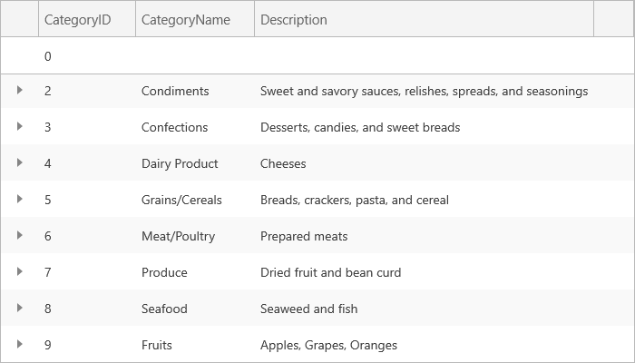
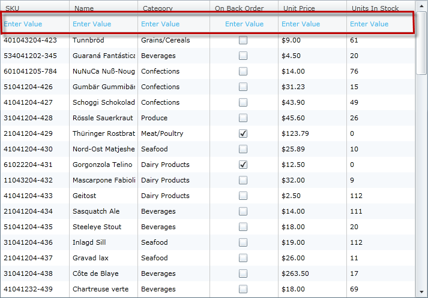
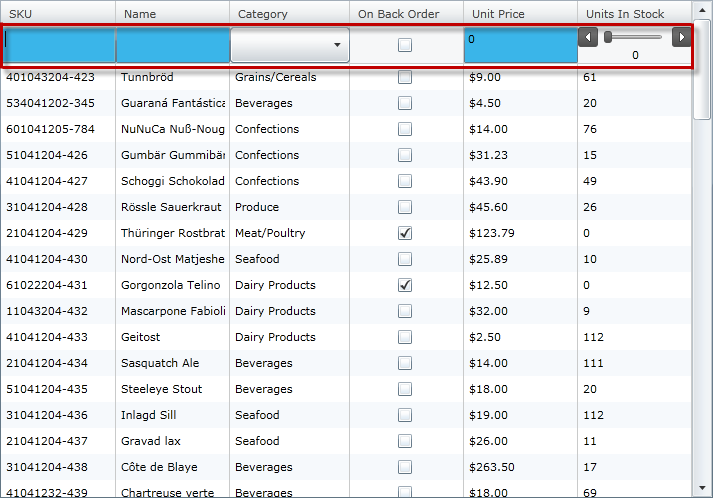

////

|metadata|
{
    "name": "xamgrid-add-new-row",
    "controlName": ["xamGrid"],
    "tags": ["Editing","Grids","Templating"],
    "guid": "{E4BF37BF-DDF3-4992-8375-7B8D25B75A80}",  
    "buildFlags": [],
    "createdOn": "2016-05-25T18:21:55.95317Z"
}
|metadata|
////

= Add New Row

The xamGrid™ control provides a convenient and elegant way to add new records to your data source via the link:{ApiPlatform}controls.grids.xamgrid.v{ProductVersion}~infragistics.controls.grids.primitives.addnewrow.html[AddNewRow] object. This row exists either at the top or bottom of xamGrid's rows collection, depending on the settings for the link:{ApiPlatform}controls.grids.xamgrid.v{ProductVersion}~infragistics.controls.grids.addnewrowsettings.html[AddNewRowSettings] object. It allows your end users to enter data in each cell, and when committed, adds the new data record to your data collection. You can configure Add New Row settings on the control or on each link:{ApiPlatform}controls.grids.xamgrid.v{ProductVersion}~infragistics.controls.grids.columnlayout.html[ColumnLayout] object. The Add New Row is fixed for the root band; i.e, the row does not scroll with the other rows in the same band. For all other bands, the row is in the normal row island.

The Add New Row feature is independent of the editing feature in xamGrid: editing does not need to be enabled in order to edit the cells of an AddNewRow object. This enables you to allow end users to add data but not modify existing data. However, the editing behavior inside an Add New Row is the same as when editing in a normal row. For more information on the editing behavior, see the Editing Behavior section in link:xamgrid-editing-data.html[Editing Data].

.Note:
[NOTE]
====
An object that implements IList is required as the underlying data source in order for adding records to function correctly.
====

== Add New Row Settings

The AddNewRowSettings object provides you with a list of properties to set up xamGrid's Add New Row.

* link:{ApiPlatform}controls.grids.xamgrid.v{ProductVersion}~infragistics.controls.grids.addnewrowsettings~allowaddnewrow.html[AllowAddNewRow] – Enable/Disable the Add New Row feature. The AddNewRowLocation Enumeration provides the following possible values: Top, Bottom, Both, or None.
* link:{ApiPlatform}controls.grids.xamgrid.v{ProductVersion}~infragistics.controls.grids.editingsettingsbase~isenterkeyeditingenabled.html[IsEnterKeyEditingEnabled] – Enable/disable editing with the Enter key.
* link:{ApiPlatform}controls.grids.xamgrid.v{ProductVersion}~infragistics.controls.grids.editingsettingsbase~isf2editingenabled.html[IsF2EditingEnabled] – Enable/disable editing with F2 key.

ifdef::sl,wpf[]
* link:{ApiPlatform}controls.grids.xamgrid.v{ProductVersion}~infragistics.controls.grids.editingsettingsbase~ismouseactioneditingenabled.html[IsMouseActionEdtingEnabled] – Allow editing on a single or double click.

endif::sl,wpf[]

ifdef::win-rt[]
* link:{ApiPlatform}controls.grids.xamgrid.v{ProductVersion}~infragistics.controls.grids.editingsettingsbase~ispointeractioneditingenabled.html[IsPointerActionEdtingEnabled] – Allow editing on a single or double click/tap.

endif::win-rt[]

* link:{ApiPlatform}controls.grids.xamgrid.v{ProductVersion}~infragistics.controls.grids.editingsettingsbase~isoncellactiveeditingenabled.html[IsOnCellActiveEditingEnabled] – Enable/disable editing when a cell becomes active, for example with the Tab key.

== Enabling Add New Row

The following code shows you how to enable the Add New Row.

ifdef::wpf[]

*In XAML:*

----
<ig:XamGrid x:Name="xamGrid1" ItemsSource="{Binding Source={StaticResource DataUtil}, Path=CategoriesAndProducts}">
    <ig:XamGrid.AddNewRowSettings>
        <ig:AddNewRowSettings AllowAddNewRow="Top" />
    </ig:XamGrid.AddNewRowSettings>
    <ig:XamGrid.Columns>
        <ig:TextColumn Key="CategoryID" />            
        <ig:ColumnLayout Key="Products">
            <ig:ColumnLayout.AddNewRowSettings>
                <grid:AddNewRowSettingsOverride AllowAddNewRow="Bottom" />
            </ig:ColumnLayout.AddNewRowSettings>
        </ig:ColumnLayout>
    </ig:XamGrid.Columns>    
</ig:XamGrid>
----

endif::wpf[]

*In Visual Basic:*

----
Me.xamGrid1.AddNewRowSettings.AllowAddNewRow = Infragistics.Controls.Grids.AddNewRowLocation.Top
Me.xamGrid1.Columns.ColumnLayouts("Products").AddNewRowSettings.AllowAddNewRow = Infragistics.Controls.Grids.AddNewRowLocation.Bottom
----

*In C#:*

----
this.xamGrid1.AddNewRowSettings.AllowAddNewRow = Infragistics.Controls.Grids.AddNewRowLocation.Top;
this.xamGrid1.Columns.ColumnLayouts["Products"].AddNewRowSettings.AllowAddNewRow = Infragistics.Controls.Grids.AddNewRowLocation.Bottom;
----

ifdef::sl,wpf[]

endif::sl,wpf[]

ifdef::win-rt[]

endif::win-rt[]

== Adding New Record from Code Behind

You can add a row from the code behind without having to enable the Add New Row feature. The following code shows you how to add a new record to your data source.

*In Visual Basic:*

----
Dim category As New Category()
category.CategoryID = 9
category.CategoryName = "Fruits"
category.Description = "Apples, Grapes, Oranges"
Dim categories As ObservableCollection(Of Category) = TryCast(Me.xamGrid1.ItemsSource, ObservableCollection(Of Category))
categories.Add(category)
----

*In C#:*

----
Category category = new Category();
category.CategoryID = 9;
category.CategoryName = "Fruits";
category.Description = "Apples, Grapes, Oranges";
ObservableCollection<Category> categories = this.xamGrid1.ItemsSource as ObservableCollection<Category>;
categories.Add(category);
----

ifdef::sl,wpf[]

endif::sl,wpf[]

ifdef::win-rt[]

endif::win-rt[]

ifdef::sl,wpf[]
== AddNewRowTemplate
endif::sl,wpf[]

ifdef::sl,wpf[]
A blank row is the default view of the AddNewRow area and, when adding a new row, the default editor of the particular Column type is used. However, you can customize these default behavior through the use of data templates. This is achieved by setting the link:{ApiPlatform}controls.grids.xamgrid.v{ProductVersion}~infragistics.controls.grids.column~addnewrowitemtemplate.html[AddNewRowItemTemplate] and link:{ApiPlatform}controls.grids.xamgrid.v{ProductVersion}~infragistics.controls.grids.column~addnewroweditortemplate.html[AddNewRowEditorTemplate] properties of the Column object to instances of data templates.
endif::sl,wpf[]

ifdef::sl,wpf[]
The following code snippet demonstrates how to set the AddNewRowItemTemplate and AddNewRowEditorTemplate properties.
endif::sl,wpf[]

ifdef::wpf[]

*In XAML:*

----
<ig:TextColumn Key="SKU">
   <ig:TextColumn.AddNewRowItemTemplate>
      <DataTemplate>
         <TextBlock Foreground="#FF3AB5E9" Text="Enter Value"/> 
      </DataTemplate>
   </ig:TextColumn.AddNewRowItemTemplate>
   <ig:TextColumn.AddNewRowEditorTemplate>
      <DataTemplate>
         <TextBox Text="{Binding SKU, Mode=TwoWay,UpdateSourceTrigger=Explicit}"  Background="#FF3AB5E9"/>
      </DataTemplate>
   </ig:TextColumn.AddNewRowEditorTemplate>
</ig:TextColumn>
----

endif::wpf[]

ifdef::sl,wpf[]
The pictures below demonstrate the templates set in the code snippet above.
endif::sl,wpf[]

ifdef::sl,wpf[]

endif::sl,wpf[]

ifdef::sl,wpf[]
Figure 1: The xamGrid control with AddNewRowItemTemplate implemented
endif::sl,wpf[]

ifdef::sl,wpf[]

endif::sl,wpf[]

ifdef::sl,wpf[]
Figure 2: The xamGrid control with AddRowEditorTemplate implemented.
endif::sl,wpf[]

== Related Topics

link:xamgrid-editing-data.html[Editing Data]

link:xamgrid-row-deletion.html[Row Deletion]

pick:[win-rt=" link:bb45cdbe-7149-49bc-a63a-1a77676c6986[Touch Support]"]